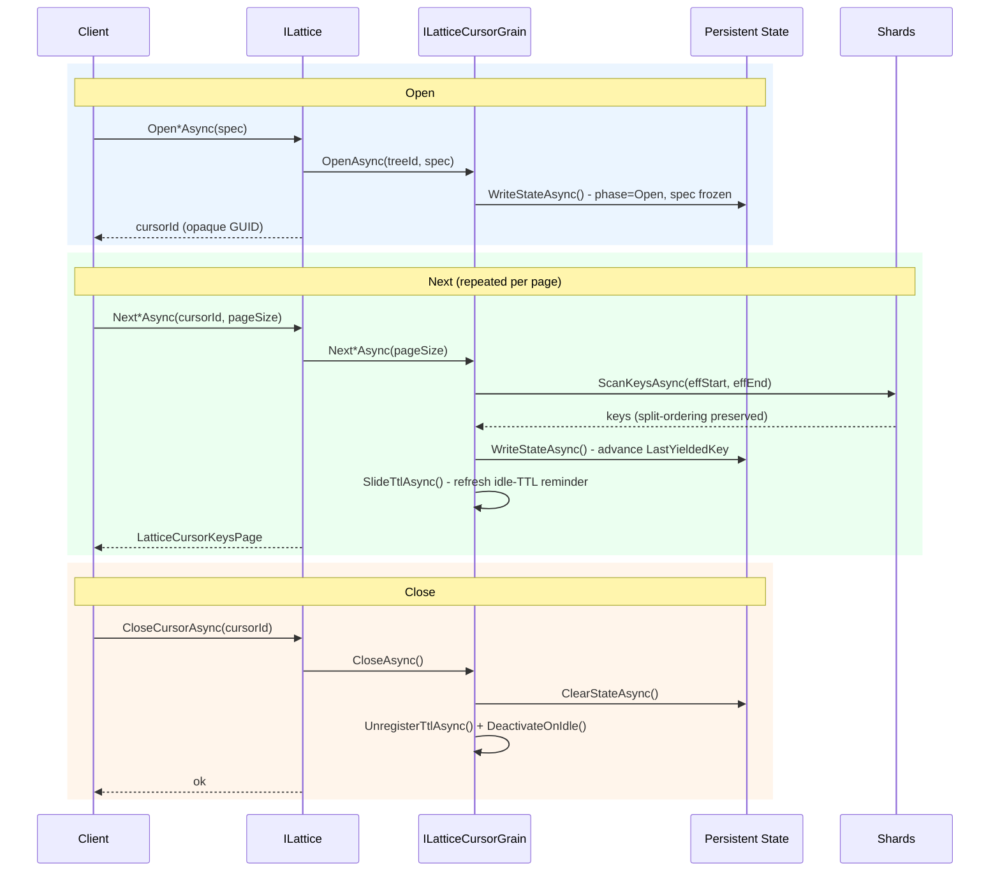
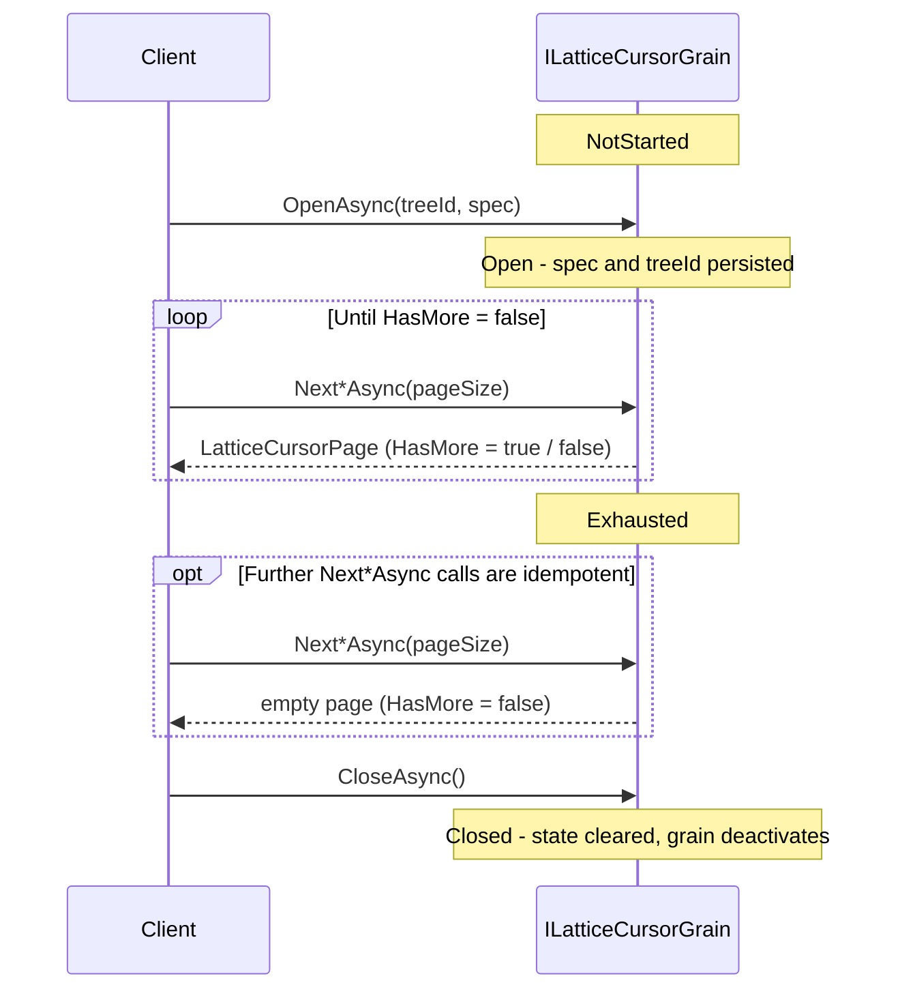
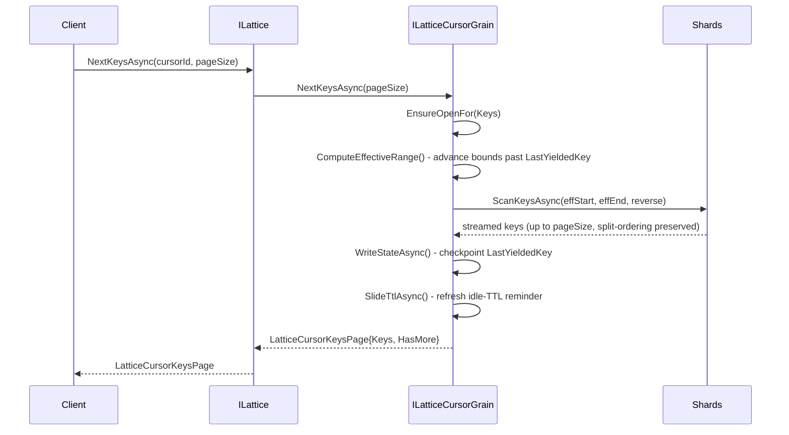
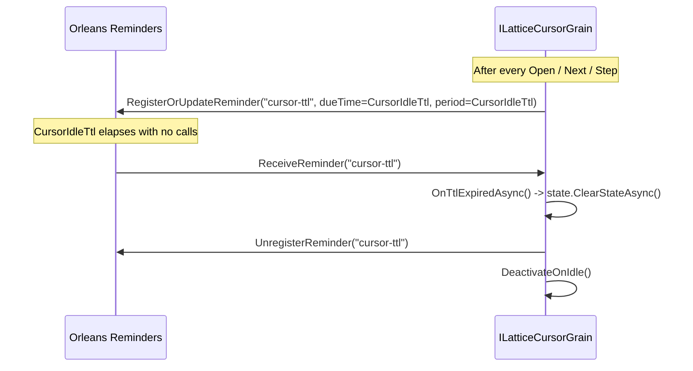

# Durable Cursors

Durable cursors are server-side, checkpointed iterators for long-running key
scans and resumable range deletes. Unlike the stateless
[`ScanKeysAsync` / `ScanEntriesAsync` / `DeleteRangeAsync`](api.md#enumeration)
methods - which are bounded by `LatticeOptions.MaxScanRetries` and die with
the client process - a cursor grain persists its position to Orleans storage
after every page. A new activation reads that checkpoint and continues exactly
where the previous one stopped, making export jobs, ETL pipelines, and
range-delete sweeps transparent to silo failovers, client restarts, and
topology changes (shard splits).

See [API Reference - Stateful Cursors](api.md#stateful-cursors)
for the full method signatures, return types, error surface, and code examples.
This document covers the design, grain lifecycle, and performance
characteristics.

## When to use a durable cursor

| Scenario | Recommendation |
|----------|----------------|
| Short-lived scan, client stays up, few thousand keys | Stateless `ScanKeysAsync` / `ScanEntriesAsync` - lower overhead, no grain state |
| Export or migration that may span minutes | Durable cursor - survives failover, no client retry code needed |
| Range delete that must survive interruption | `OpenDeleteRangeCursorAsync` - tracks tombstoning progress across steps |
| Topology under aggressive splitting, `MaxScanRetries` exhaustion | Durable cursor - each step has its own retry budget; topology churn only affects one step at a time |
| Cursor ID must be handed off between processes or services | Durable cursor - any client that knows the opaque ID can resume |
| Multi-page scan that must observe the same saga-decision view across every page | Durable key/entry cursor opened with `pointInTime: true` - see [Point-in-time cursors](#point-in-time-cursors) |

## Architecture

### Grain model

Each cursor is a single `ILatticeCursorGrain` activation keyed
`{treeId}/{cursorId}`, where `cursorId` is a server-assigned opaque GUID
returned by the `Open*Async` call. The grain is an internal implementation
detail - hidden from IntelliSense and guarded against direct external calls.
Callers interact exclusively through the `ILattice` facade.



### Cursor phase state machine


### Persisted state

`LatticeCursorState` is intentionally minimal - a silo restart only needs to
replay one page of work, and the checkpoint must be cheap to write on every
step.

| Field | Type | Purpose |
|-------|------|---------|
| `TreeId` | `string` | Target tree grain key |
| `Spec` | `LatticeCursorSpec` | Kind, start/end bounds, direction, `PointInTime` - frozen at `OpenAsync` |
| `Phase` | `LatticeCursorPhase` | `NotStarted` / `Open` / `Exhausted` / `Closed` |
| `LastYieldedKey` | `string?` | Last key returned or tombstoned. `null` before the first step. |
| `DeletedTotal` | `int` | Cumulative tombstone count (delete-range cursors only) |
| `PointInTimeSnapshot` | `Dictionary<Guid, TxStatus>?` | The per-tree transaction-registry snapshot captured at `OpenAsync` time. Persisted only for point-in-time cursors; `null` for live-mode cursors. |
| `SnapshotPinId` | `Guid` | The registry-side pin handle returned by `PinSnapshotAsync`. Empty for live-mode cursors and for point-in-time cursors whose captured snapshot was empty (no in-flight sagas at open). |
| `SnapshotCoordinate` | `LatticeSnapshotCoordinate?` | Tree-wide WAL coordinate captured at `OpenAsync` for zero-observable-writes snapshot cursors. Pairs with `PointInTimeSnapshot` to fix the projection as of one tree-wide moment (WAL offsets fix the foreground-write view, the registry snapshot fixes saga decisions), so a reactivated cursor keeps serving the view it opened with. `null` for non-snapshot cursors. |
| `SnapshotBaselinePersisted` | `bool` | `true` once a snapshot cursor has durably flushed its per-shard frozen baselines. The baselines seed the transient snapshot leaves in memory at open and are flushed lazily only the first time a page reports more results (the cursor must now survive past page 1 across failover or eviction); a cursor that drains in a single page never sets it and can skip the durable baseline delete on close. `false` for non-snapshot cursors. |

### Step sequence

Every `Next*Async` / `DeleteRangeStepAsync` call follows the same pattern:



### Effective range computation and resumption

Resumption after a silo failover requires no replay of prior pages - the grain
recomputes `effStart` / `effEnd` from the persisted `LastYieldedKey` and
issues the next bounded `ScanKeysAsync` / `ScanEntriesAsync` call:

- **Forward scan:** `effStart = LastYieldedKey + "\0"` - the lexicographically
  first key strictly after the last yielded one. `effEnd` is unchanged.
- **Reverse scan:** `effEnd = LastYieldedKey` - the last yielded key becomes
  the exclusive upper bound, so it is not re-yielded. `effStart` is unchanged.

A key yielded by step *i* is therefore never re-yielded by step *i+1* or
later, regardless of any shard splits that occur between steps.

### Ordering under concurrent shard splits

Because each step delegates to the normal `ScanKeysAsync` /
`ScanEntriesAsync` / `DeleteRangeAsync` path, **ordering preservation under
concurrent shard splits applies within each step**: concurrent shard splits are reconciled via
in-line cursor injection into the k-way merge priority queue, bounded by
`LatticeOptions.MaxScanRetries`. See [Shard Splitting](shard-splitting.md)
for the full reconciliation design.

Across steps, global ordering is preserved by the effective-range logic: the
continuation bound strictly excludes every previously-yielded key, so a split
that moves keys between steps is naturally handled by the next step's sharded
range query.

## Point-in-time cursors

A durable key or entry cursor opened with `pointInTime: true` extends the
tree-wide atomic-visibility guarantee that already covers single-call reads
(`GetManyAsync`, `CountAsync`, `CountPerShardAsync`) to a multi-page
enumeration. The cursor freezes the per-tree saga-decision view at open time
and every subsequent page reads against that frozen view - a
`SetManyAtomicAsync` saga that commits between two pages is observed
identically on every page (either all of its keys, or none), never as a torn
pre/post split.

```csharp verify
var cursorId = await tree.OpenEntryCursorAsync(
    startInclusive: null,
    endExclusive: null,
    reverse: false,
    pointInTime: true);
try
{
    while (true)
    {
        var page = await tree.NextEntriesAsync(cursorId, pageSize: 500);
        foreach (var (k, v) in page.Entries)
        {
            // Every page sees the same in-flight-saga view captured at
            // OpenEntryCursorAsync time. Sagas that commit between pages
            // are atomically visible across the cursor.
        }
        if (!page.HasMore) break;
    }
}
finally
{
    await tree.CloseCursorAsync(cursorId);
}
```

### How it works

1. **Capture at open.** `OpenAsync` calls
   `ITxRegistryGrain.SnapshotAsync()` once and persists the resulting
   `Dictionary<Guid, TxStatus>` in `LatticeCursorState.PointInTimeSnapshot`.
2. **Pin retention.** If the snapshot contains any decisions, the cursor
   calls `ITxRegistryGrain.PinSnapshotAsync(snapshot, ttl)` to ask the
   registry to retain every observed decision (including any
   `ForgetAsync`'d tombstones) for the cursor's lifetime. The
   registry's `LatticeOptions.MaxCursorSnapshotPinTtl` (default 7 days)
   is the hard upper bound. The returned `Guid` handle is persisted in
   `LatticeCursorState.SnapshotPinId`.
3. **Per-step replay.** Every `NextKeysAsync` / `NextEntriesAsync`
   re-enters the captured snapshot via
   `LatticeRegistrySnapshotContext.BeginScope(...)` before fanning out
   to leaves. Every leaf RPC for the step reads the same registry view
   - identical to the steady-state behaviour of
   `GetManyAsync` / `CountAsync` / `CountPerShardAsync`, just held
   across multiple pages.
4. **Pin refresh.** Each step also calls
   `ITxRegistryGrain.RefreshPinAsync(pinId, ttl)` to slide the
   registry-side TTL. A cursor that pages actively never runs out the
   pin TTL; a stalled cursor that misses the slide will eventually be
   reaped by the registry.
5. **Release on close / TTL expiry.** `CloseCursorAsync` and the
   cursor's own idle-TTL reminder both call
   `ITxRegistryGrain.UnpinSnapshotAsync(pinId)`, freeing the retained
   decisions so registry tombstone-prune can resume.

### Caps and failure modes

Three independent caps bound the registry footprint a forgotten or
stalled point-in-time cursor can occupy:

| Cap | Default | Effect |
|-----|---------|--------|
| `LatticeOptions.CursorIdleTtl` | 48 h | Cursor-grain idle reminder releases the pin on inactivity. |
| `LatticeOptions.MaxCursorSnapshotPinTtl` | 7 d | Registry-side hard cap on a single pin's lifetime. A live cursor slides this on every `Next*Async`; a stalled cursor that misses the slide surfaces `LatticeCursorSnapshotExpiredException` on its next call and the cursor must be reopened. |
| `LatticeOptions.MaxPinnedSagaDecisions` | 100 000 | Registry-wide footprint cap across all live pins. `OpenAsync(pointInTime: true)` throws `LatticeCursorRegistryPinExhaustedException` when accepting the new snapshot would breach the cap; existing pinned cursors continue paging. |

| Condition | Exception |
|-----------|-----------|
| `OpenAsync(pointInTime: true)` would push the registry pinned-decision count past `MaxPinnedSagaDecisions` | `LatticeCursorRegistryPinExhaustedException` |
| `NextKeysAsync` / `NextEntriesAsync` on a point-in-time cursor whose pin has been evicted (TTL elapsed or registry reaper ran) | `LatticeCursorSnapshotExpiredException` |
| `OpenDeleteRangeCursorAsync` with `pointInTime: true` (range deletes are mutations, not snapshot reads) | `ArgumentException` |

### Cost vs. live mode

Live-mode and point-in-time cursors share the same per-step
checkpoint and shard fan-out cost. Point-in-time mode adds:

- One `PinSnapshotAsync` call at open (skipped when the captured
  snapshot is empty).
- One `RefreshPinAsync` call per step (interleaved with the existing
  checkpoint write).
- One `UnpinSnapshotAsync` call at close or TTL expiry.

The persisted `PointInTimeSnapshot` adds one dictionary entry per
in-flight or recently-completed saga at open time to the cursor's
storage row; it does not grow as the cursor pages.

## Self-cleanup (idle-TTL reminder)

To prevent cursor state leaking when a client forgets `CloseCursorAsync`,
every cursor grain registers a sliding idle-TTL reminder (`cursor-ttl`) after
every successful call. If the reminder fires with no intervening activity, the
grain clears its persisted state and deactivates.



`LatticeCursorGrain` inherits this machinery from the internal `TtlGrain`
abstract base class, which also backs `AtomicWriteGrain`. Each grain overrides
`TtlReminderName`, `ResolveTtl`, and `OnTtlExpiredAsync` independently -
`CursorIdleTtl` and `AtomicWriteRetention` are separate options and do not
share a value.

**Configuration:**

```csharp verify
// Per-tree
siloBuilder.ConfigureLattice("my-tree", o =>
    o.CursorIdleTtl = TimeSpan.FromHours(6));

// Global default
siloBuilder.ConfigureLattice(o =>
    o.CursorIdleTtl = TimeSpan.FromHours(6));
```

Set `CursorIdleTtl = Timeout.InfiniteTimeSpan` to disable automatic cleanup.
The minimum effective interval is **1 minute** (Orleans reminder granularity);
smaller values are clamped to that floor.

## Performance characteristics

### Per-step overhead

Every `Next*Async` / `DeleteRangeStepAsync` call incurs two additional I/O
round-trips above a direct stateless scan call:

| Cost component | Magnitude | Notes |
|----------------|-----------|-------|
| `WriteStateAsync` - checkpoint | 1 x storage write per step | Serialises `LatticeCursorState` (< 10 KB). On memory provider: negligible. On Azure Table / SQL: ~1-5 ms. |
| `RegisterOrUpdateReminder` - TTL slide | 1 x reminder-table write per step | ~1-5 ms round-trip. See [debounce](#reducing-reminder-write-frequency) below. |
| Extra grain round-trip | +1 Orleans call per step | `ILatticeCursorGrain` sits between `ILattice` and the shard fan-out. Typically < 1 ms on a local cluster. |
| Shard fan-out | Same as `ScanKeysAsync` / `ScanEntriesAsync` | Each step is a normal sharded scan - no additional shard calls. |

**Total per-step overhead: ~2-10 ms**, dominated by the storage provider
round-trip.

### Large-export scenario

For a 10 million key export with `pageSize = 500` (20 000 steps):

| Metric | Value |
|--------|-------|
| Steps | 20 000 |
| Checkpoint writes | 20 000 |
| Reminder slides | 20 000 |
| Extra wall-clock time at 2 ms/step | ~= 40 s |
| Extra wall-clock time at 5 ms/step | ~= 100 s |

This overhead is typically small relative to the actual I/O cost of streaming
10 M keys across the network, but it is not zero.

### Reducing reminder write frequency

The internal `TtlGrain` base exposes a virtual `SlideDebounce` property
(default `TimeSpan.Zero`, meaning slide on every call). Overriding it in a
subclass throttles `RegisterOrUpdateReminder` calls to at most one per
interval, accepting a slightly stale TTL window in exchange for lower
reminder-table pressure. This is an internal extension point; it is not
surfaced on `LatticeOptions`.

The simpler alternative is to **increase `pageSize`**: halving the step
count halves the reminder and checkpoint write count proportionally.

### Grain state size

`LatticeCursorState` is intentionally minimal. Even with a 4 KB
`LastYieldedKey` and a 1 KB spec, the checkpoint is < 10 KB per cursor.
Aggregate reminder-table storage for a typical fleet of concurrent cursors
is negligible.

### Concurrent cursors

Each cursor grain is a single-threaded Orleans activation. Concurrent pages
from *different* cursors run in parallel with no cross-cursor coordination -
*N* concurrent cursors are equivalent in throughput to *N* independent
stateless scans, plus the per-step overhead per cursor.

## Stateless vs. durable - decision guide

| Dimension | Stateless (`ScanKeysAsync` / `ScanEntriesAsync`) | Durable cursor (live mode) | Durable cursor (point-in-time) |
|-----------|------------------------------------------|----------------|----------------|
| Survives silo failover | No - stream terminates | Yes - resumes from checkpoint | Yes - resumes from checkpoint *and* retained registry pin |
| Survives client restart | No | Yes - cursor ID is the resume token | Yes |
| Caller retry code needed | Required for robustness under splits | None needed | None needed |
| Per-page overhead | Zero | ~2-10 ms (checkpoint + reminder slide) | ~2-10 ms (adds one registry refresh RPC) |
| Ordering under splits | Per-call reconciliation (see [Shard Splitting](shard-splitting.md)) | Per-step reconciliation | Per-step reconciliation |
| Atomic visibility | Scan-lifetime tree-wide | Per-step tree-wide; *not* preserved across pages | **Cursor-lifetime tree-wide** - identical saga view on every page |
| Max scan duration | Bounded by `MaxScanRetries` | Unbounded - each step has its own budget | Bounded by `MaxCursorSnapshotPinTtl` (default 7 d, slides on activity) |
| Idle cleanup | No state to clean up | Automatic via idle-TTL reminder | Idle-TTL reminder + registry-pin TTL |
| Cursor ID transferable across processes | No | Yes | Yes |
| Available for range delete | No | Yes via `OpenDeleteRangeCursorAsync` | No - range deletes are mutations, not snapshot reads |
| Best for | Interactive queries, short scans | Long exports, ETL, background sweeps | Long exports that must observe a single saga-decision view across every page |

## See also

- [API Reference - Stateful Cursors](api.md#stateful-cursors) -
  full method signatures, return types, error surface, and code examples.
- [Consistency - Enumeration](consistency.md#enumeration) - the formal
  consistency classification of live-mode and point-in-time cursor steps.
- [Atomic Writes](atomic-writes.md) - the saga primitive whose
  visibility flip point-in-time cursors freeze for the cursor's lifetime.
- [Shard Splitting](shard-splitting.md) - ordering preservation under
  concurrent topology changes (applied within each cursor step).
- [Configuration](configuration.md) - `CursorIdleTtl`,
  `MaxCursorSnapshotPinTtl`, `MaxPinnedSagaDecisions`, `MaxScanRetries`,
  and other tunables.
