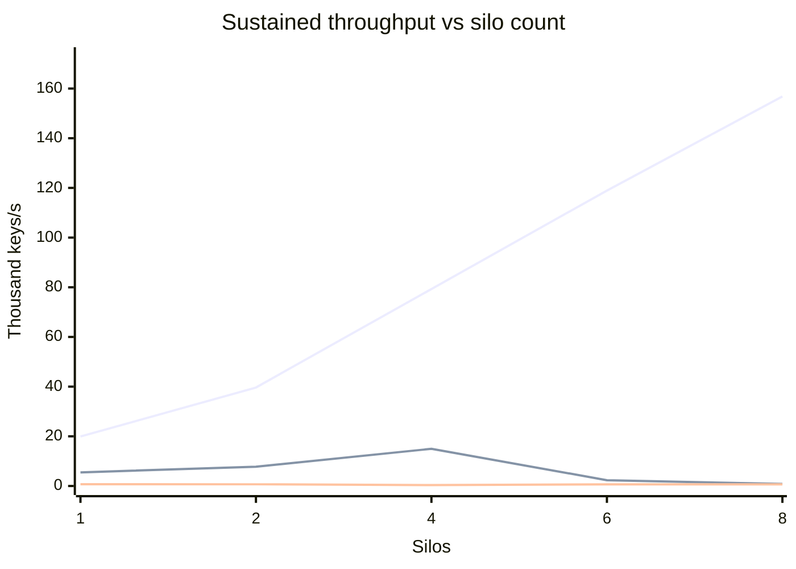

# Performance: multi-silo scaling guide

This document is an **approximate guide** to how Orleans.Lattice throughput
responds when you add silos. It is the horizontal-scaling companion to
[Performance: single-silo guide](performance-single-silo.md), which remains
the authority on what one silo delivers and on the per-operation call
shapes; read that first. Everything here answers one question that the
single-silo document deliberately does not: **when you put N hosts behind
the same tree, what do you actually get?**

The numbers come from a third benchmark tier ("Layer 3") that stands up a
fixed-size Orleans cluster on **Azure Container Apps**, drives it from an
out-of-cluster Orleans client, records one cell per (workload, silo count),
and tears the infrastructure back down. It is regenerated by
`benchmark/performance-report.ps1 -Layer3`, the same harness that produces
the Layer 1 and Layer 2 tables.

**Read the curve, not the absolute numbers.** The point of this tier is the
*shape* - where throughput stops rewarding extra hosts - and the shape is
robust in a way the absolute figures are not. Several deliberate choices
below (a single shared storage account, a fixed shard count, ACA's memory
ceiling) hold the topology constant so the silo count is the only variable;
each of them also caps the absolute ceiling. A production deployment tuned
for throughput rather than for comparability will beat these figures.

## The scaling curve

<!-- perf-chart:layer3:start
  schema=v1
  DO-NOT-HAND-EDIT-BETWEEN-MARKERS
-->



Series order (xychart-beta renders no legend): `GetManyAsync` (4,096 keys/call), then `SetManyAsync` (4,096 keys/call), then `SetAsync` (point write).

<!-- perf-chart:layer3:end -->

## The grid

**How it was run.** Each cell is one cohort: the harness scales the silo
Container App to N replicas, waits for every replica to report running,
retires the superseded revision, settles for cluster membership, then runs
the producer as a Container Apps **job** that joins the cluster as an
Orleans *client* over the same Azure Table clustering store. The client
opens several connections per silo so grain calls spread across every
gateway rather than funnelling through one, warms the tree, and then drives
the measurement window. Offered load is **per-silo rung x N**, so the
demand presented to the cluster grows with the cluster: a flat line on the
chart means extra hosts absorbed nothing, not that the load ran out.

After every cell the silo app is parked at **zero replicas**, and the whole
resource group is deleted at the end of the sweep.

<!-- perf-table:layer3:start
  schema=v1
  batchSize=4096
  cohortN=2/3
  dotnet=10.0.x
  gitSha=eb78c703c
  host=Azure Container Apps (Consumption)
  region=westus3
  responseTimeoutSec=180
  rowsMeasured=2026-09-22
  rungPerSilo=get-many=4000 veh/silo @ 5 Hz / 45s; set-many=1200 veh/silo @ 5 Hz / 45s; set-point=200 veh/silo @ 5 Hz / 45s
  shardCount=64
  siloCounts=1,2,4,6,8
  siloSize=4 vCPU / 8 GiB
  walAccounts=1
  walMaxPendingBatches=16
  walPartitions=16
  methodology=Each cell is the median across N HEALTHY cohorts of completed-work throughput: total successfully-completed keys at FINAL divided by the engine's active elapsed time. Layer 3 deliberately does NOT reuse Layer 2's rate>0 steady-state mean. On this path the client submits 4096-key batches, so a whole batch retires inside one per-second sample and the samples between retirements are exactly zero; filtering the zeros away averages only the spikes and reports more throughput than was offered (measured: 9,637 keys/s reported against 5,935 keys/s actually offered). The overstatement also varies with burstiness, which varies with silo count, so it would bend the scaling curve itself. Completed-ops / active-elapsed counts only work that succeeded over the wall-clock it took, so it cannot exceed the offered load and carries no windowing bias. Per-call p50/p99 come from the [phaseA] duration histogram of ONE representative silo, not an aggregate across silos. Offered load is scaled with the silo count (each workload carries a per-silo rung, driven at rung x silo count) so per-silo demand is held constant as the cluster grows and the curve measures capacity rather than a fixed load spread thinner. Speedup and per-silo efficiency are derived against the measured 1-silo cell. All silo counts share ONE Azure Storage account for the WAL. That account's own metrics were checked for this sweep and it is NOT the write-side limit: zero throttling responses at any silo count, and server-side latency falling from 9.7 ms at N=1 to 6.7 ms at N=8. Read the write-mode collapse as a cluster-side defect, not a storage ceiling - see the caveats section.
  DO-NOT-HAND-EDIT-BETWEEN-MARKERS
-->

| Operation | Silos | Offered | Sustained throughput | Speedup vs 1 silo | Per-silo efficiency | Per-call p50 | Per-call p99 |
|-----------|------:|--------:|---------------------:|------------------:|--------------------:|-------------:|-------------:|
| `GetManyAsync` (4,096 keys/call) | 1 | ~20 k keys/s | **~19.9 k keys/s** | 1x | 100% | ~1.56 ms | ~22.15 ms |
| `GetManyAsync` (4,096 keys/call) | 2 | ~40 k keys/s | **~39.6 k keys/s** | 1.99x | 100% | ~10.92 ms | ~1152.59 ms |
| `GetManyAsync` (4,096 keys/call) | 4 | ~80 k keys/s | **~79.3 k keys/s** | 3.98x | 100% | ~9.31 ms | ~276.94 ms |
| `GetManyAsync` (4,096 keys/call) | 6 | ~120 k keys/s | **~118.9 k keys/s** | 5.97x | 100% | ~11.66 ms | ~1115.51 ms |
| `GetManyAsync` (4,096 keys/call) | 8 | ~160 k keys/s | **~156.8 k keys/s** | 7.88x | 98% | ~12.38 ms | ~16.2 ms |
| `SetManyAsync` (4,096 keys/call) | 1 | ~6 k keys/s | **~5.5 k keys/s** | 1x | 100% | ~3456.73 ms | ~6273.2 ms |
| `SetManyAsync` (4,096 keys/call) | 2 | ~12 k keys/s | **~7.8 k keys/s** | 1.42x | 71% | ~5132.36 ms | ~8078.88 ms |
| `SetManyAsync` (4,096 keys/call) | 4 | ~24 k keys/s | **~15 k keys/s** | 2.73x | 68% | ~6978.52 ms | ~10140.72 ms |
| `SetManyAsync` (4,096 keys/call) | 6 | ~36 k keys/s | **~2.3 k keys/s** | 0.43x | 7% | ~37837.48 ms | ~82940.16 ms |
| `SetManyAsync` (4,096 keys/call) | 8 | ~48 k keys/s | **840 keys/s** | 0.15x | 2% | ~85241.98 ms | ~85241.98 ms |
| `SetAsync` (point write) | 1 | ~1 k keys/s | **697 keys/s** | 1x | 100% | ~14.63 ms | ~609.62 ms |
| `SetAsync` (point write) | 2 | ~2 k keys/s | **688 keys/s** | 0.99x | 49% | ~49.64 ms | ~1329.78 ms |
| `SetAsync` (point write) | 4 | ~4 k keys/s | **375 keys/s** | 0.54x | 13% | ~25.75 ms | ~770.34 ms |
| `SetAsync` (point write) | 6 | ~6 k keys/s | **642 keys/s** | 0.92x | 15% | ~49.3 ms | ~1463.52 ms |
| `SetAsync` (point write) | 8 | ~8 k keys/s | **652 keys/s** | 0.94x | 12% | ~27.05 ms | ~224.52 ms |

<!-- perf-table:layer3:end -->

> Measured 2026-09-22 on Azure Container Apps (Consumption) in westus3 (.NET 10.0.x) at git sha eb78c703c, n=2/3 cohorts per cell, silo counts 1,2,4,6,8. Offered load scales with the silo count (constant per-silo demand). All silo counts share one Azure Storage account for the WAL, but that account was measured and is NOT the write-side limit - see the caveats below.

## How to read this

**`Speedup vs 1 silo` is the headline and `Per-silo efficiency` is the
warning light.** Speedup is the cell's throughput over the same workload's
N=1 throughput; efficiency is that speedup divided by N. Perfect scaling is
speedup = N and efficiency = 100%. The **knee** is the silo count after
which efficiency falls away sharply - past it you are paying for hosts that
contend rather than contribute.

**The read row and the write rows answer different questions, and
conflating them is the main way to misread this table.** The read workload
(`GetManyAsync`) touches no WAL, so its curve measures the **compute tier**:
whether grain placement, the gateway fan-out, and the leaf cache actually
spread across hosts, and it scales essentially linearly to the limit of
what this sweep offered it. The write workloads funnel through the WAL,
and their curve does something different: `SetManyAsync` peaks at 4 silos
and then **collapses**, returning less absolute throughput at 8 silos than
at 1.

**That collapse is not the storage account.** The intuitive explanation -
one shared Azure Tables account saturating - was tested against the
account's own metrics for this sweep and refuted: **zero** throttling
responses at any silo count, and server-side latency that *improved* as
the collapse deepened (9.7 ms at N=1 against 6.7 ms at N=8). Adding
storage accounts would not move this curve. The cause sits in the
multi-silo write path itself, and is tracked as a defect rather than
published here as a ceiling - see *What the write collapse actually is*
below.

**Throughput is cluster-wide; the latency quantiles are not.** The
throughput column counts every key the whole cluster retired. The p50/p99
columns come from the duration histograms of a single silo's reporter
window, because the histogram is per-process and this tier does not
aggregate quantiles across hosts (merging quantiles is not sound, and
summing them is meaningless). Treat the latency columns as *representative
of one host under the cluster's share of the load*, not as a cluster-wide
distribution.

**Failures are data here, not defects - but not the kind you would
guess.** Layer 2 tunes every write rung to sit below the single-account
saturation point, so a failed call there is anomalous. Layer 3 deliberately
offers `rung x N` in order to *find* the knee, so cells past it are expected
to report failures. The failure that actually dominates is **not** WAL
back-pressure: it is an Azure Tables transaction conflict
(`TableTransactionFailedException: The specified entity already exists`),
the signature of a storage transaction being retried after it had in fact
landed. The keys are durable; the retry is what is counted as failed. So a
large failure count on a write row means the write path is being pushed
hard enough to make the storage SDK retry, and it *depresses the reported
throughput without implying data loss*. The harness grades a cohort only on
whether it produced a productive measurement window at all, and carries the
failure count through as a signal rather than discarding the cell.

**Those failure counts predate the producer honouring WAL back-pressure.**
During this sweep the ingest engine's retry filter did not match
`LatticeSaturatedException`, so a WAL admission refusal was never retried:
the batch was logged once and booked whole into `failed` - 4,096 entries at
the default batch size - while the producer carried on offering load at the
full configured rate. Any cell that saturated therefore reports failures a
back-pressure-honouring client would largely have absorbed, and to that
extent measures capacity under a client that ignores back-pressure rather
than platform capacity. The engine now retries a saturation refusal on its
own back-off ladder spanning the exception's documented 1-10 s recovery,
and the FINAL line carries `satRetries`, `satRecovered`, `satExhausted` and
`satBackoff` so a rung's back-pressure is readable directly (#3339). Expect
a re-run on the current engine to report a lower `failed` count wherever
saturation was in play, and do not compare these counts against one that
was measured after it.

## What the write collapse actually is

The `SetManyAsync` row peaks at 4 silos and then falls away sharply. This
section records what that is, because the number on its own invites the
wrong conclusion.

Instrumentation from the cohorts localises the whole effect to one place.
`LatticeGrain`'s shard **fan-out** stage accounts for roughly 99.9% of a
`SetManyAsync` call at every silo count, and its mean rises from about
6.0 s at 4 silos to about 80 s at 8. Every stage around it - routing,
bucketing, the admission gate, event publication - stays in the
single-digit-to-tens-of-milliseconds range and is irrelevant to the curve.

Everything *below* the fan-out got faster over the same range. The leaf
commit and the WAL provider commit both post their best figures at the
silo count where the cluster performs worst. Nothing in the write path
slowed down.

What changed is the **shape** of the distribution, not its centre. The
per-branch leaf RPC at 8 silos has a median of about 386 ms, roughly eight
times *faster* than the 4-silo median, while its 99th percentile grows
from about 8.6 s to about 94 s. A fan-out that awaits every branch pays
the slowest branch rather than the typical one, so a rare 94-second event
becomes the price of every batch. The arithmetic closes: at both silo
counts the measured fan-out duration tracks the branch tail, not the
branch mean.

This is scatter-gather tail amplification in the core write path, filed as
a defect (#3348) with its full evidence.

**These rows were measured before that defect was fixed, and they are not
a write ceiling.** The fix addresses the tail at its source rather than
capping it: under saturation a refused branch no longer re-fanned the
whole batch through the stale-routing retry (which alone accounted for a
rise from about 64 to about 146 leaf dispatches per call), the ingest
engine now backs off instead of re-offering load at the knee (#3339),
replay-permit refusals retry rather than failing leaf activation (#3294),
and a batch that one branch has already doomed no longer waits out the
remaining branches before surfacing the failure. The first three reduce
the dispatch volume that produces the queueing the tail is made of; the
fourth bounds the cost of a batch that was going to fail anyway.

What is **not** claimed is a re-measured curve. The success-path tail -
a branch that takes 94 seconds and then succeeds - is still awaited, by
design, because `SetManyAsync` publishes its events only once every shard
write has committed. Whether removing the amplification is enough to move
the 8-silo row can only be settled by re-running this rig; until that
happens, treat these numbers as a measurement of the pre-fix engine.

## Caveats that bound these numbers

**The N=1 cell is the control, and it reproduces Layer 2.** A scaling curve
measured on different hardware to the single-host tier would be
uncomparable, so the first thing to check is that one ACA silo performs
like one Layer 2 VM. It does: the N=1 `get-many` cell lands on Layer 2's
published single-VM read figure. That is what licenses reading the rest of
this document alongside the single-silo guide rather than as an unrelated
experiment, and it is the reason `get-many` is in the sweep at all even
though it exercises no WAL. If a future re-run shows the N=1 cell drifting
away from Layer 2's, treat the whole curve as suspect before believing
anything it says about scaling.

**The throughput basis differs from Layer 2's, deliberately.** Layer 2
publishes the mean of the silo's per-second rate samples. That works when
the producer is co-located and work retires smoothly. It does **not** work
here: the Layer 3 client submits large batches, so a whole batch retires
inside one sample and the samples between retirements are exactly zero.
Layer 2's filter discards those zeros, which averages only the spikes - on
a real warmed single-silo cohort that reported 9,637 keys/s against an
offered load of 5,935 keys/s, a rate higher than the load, which cannot be
a sustained throughput. Worse, the overstatement scales with burstiness,
and burstiness varies with silo count, so it would bend the very curve this
tier exists to measure. Layer 3 therefore publishes **completed operations
divided by the active measurement window**. A Layer 3 cell and a Layer 2
cell are consequently *not* computed the same way; the Layer 3 figure is
the conservative one.

**One storage account backs the whole cluster, and it was not the limit.**
Every silo's WAL writes land in the same Azure Tables account, so the
obvious reading of the write rows is that they stop measuring the cluster
and start measuring that account. That reading was checked against the
account's own metrics for this sweep and does not hold: across 28.3 M
transactions there were **zero** throttling responses at any silo count,
and server-side latency *fell* as the collapse deepened. Multi-account WAL
fan-out exists in the harness and is held out of this sweep so that silo
count stays the only variable; on this evidence it would not have helped.

**The shard count is fixed across every cell.** All cells use the same
tree topology, so a change in the curve is a change in host count and not
in shard granularity. The flip side is that at high silo counts each host
owns proportionally fewer shard roots, and once that division gets thin a
flattening curve could be a shard-count artefact rather than a real
ceiling. The meta-header above records the exact shard count; if your
deployment runs a different one, scale your expectations with it.

**Silo sizing matches Layer 2 on CPU, not on memory.** The Layer 2 host is
a `Standard_D4as_v5` (4 vCPU / 16 GiB). ACA Consumption caps a replica at
4 vCPU / 8 GiB with a fixed 1:2 CPU-to-memory ratio, so CPU parity is
exact and memory is **half**. This mostly affects cache-resident read
workloads, whose absolute numbers are correspondingly conservative; it does
not affect the scaling shape.

**There is a residual per-call latency cost against Layer 2.** The Layer 2
producer runs *inside* the silo process, so its calls never leave the host.
The Layer 3 producer is a separate container reaching silo gateways over
the container environment's network, so every call pays a real network hop
that Layer 2 does not. Compare Layer 3 latencies to each other across silo
counts; compare them to Layer 2's only with that hop in mind.

**The replay admission queue is widened for this tier.** A cohort opens
against a cold tree and the warm-up needs every shard root live at once.
The replay admission gate sizes its queue from the host's CPU grant, which
on a 4-vCPU replica refuses a fan-out that wide - it exists to stop a
foreground read queueing behind a background corpus walk, and the benchmark
has no foreground reader to protect. The harness raises
`LatticeOptions.WalReplayPermitQueueDepthPerPermit` on the Layer 3 silos
accordingly. The single-silo tiers do not set it and are unaffected.

## Re-running it yourself

The sweep is a single switch on the same harness that produces the other
two tiers:

```powershell
pwsh benchmark/performance-report.ps1 -Layer3 -SiloCounts 1,2,4,6,8
```

It provisions its own resource group, container registry, log workspace,
container environment, silo app and producer job; parks the cluster at zero
replicas between cells; and deletes the resource group when the sweep ends.
See [Benchmarks](benchmarks.md) for the runbook and prerequisites, and
`benchmark/azure-throughput/throughput.md` for the engine's own
documentation.
