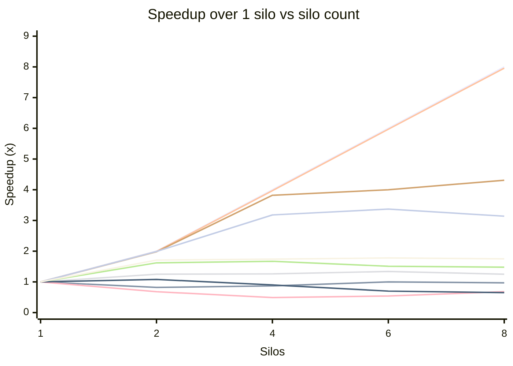
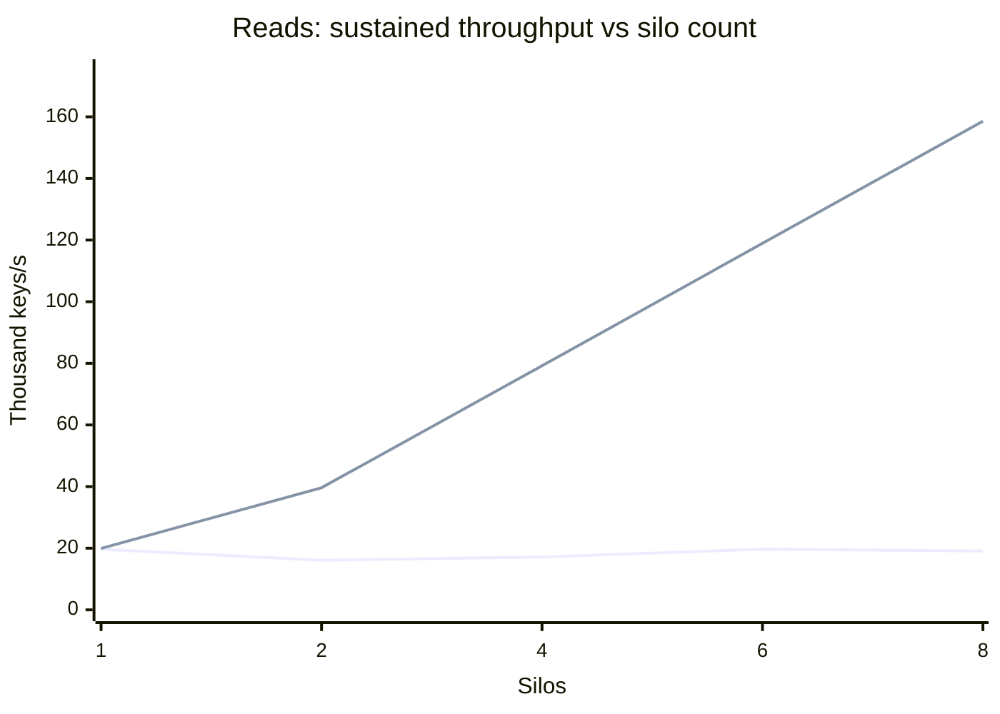
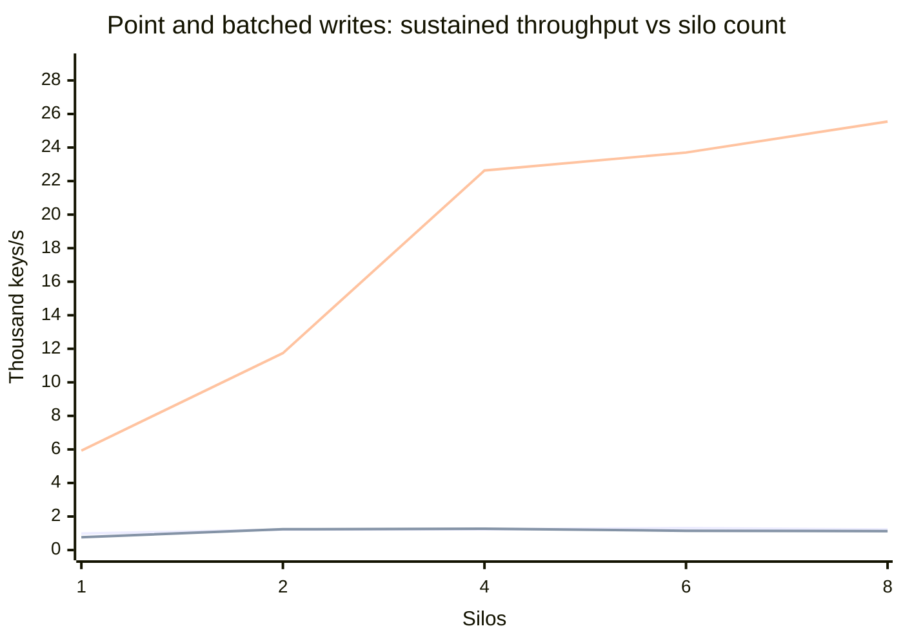
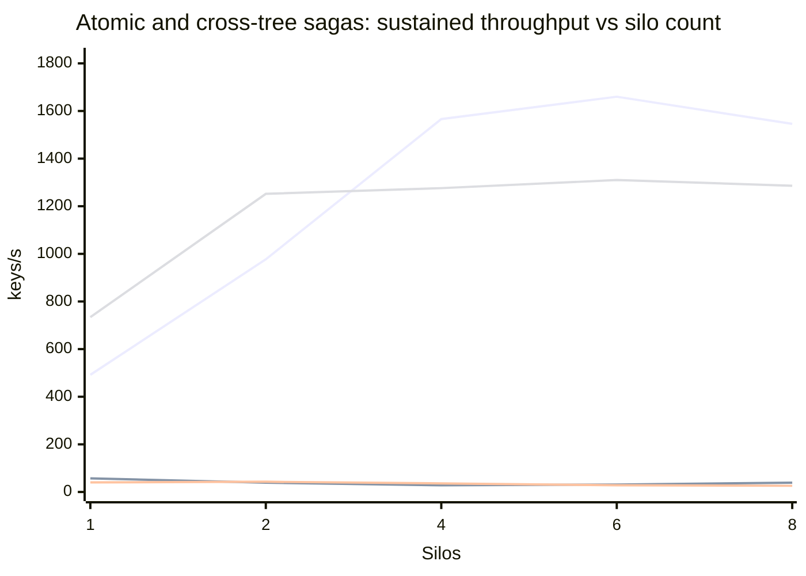

# Performance: multi-silo scaling guide

This document is an **approximate guide** to how Orleans.Lattice throughput
responds when you add silos. It is the horizontal-scaling companion to
[Performance: single-silo guide](performance-single-silo.md), which remains
the authority on what one silo delivers and on the per-operation call
shapes; read that first. Everything here answers one question that the
single-silo document deliberately does not: **when you put N hosts behind
the same tree, what do you actually get?**

The numbers come from a third benchmark tier ("Layer 3") that stands up a
fixed-size Orleans cluster on **Azure Container Apps**, drives it from an
out-of-cluster Orleans client, and records one cell per (workload, silo
count). It covers the same nine workloads as the single-silo Layer 2 table
and is regenerated by `benchmark/performance-report.ps1 -Layer3`, the same
harness that produces the Layer 1 and Layer 2 tables.

**Read the curve, not the absolute numbers.** The point of this tier is the
*shape* - where throughput stops rewarding extra hosts - and the shape is
robust in a way the absolute figures are not. Several deliberate choices
below (a single shared storage account, a fixed shard count, ACA's memory
ceiling, a harness with bounded concurrency) hold the topology constant so
the silo count is the only variable; each of them also caps the absolute
ceiling. A production deployment tuned for throughput rather than for
comparability will beat these figures.

## The short version

| Workload | Shape from 1 to 8 silos | What the evidence says bounds it |
|----------|-------------------------|----------------------------------|
| `GetManyAsync` (batched read) | Linear: 7.96x at 8 silos, 99% per-silo efficiency | Nothing this sweep reached |
| `SetManyAsync` (batched write) | Linear to 4 silos (95%), then a plateau at ~24-26 k keys/s | Consistent with the one shared storage account; not isolated |
| `GetAsync` (point read) | Flat at ~16-20 k keys/s | Consistent with the fixed pool of 64 non-interleaved shard roots |
| `SetAsync`, with or without a view | Flat at ~1.1-1.3 k keys/s | As for `GetAsync`; the view costs nothing measurable at this ceiling |
| Atomic and cross-tree sagas (all four) | Plateau at a roughly fixed **~15-25 sagas/s**, whatever the saga size | Not identified; the shape is that of a serialisation point |

The rest of this document gives the grid, how it was measured, and the
evidence behind each row of that table.

## The scaling curve

<!-- perf-chart:layer3:start
  schema=v1
  DO-NOT-HAND-EDIT-BETWEEN-MARKERS
-->



Series order (xychart-beta renders no legend): ideal linear scaling (y = silos), then `GetAsync` (point read), then `GetManyAsync` (4,096 keys/call), then `SetAsync` (point write), then `SetAsync` (point write + async materialised view), then `SetManyAsync` (4,096 keys/call), then `SetManyAtomicAsync` (64 keys/saga), then `SetManyAtomicAsync` (2 keys/saga, single-tree), then `BeginAtomicWrite` cross-tree (2 keys/saga, 2 trees), then `BeginAtomicWrite` cross-tree (64 keys/saga, 2 trees).



Series order (xychart-beta renders no legend): `GetAsync` (point read), then `GetManyAsync` (4,096 keys/call).



Series order (xychart-beta renders no legend): `SetAsync` (point write), then `SetAsync` (point write + async materialised view), then `SetManyAsync` (4,096 keys/call).



Series order (xychart-beta renders no legend): `SetManyAtomicAsync` (64 keys/saga), then `SetManyAtomicAsync` (2 keys/saga, single-tree), then `BeginAtomicWrite` cross-tree (2 keys/saga, 2 trees), then `BeginAtomicWrite` cross-tree (64 keys/saga, 2 trees).

<!-- perf-chart:layer3:end -->

## The grid

**How it was run.** Each cell is one cohort: the harness scales the silo
Container App to N replicas, waits for every replica to report running,
retires the superseded revision, settles for cluster membership, then runs
the producer as a Container Apps **job** that joins the cluster as an
Orleans *client* over the same Azure Table clustering store. The client
opens several connections per silo so grain calls spread across every
gateway rather than funnelling through one, warms the tree, and then drives
the measurement window. Offered load is **per-silo rung x N**, so the demand
presented to the cluster grows with the cluster: a flat line on the chart
means extra hosts absorbed nothing, not that the load ran out.

**Every cohort starts on empty storage.** Before each cohort, with the silos
parked at zero replicas, the harness deletes every table in the storage
account except the clustering table and points the silos at a freshly named
WAL table and grain-state table. No cohort inherits trees, tree-registry
rows, or WAL backlog from an earlier one. An earlier sweep reused one WAL
table for every cell, so later cells started behind a growing backlog of
earlier trees; that is no longer possible.

**Two identical rigs, one per workload family.** To halve the wall-clock,
the sweep ran on two identically deployed rigs in the same region, each with
its own storage account: one ran the reads, the point writes and
`SetManyAsync`, the other ran the four atomic workloads. Every curve comes
from a single rig, so no line mixes the two. Each cell is the median of two
cohorts; where the two disagreed by more than 2x the harness ran a third as
a tie-break, which happened once (`SetManyAsync` at 6 silos, see below).
Between cells the silo app is parked at zero replicas.

<!-- perf-table:layer3:start
  schema=v1
  batchSize=4096
  cohortN=2/3
  dotnet=10.0.x
  gitSha=8438e1660
  host=Azure Container Apps (Consumption)
  region=westus3
  responseTimeoutSec=420
  rowsMeasured=2026-09-24
  rungPerSilo=get-point=4000 veh/silo @ 5 Hz / 45s; get-many=4000 veh/silo @ 5 Hz / 45s; set-point=200 veh/silo @ 5 Hz / 45s; set-point-mv=200 veh/silo @ 5 Hz / 45s; set-many=1200 veh/silo @ 5 Hz / 45s; set-many-atomic=100 veh/silo @ 5 Hz / 45s; set-many-atomic-2=20 veh/silo @ 5 Hz / 45s; cross-tree-atomic-2=8 veh/silo @ 5 Hz / 45s; cross-tree-atomic-64=150 veh/silo @ 5 Hz / 45s
  shardCount=64
  siloCounts=1,2,4,6,8
  siloSize=4 vCPU / 8 GiB
  walAccounts=1
  walMaxPendingBatches=16
  walPartitions=16
  methodology=Each cell is the median across N HEALTHY cohorts of completed-work throughput: total successfully-completed keys at FINAL divided by the engine's active elapsed time. Layer 3 deliberately does NOT reuse Layer 2's rate>0 steady-state mean. On this path the client submits 4096-key batches, so a whole batch retires inside one per-second sample and the samples between retirements are exactly zero; filtering the zeros away averages only the spikes and reports more throughput than was offered (measured: 9,637 keys/s reported against 5,935 keys/s actually offered). The overstatement also varies with burstiness, which varies with silo count, so it would bend the scaling curve itself. Completed-ops / active-elapsed counts only work that succeeded over the wall-clock it took, so it cannot exceed the offered load and carries no windowing bias. Per-call p50/p99 come from the [phaseA] duration histogram of ONE representative silo, not an aggregate across silos. Offered load is scaled with the silo count (each workload carries a per-silo rung, driven at rung x silo count) so per-silo demand is held constant as the cluster grows and the curve measures capacity rather than a fixed load spread thinner. Speedup and per-silo efficiency are derived against the measured 1-silo cell. Every cohort starts on empty storage: with the silos parked, the harness deletes every table in the storage account except the clustering table and points the silos at a freshly named WAL table and grain-state table, so no cohort inherits trees, registry rows, or WAL backlog from an earlier one. All silo counts share ONE Azure Storage account for the WAL; see the caveats section for what its own metrics showed.
  DO-NOT-HAND-EDIT-BETWEEN-MARKERS
-->

| Operation | Silos | Offered | Sustained throughput | Speedup vs 1 silo | Per-silo efficiency | Per-call p50 | Per-call p99 |
|-----------|------:|--------:|---------------------:|------------------:|--------------------:|-------------:|-------------:|
| `GetAsync` (point read) | 1 | ~20 k keys/s | **~19.7 k keys/s** | 1x | 100% | ~30 us | ~240 us |
| `GetAsync` (point read) | 2 | ~40 k keys/s | **~16.1 k keys/s** | 0.82x | 41% | ~2 ms | ~18.16 ms |
| `GetAsync` (point read) | 4 | ~80 k keys/s | **~17.1 k keys/s** | 0.87x | 22% | ~2.52 ms | ~36.75 ms |
| `GetAsync` (point read) | 6 | ~120 k keys/s | **~19.7 k keys/s** | 1x | 17% | ~1.68 ms | ~77.31 ms |
| `GetAsync` (point read) | 8 | ~160 k keys/s | **~19.1 k keys/s** | 0.97x | 12% | ~3.68 ms | ~74.83 ms |
| `GetManyAsync` (4,096 keys/call) | 1 | ~20 k keys/s | **~19.9 k keys/s** | 1x | 100% | ~1.29 ms | ~4.16 ms |
| `GetManyAsync` (4,096 keys/call) | 2 | ~40 k keys/s | **~39.6 k keys/s** | 1.99x | 99% | ~7.72 ms | ~19.98 ms |
| `GetManyAsync` (4,096 keys/call) | 4 | ~80 k keys/s | **~79.2 k keys/s** | 3.97x | 99% | ~10.74 ms | ~22.24 ms |
| `GetManyAsync` (4,096 keys/call) | 6 | ~120 k keys/s | **~118.9 k keys/s** | 5.97x | 99% | ~9.48 ms | ~21.48 ms |
| `GetManyAsync` (4,096 keys/call) | 8 | ~160 k keys/s | **~158.6 k keys/s** | 7.96x | 99% | ~13.51 ms | ~26.88 ms |
| `SetAsync` (point write) | 1 | ~1 k keys/s | **979 keys/s** | 1x | 100% | ~17.03 ms | ~71.69 ms |
| `SetAsync` (point write) | 2 | ~2 k keys/s | **~1.2 k keys/s** | 1.25x | 62% | ~22.3 ms | ~87.89 ms |
| `SetAsync` (point write) | 4 | ~4 k keys/s | **~1.2 k keys/s** | 1.26x | 32% | ~22.3 ms | ~89.6 ms |
| `SetAsync` (point write) | 6 | ~6 k keys/s | **~1.3 k keys/s** | 1.34x | 22% | ~30.2 ms | ~176.42 ms |
| `SetAsync` (point write) | 8 | ~8 k keys/s | **~1.2 k keys/s** | 1.25x | 16% | ~27.29 ms | ~132.66 ms |
| `SetAsync` (point write + async materialised view) | 1 | ~1 k keys/s | **764 keys/s** | 1x | 100% | ~34.7 ms | ~84.64 ms |
| `SetAsync` (point write + async materialised view) | 2 | ~2 k keys/s | **~1.2 k keys/s** | 1.62x | 81% | ~20.5 ms | ~77.37 ms |
| `SetAsync` (point write + async materialised view) | 4 | ~4 k keys/s | **~1.3 k keys/s** | 1.67x | 42% | ~30.68 ms | ~189.73 ms |
| `SetAsync` (point write + async materialised view) | 6 | ~6 k keys/s | **~1.2 k keys/s** | 1.51x | 25% | ~28.24 ms | ~287.2 ms |
| `SetAsync` (point write + async materialised view) | 8 | ~8 k keys/s | **~1.1 k keys/s** | 1.48x | 18% | ~25.97 ms | ~185.08 ms |
| `SetManyAsync` (4,096 keys/call) | 1 | ~6 k keys/s | **~5.9 k keys/s** | 1x | 100% | ~206 ms | ~268.85 ms |
| `SetManyAsync` (4,096 keys/call) | 2 | ~12 k keys/s | **~11.7 k keys/s** | 1.98x | 99% | ~783.2 ms | ~943.71 ms |
| `SetManyAsync` (4,096 keys/call) | 4 | ~24 k keys/s | **~22.6 k keys/s** | 3.82x | 95% | ~2552.1 ms | ~2779.74 ms |
| `SetManyAsync` (4,096 keys/call) | 6 | ~36 k keys/s | **~23.7 k keys/s** | 4x | 67% | ~12365.23 ms | ~17152.1 ms |
| `SetManyAsync` (4,096 keys/call) | 8 | ~48 k keys/s | **~25.6 k keys/s** | 4.31x | 54% | ~7000.57 ms | ~8181.75 ms |
| `SetManyAtomicAsync` (64 keys/saga) | 1 | 500 keys/s | **492 keys/s** | 1x | 100% | ~56.32 ms | ~99.68 ms |
| `SetManyAtomicAsync` (64 keys/saga) | 2 | ~1 k keys/s | **977 keys/s** | 1.99x | 99% | ~49.4 ms | ~93.37 ms |
| `SetManyAtomicAsync` (64 keys/saga) | 4 | ~2 k keys/s | **~1.6 k keys/s** | 3.18x | 80% | ~94.22 ms | ~166.34 ms |
| `SetManyAtomicAsync` (64 keys/saga) | 6 | ~3 k keys/s | **~1.7 k keys/s** | 3.37x | 56% | ~57.7 ms | ~118.85 ms |
| `SetManyAtomicAsync` (64 keys/saga) | 8 | ~4 k keys/s | **~1.5 k keys/s** | 3.14x | 39% | ~84.42 ms | ~378.22 ms |
| `SetManyAtomicAsync` (2 keys/saga, single-tree) | 1 | 100 keys/s | **57 keys/s** | 1x | 100% | ~15.36 ms | ~30.4 ms |
| `SetManyAtomicAsync` (2 keys/saga, single-tree) | 2 | 200 keys/s | **39 keys/s** | 0.68x | 34% | ~18.27 ms | ~27.78 ms |
| `SetManyAtomicAsync` (2 keys/saga, single-tree) | 4 | 400 keys/s | **28 keys/s** | 0.49x | 12% | ~99.01 ms | ~160.24 ms |
| `SetManyAtomicAsync` (2 keys/saga, single-tree) | 6 | 600 keys/s | **31 keys/s** | 0.54x | 9% | ~47.66 ms | ~130.01 ms |
| `SetManyAtomicAsync` (2 keys/saga, single-tree) | 8 | 800 keys/s | **39 keys/s** | 0.68x | 9% | ~49.6 ms | ~74.98 ms |
| `BeginAtomicWrite` cross-tree (2 keys/saga, 2 trees) | 1 | 40 keys/s | **40 keys/s** | 1x | 100% | ~7.42 ms | ~26.54 ms |
| `BeginAtomicWrite` cross-tree (2 keys/saga, 2 trees) | 2 | 80 keys/s | **43 keys/s** | 1.08x | 54% | ~12.84 ms | ~98.6 ms |
| `BeginAtomicWrite` cross-tree (2 keys/saga, 2 trees) | 4 | 160 keys/s | **36 keys/s** | 0.9x | 22% | ~9.54 ms | ~15.8 ms |
| `BeginAtomicWrite` cross-tree (2 keys/saga, 2 trees) | 6 | 240 keys/s | **28 keys/s** | 0.7x | 12% | ~50.89 ms | ~99.32 ms |
| `BeginAtomicWrite` cross-tree (2 keys/saga, 2 trees) | 8 | 320 keys/s | **26 keys/s** | 0.65x | 8% | ~31.8 ms | ~50.22 ms |
| `BeginAtomicWrite` cross-tree (64 keys/saga, 2 trees) | 1 | 750 keys/s | **734 keys/s** | 1x | 100% | ~68.43 ms | ~121.24 ms |
| `BeginAtomicWrite` cross-tree (64 keys/saga, 2 trees) | 2 | ~1.5 k keys/s | **~1.3 k keys/s** | 1.71x | 85% | ~67.31 ms | ~122.12 ms |
| `BeginAtomicWrite` cross-tree (64 keys/saga, 2 trees) | 4 | ~3 k keys/s | **~1.3 k keys/s** | 1.74x | 43% | ~84.86 ms | ~99.58 ms |
| `BeginAtomicWrite` cross-tree (64 keys/saga, 2 trees) | 6 | ~4.5 k keys/s | **~1.3 k keys/s** | 1.78x | 30% | ~140.06 ms | ~165.02 ms |
| `BeginAtomicWrite` cross-tree (64 keys/saga, 2 trees) | 8 | ~6 k keys/s | **~1.3 k keys/s** | 1.75x | 22% | ~443.48 ms | ~635.23 ms |

<!-- perf-table:layer3:end -->

> Measured 2026-09-24 on Azure Container Apps (Consumption) in westus3 (.NET 10.0.x) at git sha 8438e1660, n=2/3 cohorts per cell, silo counts 1,2,4,6,8. Offered load scales with the silo count (constant per-silo demand), and every cohort starts on freshly emptied storage. All silo counts share one Azure Storage account for the WAL - see the caveats below for what its metrics showed.

## How to read this

**`Speedup vs 1 silo` is the headline and `Per-silo efficiency` is the
warning light.** Speedup is the cell's throughput over the same workload's
N=1 throughput; efficiency is that speedup divided by N. Perfect scaling is
speedup = N and efficiency = 100%. The **knee** is the silo count after
which efficiency falls away sharply - past it you are paying for hosts that
contend rather than contribute.

**`Offered` is the target, and the client is closed-loop.** The harness
bounds how much work it has in flight (a fixed number of flush slots per
silo), so when the cluster cannot keep up the producer is held back rather
than queueing without limit. A cell well below its `Offered` figure is
therefore the cluster's limit under that harness, not load that was lost.
Where the client was pinned at its in-flight cap, that is stated below,
because it changes what a flat line means.

**Throughput is cluster-wide; the latency quantiles are not.** The
throughput column counts every key the whole cluster retired. The p50/p99
columns come from the duration histogram of a single silo's last productive
reporter window, because the histogram is per-process and this tier does not
aggregate quantiles across hosts (merging quantiles is not sound, and
summing them is meaningless). Treat the latency columns as *representative
of one host under the cluster's share of the load*, not as a cluster-wide
distribution. For the atomic rows the instrument is the saga's terminal
broadcast phase (`saga.broadcast.duration`), not its end-to-end commit time,
which is much longer; see the atomic section.

**Failures are data here, and most are storage transaction failures.** The
engine retries a WAL saturation refusal on its own back-off ladder (#3339),
so back-pressure is absorbed rather than counted, and the FINAL line carries
`satRetries` / `satRecovered` / `satExhausted` to make it readable. What
`failed` counts in this sweep is almost entirely Azure Tables batch
transactions that did not report success: either
`TableTransactionFailedException: The specified entity already exists` - the
signature of a transaction being retried after it had in fact landed, so the
keys are durable - or a server-side timeout ("Operation could not be
completed within the specified time"), where the outcome was simply not
reported. Either way the harness books the whole batch as failed. Most cells
report zero; the non-zero ones are called out below. The harness grades a
cohort only on whether it produced a productive measurement window, and
carries the failure count through rather than discarding the cell.

## Workload by workload

### `GetManyAsync`: linear to 8 silos

Every cell retired essentially all of its offered load: 19.9 k keys/s at one
silo and 158.6 k at eight, 7.96x, with per-silo efficiency at 99% in every
cell. Both cohorts of every cell agree to within 1%. The median per-call
time rises from ~1.3 ms at one silo to ~8-14 ms from two silos on, which is
the cost of a batch fanning out to shard roots that now live on other hosts,
and grows only modestly beyond that. This is the compute-tier result: grain
placement, the gateway fan-out and the leaf cache spread across hosts, and
this sweep did not find the ceiling. The N=1 cell also matches Layer 2's
single-VM read figure (see the caveats).

### `GetAsync`: flat, and the reason is not the silos

Point reads deliver ~16-20 k keys/s at every silo count. At one silo that is
the offered load (the client used 2 of its 8 flush slots). From two silos on
the client is pinned at its in-flight cap and the cluster still retires the
same ~17-20 k keys/s, so the extra hosts add nothing.

The silo-side histograms say where the time goes. Busy concurrency inside
`LatticeGrain` (the sum of `get.duration` over a 10-second window divided by
the window) is **0.8** calls per silo at one silo and **25-28** at two to
eight silos, against a stateless-worker pool of 32 per silo; the mean time a
get spends inside the grain rises from **0.05 ms** at one silo to **4-10
ms** at two to eight. So each silo's workers are almost all busy waiting.
The worker pool grows with the silo count while the cluster's throughput
does not, which means the binding resource is fixed-size rather than
per-host.

The fixed-size resource that fits is the tree's **64 shard roots**. A shard
root's `GetAsync` and `SetAsync` are deliberately *not* interleaved (the
invariant that keeps a point operation atomic with respect to an online
reshard), so each shard root serves one point operation at a time and holds
its turn across the call to the leaf. At one silo that hop is in-process; at
N silos it crosses the network for (N-1)/N of calls. More silos therefore
add hops without adding shard roots, and cluster-wide point throughput stays
roughly 64 divided by the per-operation hold time. This is **consistent
with** the evidence, not proven by it: a shard-count A/B would settle it.
Either way, the levers for point-read throughput are batching
(`GetManyAsync` amortises one shard-root turn over many keys, which is why
it scales) and shard count, not silo count.

### `SetAsync` and `SetAsync` with a materialised view: flat at ~1.2 k

Point writes deliver 979 keys/s at one silo (the offered 1 k) and ~1.2-1.3 k
keys/s at every silo count from two to eight. The shape is the same as
`GetAsync`: at one silo the grain's busy concurrency is ~13 per silo; from
two silos on it is **30-32**, its cap, and the mean time a set spends inside
the grain triples from ~14 ms to ~44 ms. The same fixed-pool reading
applies, with a WAL commit inside each shard-root turn making the hold time
longer, and so the ceiling much lower, than for reads. Some cohorts at four
or more silos report failed keys (up to ~12 k); in every one checked they
are Azure Tables server timeouts, not WAL back-pressure.

The materialised-view variant tracks plain `SetAsync` within cohort noise
from two silos on (~1.1-1.3 k keys/s). At one silo it is lower (764 against
979 keys/s, with its two cohorts at 669 and 859), where the view maintainer
shares the only host with the write path. At the ceiling the view costs
nothing measurable.

### `SetManyAsync`: linear to 4 silos, then a plateau

Batched writes scale linearly to four silos - 5.9 k, 11.7 k and 22.6 k
keys/s, 95% efficiency at four - and at those silo counts the cluster keeps
up with the offered load: the client uses a handful of its flush slots (3-5
of 32 at four silos) and failures are zero. From six silos on the curve
flattens at **~24-26 k keys/s**: the client is pinned at its cap (64 of 64
at eight silos) and the median call time rises from ~2.6 s at four silos to
~7-12 s.

The plateau is **consistent with the single shared storage account**, but
not proven to be it. The account's own metrics show **zero** throttling
responses across the whole sweep, so it was not refusing work. Its
server-side latency did rise in the final hour of the sweep, which carried
the eight-silo `SetManyAsync` cell and the six-silo tie-break (hourly
averages of 6-9 ms earlier, 18.4 ms in that hour), and the tree's 16 WAL
partitions against Azure Tables' documented per-partition target of about
2,000 entities/s give a ceiling in the low 30 k entities/s - close to where
the curve flattens. The experiment that would settle it is the harness's
multi-account WAL fan-out, held out of this sweep so the silo count stays
the only variable.

The six-silo cell needed a tie-break, and it is the one place the residual
multi-silo stall shows up in the grid. Its first cohort **wedged**: 18
productive seconds, then 287 seconds retiring nothing with the client pinned
at its cap, and no recovery even after the producer stopped. It finished at
1,780 keys/s with 352,803 keys failed and 182,117 back-offs exhausted, and
the storage account went on serving WAL batch transactions throughout, so
commits were landing while calls did not return. The other two cohorts ran
normally at 27.4 k and 23.7 k keys/s, and the cell reports the median of all
three, 23.7 k. Neither eight-silo cohort wedged (28.4 k and 22.7 k keys/s,
zero failures). This stall class is tracked as #3458; the cohort is kept in
the data rather than discarded.

### Atomic and cross-tree sagas: a fixed number of sagas per second

The four atomic workloads look different in keys/s and alike in sagas/s,
which is the more telling unit:

| Workload | Keys per saga | Sagas/s at 1 / 2 / 4 / 6 / 8 silos |
|----------|--------------:|:-----------------------------------|
| `SetManyAtomicAsync` | 64 | 7.7 / 15 / 24 / 26 / 24 |
| `SetManyAtomicAsync` | 2 | 28 / 20 / 14 / 15 / 20 |
| `BeginAtomicWrite` cross-tree | 64 | 11.5 / 20 / 20 / 20 / 20 |
| `BeginAtomicWrite` cross-tree | 2 | 20 / 21 / 18 / 14 / 13 |

Where a cell is below its plateau (the single-tree 64-key saga at one and
two silos, both cross-tree sagas at one) it is simply retiring the offered
load. Everywhere else the four workloads converge on roughly **15-25
sagas/s**, whether a saga carries 2 keys or 64 and whether it spans one tree
or two. The cost is per saga, not per key, and adding silos does not raise
the rate.

That is not the harness running out of concurrency. Every atomic mode
commits one flush batch's sagas one after another, and runs up to eight
batches per silo at once, so the harness presents 8N concurrent saga chains;
at the plateau it is pinned at that cap (for example 32 of 32 for the
cross-tree 64-key saga at four silos, and 64 of 64 for both single-tree
sagas at eight). A fixed sagas/s rate under concurrency that grows with N
means each saga's end-to-end time grows roughly in proportion to N: for the
2-key single-tree saga, about 0.3 s at one silo and about 3.3 s at eight.
That shape - throughput set by a count of operations and independent of both
their size and the concurrency offered - is what a serialisation point looks
like, but this sweep does not identify one, and it is not the saga's
terminal broadcast, whose p50 in the table stays far below the end-to-end
times above. The failed keys in some 64-key cohorts at four or more silos
are, in every cohort checked, Azure Tables server timeouts.

## What happened to the write collapse

An earlier version of this document, measured at eb78c703c, reported a
`SetManyAsync` curve that peaked at 4 silos and then **collapsed** - 2.3 k
keys/s at six silos and 840 keys/s at eight, less than one silo delivered.
Instrumentation localised that to scatter-gather tail amplification in
`LatticeGrain`'s shard fan-out, filed as #3348 and fixed by #3455 (with the
back-pressure retry of #3339 and the acute-only saturation classification of
#3443, both of which this rig runs with).

On the fixed engine the same cells deliver **23.7 k keys/s at six silos and
25.6 k at eight** - a 10x and 30x improvement respectively - and the median
`SetManyAsync` call at one silo fell from ~3.5 s to ~206 ms. The collapse is
gone. What remains at six or more silos is the plateau and the residual
stall described above, which are separate questions from the defect that was
fixed.

## Caveats that bound these numbers

**The N=1 cell is the control, and it reproduces Layer 2.** A scaling curve
measured on different hardware to the single-host tier would be
uncomparable, so the first thing to check is that one ACA silo performs like
one Layer 2 VM. It does: the N=1 `get-many` cell lands on Layer 2's
published single-VM read figure. That is what licenses reading the rest of
this document alongside the single-silo guide rather than as an unrelated
experiment, and it is the reason `get-many` is in the sweep at all even
though it exercises no WAL. If a future re-run shows the N=1 cell drifting
away from Layer 2's, treat the whole curve as suspect before believing
anything it says about scaling.

**The throughput basis differs from Layer 2's, deliberately.** Layer 2
publishes the mean of the silo's per-second rate samples. That works when
the producer is co-located and work retires smoothly. It does **not** work
here: the Layer 3 client submits large batches, so a whole batch retires
inside one sample and the samples between retirements are exactly zero.
Layer 2's filter discards those zeros, which averages only the spikes - on a
real warmed single-silo cohort that reported 9,637 keys/s against an offered
load of 5,935 keys/s, a rate higher than the load, which cannot be a
sustained throughput. Worse, the overstatement scales with burstiness, and
burstiness varies with silo count, so it would bend the very curve this tier
exists to measure. Layer 3 therefore publishes **completed operations
divided by the active measurement window**. A Layer 3 cell and a Layer 2
cell are consequently *not* computed the same way; the Layer 3 figure is the
conservative one.

**One storage account per rig backs the whole cluster.** Every silo's WAL
writes land in the same Azure Tables account, so a flattening write curve
could be measuring that account rather than the cluster. Its metrics were
read for the whole sweep: across roughly 13.5 M transactions on the two
rigs' accounts there were **zero** throttling (`ServerBusy`) responses and
about 120 server timeouts in total. The account was never refusing work, but
that does not rule out it being the pace-setter for `SetManyAsync`'s
plateau, as discussed above. Multi-account WAL fan-out exists in the harness
and is held out of this sweep so that silo count stays the only variable.

**The shard count is fixed across every cell.** All cells use the same
64-shard tree topology, so a change in the curve is a change in host count
and not in shard granularity. That choice matters most for the point
operations, whose flat curves are consistent with the shard roots being the
limit; if your deployment runs a different shard count, scale your
expectations for `GetAsync` and `SetAsync` with it.

**The harness's concurrency is bounded and scales with the silo count.** The
client runs a fixed number of flush slots per silo, and the atomic modes
commit each slot's sagas serially. That keeps per-silo demand constant, but
it means a cell where the client was pinned at its cap measures the
cluster's response time under that concurrency, not an open-loop ceiling.
Each section above says where that applies.

**Silo sizing matches Layer 2 on CPU, not on memory.** The Layer 2 host is a
`Standard_D4as_v5` (4 vCPU / 16 GiB). ACA Consumption caps a replica at 4
vCPU / 8 GiB with a fixed 1:2 CPU-to-memory ratio, so CPU parity is exact
and memory is **half**. This mostly affects cache-resident read workloads,
whose absolute numbers are correspondingly conservative; it does not affect
the scaling shape.

**There is a residual per-call latency cost against Layer 2.** The Layer 2
producer runs *inside* the silo process, so its calls never leave the host.
The Layer 3 producer is a separate container reaching silo gateways over the
container environment's network, so every call pays a real network hop that
Layer 2 does not. Compare Layer 3 latencies to each other across silo
counts; compare them to Layer 2's only with that hop in mind.

**The replay admission queue is widened for this tier.** A cohort opens
against a cold tree and the warm-up needs every shard root live at once. The
replay admission gate sizes its queue from the host's CPU grant, which on a
4-vCPU replica refuses a fan-out that wide - it exists to stop a foreground
read queueing behind a background corpus walk, and the benchmark has no
foreground reader to protect. The harness raises
`LatticeOptions.WalReplayPermitQueueDepthPerPermit` on the Layer 3 silos
accordingly. The single-silo tiers do not set it and are unaffected.

## Re-running it yourself

The sweep is a single switch on the same harness that produces the other two
tiers:

```powershell
pwsh benchmark/performance-report.ps1 -Layer3
```

With no further arguments it provisions its own resource group, container
registry, log workspace, container environment, silo app and producer job,
sweeps every workload at 1, 2, 4, 6 and 8 silos, parks the cluster at zero
replicas between cells, and deletes the resource group when the sweep ends.
The switches that matter for a partial or resumed run:

- `-ReuseAca <prefix>` runs against an already deployed rig instead of
  provisioning one, and leaves it in place (parked) afterwards.
- `-Workloads` and `-SiloCounts` restrict the sweep. `pwsh -File` passes an
  array argument as a single string, so to pass a list use `pwsh -Command "&
  ./benchmark/performance-report.ps1 -Layer3 -SiloCounts 6,8"`.
- `-Resume` skips cells the newest run state already holds; combined with a
  larger `-N` it tops an existing cell up with extra cohorts (this is how
  the six-silo `SetManyAsync` tie-break was run) rather than re-running it.
- `-DryRun` re-renders this document from the newest run state without
  touching Azure.

See [Benchmarks](benchmarks.md) for the runbook and prerequisites, and
`benchmark/azure-throughput/throughput.md` for the engine's own
documentation.
