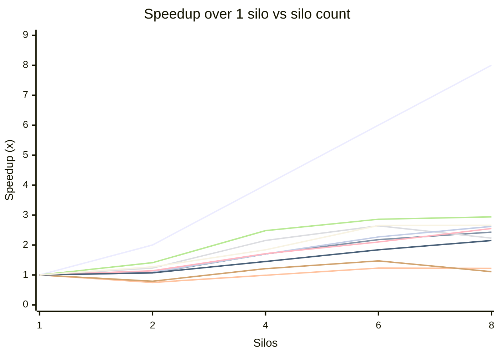
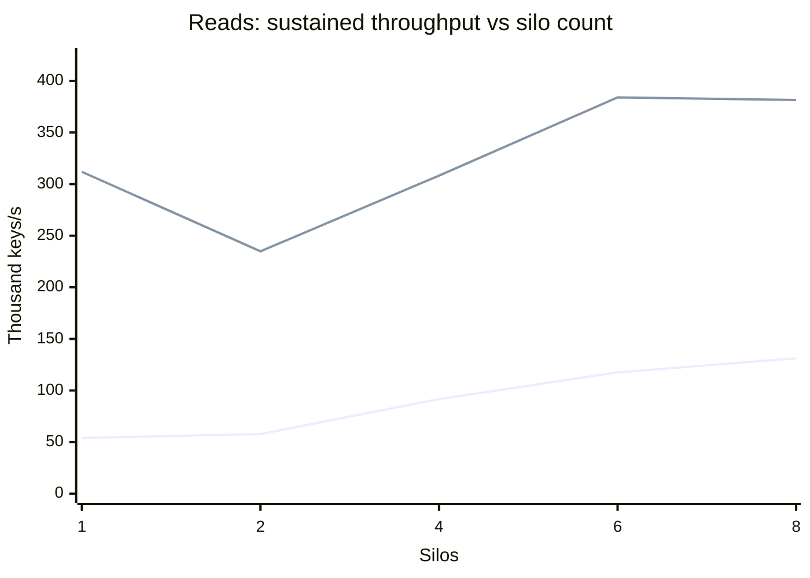
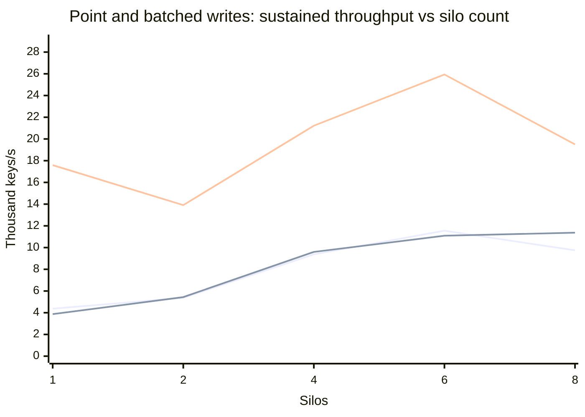
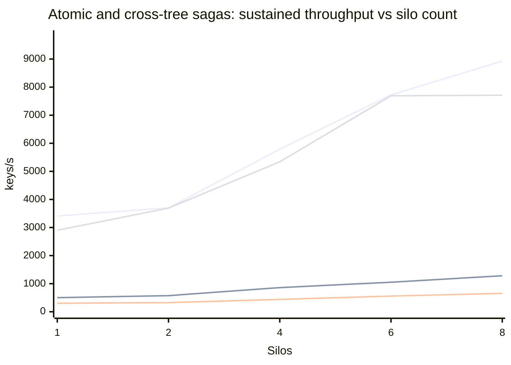

# Performance: multi-silo scaling guide

> [!IMPORTANT]
> **Scope: one tree, one storage account.** Every figure here comes from a cluster serving a **single tree** (two for the cross-tree saga rows), with its write-ahead log and grain state on **one Azure Storage account**.
>
> - **Trees.** Some of a tree's resources have a fixed count that does not grow with the cluster: its WAL partitions ([`WalPartitions`](configuration.md#walpartitions), default 8), its shards, and its transaction registry ([`TxRegistryShardCount`](configuration.md#txregistryshardcount), default 1). An estate serving many trees spreads more of them across its silos, so its aggregate write and atomic-saga throughput can scale further than one tree's. Reads, whose bound here lies outside the tree, would gain little. Multi-tree scaling has not been measured.
> - **Storage accounts.** One account is a test constraint, not a library limit. Lattice can spread a tree's WAL partitions across several storage accounts; see [Multi-account fan-out](wal-storage-providers.md#multi-account-fan-out-named-providers-and-pinned-placement). The `SetManyAsync` ceiling below is that one account's ceiling.

This document is an **approximate guide** to how Orleans.Lattice throughput
responds when you add silos. It is the horizontal-scaling companion to
[Performance: single-silo guide](performance-single-silo.md), which remains
the authority on what one silo delivers and on the per-operation call
shapes; read that first. Everything here answers one question that the
single-silo document deliberately does not: **when you put N hosts behind
the same tree, what do you actually get?**

The numbers come from a third benchmark tier ("Layer 3") that stands up a
fixed-size Orleans cluster on **Azure Container Apps**, drives it from an
out-of-cluster Orleans client, and records one cell per (workload, silo
count). It covers the same nine workloads as the single-silo Layer 2 table
and is regenerated by `benchmark/performance-report.ps1 -Layer3`, the same
harness that produces the Layer 1 and Layer 2 tables.

**Read the curve, not the absolute numbers.** The point of this tier is the
*shape* - where throughput stops rewarding extra hosts - and the shape is
robust in a way the absolute figures are not. Several deliberate choices
below (one shared storage account per rig, a fixed shard count, ACA's memory
ceiling, a client with bounded concurrency) hold the topology constant so
the silo count is the only variable; each of them also caps the absolute
ceiling. A production deployment tuned for throughput rather than for
comparability will beat these figures.

## The short version

| Workload | Shape from 1 to 8 silos | What the evidence says bounds it |
|----------|-------------------------|----------------------------------|
| `GetAsync` (point read) | ~54 k keys/s at one silo, ~58 k at two, then rising to ~131 k at eight (2.43x) | From two silos on, time spent outside the grain call: the silo-side call time holds at ~4 ms while the client's calls take longer |
| `GetManyAsync` (batched read) | ~312 k keys/s at one silo, ~235 k at two, then rising to ~384 k at six and ~382 k at eight (1.22x) | The client's bounded concurrency against a per-call time that grows with the silo count; not isolated further |
| `SetAsync`, with or without a view | ~4 k keys/s at one silo, ~11-12 k at six, ~10-11 k at eight | Not isolated; the silo-side median write holds at 35-50 ms up to six silos, then rises at eight as Azure Tables timeouts appear |
| `SetManyAsync` (batched write) | ~17.6 k keys/s at one silo, 14-26 k from two to eight, no sustained gain | The one shared storage account: server-side timeouts, and at eight silos a cohort that lost whole batches to them |
| 64-key atomic sagas (single-tree and cross-tree) | ~45-53 sagas/s at one silo, ~120-140 at eight (2.6-2.7x) | Per-saga latency under the client's bounded concurrency; the saga registry's admission budget was never reached |
| 2-key atomic sagas (single-tree and cross-tree) | ~250 and ~150 sagas/s at one silo, ~640 and ~330 at eight (2.2-2.6x) | Per-saga durable-write latency on the one grain-state storage account ([#3591](https://github.com/NSTA1/Orleans.Lattice/issues/3591)) |

No workload is flat any more, and none scales linearly. The rest of this
document gives the grid, how it was measured, and the evidence behind each
row of that table.

## The scaling curve

<!-- perf-chart:layer3:start
  schema=v1
  DO-NOT-HAND-EDIT-BETWEEN-MARKERS
-->



Series order (xychart-beta renders no legend): ideal linear scaling (y = silos), then `GetAsync` (point read), then `GetManyAsync` (4,096 keys/call), then `SetAsync` (point write), then `SetAsync` (point write + async materialised view), then `SetManyAsync` (4,096 keys/call), then `SetManyAtomicAsync` (64 keys/saga), then `SetManyAtomicAsync` (2 keys/saga, single-tree), then `BeginAtomicWrite` cross-tree (2 keys/saga, 2 trees), then `BeginAtomicWrite` cross-tree (64 keys/saga, 2 trees).



Series order (xychart-beta renders no legend): `GetAsync` (point read), then `GetManyAsync` (4,096 keys/call).



Series order (xychart-beta renders no legend): `SetAsync` (point write), then `SetAsync` (point write + async materialised view), then `SetManyAsync` (4,096 keys/call).



Series order (xychart-beta renders no legend): `SetManyAtomicAsync` (64 keys/saga), then `SetManyAtomicAsync` (2 keys/saga, single-tree), then `BeginAtomicWrite` cross-tree (2 keys/saga, 2 trees), then `BeginAtomicWrite` cross-tree (64 keys/saga, 2 trees).

<!-- perf-chart:layer3:end -->

## The grid

**How it was run.** For each cohort the harness scales the silo
Container App to N replicas, waits for every replica to report running,
retires the superseded revision, settles for cluster membership, then runs
the producer as a Container Apps **job** that joins the cluster as an
Orleans *client* over the same Azure Table clustering store. The client
opens several connections per silo (four by default) so grain calls spread
across every gateway rather than funnelling through one, seeds the keyspace
for the read workloads, warms the tree, and then drives the measurement
window. Offered load is **per-silo rung x N**, so the demand presented to
the cluster grows with the cluster: a flat line on the chart means extra
hosts absorbed nothing, not that the load ran out.

**Every cohort starts on empty storage.** Before each cohort, with the silos
parked at zero replicas, the harness deletes every table in the storage
account except the clustering table and points the silos at a freshly named
WAL table and grain-state table. No cohort inherits trees, tree-registry
rows, or WAL backlog from an earlier one.

**Every figure is true throughput, not offered load.** A cell whose first
cohort completes at least 90% of what was offered has not found the
cluster's limit, so the harness discards that cohort as a probe, doubles
the per-silo rung and runs it again, up to three times. The rung a workload
settles on carries forward to the larger silo counts, so demand never falls
as the cluster grows. A cell still keeping up with its offered load after
the last escalation is published as a lower bound, marked `>=`, and so is a
cell whose producer could not generate the load it was asked for: that
measures the client, not the cluster. Each cell is the median of two
cohorts at the settled rung; `GetAsync` takes three, because its cohorts do
not always land at the same level. Between cells the silo app is parked at
zero replicas.

**The client's concurrency is sized per workload.** The client runs a fixed
number of flush slots per silo, recorded as `flushConcurrency` in the
table's metadata. Batched workloads need few, because one call carries 4,096
keys, and run 8 per silo. Point and saga workloads carry one key or one saga
per call, so at that default the client, not the cluster, would be the
limit; `GetAsync` runs 16 slots per silo and the point-write and atomic
workloads 64, and each atomic saga is its own flush unit. The point
workloads fan each slot out into that many individual calls, so their
in-flight call count is the slot count squared times N: it grows linearly
with the cluster, keeping per-silo demand constant.

**Two identical rigs, split by workload family.** To halve the wall-clock,
the sweep ran on two identically deployed rigs in the same region, each with
its own storage account. One ran the two reads and `SetManyAsync`; the other
ran the four atomic workloads and the two point-write workloads. Every curve
comes from a single rig, so no line mixes the two. As a cross-check the
second rig also ran `SetManyAsync` at every silo count: it reproduced the
same shape, a dip at two silos and no sustained gain after four, at 4-24%
below the first rig cell by cell, which is the spread to allow when
comparing absolute figures across rigs.

**The code measured.** Every cell ran the tip of the epic that removed the
multi-silo ceilings ([#3496](https://github.com/NSTA1/Orleans.Lattice/issues/3496)),
recorded as `gitSha` below. The point-write rows and one-silo re-runs of
`GetManyAsync` and the 64-key `SetManyAtomicAsync` saga ran on the same
library code with later fixes to the benchmark client's accounting and
grading applied, because those fixes changed what those cells measured;
those fixes grade a cohort producer-bound only when the producer really
fell behind ([#3589](https://github.com/NSTA1/Orleans.Lattice/issues/3589)),
book point-mode failures per key rather than per 4,096-key flush unit
([#3590](https://github.com/NSTA1/Orleans.Lattice/issues/3590)), and re-run
a read cohort whose keyspace was never seeded instead of letting it cap the
cell. The six-silo `GetManyAsync` cell was re-run for that last reason: one
of its two original cohorts was unseeded and had been excluded.

<!-- perf-table:layer3:start
  schema=v1
  batchSize=4096
  cohortN=2/3
  dotnet=10.0.x
  gitSha=0981d6d27
  host=Azure Container Apps (Consumption)
  maxRungEscalations=3
  region=westus3
  responseTimeoutSec=420
  rowsMeasured=2026-09-26
  rungPerSilo=get-point=8000 veh/silo @ 5 Hz / 45s, flushConcurrency 16/silo; get-many=16000 veh/silo @ 5 Hz / 45s, flushConcurrency 8/silo; set-point=1200 veh/silo @ 5 Hz / 45s, flushConcurrency 64/silo; set-point-mv=1200 veh/silo @ 5 Hz / 45s, flushConcurrency 64/silo; set-many=2400 veh/silo @ 5 Hz / 45s, flushConcurrency 8/silo; set-many-atomic=800 veh/silo @ 5 Hz / 45s, flushConcurrency 64/silo; set-many-atomic-2=200 veh/silo @ 5 Hz / 45s, flushConcurrency 64/silo; cross-tree-atomic-2=100 veh/silo @ 5 Hz / 45s, flushConcurrency 64/silo; cross-tree-atomic-64=800 veh/silo @ 5 Hz / 45s, flushConcurrency 64/silo
  saturationRatio=0.9
  shardCount=64
  siloCounts=1,2,4,6,8
  siloSize=4 vCPU / 8 GiB
  walAccounts=1
  walMaxPendingBatches=16
  walPartitions=16
  methodology=Each cell is the median across N HEALTHY cohorts of completed-work throughput: total successfully-completed keys at FINAL divided by the engine's active elapsed time. Layer 3 deliberately does NOT reuse Layer 2's rate>0 steady-state mean. On this path the client submits 4096-key batches, so a whole batch retires inside one per-second sample and the samples between retirements are exactly zero; filtering the zeros away averages only the spikes and reports more throughput than was offered (measured: 9,637 keys/s reported against 5,935 keys/s actually offered). The overstatement also varies with burstiness, which varies with silo count, so it would bend the scaling curve itself. Completed-ops / active-elapsed counts only work that succeeded over the wall-clock it took, so it cannot exceed the offered load and carries no windowing bias. Per-call p50/p99 come from the [phaseA] duration histogram of ONE representative silo, not an aggregate across silos. Every cell is a true-throughput measurement, not an offered-load one: offered load is scaled with the silo count (a per-silo rung driven at rung x silo count, so per-silo demand never falls as the cluster grows), and a cell whose first cohort completes at least saturationRatio of what was offered is re-run at double the rung, up to maxRungEscalations times, so the published figure is where the cluster stopped keeping up rather than what the client asked for. A cell still offer-bound after the last escalation is published as a lower bound (>=). Speedup and per-silo efficiency are derived against the measured 1-silo cell. Every cohort starts on empty storage: with the silos parked, the harness deletes every table in the storage account except the clustering table and points the silos at a freshly named WAL table and grain-state table, so no cohort inherits trees, registry rows, or WAL backlog from an earlier one. All silo counts share ONE Azure Storage account for the WAL; see the caveats section for what its own metrics showed.
  DO-NOT-HAND-EDIT-BETWEEN-MARKERS
-->

| Operation | Silos | Offered | Sustained throughput | Speedup vs 1 silo | Per-silo efficiency | Per-call p50 | Per-call p99 |
|-----------|------:|--------:|---------------------:|------------------:|--------------------:|-------------:|-------------:|
| `GetAsync` (point read) | 1 | ~80 k keys/s | **~54 k keys/s** | 1x | 100% | ~30 us | ~290 us |
| `GetAsync` (point read) | 2 | ~160 k keys/s | **~57.8 k keys/s** | 1.07x | 54% | ~3.79 ms | ~14.46 ms |
| `GetAsync` (point read) | 4 | ~320 k keys/s | **~91.7 k keys/s** | 1.7x | 42% | ~4.07 ms | ~15.92 ms |
| `GetAsync` (point read) | 6 | ~480 k keys/s | **~117.6 k keys/s** | 2.18x | 36% | ~3.62 ms | ~17.59 ms |
| `GetAsync` (point read) | 8 | ~640 k keys/s | **~131.2 k keys/s** | 2.43x | 30% | ~3.94 ms | ~20.93 ms |
| `GetManyAsync` (4,096 keys/call) | 1 | ~640 k keys/s | **~311.9 k keys/s** | 1x | 100% | ~51.05 ms | ~168.93 ms |
| `GetManyAsync` (4,096 keys/call) | 2 | ~640 k keys/s | **~234.8 k keys/s** | 0.75x | 38% | ~237.9 ms | ~285.38 ms |
| `GetManyAsync` (4,096 keys/call) | 4 | ~1.28 M keys/s | **~308.2 k keys/s** | 0.99x | 25% | ~349 ms | ~451.36 ms |
| `GetManyAsync` (4,096 keys/call) | 6 | ~1.92 M keys/s | **~384 k keys/s** | 1.23x | 21% | ~446.96 ms | ~539.3 ms |
| `GetManyAsync` (4,096 keys/call) | 8 | ~2.56 M keys/s | **~381.5 k keys/s** | 1.22x | 15% | ~621.26 ms | ~713.69 ms |
| `SetAsync` (point write) | 1 | ~6 k keys/s | **~4.4 k keys/s** | 1x | 100% | ~46.04 ms | ~152.52 ms |
| `SetAsync` (point write) | 2 | ~12 k keys/s | **~5.4 k keys/s** | 1.23x | 61% | ~34.51 ms | ~89.21 ms |
| `SetAsync` (point write) | 4 | ~24 k keys/s | **~9.4 k keys/s** | 2.15x | 54% | ~43 ms | ~148.88 ms |
| `SetAsync` (point write) | 6 | ~36 k keys/s | **~11.6 k keys/s** | 2.64x | 44% | ~48.7 ms | ~144.36 ms |
| `SetAsync` (point write) | 8 | ~48 k keys/s | **~9.7 k keys/s** | 2.23x | 28% | ~67.86 ms | ~152.17 ms |
| `SetAsync` (point write + async materialised view) | 1 | ~6 k keys/s | **~3.9 k keys/s** | 1x | 100% | ~50.2 ms | ~141.06 ms |
| `SetAsync` (point write + async materialised view) | 2 | ~12 k keys/s | **~5.4 k keys/s** | 1.41x | 70% | ~41.31 ms | ~137.78 ms |
| `SetAsync` (point write + async materialised view) | 4 | ~24 k keys/s | **~9.6 k keys/s** | 2.48x | 62% | ~53.32 ms | ~170.14 ms |
| `SetAsync` (point write + async materialised view) | 6 | ~36 k keys/s | **~11.1 k keys/s** | 2.86x | 48% | ~47.1 ms | ~607.48 ms |
| `SetAsync` (point write + async materialised view) | 8 | ~48 k keys/s | **~11.4 k keys/s** | 2.94x | 37% | ~51.9 ms | ~168.48 ms |
| `SetManyAsync` (4,096 keys/call) | 1 | ~24 k keys/s | **~17.6 k keys/s** | 1x | 100% | ~1622.34 ms | ~1888.69 ms |
| `SetManyAsync` (4,096 keys/call) | 2 | ~48 k keys/s | **~13.9 k keys/s** | 0.79x | 40% | ~3717.43 ms | ~4142.52 ms |
| `SetManyAsync` (4,096 keys/call) | 4 | ~96 k keys/s | **~21.2 k keys/s** | 1.21x | 30% | ~5853.15 ms | ~6372.12 ms |
| `SetManyAsync` (4,096 keys/call) | 6 | ~144 k keys/s | **~25.9 k keys/s** | 1.47x | 25% | ~6895.64 ms | ~7388.44 ms |
| `SetManyAsync` (4,096 keys/call) | 8 | ~192 k keys/s | **~19.5 k keys/s** | 1.11x | 14% | ~16466.48 ms | ~20061.78 ms |
| `SetManyAtomicAsync` (64 keys/saga) | 1 | ~8 k keys/s | **~3.4 k keys/s** | 1x | 100% | ~476.5 ms | ~761.59 ms |
| `SetManyAtomicAsync` (64 keys/saga) | 2 | ~8 k keys/s | **~3.7 k keys/s** | 1.09x | 54% | ~1015.98 ms | ~1395.41 ms |
| `SetManyAtomicAsync` (64 keys/saga) | 4 | ~16 k keys/s | **~5.8 k keys/s** | 1.7x | 42% | ~1446.25 ms | ~1665.31 ms |
| `SetManyAtomicAsync` (64 keys/saga) | 6 | ~24 k keys/s | **~7.7 k keys/s** | 2.27x | 38% | ~1684.66 ms | ~2559.9 ms |
| `SetManyAtomicAsync` (64 keys/saga) | 8 | ~32 k keys/s | **~8.9 k keys/s** | 2.62x | 33% | ~2160.95 ms | ~2870.2 ms |
| `SetManyAtomicAsync` (2 keys/saga, single-tree) | 1 | ~1 k keys/s | **502 keys/s** | 1x | 100% | ~20.66 ms | ~73.04 ms |
| `SetManyAtomicAsync` (2 keys/saga, single-tree) | 2 | ~2 k keys/s | **573 keys/s** | 1.14x | 57% | ~38.56 ms | ~112.05 ms |
| `SetManyAtomicAsync` (2 keys/saga, single-tree) | 4 | ~4 k keys/s | **860 keys/s** | 1.71x | 43% | ~58.86 ms | ~142.6 ms |
| `SetManyAtomicAsync` (2 keys/saga, single-tree) | 6 | ~6 k keys/s | **~1.1 k keys/s** | 2.1x | 35% | ~80.03 ms | ~273.61 ms |
| `SetManyAtomicAsync` (2 keys/saga, single-tree) | 8 | ~8 k keys/s | **~1.3 k keys/s** | 2.55x | 32% | ~72.96 ms | ~152.04 ms |
| `BeginAtomicWrite` cross-tree (2 keys/saga, 2 trees) | 1 | 500 keys/s | **304 keys/s** | 1x | 100% | ~9.97 ms | ~68.4 ms |
| `BeginAtomicWrite` cross-tree (2 keys/saga, 2 trees) | 2 | ~1 k keys/s | **326 keys/s** | 1.07x | 54% | ~14.07 ms | ~83.96 ms |
| `BeginAtomicWrite` cross-tree (2 keys/saga, 2 trees) | 4 | ~2 k keys/s | **440 keys/s** | 1.45x | 36% | ~19.88 ms | ~96.76 ms |
| `BeginAtomicWrite` cross-tree (2 keys/saga, 2 trees) | 6 | ~3 k keys/s | **559 keys/s** | 1.84x | 31% | ~22.36 ms | ~100.46 ms |
| `BeginAtomicWrite` cross-tree (2 keys/saga, 2 trees) | 8 | ~4 k keys/s | **655 keys/s** | 2.15x | 27% | ~25.52 ms | ~102.4 ms |
| `BeginAtomicWrite` cross-tree (64 keys/saga, 2 trees) | 1 | ~4 k keys/s | **~2.9 k keys/s** | 1x | 100% | ~301.34 ms | ~481.09 ms |
| `BeginAtomicWrite` cross-tree (64 keys/saga, 2 trees) | 2 | ~8 k keys/s | **~3.7 k keys/s** | 1.27x | 64% | ~171.47 ms | ~316.63 ms |
| `BeginAtomicWrite` cross-tree (64 keys/saga, 2 trees) | 4 | ~16 k keys/s | **~5.3 k keys/s** | 1.84x | 46% | ~3677.4 ms | ~4006.31 ms |
| `BeginAtomicWrite` cross-tree (64 keys/saga, 2 trees) | 6 | ~24 k keys/s | **~7.7 k keys/s** | 2.65x | 44% | ~166.9 ms | ~499.32 ms |
| `BeginAtomicWrite` cross-tree (64 keys/saga, 2 trees) | 8 | ~32 k keys/s | **~7.7 k keys/s** | 2.66x | 33% | ~145.33 ms | ~305.57 ms |

<!-- perf-table:layer3:end -->

> Measured 2026-09-26 on Azure Container Apps (Consumption) in westus3 (.NET 10.0.x) at git sha 0981d6d27, n=2/3 cohorts per cell, silo counts 1,2,4,6,8. Offered load scales with the silo count and is raised until each cell plateaus below it, so every figure is true throughput rather than offered load; every cohort starts on freshly emptied storage. All silo counts share one Azure Storage account for the WAL - see the caveats below for what its metrics showed.

## How to read this

**`Speedup vs 1 silo` is the headline and `Per-silo efficiency` is the
warning light.** Speedup is the cell's throughput over the same workload's
N=1 throughput; efficiency is that speedup divided by N. Perfect scaling is
speedup = N and efficiency = 100%. The **knee** is the silo count after
which efficiency falls away sharply - past it you are paying for hosts that
contend rather than contribute.

**The one-silo cell is a different machine from the rest.** At one silo
every grain is local, so a call from the router to a shard root and from the
shard root to a leaf never leaves the process. From two silos on, most of
those hops cross the network. The step from one to two silos therefore
carries a one-off latency cost that no later step repeats, and for the
workloads dominated by per-call latency it shows as a speedup well below 2x
at two silos (or, for the two batched workloads, below 1x). Reading speedup
from two silos onwards, as well as from one, separates that one-off cost
from how the cluster scales.

**`Offered` is the load the cell was driven at, and it is above the
result by design.** The harness raises the offered load until the cluster
stops keeping up, so a cell well below its `Offered` figure is the
cluster's limit, not load that was lost: the client is closed-loop and
bounds how much work it has in flight, so when the cluster cannot keep up
the producer is held back rather than queueing without limit. A `>=` cell
is the exception - either the cluster was still keeping up at the highest
load the harness offered, or the producer could not generate that load - so
the true ceiling is higher.

**Throughput is cluster-wide; the latency quantiles are not.** The
throughput column counts every key the whole cluster retired. The p50/p99
columns come from the duration histogram of a single silo's last productive
reporter window, because the histogram is per-process and this tier does not
aggregate quantiles across hosts (merging quantiles is not sound, and
summing them is meaningless). Treat the latency columns as *representative
of one host under the cluster's share of the load*, not as a cluster-wide
distribution, and as the time spent inside the silo, not the round trip the
client sees. For the atomic rows the instrument is the saga's terminal
broadcast phase (`saga.broadcast.duration`), not its end-to-end commit time.

**Failures are data here, and they are storage timeouts.** The engine
retries a WAL saturation refusal on its own back-off ladder, so
back-pressure is absorbed rather than counted, and the FINAL line carries
`satRetries` / `satRecovered` / `satExhausted` to make it readable. Across
the whole sweep `satExhausted` is zero in every cohort. What `failed` counts
is Azure Tables operations that did not report success. In every cohort
checked they are almost all server-side timeouts ("Operation could not be
completed within the specified time"), with a handful of
`The specified entity already exists` conflicts - a transaction retried
after it had in fact landed, so those keys are durable. A point workload books a failure per key; a batched
workload books the whole 4,096-key batch the timeout hit, which is why the
batched failure counts are much larger. Most cells report zero; the non-zero
ones are called out below. The harness grades a cohort only on whether it
produced a productive measurement window, and carries the failure count
through rather than discarding the cell.

## Workload by workload

### `GetAsync`: scales from two silos, on client round-trip time

Point reads deliver ~54 k keys/s at one silo, ~58 k at two, and then
~92 k, ~118 k and ~131 k at four, six and eight: 2.43x at eight silos, or
2.27x for the fourfold step from two to eight. All three cohorts of every
cell are within about 20% of each other, with zero failures.

The client is closed-loop at 256 calls in flight per silo, and its producer
is blocked on the cluster 88-98% of the time in every cohort, so the cluster
is setting the pace. Dividing the calls in flight by the throughput gives
the mean time a read takes as the client sees it: about 4.7 ms at one silo,
9 ms at two and 16 ms at eight. The silo-side time is far smaller: a p50 of
~30 us at one silo, where the whole read is in-process, and a flat ~3.6-4 ms
at two to eight, where the shard root usually lives on another host. So
from two silos on, the growth is not inside the grain call; it is in the
client-to-gateway hop, the messaging layer and the queueing in front of
them. Shard-root point reads are interleavable
([#3474](https://github.com/NSTA1/Orleans.Lattice/issues/3474)), so the
fixed pool of 64 shard roots is not a serialisation point for them.

### `GetManyAsync`: rises from two silos, on per-call time

Batched reads deliver ~312 k keys/s at one silo, drop to ~235 k at two,
and rise to ~308 k at four and ~384 k and ~382 k at six and eight: 1.22x at
eight silos, or 1.62x for the fourfold step from two to eight. Every cohort
reports zero failures, and in every one the producer is blocked on the
cluster 99% of the time, so the cluster sets the pace.

Each call reads a 4,096-key batch whose keys land on shards on every host,
and the client holds eight calls in flight per silo. The silo-side median
call time grows with the silo count: ~50 ms at one silo, ~240 ms at two,
~350 ms at four, ~450 ms at six and ~620 ms at eight. From two silos to
eight the calls in flight grow fourfold while the call time grows about
2.6-fold, which is the ~1.6x gain measured. Why the call time grows is not
isolated further; a batch completes only when its slowest shard answers,
and each added host puts more of its shards across the network. The
one-silo cell ran 16 producer clients per silo rather than 4, so that the
producer could offer the load a single silo needed.

**The read keyspace grows with the cell.** The harness seeds as many keys as
the producer has vehicles, and the vehicle count also sets the offered load,
so a larger cell reads a larger keyspace: 128 k keys at one and two silos,
256 k at four, 384 k at six and 512 k at eight. Keyspace size affects the
result. At six silos a 96 k-key keyspace delivered ~452 k keys/s in a single
cohort, while 192 k and 384 k keys both delivered ~385 k; an earlier
six-silo sweep at 384 k keys delivered ~342 k from a single cohort, which
puts the run-to-run spread at about 12%. The one-silo cell read twice as
many keys per silo as the others, so if anything its figure is understated.

### `SetAsync` and `SetAsync` with a materialised view

Point writes deliver ~4.4 k keys/s at one silo, ~5.4 k at two, ~9.4 k at
four and ~11.6 k at six, then fall back to ~9.7 k at eight: 2.64x at six
silos. The median time a write spends inside the silo is 35-50 ms from
one silo to six, so the gain comes from more writes in flight across more
hosts rather than from faster writes. At eight the median rises to ~68 ms
and failures appear: the two eight-silo cohorts lost 827 and 1,405 keys, Azure Tables server timeouts with a few `already exists` conflicts,
against zero at every other silo count. The pace-setter is not isolated
further.

The materialised-view variant tracks plain `SetAsync` within about 12% from
one silo to six (~3.9 k, ~5.4 k, ~9.6 k and ~11.1 k keys/s) and reaches
~11.4 k at eight, where one cohort lost 148 keys to timeouts; the plain
writes' larger losses at eight account for most of that gap. It is lowest
relative to plain writes at one silo, where the view maintainer shares the
only host with the write path. Maintaining the view does not measurably
lower the write ceiling at two or more silos.

### `SetManyAsync`: bound by the storage account from one silo

Batched writes deliver ~17.6 k keys/s at one silo and do not sustain a gain
beyond it: ~13.9 k at two, ~21.2 k at four, ~25.9 k at six and ~19.5 k at
eight. The median call already takes ~1.6 s at one silo, and ~7 s at six,
so each call is waiting on the WAL rather than on compute, and extra silos
add calls in flight without adding commit capacity.

The pace-setter is the one storage account the whole rig writes its WAL
through. It is the only resource in the path that every silo shares, the
second rig reproduced the same shape through its own account, and the
failures it produces grow with the load: zero in most cohorts, one
two-silo cohort with 53,248 keys failed, and one eight-silo cohort with
538,624 keys failed, which retired 13.4 k keys/s beside its sibling's
25.6 k. Those failures are storage timeouts, not WAL back-pressure
refusals. The lever is the harness's
multi-account WAL fan-out (`BENCH_WAL_ACCOUNTS`), which spreads a tree's
WAL partitions across several accounts; it is held out of this sweep so the
silo count stays the only variable.

### Atomic and cross-tree sagas: per-saga latency

The four atomic workloads read most clearly in sagas per second:

| Workload | Keys per saga | Sagas/s at 1 / 2 / 4 / 6 / 8 silos |
|----------|--------------:|:-----------------------------------|
| `SetManyAtomicAsync` | 64 | 53 / 58 / 90 / 121 / 139 |
| `SetManyAtomicAsync` | 2 | 251 / 287 / 430 / 526 / 641 |
| `BeginAtomicWrite` cross-tree | 64 | 45 / 58 / 83 / 120 / 120 |
| `BeginAtomicWrite` cross-tree | 2 | 152 / 163 / 220 / 280 / 328 |

All four rise with the silo count, by 2.2-2.7x at eight silos. The cost is
mostly per saga rather than per key: a 2-key saga runs three to five times
as many sagas per second as a 64-key one, not thirty-two times. Spanning two
trees costs a 2-key saga about half its rate; a 64-key saga loses at
most 15%.

No cohort was refused. `satRetries` is zero in every atomic cohort, so
neither WAL back-pressure nor the saga decision registry turned a saga away.
The registry does have a real ceiling: it persists a tombstone per completed
saga for `TxDecisionRetention`, and `LatticeOptions.TxRegistryAdmissionBudgetBytes`
refuses new sagas with `LatticeSaturatedException` (source
`TxRegistryCapacity`) once a registry shard's row approaches the storage
provider's entity limit. The sweep runs the registry with eight shards
(`LatticeOptions.TxRegistryShardCount`, default 1), and at these rates it
never got there. A tree that needs more sagas per second than its registry
admits can raise the shard count; a refusal shows up as non-zero
`satRetries` on the FINAL line.

What sets the rate is how long each saga takes. The client keeps 64 sagas in
flight per silo, and its producer is blocked on the cluster for a growing
share of the time as silos are added (a third of the time or less at one
silo, 78-93% at eight), so the cluster is the limit and each saga's
end-to-end time grows with the silo count. For the 2-key saga the growth is
in its chain of serial durable writes - the leaf prepare and decision
commits and three saga checkpoints - whose p50s rise three- to fourfold
from one silo to eight (a checkpoint from 12 ms to 53 ms, a prepare from
43 ms to 135 ms), while each per-shard broadcast call
(`saga.broadcast.shard.duration`) stays at about 3 ms. Every one of those
writes lands in the rig's single grain-state storage account. That is the
saga analogue of the `SetManyAsync` storage bound, and it is tracked as
[#3591](https://github.com/NSTA1/Orleans.Lattice/issues/3591). The 64-key
sagas carry a 64-key WAL write on top of the same chain; their few failed
keys (up to ~32 k in one cross-tree cohort at eight silos) are Azure Tables
server timeouts.

## Caveats that bound these numbers

**The N=1 cell is not a like-for-like control for Layer 2.** Layer 2
publishes most of its rows at a fixed offered load (for example `GetAsync`
at ~19.9 k keys/s against 20 k offered), because its question is what one
host costs per call, not where it stops keeping up. Every Layer 3 cell is
driven until the cluster stops keeping up, so most N=1 cells here sit well
above the Layer 2 figure for the same workload, and the two are not
directly comparable. The check that stands in for a control is the one
described under the grid: the second rig ran `SetManyAsync` independently
and reproduced its shape. If a re-run shows one rig's N=1 cells moving far
from the other's, treat the whole curve as suspect before believing
anything it says about scaling.
**The throughput basis differs from Layer 2's, deliberately.** Layer 2
publishes the mean of the silo's per-second rate samples. That works when
the producer is co-located and work retires smoothly. It does **not** work
here: the Layer 3 client submits large batches, so a whole batch retires
inside one sample and the samples between retirements are exactly zero.
Layer 2's filter discards those zeros, which averages only the spikes - on a
real warmed single-silo cohort that reported 9,637 keys/s against an offered
load of 5,935 keys/s, a rate higher than the load, which cannot be a
sustained throughput. Worse, the overstatement scales with burstiness, and
burstiness varies with silo count, so it would bend the very curve this tier
exists to measure. Layer 3 therefore publishes **completed operations
divided by the active measurement window**. A Layer 3 cell and a Layer 2
cell are consequently *not* computed the same way; the Layer 3 figure is the
conservative one.

**One storage account per rig backs the whole cluster.** Every silo's WAL
writes and grain state land in the same Azure Tables account, so a
flattening write curve can be measuring that account rather than the
cluster. For `SetManyAsync` and the 2-key sagas the evidence above says it
is. Multi-account WAL fan-out exists in the harness and is held out of this
sweep so that silo count stays the only variable; there is no equivalent
fan-out for grain state yet.

**The shard count is fixed across every cell.** All cells use the same
64-shard tree topology, so a change in the curve is a change in host count
and not in shard granularity. At eight silos that leaves eight shard roots
per silo.

**The client's concurrency is bounded and scales with the silo count.** The
client runs a fixed number of flush slots per silo, sized per workload. The
rung escalation raises the offered rate, not the slot count, so a cell
where the client was pinned at its slot cap measures the cluster's response
time under that concurrency, not an open-loop ceiling. Each section above
says where that applies.

**Harness fixes after this sweep started are listed in the changelog.**
Three harness bugs were found and fixed while the sweep ran, and the cells
they affected were re-run: point-write fan-out booked a whole flush unit as
failed on one faulted call
([#3590](https://github.com/NSTA1/Orleans.Lattice/issues/3590)), the report
graded some cluster-bound or on-schedule cohorts as producer-bound
([#3589](https://github.com/NSTA1/Orleans.Lattice/issues/3589)), and an
unseeded read cohort was accepted in place of a measurement, capping its
cell at the starting load. A read preseed that failed part-way also
restarted from the first key, and at six silos the 384 k-key seed needed
three whole cohort attempts before one seeded
([#3588](https://github.com/NSTA1/Orleans.Lattice/issues/3588)); the seed
now resumes from the last slice that landed, a fix made after these cells
were measured. One harness defect remains open under the same issue: a new
cohort's silo revision can overlap the previous cohort's for up to a
minute. The retiring silos run under the previous cohort's cluster id, so
they cannot join the new cluster, but they share its storage account until
they stop.

**Silo sizing matches Layer 2 on CPU, not on memory.** The Layer 2 host is a
`Standard_D4as_v5` (4 vCPU / 16 GiB). ACA Consumption caps a replica at 4
vCPU / 8 GiB with a fixed 1:2 CPU-to-memory ratio, so CPU parity is exact
and memory is **half**. This mostly affects cache-resident read workloads,
whose absolute numbers are correspondingly conservative; it does not affect
the scaling shape.

**There is a residual per-call latency cost against Layer 2.** The Layer 2
producer runs *inside* the silo process, so its calls never leave the host.
The Layer 3 producer is a separate container reaching silo gateways over the
container environment's network, so every call pays a real network hop that
Layer 2 does not. Compare Layer 3 latencies to each other across silo
counts; compare them to Layer 2's only with that hop in mind.

**The replay admission queue is widened for this tier.** A cohort opens
against a cold tree and the warm-up needs every shard root live at once. The
replay admission gate sizes its queue from the host's CPU grant, which on a
4-vCPU replica refuses a fan-out that wide - it exists to stop a foreground
read queueing behind a background corpus walk, and the benchmark has no
foreground reader to protect. The harness raises
`LatticeOptions.WalReplayPermitQueueDepthPerPermit` on the Layer 3 silos
accordingly, to 64 against a library default of 4. The single-silo tiers do
not set it and are unaffected.

**Two saturation budgets are finite on this tier.** The library ships
`LatticeOptions.SetManyFanOutBudget` and
`LatticeOptions.WalAdmissionSaturationCallBudget` disabled (infinite). The
Layer 3 harness opts its silos into finite values - 30 s and 15 s by default,
set with `-SetManyFanOutBudgetSec` and `-WalAdmissionCallBudgetSec` - so a
sweep measures the bounded configuration. Pass `0` for both to measure the
out-of-the-box configuration instead.

## Re-running it yourself

The sweep is a single switch on the same harness that produces the other two
tiers:

```powershell
pwsh benchmark/performance-report.ps1 -Layer3
```

With no further arguments it provisions its own resource group, storage
account, container registry, log workspace, container environment, silo app
and producer job,
sweeps every workload at 1, 2, 4, 6 and 8 silos, parks the cluster at zero
replicas between cells, and deletes the resource group when the sweep ends.
The switches that matter for a partial or resumed run:

- `-ReuseAca <prefix>` runs against an already deployed rig instead of
  provisioning one, and leaves it in place (parked) afterwards.
- `-KeepAca` keeps a rig the sweep provisioned itself: the resource group is
  preserved with the silos parked at zero, ready for a later `-ReuseAca` run.
- `-Workloads` and `-SiloCounts` restrict the sweep. `pwsh -File` passes an
  array argument as a single string, so to pass a list use `pwsh -Command "&
  ./benchmark/performance-report.ps1 -Layer3 -SiloCounts 6,8"`.
- `-Resume` skips cells the newest run state already holds; combined with a
  larger `-N` it tops an existing cell up with extra cohorts rather than
  re-running it.
- `-SaturationRatio` (default 0.9) is the completed-to-offered ratio at or
  above which a cell counts as still keeping up and is re-run at double the
  load; `-MaxRungEscalations` (default 3) bounds how many times that
  happens before the cell is published as a `>=` lower bound.
- `-Layer3ClientsPerSilo` (default 4) sets how many Orleans client
  connections the producer opens per silo, capped at 64 in total. Raise it
  when a cell is graded producer-bound, which means the producer could not
  generate the load it was asked for.
- `-DryRun` re-renders this document from the newest run state without
  touching Azure.

See [Benchmarks](benchmarks.md) for the runbook and prerequisites, and
`benchmark/azure-throughput/throughput.md` for the engine's own
documentation.
