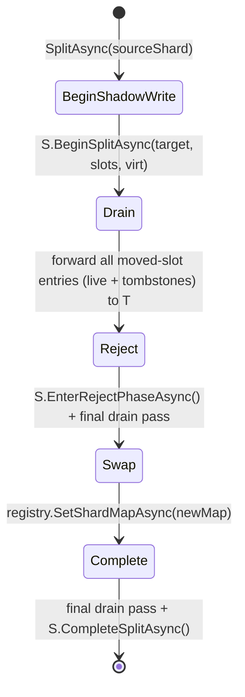

# Adaptive Shard Splitting

Adaptive shard splitting allows a hot physical shard to split into two **at
runtime, fully online** - no shard is ever taken offline. Splits happen
automatically when an autonomic monitor detects a hot shard. Shard
splitting is internal-only: `ITreeShardSplitGrain` is declared `internal`
and is not reachable from consumer assemblies.

## Why

Lattice trees are sharded by hashing keys into a virtual slot space and
mapping virtual slots onto physical `ShardRootGrain` activations. With a
fixed shard count, a workload skewed toward a small set of keys will
saturate one shard while others sit idle. Adaptive splitting redistributes
hot virtual slots to a new physical shard so the load follows the data.

## How it works

A split is driven by the internal `TreeShardSplitGrain` coordinator through
five phases. The source shard *S* keeps serving reads and writes throughout;
the target shard *T* receives mirrored data and eventually owns the moved
slots.

1. **BeginShadowWrite** - Coordinator persists intent and calls
   `S.BeginSplitAsync(targetShardIndex, movedSlots, virtualShardCount)`. Before
   any foreground writes are mirrored, the coordinator also runs a
   **retroactive prepared-mutation sweep**: it walks *S*'s leaf chain,
   pulls every in-flight `_pendingTx` entry whose key hashes into a moved
   virtual slot via
   `IBPlusLeafGrain.GetPendingMutationsForSlotsAsync(sortedMovedSlots, virtualShardCount)`,
   and replays each one into *T*'s `_pendingTx` buckets under the
   original `(txid, hlc, origin, vc, expiresAtTicks)` so any prepared
   write that landed on *S* before the split survives the topology
   change. The sweep is idempotent by `(txid, key)` and persists its
   phase, so a coordinator crash mid-sweep resumes from the same point
   on reactivation. Instrumentation:
   `orleans.lattice.split.retroactive_forward.entries` (counter, per
   replayed mutation) and
   `orleans.lattice.split.retroactive_forward.duration` (histogram,
   total sweep wall-clock). From this point on, every successful write
   *S* applies to a key in a moved virtual slot is also mirrored to *T*
   via `T.MergeManyAsync`, preserving the original HLC. CRDT LWW
   guarantees correct convergence regardless of how the foreground
   write and the background drain interleave.
2. **Drain** - Coordinator walks *S*'s leaf chain and forwards moved-slot
   entries (including tombstones) to *T* with their original HLC timestamps.
   The drain is **chunked** and **leaf-side filtered**: each leaf returns
   only entries whose virtual slot is in the moved-slot set via
   `IBPlusLeafGrain.GetDeltaSinceForSlotsAsync`, and the coordinator flushes
   to *T* in batches of `SplitDrainBatchSize` (default 1024) entries. This
   bounds peak memory on the coordinator regardless of source shard size,
   and avoids transferring non-moved entries over the wire. Idempotent under
   retry - re-running merges only converges to the same state.
3. **Reject** - Coordinator marks the source leaves moved-away and calls
   `S.EnterRejectPhaseAsync()` **before** the registry map flips. From this
   point any read or write to *S* for a moved-slot key throws
   `StaleShardRoutingException`, which freezes the source's committed state
   for the migrating slots. The coordinator then runs one final authoritative
   drain pass to *T*, so the destination is synchronised with the source's
   now-frozen committed state before any reader can route to *T*. Reversing
   this order - flipping the map before the source rejects - would open a
   window in which a stale-routing reader could still be served the pre-split
   value by the source.
4. **Swap** - Coordinator persists a new `ShardMap` in the registry that
   redirects moved slots to *T*. New `LatticeGrain` activations immediately
   route the moved slots to *T*; stale activations that still cache the old
   map hit the source's reject gate, catch `StaleShardRoutingException`,
   invalidate their cached map, fetch the fresh map from the registry, and
   retry against *T* - a single transparent retry per call.
5. **Complete** - Coordinator runs one final drain pass to capture any
   tombstones written during shadow that were not mirrored on the hot path,
   then calls `S.CompleteSplitAsync()` and clears its own state.
   `CompleteSplitAsync` also promotes the just-completed split's moved
   slots into a permanent `MovedAwaySlots` set on `S`, so even after the
   active reject-phase state is cleared, every subsequent operation on a
   moved-slot key continues to throw `StaleShardRoutingException`. This
   guarantees that stale `[StatelessWorker]` `LatticeGrain` activations
   (which may have cached the pre-split shard map) always trigger a map
   refresh on first use rather than silently returning orphan data.

The coordinator state is persisted before any side effect, so a silo crash
mid-split is recovered by the keepalive reminder: `RunSplitPassAsync`
resumes from the last persisted phase, and every phase method is
idempotent.

## Scan semantics during a split

This section describes the *mechanism* by which live operations behave
during a split. For the consistency contract each `ILattice` method
provides - including under concurrent splits - see
[Consistency](consistency.md).

Point reads and writes (`GetAsync`, `SetAsync`, `DeleteAsync`,
`SetIfVersionAsync`, `GetOrSetAsync`, etc.) continue to serve traffic
throughout the split: every successful write is mirrored to the new
owner during the shadow phase and the reject phase (which precedes the map
swap) causes stale activations to transparently retry against the correct
shard. The
post-Complete permanent `MovedAwaySlots` rejection extends this for the
lifetime of the source shard.

Scans (`ScanKeysAsync`, `ScanEntriesAsync`, `CountAsync`) reconcile against
topology changes mid-scan as described below. See
[Consistency](consistency.md) for the guarantee this reconciliation
delivers.

### How the reconciliation works

Each scan uses a reconciliation algorithm coordinated against the
registry's monotonically-incrementing `ShardMap.Version`, but `CountAsync`
and the `ScanKeysAsync` / `ScanEntriesAsync` streams follow two different paths.

#### `CountAsync` / `CountPerShardAsync` - per-slot routing

The orchestrator reads the authoritative `ShardMap`, partitions virtual
slots by current owner (via `LatticeGrain.BuildOwnedSlotMap`), and asks
each physical shard to count only its owned slots via
`IShardRootGrain.CountForSlotsAsync(sortedSlots, virtualShardCount)`.
Because each virtual slot is counted exactly once - against whichever
shard the map identifies as its current owner - the result is
topology-consistent by construction, independent of the source shard's
per-split phase. The map version is re-read after the fan-out; if it
moved, the count is discarded and retried on the fresh map, bounded by
`LatticeOptions.MaxScanRetries` (default 3). Throws
`InvalidOperationException` on retry exhaustion.

#### `ScanKeysAsync` / `ScanEntriesAsync` - in-line reconciliation

Reconciliation is driven inside the main k-way merge loop rather than
as a separate pass. Each shard root reports back:

* the keys/entries of all keys *not* in its `MovedAwaySlots` table
  (entries it no longer authoritatively owns), and
* the set of `MovedAwaySlots` virtual slots it observed during the
  traversal (used as a topology-stability hint).

Before each priority-queue dequeue, the orchestrator checks whether
any live shard cursor has reported new `MovedAwaySlots` since the last
reconciliation step. If so, it queries the current owners of the
affected slots via the slot-filtered variants
`GetSortedKeysBatchForSlotsAsync` / `GetSortedEntriesBatchForSlotsAsync`,
loads the reconciled keys into memory, sorts them with the same
comparer, and injects them as an additional in-memory cursor into the
same priority queue. The merge invariant (global minimum is yielded
next) then carries ordering across the topology boundary. A per-call
`HashSet<string>` suppresses duplicates across pre- and post-swap
views. A final stability check after the priority queue drains catches
the edge case where a split commits after all live cursors finished -
reconciled entries from this path are also sorted and injected as a
cursor, not appended. Bounded by `LatticeOptions.MaxScanRetries`.

#### Snapshot scans - pinned-map slot ownership in the snapshot leaf

A snapshot-isolated scan (`OpenSnapshotEntryCursorAsync` /
`OpenSnapshotKeyCursorAsync`, the read-only state API, and the Explorer
Data tab) cannot use the live in-line reconciliation above, because it
must read a single, internally-consistent point in time. Instead the
snapshot coordinate pins the registry's `ShardMap` at open
(`LatticeSnapshotCoordinate.PinnedShardMap`, alongside the pinned
`ShardMap.Version`, the per-shard / per-partition WAL offsets, and the
registry HLC). The snapshot fan-out forces a fresh routing read so it
opens against the post-split map, then for each fan-out shard it
resolves that shard's owned virtual slots under the pinned map and
passes them to the shard's snapshot leaf.

The snapshot leaf serves a durable frozen baseline captured at open time
(see [Snapshot Cursors](snapshot-cursors.md)): the per-shard projection
is materialised once by walking the shard's leaf chain and folding each
leaf's WAL tail, then persisted and seeded into the leaf with no
serve-time WAL replay. Whether a per-key record reaches the served view
is resolved by the key's virtual slot under the pinned map - **not** by
the mutation's stamped `ShardIndex` - applied both when the baseline is
folded at capture and again through the leaf's `IsKeyOwned` filter when
the durable rows are seeded. Resolving by slot is what makes the snapshot
view correct across a split, because the stamp records the shard that
*authored* a record, which is not the same as the shard that *owns* the
key after the split:

* A moved key's pre-split copy is physically retained on the donor
  shard (an orphan). Its stamp still names the donor, but the pinned
  map now assigns its slot to the target, so the donor's snapshot leaf
  drops it and only the target surfaces the key - no duplicate.
* A write routed to the donor for an already-moved slot is
  shadow-forwarded into the target shard's WAL but keeps the donor's
  source stamp. Resolving by slot keeps that forwarded record on the
  target's snapshot leaf, so the leaf's last-writer-wins merge applies
  it. A stamp-based filter would drop it (its stamp names the donor)
  and resurrect the pre-forward value - for example a post-split delete
  forwarded through the donor would be lost and the deleted key would
  reappear with its stale drained value.

Ownership must be resolved against the *pinned* map version, not the
current one, so the snapshot neither over-excludes (a key not yet moved
at the pinned version) nor under-excludes (a key moved after the pinned
version). The snapshot k-way merge additionally collapses equal,
adjacent keys as a defensive net, but value correctness comes from the
leaf-side ownership filter (the merge operates on raw bytes with no HLC
and cannot pick the last-writer-wins winner on its own).

#### Live leaf reactivation - current-map slot ownership in the live leaf

The authoritative live leaf has its own activation-time WAL replay, and
the same stamp-versus-slot distinction applies to it. When a live leaf
activates (a cold reactivation after deactivation, a silo move, or a
crash), it rebuilds its in-memory projection by replaying every WAL
entry past its persisted projection checkpoint through
`BPlusLeafGrain.ShouldApplyDuringReplay`. Unlike the snapshot leaf the
live leaf has no pinned map - it serves the *current* point in time -
so it resolves per-mutation shard ownership by the key's virtual slot
under the **current** registry `ShardMap`, fetched once at the start of
replay.

This matters only on a cold reactivation that replays a WAL suffix past
a checkpoint taken *before* a shadow-forward. In steady state the live
leaf applies the forwarded mutation in real time and folds it into its
next checkpoint, so a warm leaf never re-evaluates the record. The
trigger is a target leaf that checkpointed before a post-split write was
shadow-forwarded through the donor, then reactivated cold:

* A write routed to the donor for an already-moved slot is
  shadow-forwarded into the target shard's WAL but keeps the donor's
  source stamp. Resolving by slot keeps that forwarded record on the
  target's live leaf (the current map routes its slot here), so the
  leaf's last-writer-wins merge applies it on replay. A stamp-based
  filter would drop it - its stamp names the donor - and resurrect the
  pre-forward value, for example losing a post-split delete and
  reappearing the deleted key with its stale drained value.
* Genuine sibling-shard data multiplexed through a shared WAL partition
  (partitions are keyed by key hash, not by shard) still resolves to
  another shard under the current map and is dropped, and a donor leaf's
  own orphan copies of moved slots are dropped because their slot now
  routes to the target - the live read path already seals those orphans
  via `MovedAwaySlots`.

The current map is fetched best-effort and is trusted only when it
references the leaf's own shard, so a registry hiccup at activation or a
map drawn from a foreign physical shard space falls back to the legacy
stamped-`ShardIndex` axis - a leaf can never reject its own writes.
Slot-less legacy leaves (pre-split-feature persisted state with a null
`ShardIndex`) keep their unconditional V1 single-leaf-per-shard
semantics and apply on the shard axis regardless.

### Trade-offs

* **Order**: Keys/Entries are streamed in strict lexicographic (or
  reverse) order end-to-end, even when splits commit mid-scan.
  Reconciled entries participate in the same k-way merge as live
  cursors, so the ordering guarantee is preserved.
* **Memory**: scans allocate a `HashSet<string>` for dedup that grows
  with the number of distinct keys observed during the scan, plus a
  per-reconciliation buffer proportional to the number of keys in
  slots that actually moved during the scan (typically small). For
  very large trees, prefer the range-bounded overload of `ScanKeysAsync` /
  `ScanEntriesAsync` to bound memory.
* **Latency**: when no split has ever occurred, scans take the same
  fast path as before (one round-trip per shard). The reconciliation
  passes only run when a shard actually reports moved slots.
* **System trees**: the lattice registry tree itself bypasses the
  reconciliation path (it never participates in adaptive splits, and
  reading its own shard map would deadlock). It uses the simple
  fan-out-and-sum count instead.

## Autonomic detection

The per-tree `HotShardMonitorGrain` is started lazily on the first write and
re-anchored by a keepalive reminder. On each tick (default every 30 s) it:

1. Polls every physical shard's `GetHotnessAsync()` in parallel.
2. Computes ops/sec = `(reads + writes) / window.TotalSeconds`.
3. Counts the number of in-flight splits **for this tree** by polling every
   physical shard's `IsSplittingAsync()`. If that count is already
   `MaxConcurrentAutoSplits`, the pass returns without triggering anything.
   Because `HotShardMonitorGrain` is keyed per-tree, the cap is enforced
   independently per tree - in a multi-tree cluster each tree may have up
   to `MaxConcurrentAutoSplits` concurrent splits running simultaneously.
4. Selects the top-`(MaxConcurrentAutoSplits - inFlight)` hottest shards
   whose rate exceeds `HotShardOpsPerSecondThreshold` (default 200 ops/s),
   skipping any shard already splitting, on cooldown, or owning a single
   virtual slot.
5. Triggers `ITreeShardSplitGrain.SplitAsync` on each selected shard in
   parallel via `Task.WhenAll` and starts a per-shard cooldown.

Each split runs in its own coordinator activation: the
`ITreeShardSplitGrain` key format is **`{treeId}/{sourceShardIndex}`**,
so independent splits of different source shards within the same tree do
not contend on a single coordinator. Concurrent target-index allocation is
made collision-free by a registry-side atomic counter
(`ILatticeRegistry.AllocateNextShardIndexAsync`), and concurrent shard-map
swaps are made composition-safe by re-reading the current map inside the
swap phase before persisting the diff. Both atomicity guarantees rely on
the singleton `LatticeRegistryGrain` being non-reentrant.

A split is **suppressed** (whole pass skipped) or a candidate is **skipped
individually** when:

| Suppression rule | Scope | Mechanism |
|---|---|---|
| `AutoSplitEnabled = false` | Whole pass | Returns early. |
| Tree younger than `AutoSplitMinTreeAge` (since monitor activation, default 60 s) | Whole pass | Returns early. |
| Resize / merge / snapshot in progress | Whole pass | `ILattice.IsResize/Merge/SnapshotCompleteAsync()` returns `false`. |
| Any shard has a pending bulk graft | Whole pass | `IShardRootGrain.HasPendingBulkOperationAsync()` returns `true`. |
| In-flight splits already at `MaxConcurrentAutoSplits` | Whole pass | Sum of `IsSplittingAsync()` results. |
| Cluster-wide split ceiling reached (`MaxClusterConcurrentAutoSplits` set) | Per candidate | No cluster headroom left in the admission gate; the candidate is deferred to a later tick. |
| Shard already splitting | Per shard | Excluded from candidate set. |
| Per-shard cooldown active (default 2 min) | Per shard | In-memory cooldown timestamp. |
| Shard owns a single virtual slot | Per shard | Cannot be subdivided further. |

## Cluster-wide split concurrency (opt-in)

`MaxConcurrentAutoSplits` is enforced **per tree**: because `HotShardMonitorGrain` is keyed by tree id, each tree counts only its own in-flight splits. In a multi-tenant or many-tree cluster the summed drain I/O from many trees splitting at once can saturate the storage provider even though no single tree exceeds its own cap.

`MaxClusterConcurrentAutoSplits` (default `null` = disabled) opts in to a cluster-wide admission gate - a singleton `IClusterSplitConcurrencyGrain` (well-known integer key `0`) - that caps the aggregate number of concurrently in-flight autonomic splits across all trees. The ceiling is enforced **in addition to** each tree's `MaxConcurrentAutoSplits` and can only ever **lower** the number of splits a tree triggers, never raise it. When the option is `null` the monitor never resolves or calls the gate, so the disabled path issues no extra RPC per tick and is byte-for-byte identical to running without the option.

### Per-tree heartbeat footprints (self-healing)

Admission uses a per-tree heartbeat model rather than long-lived permits. On every sampling pass an enabled monitor reports its tree's authoritative in-flight split count (derived from real shard `IsSplitting` state) and how many new splits it wants; the gate drops any tree footprint whose time-to-live has lapsed, sums the live in-flight counts of the **other** trees, and grants new slots only up to the remaining cluster headroom. It then records this tree's footprint (its in-flight count plus any grant) with a fresh expiry of `HotShardSampleInterval * 3`. Because the count is re-reported from ground truth each pass, there is no permit to leak: a silo that crashes mid-split simply stops refreshing its footprint, so the stale entry lapses at its expiry and the next pass reclaims that share of the ceiling. This self-healing property is what makes the aggregate ceiling safe to enable.

### Per-group override

Per-tree options resolve through named `IOptionsMonitor<LatticeOptions>.Get(treeName)`, so a low-traffic tree group can clamp its own `MaxConcurrentAutoSplits` down (e.g. to `1`) while a high-traffic group keeps a higher per-tree cap - all bounded in aggregate by the single global `MaxClusterConcurrentAutoSplits` ceiling.

### Operator questions and the metrics that answer them

| Question | Metric | How to read it |
|---|---|---|
| (a) Do I need to enable this? | `orleans.lattice.split.in_flight` (summed across `tree`) and `orleans.lattice.split.candidates_suppressed` | Both emit **even when the gate is disabled**. A high steady-state cluster sum with chronically non-zero suppression across many trees means aggregate drain pressure the per-tree cap cannot see. |
| (b) What ceiling should I pick? | `orleans.lattice.split.in_flight` peak / quantiles | Size the ceiling near the aggregate your storage provider absorbs without saturating (correlate with storage-latency panels), leaving headroom above typical peak so the gate only bites during pathological bursts. |
| (c) How is the enabled gate affecting my system? | `orleans.lattice.split.admission.deferred` (`reason=cluster_cap`) | Flat-zero means the ceiling never binds (raise it or leave the gate off). Sustained non-zero with rising hot-shard latency means the ceiling is too low and is starving legitimate elasticity. |

## Tunables (`LatticeOptions`)

| Option | Default | Description |
|---|---|---|
| `AutoSplitEnabled` | `true` | Master switch for autonomic splits. When `false`, `HotShardMonitorGrain` will not trigger any splits; there is no external way to invoke a split. |
| `HotShardOpsPerSecondThreshold` | `200` | Operations/second above which a shard is considered hot. Intentionally low so splits occur before throughput degrades. |
| `HotShardSampleInterval` | `30 s` | How often the monitor polls hotness counters. |
| `HotShardSplitCooldown` | `2 min` | Minimum interval between consecutive splits of the same physical shard. |
| `MaxConcurrentAutoSplits` | `2` | Maximum concurrent splits per tree. Each split runs in its own per-shard coordinator activation; the cap bounds aggregate storage I/O. |
| `MaxClusterConcurrentAutoSplits` | `null` | Optional cluster-wide ceiling on the aggregate number of concurrent autonomic splits across **all** trees. `null` disables the gate (per-tree caps only, zero cost); a positive value opts in to a singleton admission gate enforced in addition to each tree's `MaxConcurrentAutoSplits`. |
| `SplitDrainBatchSize` | `1024` | Maximum number of moved-slot entries the drain accumulates in memory before flushing to the target shard. Caps coordinator allocation regardless of source shard size. |
| `AutoSplitMinTreeAge` | `60 s` | Minimum tree age before autonomic splits are allowed; absorbs startup bursts. |
| `MaxScanRetries` | `3` | Maximum bounded retries that a scan (`CountAsync`, `ScanKeysAsync`, `ScanEntriesAsync`) performs when `ShardMap.Version` keeps moving mid-scan due to concurrent splits. Throws `InvalidOperationException` on exhaustion. Increase if scans run during very-high split churn. See [Consistency](consistency.md). |

## Convergence guarantees

* **No data loss** - every write committed to *S* is either drained,
  shadow-mirrored, or both, and `MergeManyAsync` is idempotent under LWW.
* **No prepared-mutation loss** - the retroactive sweep at
  `BeginShadowWrite` re-stamps every in-flight prepared mutation from
  *S*'s leaves onto *T*'s `_pendingTx` buckets, so a `SetManyAtomicAsync`
  saga whose Prepare landed on *S* before the split commits and
  completes against *T* with no perceived interruption. Combined with
  `LatticeOptions.TxDecisionRetention` (default 60 s), a sweep that
  installs a pending bucket after the saga's terminal fan-out has
  already broadcast can still resolve the verdict via the registry
  tombstone window. See [Atomic Writes - Phase 4 Complete](atomic-writes.md#phase-4---complete).
* **No duplicate authority** - after the swap, only *T* is reachable for
  moved slots via the public API; orphan entries on *S* are unreachable
  and reclaimed on tree purge.
* **Geometric convergence on a single hot slot** - if all heat is in one
  virtual slot, successive autonomic splits subdivide *S*'s slot set in
  half each pass, isolating the hot slot in `O(log virtualSlotsPerShard)`
  splits.

## Scope

Shard splitting is an autonomic concern. `ITreeShardSplitGrain` is internal
infrastructure protected by `InternalGrainGuardFilter` - external client
calls are rejected with `InvalidOperationException`. There is no public
API to trigger or control a split; tuning is performed exclusively through
the `LatticeOptions` listed above.
