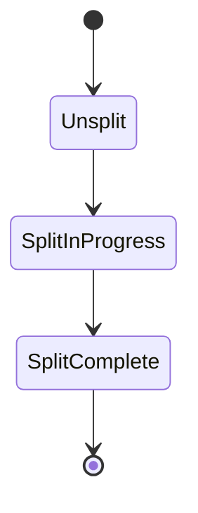
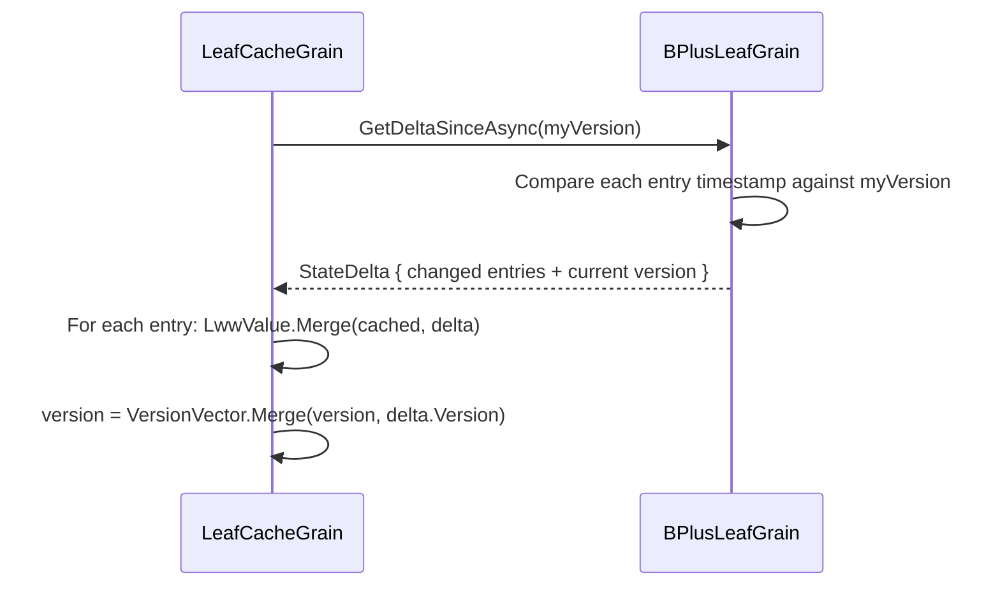

# Monotonic State Primitives

All state in the tree is designed to advance monotonically — it can move forward but never backwards. This makes operations idempotent and crash-safe.

## Hybrid Logical Clock (HLC)

Each grain maintains an `HybridLogicalClock` that combines wall-clock time with a logical counter:

```
HLC = (WallClockTicks, Counter)
```

- **Tick** — advances the clock for a local event. If the physical clock has moved forward, the counter resets to 0. Otherwise the counter increments.
- **Merge** — given two HLC values, returns a new value strictly greater than both. The merge is commutative and associative.

This gives every write a totally-ordered timestamp without requiring a central clock service.

## Last-Writer-Wins Register (LWW)

Each key-value entry in a leaf node is wrapped in `LwwValue<byte[]>`:

```
LwwValue = (Value, Timestamp, IsTombstone)
```

The merge rule is simple: **the entry with the higher `HLC` timestamp wins**. This is:

- **Commutative:** `Merge(a, b) = Merge(b, a)`
- **Associative:** `Merge(Merge(a, b), c) = Merge(a, Merge(b, c))`
- **Idempotent:** `Merge(a, a) = a`

These three properties make `LwwValue` a join-semilattice — two divergent replicas can always merge to a consistent result regardless of message ordering.

Deletes are represented as **tombstones** (an `LwwValue` with `IsTombstone = true` and a timestamp). A tombstone with a higher timestamp than a live value wins; a live value with a higher timestamp than a tombstone "resurrects" the key.

## Monotonic Split State

The split lifecycle for every node is a three-value enum:



The merge operation is `max()` — once a node reaches `SplitComplete`, no message can revert it to an earlier state. This means:

- If a grain crashes between `SplitInProgress` and `SplitComplete`, on reactivation it detects the incomplete split and resumes the cross-grain phase (`CompleteSplitAsync`). The sibling operations (`MergeEntriesAsync`, `InitializeAsync`) are idempotent, and the parent's `AcceptSplitAsync` guards against duplicate `(separatorKey, childId)` pairs.
- If two messages arrive out of order (one carrying `SplitInProgress`, one carrying `SplitComplete`), the result is simply `SplitComplete`.
- After recovery, the caller's original operation (a write for leaves, a split promotion for internal nodes) is routed to the correct node based on the split key — ensuring no operations are silently dropped.

## Version Vector

Each leaf node maintains a `VersionVector` — a map from replica ID (the grain's string identity) to the highest `HLC` value produced by that replica:

```
VersionVector = { "grain/abc" → HLC(100:3), "grain/def" → HLC(95:0) }
```

The version vector is ticked on every write (insert, update, or delete). This enables **delta extraction**: a consumer can present its own version vector and ask "give me everything that changed since this point." The leaf compares each entry's timestamp against the consumer's clock for the relevant replica and returns only the newer entries.

Merge is **pointwise-max** across all replica IDs:

```
Merge({r1→10, r2→5}, {r1→8, r3→3}) = {r1→10, r2→5, r3→3}
```

This is commutative, associative, and idempotent — making it safe for uncoordinated consumers to merge version vectors from multiple sources.

## State Deltas

A `StateDelta` is a snapshot of changes extracted from a leaf:

```
StateDelta = {
    Entries:  { key → LwwValue }   // only entries newer than the caller's version
    Version:  VersionVector          // the leaf's version at extraction time
    SplitKey: string?                // non-null if the leaf has split since the caller's version
}
```

When `SplitKey` is present, it signals that the leaf has split and all entries ≥ `SplitKey` have moved to a new sibling. Consumers (e.g. `LeafCacheGrain`) use this to **prune** stale entries from their local cache that now belong to the sibling.

The delta extraction flow:



Because both `LwwValue.Merge` and `VersionVector.Merge` are lattice operations, applying the same delta twice is a no-op. This makes the protocol tolerant of duplicate deliveries and message reordering.
