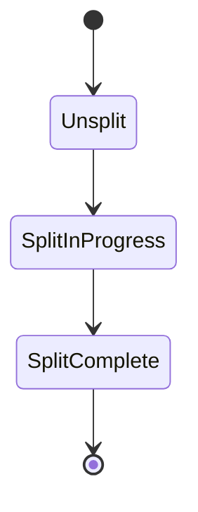
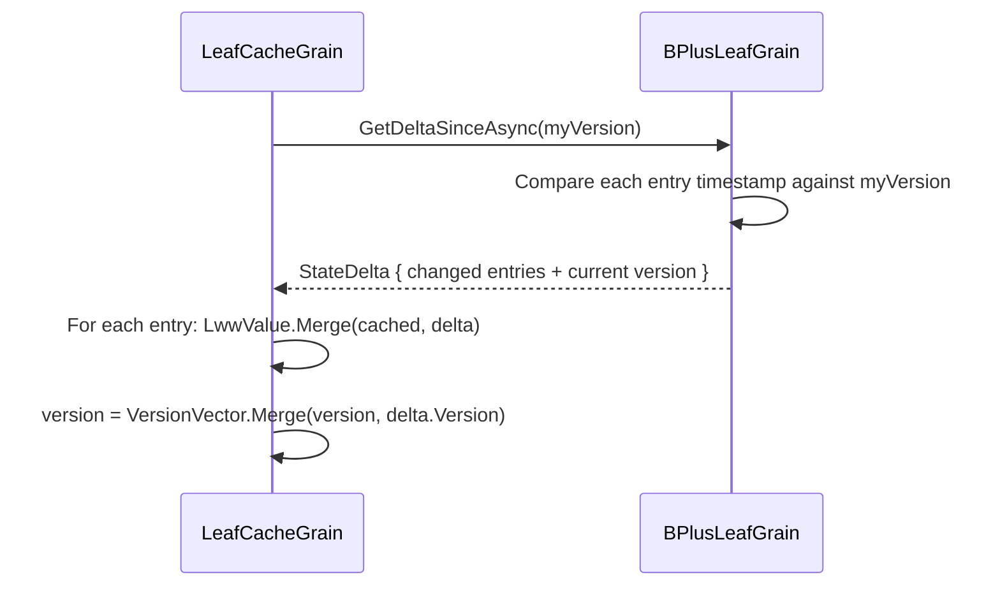

# Monotonic State Primitives

All state in the tree is designed to advance monotonically - it can move forward but never backwards. This makes operations idempotent and crash-safe.

See [CRDT Primitives](../crdt/readme.md) for a beginner-friendly introduction to the concepts and terminology - read below for a more detailed explanation.


## Hybrid Logical Clock (HLC)

Each grain maintains an `HybridLogicalClock` that combines wall-clock time with a logical counter:

```
HLC = (WallClockTicks, Counter)
```

- **Tick** - advances the clock for a local event. If the physical clock has moved forward, the counter resets to 0. Otherwise the counter increments.
- **Merge** - given two HLC values, returns a new value strictly greater than both. The merge is commutative and associative.

This gives every write a totally-ordered timestamp without requiring a central clock service.

**Example use case:** stamping every write with a timestamp that orders correctly across silos even when their wall clocks drift by a few milliseconds - for example, deciding which of two near-simultaneous edits to the same user profile happened "last" without calling out to a central time service.

## Last-Writer-Wins Register (LWW)

Each key-value entry in a leaf node is wrapped in `LwwValue<byte[]>`:

```
LwwValue = (Value, Timestamp, IsTombstone)
```

The merge rule is simple: **the entry with the higher `HLC` timestamp wins**. This is:

- **Commutative:** `Merge(a, b) = Merge(b, a)`
- **Associative:** `Merge(Merge(a, b), c) = Merge(a, Merge(b, c))`
- **Idempotent:** `Merge(a, a) = a`

These three properties make `LwwValue` a join-semilattice - two divergent replicas can always merge to a consistent result regardless of message ordering.

Deletes are represented as **tombstones** (an `LwwValue` with `IsTombstone = true` and a timestamp). A tombstone with a higher timestamp than a live value wins; a live value with a higher timestamp than a tombstone "resurrects" the key.

**Example use case:** a user-profile store where each field (display name, avatar URL, theme) is overwritten by the most recent edit and you are happy to drop a losing concurrent write rather than show the user a conflict prompt. This is the default semantics for plain `SetAsync` / `GetAsync` on the tree.

## Monotonic Split State

The split lifecycle for every node is a three-value enum:


```mermaid
stateDiagram-v2
    [*] --> Unsplit
    Unsplit --> SplitInProgress
    SplitInProgress --> SplitComplete
    SplitComplete --> [*]
```

The merge operation is `max()` - once a node reaches `SplitComplete`, no message can revert it to an earlier state. This means:

- If a grain crashes between `SplitInProgress` and `SplitComplete`, on reactivation it detects the incomplete split and resumes the cross-grain phase (`CompleteSplitAsync`). The sibling operations (`MergeEntriesAsync`, `InitializeAsync`) are idempotent, and the parent's `AcceptSplitAsync` guards against duplicate `(separatorKey, childId)` pairs.
- If two messages arrive out of order (one carrying `SplitInProgress`, one carrying `SplitComplete`), the result is simply `SplitComplete`.
- After recovery, the caller's original operation (a write for leaves, a split promotion for internal nodes) is routed to the correct node based on the split key - ensuring no operations are silently dropped.

**Example use case:** internal bookkeeping for the tree itself. When a leaf grows past its key budget and splits in two, the silo can crash partway through the split and still come back to a consistent tree on reactivation - no operator intervention, no manual repair. Application code does not interact with this primitive directly.

## Version Vector

Each leaf node maintains a `VersionVector` - a map from replica ID (the grain's string identity) to the highest `HLC` value produced by that replica:

```
VersionVector = { "grain/abc" -> HLC(100:3), "grain/def" -> HLC(95:0) }
```

The version vector is ticked on every write (insert, update, or delete). This enables **delta extraction**: a consumer can present its own version vector and ask "give me everything that changed since this point." The leaf compares each entry's timestamp against the consumer's clock for the relevant replica and returns only the newer entries.

Merge is **pointwise-max** across all replica IDs:

```
Merge({r1->10, r2->5}, {r1->8, r3->3}) = {r1->10, r2->5, r3->3}
```

This is commutative, associative, and idempotent - making it safe for uncoordinated consumers to merge version vectors from multiple sources.

**Example use case:** a read-through cache or a downstream replica that periodically asks "what's changed since I last looked?" The caller hands its current version vector to the leaf and gets back only the entries newer than that point, so a sidecar projector can keep an external search index up to date without re-scanning the whole tree on every poll.

## State Deltas

A `StateDelta` is a snapshot of changes extracted from a leaf:

```
StateDelta = {
    Entries:  { key -> LwwValue }   // only entries newer than the caller's version
    Version:  VersionVector          // the leaf's version at extraction time
    SplitKey: string?                // non-null if the leaf has split since the caller's version
}
```

When `SplitKey` is present, it signals that the leaf has split and all entries >= `SplitKey` have moved to a new sibling. Consumers (e.g. `LeafCacheGrain`) use this to **prune** stale entries from their local cache that now belong to the sibling.

The delta extraction flow:


```mermaid
sequenceDiagram
    participant Cache as LeafCacheGrain
    participant Leaf as BPlusLeafGrain

    Cache->>Leaf: GetDeltaSinceAsync(myVersion)
    Leaf->>Leaf: Compare each entry timestamp against myVersion
    Leaf-->>Cache: StateDelta { changed entries + current version }
    Cache->>Cache: For each entry: LwwValue.Merge(cached, delta)
    Cache->>Cache: version = VersionVector.Merge(version, delta.Version)
```

Because both `LwwValue.Merge` and `VersionVector.Merge` are lattice operations, applying the same delta twice is a no-op. This makes the protocol tolerant of duplicate deliveries and message reordering.

**Example use case:** the wire format for incremental sync between a leaf and its caches or replicas. If the network drops a delta and the consumer retries, replaying the same delta is harmless; if two deltas arrive out of order, applying them in either order produces the same result.

## :warning: Opt-in CRDT values

The CRDT primitives described below are **opt-in**. Plain writes - `SetAsync`, `SetManyAsync`, and friends - are last-writer-wins: a later timestamp silently overwrites a concurrent write. To get convergent, no-lost-update behaviour you write through the typed CRDT accessors on `ILattice`, which pick the right merge mode for the key.

The [Conflict-Free Merges sample](../../samples/ConflictFreeMerges/README.md) is a runnable tour of every accessor, including convergence under concurrent threads.

## Grow-Only Counter (G-Counter)

`GCounter` is a **grow-only counter**. Each replica owns a monotonically increasing component, and the visible value is the sum of every component:

```
GCounter = { replicaId -> long }
Value = sum(GCounter.Values)
```

`Increment(replicaId, amount)` accepts only non-negative amounts and advances that replica's component. Merge is **pointwise-max** per replica, so re-delivering an older component cannot move the counter backwards and concurrent increments from different replicas accumulate without double-counting.

**Example use case:** page views, bytes ingested, or any event tally that can only increase. Use `GCounter` when decrement is impossible and you want the smallest counter state. Use `PnCounter` when the value must also move down.

## Grow-Only Set (G-Set)

`GSet` is a **grow-only set** of opaque `byte[]` elements. Elements are compared by byte content and encoded internally as base64 strings for stable serialization:

```
GSet = { elementBytes }
```

`Add(element)` is idempotent and there is no remove operation. Merge is **set union**, so every concurrent add survives and duplicate delivery is harmless. Because it carries no causal dots and no tombstones, it is the cheapest set primitive for append-only membership.

**Example use case:** seen-id sets, append-only tags, or an accumulating audience list. Use `OrSet` or `RwSet` when elements must be removable.

## Remove-Wins Set (RW-Set)

`RwSet` is a **remove-wins observed-remove set** of opaque `byte[]` elements. For each element it tracks add dots, remove dots, and tombstones for remove dots that an observed add has cancelled:

```
RwSet = {
    Adds:       { element -> [OrSetDot(replicaId, counter)] }
    Removes:    { element -> [OrSetDot(replicaId, counter)] }
    Tombstones: { element -> [OrSetDot] }   // remove dots observed-and-cancelled by an add
}
```

An element is present only when it has at least one add dot and no live remove dot. `Remove(element, replicaId, counter)` is additive: it mints a remove dot. `Add(element, replicaId, counter)` mints an add dot and tombstones remove dots it has already observed. A concurrent remove that the add did not observe survives the merge and keeps the element out. Merge is the pointwise union of add, remove, and tombstone dots, followed by the same membership test.

**Example use case:** revocation lists, blocklists, and other fail-closed membership where a removal must win a race against a stale re-add. Use `OrSet` when a concurrent add should win instead.

## Bounded Registers (Max-Register and Min-Register)

`BoundedRegister` is the shared state shape behind the typed `MaxRegister<T>` and `MinRegister<T>` accessors. It stores a single opaque value with an order-preserving byte key and a durable direction bit:

```
BoundedRegister = (Value, OrderKey, HasValue, IsMin)
```

A Max-register keeps the candidate with the greatest `OrderKey`; a Min-register keeps the candidate with the smallest `OrderKey`. The producer supplies the order key through the typed accessor's `orderKeySelector`, and receivers compare keys with unsigned lexicographic byte order, tie-breaking on value bytes so the result is deterministic. Merge and delta apply are directional max/min folds over that total order, so backwards writes and duplicate deliveries are no-ops.

**Example use case:** high-water marks, version ceilings, max-seen sensor readings, min-seen latency floors, first-seen timestamps, or lowest-price watermarks. Use `MvRegister` instead when concurrent values must all be preserved for application-level resolution.

## Observed-Remove Set (OR-Set)

`OrSet` is an **add-wins, observed-remove set** of `byte[]` elements. Every `Add(element, replicaId, counter)` mints a fresh causal dot `(replicaId, counter)` and attaches it to the element under `Adds`; `Remove(element)` moves every currently-observed dot for that element into `Tombstones`. An element is present in the set whenever its `Adds` set contains at least one dot that is not in `Tombstones`:

```
OrSet = {
    Adds:       { element -> [OrSetDot(replicaId, counter)] }
    Tombstones: { element -> [OrSetDot] }   // dots observed-and-removed
}
```

Merge is the union of `Adds` and the union of `Tombstones` on both sides, after which each element's effective membership is recomputed. This is commutative, associative, and idempotent.

Because removes only tombstone the dots the local replica has actually observed, a concurrent `Add` from another replica that the remover never saw **survives** the merge - hence "add-wins". The element returns to membership the next time any replica adds it under a fresh dot.

**Example use case:** an operator-visible label set on a shared entity (a maintenance ticket, a vehicle, an instrument) that multiple sites can tag concurrently while one site removes a label. With LWW, the remover's update silently drops the concurrent additions; with `OrSet`, the additions survive and only the dots the remover actually observed disappear.

## Observed-Remove Flag (OR-Flag)

`OrFlag` is the **single-element specialisation of the OR-Set**: an enable-wins flag that tracks *presence* ("enabled") rather than a set of element values. It carries no element payload - just two dot lists:

```
OrFlag = {
    Enables:    [OrSetDot(replicaId, counter)]   // each Enable() mints a fresh dot
    Tombstones: [OrSetDot]                        // dots observed-and-disabled
}
IsEnabled = at least one dot in Enables is not in Tombstones
```

`Enable(replicaId, counter)` mints a fresh causal dot and appends it to `Enables`; `Disable()` moves every currently-observed enable dot into `Tombstones`. Merge is the union of `Enables` and the union of `Tombstones` on both sides, after which membership is recomputed - commutative, associative, and idempotent.

Because a `Disable()` only tombstones the dots the local replica has actually observed, a concurrent `Enable()` from another replica that the disabler never saw **survives** the merge - hence "enable-wins". This is exactly the OR-Set add-wins rule narrowed to a single logical element.

`OrFlag` is the minimal observed-remove primitive for **composite-key membership rows** - e.g. a tag/key secondary index where each `(tag, member)` pair is stored under its own key and the meaningful bit is simply whether the row is present. Using `OrFlag` for those rows gives OR-Set-grade convergence under concurrent active-active enable/disable without storing a singleton set's element bytes on every row. Reach for `OrSet` when a single key must hold many elements; reach for `OrFlag` when each key holds exactly one presence bit.

**Example use case:** a tag/key secondary index built on composite keys (`tag/{tag}/{key}`). Two sites concurrently associate a key with a tag while a third removes the association; the per-row `OrFlag` converges enable-wins so the association survives unless every observed enable has been disabled.

## Remove-Wins Flag (RW-Flag)

`RwFlag` is the **inverse of the OR-Flag**: a remove-wins (disable-wins) flag where a concurrent disable beats a concurrent enable. Like `OrFlag` it carries no element payload, but it tracks three grow-only dot lists rather than two:

```
RwFlag = {
    Enables:    [OrSetDot(replicaId, counter)]   // each Enable() mints a fresh dot
    Disables:   [OrSetDot(replicaId, counter)]   // each Disable() mints a fresh dot
    Tombstones: [OrSetDot]                        // disable dots an observed Enable() has cancelled
}
liveDisable = Disables \ Tombstones
IsEnabled   = Enables is non-empty AND liveDisable is empty
```

`Disable(replicaId, counter)` is **additive** - it mints a fresh disable dot and appends it to `Disables`. `Enable(replicaId, counter)` mints a fresh enable dot *and* tombstones every disable dot it currently observes. Merge is the pointwise union of all three lists on both sides, after which membership is recomputed - commutative, associative, and idempotent.

Because an `Enable()` only tombstones the disables the local replica has actually observed, a concurrent `Disable()` from another replica that the enabler never saw stays in `liveDisable` and **suppresses** the flag - hence "remove-wins". Presence requires at least one enable dot *and* no surviving disable, so a fresh/empty flag reads disabled, matching the absent-key contract of the accessor surface. Ties (a concurrent enable and disable that never observed each other) resolve to disabled.

Reach for `OrFlag` when a re-add should win a race against a concurrent removal (the common membership-index default); reach for `RwFlag` when the *safe* outcome of a conflict is the disabled/withdrawn state - e.g. a revocation, a kill-switch, or a consent/opt-out bit where a concurrent withdrawal must never be silently overridden by a stale enable.

**Example use case:** a per-entity feature kill-switch or access-revocation flag replicated active-active. If one site re-enables access while another concurrently revokes it, `RwFlag` converges to *revoked* until an enable observes (and tombstones) that revocation - the conservative, fail-closed outcome.

## Positive-Negative Counter (PN-Counter)

`PnCounter` is a **state-based counter** that supports concurrent increments and decrements without coordination by tracking per-replica cumulative components:

```
PnCounter = {
    Increments: { replicaId -> long }   // monotonically non-decreasing
    Decrements: { replicaId -> long }   // monotonically non-decreasing
}
Value = sum(Increments.Values) - sum(Decrements.Values)
```

`Increment(replicaId, amount)` and `Decrement(replicaId, amount)` simply add a non-negative `amount` to the local replica's row in the appropriate dictionary. Merge is **pointwise-max** on each per-replica row across both `Increments` and `Decrements`:

```
Merge({r1->10}, {r1->8, r2->5}) = {r1->10, r2->5}
```

This is commutative, associative, and idempotent: re-delivering an older state never reduces a counter, and concurrent increments on different replicas accumulate correctly because each replica's row advances independently.

**Example use case:** a shift-level production counter aggregated across silos in a factory line. Every site increments its own row when it scans a unit, and any reader summing the rows sees the live total regardless of which sites have synced with which.

## Multi-Value Register (MV-Register)

Where `LwwValue` collapses concurrent writes by picking the higher HLC, the multi-value register `MvRegister` preserves every concurrent write as a dot-tagged entry so the application can resolve the conflict itself (e.g. surface every candidate to a user, or merge in a domain-aware way). Like the OR-Set, the register uses **causal dots** - `(replicaId, counter)` pairs - to distinguish concurrent updates from sequential overwrites.

```
MvRegisterEntry = (ReplicaId, Counter, Value)
MvRegister      = { Entries: [MvRegisterEntry], Context: { replicaId -> highestCounter } }
```

The `Context` map records the highest counter each replica has minted, so a write that observed `r1:5` and overwrote it can safely supersede `r1:5` on merge but **must not** drop a concurrent `r2:3` it never observed. The merge rule is:

- Keep every entry whose `(replicaId, counter)` pair is **not** subsumed by the other side's context.
- Take the pointwise-max of the two contexts.

This is commutative, associative, and idempotent.

`MvRegister.Set(replicaId, value)` drops every entry the writer has observed locally and mints a fresh dot `(replicaId, NextCounter(replicaId))`. Concurrent writes from other replicas that have not been observed survive the next merge, producing a multi-value result that `MvRegisterAccessor<T>.ValuesAsync()` deserialises to `IReadOnlyList<T>`.

Use the multi-value register when **losing a concurrent write is unacceptable** (shopping carts, collaborative-edit content, tag sets where order does not matter but presence does). Use `LwwValue` when last-writer-wins is the desired semantics and the application is happy to drop the loser silently.

**Example use case:** a shopping-cart `notes` field that two devices edit while one of them is offline. With LWW, the offline device's note silently overwrites the online one when it reconnects. With MV-register, both notes survive the merge and the UI can show the user "you have two pending versions of this note - keep which one?" instead of losing data.

## Recursive CRDT Composition (`ICrdt<TSelf>`)

The CRDT primitives above all share the same merge contract: an in-place `MergeFrom(other)` that is commutative, associative, and idempotent, plus an `IsBottom` predicate that distinguishes a truly empty value from one that merely happens to evaluate to a neutral element (e.g. a `PnCounter` whose increments equal its decrements is **not** bottom because it still carries replica history).

This contract is captured by the generic interface `ICrdt<TSelf>`:

```
interface ICrdt<TSelf>
{
    void MergeFrom(TSelf other);
    bool IsBottom { get; }
}
```

Every built-in primitive implements `ICrdt<TSelf>` so they can compose recursively as values inside container CRDTs without the container needing to know their internal layout.

**Example use case:** building a custom container CRDT (say, a typed dictionary) whose values are any of the existing primitives, without having to write per-value-type merge logic. The container just calls `value.MergeFrom(other)` and trusts the primitive to do the right thing.

## Observed-Remove Map (OR-Map)

`OrMap<TKey, TValue>` is an **add-wins, observed-remove map** whose values are themselves CRDTs. Each `Set(key, replicaId, value)` mints a fresh causal dot `(replicaId, counter)` and stamps the value snapshot under that dot; `Remove(key)` tombstones every dot the local replica has currently observed for the key. Concurrent writes that the remover never observed survive the next merge - so the operation semantics are **add-wins** at the key level, while values under the same surviving dot **fold via `TValue.MergeFrom`**.

```
OrMapEntry<TValue> = (ReplicaId, Counter, Value)
OrMap<TKey, TValue> = {
    Adds:       { TKey -> { OrMapEntry<TValue> } },   // surviving dots and their values
    Tombstones: { TKey -> { OrSetDot } }              // observed-and-removed dots
}
```

`TValue` must satisfy `ICrdt<TValue>` and have a parameterless constructor. The merge rule is:

- For each key, union the two sides' `Adds` and `Tombstones`.
- Drop any add whose dot is in either side's tombstone set.
- For surviving dots that appear on both sides with the same `(ReplicaId, Counter)`, recursively `TValue.MergeFrom` the two snapshots.
- A key is observable iff at least one of its `Adds` entries survived; otherwise the key is absent.
- `Get(key)` folds every surviving entry's `Value` through `MergeFrom` to produce a single converged `TValue`.

Because the recursion bottoms out at primitives that are themselves commutative-associative-idempotent, the whole structure is a join-semilattice. `IsBottom` is true exactly when no key has any live (un-tombstoned) entry - tombstones may still be present and are preserved for causal history - so an `OrMap` of `PnCounter`s, for example, can distinguish "no key has ever been written" from "every key's counter currently sums to zero".

**Example use case:** a per-user feature-flag override map (`OrMap<UserId, OrSet>`). Different silos toggle flags for different users concurrently; one silo removes a user from the override list while another adds new flags for that same user. The OR-Map keeps the new flags (add-wins), folds concurrent flag-set edits together at the value level, and lets removed users stay removed - all without coordination.

Other typical pairings:

- **Per-aggregate counters** (`OrMap<MetricId, PnCounter>`) where each metric must accumulate concurrent increments from many replicas.
- **Per-key version vectors** (`OrMap<EntityId, VersionVector>`) for tracking causal history of independent entities.

Use `ILattice.OrMap<TKey, TValue>(key)` to obtain the typed accessor; see `docs/lattice/api.md` for the surface.

## Replicated Growable Array (RGA)

`Rga` is a **sequence CRDT for collaborative ordered lists and text**. Each element is a tree node tagged with a causal dot `(replicaId, counter)` and a `parentDot` that links it after a specific predecessor. `InsertAfter(parentDot, replicaId, value)` mints a fresh dot and attaches the new value under the parent; `Remove(dot)` tombstones the node but **preserves it in the tree** so a concurrent insert that targeted the same parent still resolves against a stable predecessor.

```
RgaNode = (ReplicaId, Counter, ParentDot, Value, IsTombstone)
Rga = { Nodes: { RgaNode } }
```

The materialised order is a depth-first walk from the virtual root in which **sibling children of any parent are visited in descending `(Counter, ReplicaId)` order**. That is the standard RGA tie-break: the highest counter wins, the highest replica id breaks counter ties, and every replica that has observed the same node set converges on the same resolved sequence regardless of merge arrival order. Tombstoned nodes are traversed (so their descendants still resolve) but are not emitted.

The merge rule is straightforward:

- Union the two sides' node sets by dot.
- A node tombstoned on either side is tombstoned in the result (tombstone is monotonic).
- Same-dot value collisions resolve deterministically by ordinal byte comparison; in normal authoring the dot uniquely identifies an insert so collisions only arise from a transport or forgery error.
- The resolved order is recomputed from the merged node set and the same descending tie-break.

Because tombstones stay in the tree, the worst-case node count grows with **insert + remove history**, not live length. For long-lived editing sessions a periodic snapshot-and-trim of fully-causally-stable tombstones is a follow-on optimisation; the base primitive keeps the full causal history so convergence is unconditional.

**Example use case:** a collaborative document or chat transcript where two users edit at the same position while one of them is offline. With a plain `LwwValue<List<string>>` the offline user's edits silently overwrite the online user's when they reconnect. With `Rga`, both users' inserts survive the merge, sibling inserts under the same predecessor converge on the same order on every device, and a remove that observed only the local insert does not erase the remote insert. Pairing this with a mutation observer gives a real-time text or list channel out of the box.

Other typical pairings:

- **Append-only event lists** where multiple replicas record events and every replica must see them in the same resolved order.
- **Tooling that needs stable cursor identity**: `InsertAfterAsync(parentDot, ...)` lets a client capture a dot from a previous read and have a later insert land at exactly that causal position regardless of intervening edits elsewhere in the sequence.

Use `ILattice.Sequence<T>(key)` to obtain the typed accessor (`RgaAccessor<T>` with `InsertAtAsync`, `RemoveAtAsync`, `ToListAsync`, plus the lower-level dot-explicit `InsertAfterAsync`); see [api.md](api.md) for the surface.
