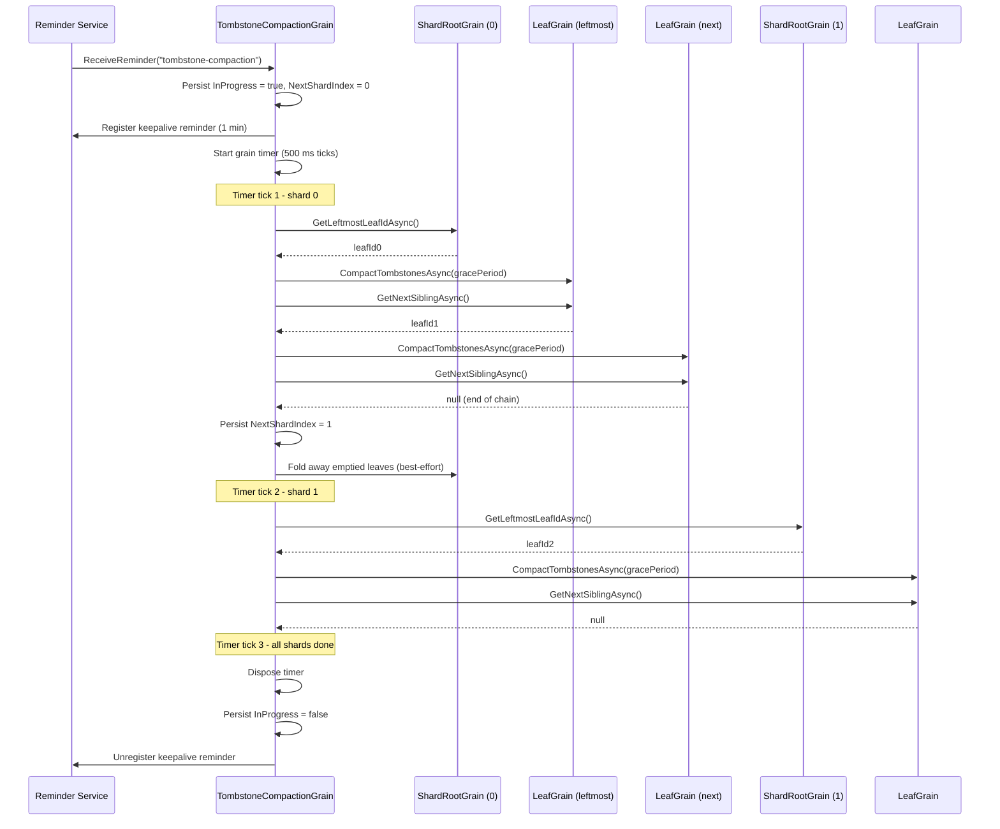

# Tombstone Compaction

Deleted keys are represented as **tombstones** - `LwwValue` entries with `IsTombstone = true`. Tombstones participate in LWW merge and delta replication like any other entry, so all replicas and caches eventually learn about the delete. However, tombstones are never removed by normal operations, leading to unbounded storage and scan overhead.

## How It Works

A single **`TombstoneCompactionGrain`** per tree owns one [grain reminder](https://learn.microsoft.com/dotnet/orleans/grains/timers-and-reminders) that fires at the configured grace-period interval. When the reminder fires, it starts a **grain timer** that processes one shard per tick (every 500 ms), avoiding a single long-running grain call that could hit Orleans timeouts for large trees:

1. The reminder tick persists `InProgress = true` and registers a **one-minute keepalive reminder**, then starts a grain timer at shard 0.
2. Each timer tick processes one shard:
   a. Calls `GetLeftmostLeafIdAsync` on the shard root to find the head of the leaf chain.
   b. Walks the doubly-linked leaf list via `GetNextSiblingAsync`, calling `CompactTombstonesAsync` on each leaf.
   c. Persists the updated `NextShardIndex` to durable state.
   d. Runs a best-effort pass over the completed shard that folds away leaves the compaction left empty, bounded by `CompactionLeafBatchSize` and `BackgroundDrainMaxDuration`. A failure there is logged and retried on the next pass; it never spends the shard's retry budget. See [Empty Leaf Reclaim](tree-structure.md#empty-leaf-reclaim).
3. If a shard fails, it is retried once before being skipped. On the dirty-leaves fast path a single leaf that refuses to compact no longer fails the shard - see [Dirty-Leaves Fast Path](#dirty-leaves-fast-path).
4. After all shards are processed, the timer self-disposes, `InProgress` is set to `false`, and the keepalive reminder is unregistered.

**Recovery:** If the silo restarts mid-compaction, the keepalive reminder fires within one minute and the grain resumes from the persisted `NextShardIndex`. Once the pass completes, the keepalive is unregistered. If `InProgress` is already `false` when the keepalive fires, it simply unregisters itself.

Each leaf compares every tombstone's `HLC.WallClockTicks` against `now - gracePeriod`. Tombstones older than the cutoff are durably reaped: for each removed entry the leaf appends a single `LatticeMutation { Kind = MutationKind.Tombstone, IsMerge = true }` envelope to the per-shard WAL **before** the entry is removed from the in-memory `SortedDictionary`. The envelope's HLC is the existing tombstone's own timestamp (not a fresh tick) so activation-time replay can use a straight `existing.Timestamp <= mutation.Timestamp` dominance check to skip a reap when a fresher live rewrite has already landed. Expired live entries past the same grace period are reaped through the same envelope shape.

The entire `CompactTombstonesAsync` body runs under a `LatticeMaintenanceContext` scope, so every emitted envelope is stamped `Category = MutationCategory.Maintenance`. This classification is what keeps reap envelopes off the replication wire: the producer-side observer in `Orleans.Lattice.Replication` skips `MutationCategory.Maintenance` writes entirely before any per-key filter runs, and the change feed plus the outbound shipper apply a defence-in-depth filter that drops `MutationKind.Tombstone` envelopes if they ever reach those layers. Every converged peer reaps its own copy of the data independently against its own grace window; replicating reap events would inflate every peer's vector clock with edges the user never authored.

After a pass the leaf records the version vector it has just compacted as its compaction watermark. The watermark advances in memory and is persisted with the leaf's state row on its next projection-checkpoint flush; that row carries no entries (they are rebuilt from the WAL on activation), so the watermark is the only compaction bookkeeping the leaf keeps durably. Subsequent passes **skip the scan entirely** while the watermark still dominates the leaf's current version vector (no writes have occurred since the last compaction). If a silo restarts before the checkpoint flushes, the next activation simply re-scans once - no data is lost.

A pass only advances the watermark when *no* tombstone or TTL-expired entry remained inside the grace window; if any was still in grace, the watermark is left untouched so the next pass re-scans once the grace has elapsed.



The reminder is registered lazily, on the first write the tree accepts through the public surface - a set, delete, range delete, batch or conditional write, or CRDT delta - and at most once per activation of the tree's grain. A write that lands while the Orleans reminder service is still initialising after silo start defers the registration to a later write instead of failing, and a tree whose `TombstoneGracePeriod` is `Timeout.InfiniteTimeSpan` never registers one.

The compaction coordinator is not part of the public API, and it handles the reminder tick itself. For on-demand compaction, call [`ILattice.CompactShardAsync`](#operator-api), which schedules an out-of-cycle pass scoped to one shard.

## Configuration

`TombstoneGracePeriod` follows the same named-options pattern as all other `LatticeOptions` properties:

```csharp verify
// Global default - applies to all trees.
siloBuilder.ConfigureLattice(o => o.TombstoneGracePeriod = TimeSpan.FromHours(12));

// Per-tree override.
siloBuilder.ConfigureLattice("my-tree", o => o.TombstoneGracePeriod = TimeSpan.FromDays(7));

// Disable compaction entirely for a specific tree.
siloBuilder.ConfigureLattice("archive-tree", o => o.TombstoneGracePeriod = Timeout.InfiniteTimeSpan);
```

The default grace period is **24 hours**. The reminder interval equals the grace period (clamped to a minimum of 1 minute, the Orleans reminder floor).

### `CompactionShardTickInterval`

A `TimeSpan` (default 500 ms, floor 100 ms). The compaction grain processes one shard per internal grain-timer tick during a pass, and waits this long between ticks so the grain returns control to the Orleans scheduler between shards. Without this gap a single grain call could span every shard in the tree, hit Orleans' grain-call timeout, and starve concurrent operator-initiated `RequestCompactionAsync` callers.

The cadence is a **scheduler-fairness knob, not a grain-deactivation knob.** Leaf activation lifetime is governed by the silo's `GrainCollectionOptions.CollectionAge` (default 15 minutes) and is independent of this value.

#### What a pass actually touches

Within a single shard the coordinator walks the leaf chain in batches of `CompactionLeafBatchSize` leaves (default 64) per timer tick, then yields for `CompactionShardTickInterval` before resuming from a persisted in-shard cursor. **The tick interval gates both the gap between shards *and* the gap between leaf batches inside a shard**, so peak concurrent leaf activations during a pass are bounded by:

```
peak ~= min(leaves walked in last CollectionAge, CompactionLeafBatchSize * (CollectionAge / CompactionShardTickInterval))
```

On a healthy default-configured tree (`CompactionLeafBatchSize = 64`, `CompactionShardTickInterval = 500 ms`, `CollectionAge = 15 min`) the second term caps at roughly `64 * 1800 = 115 200` activations. The **dirty-leaves fast path** described below cuts that cost only for shards that saw a routed delete since their last drain: such a shard activates its shard root plus just the leaves that observed those deletes. A shard with no routed delete since its last drain has an empty dirty snapshot and is chain-walked in full, so a pass over an idle or delete-free tree still activates every leaf (each one skips its scan when nothing has changed since its last compaction, but the activation is still paid).

Leaves that finish compacting fall idle and are collected after they've been idle for `CollectionAge`. With batching in place, **the leaf walk no longer activates the entire shard's leaf chain back-to-back**, so a pass that finishes inside one `CollectionAge` window does not necessarily activate the whole tree at once.

#### Tuning trade-off

Full-pass wall-clock scales linearly with shard count and tick interval, plus the batch yield within shards: each timer tick walks at most one batch of one shard, so a shard costs `ceil(leaves in the shard / CompactionLeafBatchSize)` ticks. The table below is for a tree with 1024 physical shards and ~50 leaves per shard (~50 000 leaves total), where any batch size of 50 or more walks a whole shard in one tick. "Peak concurrent activations" is the number of leaves walked in the last 15 minutes (`CollectionAge`) of the pass, capped at the tree's leaf count and at the batch-yield bound, so a pass that finishes inside 15 minutes has the whole tree active at its end. The figures describe the chain walk, which every shard with an empty dirty snapshot takes - including every shard of an idle tree and the first pass after an upgrade; a shard on the dirty-leaves fast path walks only its dirty leaves.

| `CompactionShardTickInterval` | `CompactionLeafBatchSize` | Full-pass duration | Peak concurrent leaf activations (chain-walk fallback) |
|---|---|---|---|
| 500 ms (default) | 64 (default) | ~8.5 minutes | ~50 000 (entire tree) |
| 2 s | 64 (default) | ~34 minutes | ~22 500 |
| 2 s | 1024 | ~34 minutes | ~22 500 (no change: a shard already fits in one batch) |
| 200 ms | 64 (default) | ~3.4 minutes | ~50 000 (entire tree) |
| 100 ms (floor) | 64 (default) | ~1.7 minutes | ~50 000 (entire tree) |
| 100 ms (floor) | 1 (floor) | ~85 minutes | ~9 000 (extreme yielding) |

At the default 500 ms cadence a chain-walked pass over this tree finishes inside one `CollectionAge` window, so the directory and silo memory do see the full leaf set at once; a longer tick (the 2 s rows) or a batch size below the shard's leaf count (the 1-leaf row) is what spreads activations across multiple windows. Shorten the tick or raise the batch size only after measuring that your silo can absorb the resulting peak activation count, and prefer `ILattice.CompactShardAsync(shardIndex)` for "compact this one shard fast" operator triage - a scoped pass walks only one shard's leaves regardless of the tick interval.

Values below the 100 ms floor are clamped up to the floor with a one-shot warning per tree per process. The floor protects scheduler fairness; lower it only if you have a measured reason. The interval is snapshotted at the start of each pass, so changing the option mid-pass does not reshape the in-flight pass; the next pass picks up the new value.

```csharp verify
// Speed up compaction triage on a high-shard tree.
// Verify the silo can absorb the resulting peak activation count first.
siloBuilder.ConfigureLattice("high-shard-tree", o => o.CompactionShardTickInterval = TimeSpan.FromMilliseconds(500));
```

### CompactionLeafBatchSize

An `int` (default 64, floor 1). Caps how many leaves the coordinator visits within a single shard before yielding for one `CompactionShardTickInterval`. The leaf walk resumes on the next timer tick from a persisted in-shard cursor, so progress survives silo crashes the same way `NextShardIndex` does. The cursor is cleared when the shard's leaf walk completes; a fresh pass on a different shard list always starts from the leftmost leaf.

The cursor is a **key** (`TombstoneCompactionState.NextLeafKeyInShard`) on the chain-walk path and an **index into the persisted snapshot** (`CurrentShardDirtyIndex`) on the dirty-leaves fast path - never a leaf grain id. Orleans grains are virtual, so an id persisted across a batch boundary can activate a fresh, empty grain whose sibling pointer is null; a walk resumed from it would report the shard done with most of it never visited, and that silent under-compaction is indistinguishable from a clean completion. A key is always re-descended onto whichever leaf now owns it, so a leaf split - or reclaimed - between two batches cannot truncate the pass. A leaf-id cursor left by an older build is discarded on load and the shard restarts from its leftmost leaf, which costs a re-walk and nothing else because per-leaf compaction is idempotent. See [Bounded background leaf walks](configuration.md#bounded-background-leaf-walks).

The default 64 reproduces pre-batching behaviour exactly on shards with <= 64 leaves (the common case). Raising the batch size shortens pass wall-clock at the cost of higher peak concurrent activations; lowering it does the inverse. Values below 1 are clamped up to 1 with a one-shot warning per tree per process. The batch size is snapshotted at the start of each pass, so changing the option mid-pass does not reshape the in-flight pass; the next pass picks up the new value.

The same value also caps the empty-leaf reclaim pass that follows each completed shard, which probes up to sixteen leaves per leaf it may fold (1024 at the default) while holding the shard root's turn - so raising it changes two walks, not one. See [How fast a shard actually heals](tree-structure.md#how-fast-a-shard-actually-heals).

```csharp verify
// Cut peak concurrent leaf activations by yielding more aggressively
// within each shard. Trades pass wall-clock for activation headroom.
siloBuilder.ConfigureLattice("activation-sensitive-tree", o => o.CompactionLeafBatchSize = 16);
```

## Dirty-Leaves Fast Path

The shard root maintains a small per-shard "dirty leaves since last compaction" set, populated as it routes point deletes and range deletes down to leaves. When a pass enters a shard, the compaction coordinator pulls a snapshot of this set together with the highest HLC mark it holds, walks only the named leaves, and on shard completion drains the set up to that HLC watermark. The drain is HLC-gated, so deletes that arrived during the in-flight pass are preserved for the next pass rather than silently dropped.

A named leaf that refuses to compact does not stop the walk (issue #2926). The coordinator records it as `outcome=skipped` on `orleans.lattice.compaction.leaves.visited`, re-marks it dirty strictly above the watermark so the drain keeps it and the next pass re-nominates it, and moves on to the next leaf. Only if that re-mark itself fails does the batch fail and fall back to the shard retry-then-skip policy - deliberately, so a wedged leaf is never silently dropped from the set.

The saving is per shard. A shard whose snapshot names dirty leaves costs its shard root plus those leaves instead of every leaf in its chain; a shard whose snapshot is empty is chain-walked in full (below). The fast path therefore pays off when deletes reach most shards between passes: on a 50 000-leaf, 1024-shard tree where every shard saw a delete and 2 048 leaves are dirty in total, a pass activates ~3 072 grains (the 1024 shard roots plus the dirty leaves) versus the ~51 000 of a full chain walk. A pass over a tree that saw no deletes at all walks every leaf, exactly as the chain walk would.

When a shard's dirty-leaves snapshot is empty (a fresh tree, an upgraded silo with no signal yet, or a shard whose deletes were all already drained), the coordinator falls back to the legacy leaf-chain walk for that shard so progress is never blocked by the absence of accumulated signal. The fast path takes over on a later pass once the shard has seen a routed delete again.

The shard root dedupes repeated `Delete` mutations within a dirty-window in memory, so the persistence cost scales with "distinct leaves touched per window", not "deletes per window". Dirty-leaf state is local to each cluster, and only a delete routed through the shard root marks a leaf. A replicated point delete (or predicate-filtered range delete) reaches a receiver cluster as a tombstone merge and does not mark the receiver's dirty set; a replicated plain range delete does, because the receiver re-executes it as a range delete. A leaf whose only reapable entries are TTL-expired live entries is never marked either. Such leaves are compacted when their shard is chain-walked - on a pass that finds the shard's dirty snapshot empty - so on a shard that keeps receiving routed deletes they wait until its dirty set drains empty.

The active path is reported on `orleans.lattice.compaction.leaves.visited` via the `path` tag (`walk` or `dirty-set`), and the `orleans.lattice.compaction.shard.dirty_leaves` histogram records the per-shard dirty-leaf count at the moment the coordinator enters a shard - a `0` sample is a shard that was chain-walked, not one that was skipped.

### `DirtyLeafFlushIntervalMs`

Coalescing window for persisting the shard-root dirty-leaves dictionary (default: `50` ms). The `Delete` hot path never writes to storage directly: `ShardRootGrain.MarkLeafDirtyAsync` max-merges the destination leaf into the in-memory `DirtyLeavesSinceLastCompaction` map with a monotonically-advancing HLC, sets a pending-flush flag, and arms a one-shot grain timer scoped to this interval. The timer's tick drains the flag with one `WriteStateAsync` per window regardless of how many distinct leaves were marked - the per-`Delete` shard-root storage write that previously raced concurrent `SetManyAsync` turns is replaced by at most one persist per window.

The compaction coordinator reads the in-memory dictionary directly via `IShardRootGrain.GetDirtyLeavesSinceLastCompactionAsync`, so an unpersisted mark is still routable within the same activation - the coalescing window matters only for crash survival. Admin-path flushes (`ClearDirtyLeavesUpToAsync`) and `OnDeactivateAsync` always drain pending marks in their own persist call, so clean shutdown loses nothing. An unclean silo crash that loses an in-memory mark causes the affected leaf to be re-discovered by the legacy chain-walk fallback on the next pass (the shard's empty post-restart snapshot triggers the fallback automatically), so the loss bound is one missed leaf per crashed activation per window - bounded and self-healing, never a correctness signal.

Set to `0` to disable coalescing entirely: each `MarkLeafDirtyAsync` call performs a synchronous best-effort flush, restoring the pre-coalescing behaviour of one `WriteStateAsync` per first-call-per-leaf-per-window. Tighten the window if shard-root crash survival is more valuable than coalescing the hot-path write; widen it if storage-side write amplification dominates over crash-recovery cost.

## Policy-Driven Triggers

Reminder-driven compaction handles the steady state. Bursty workloads can build a tombstone backlog **between** reminder ticks - either because the delete:write ratio spikes or because a leaf accumulates so many tombstones that scan latency degrades before the next reminder fires. Three optional policy controls let the leaf request an out-of-cycle pass without waiting for the next reminder.

### `MinTombstoneRatioForCompaction`

A `double` in the range `[0.0, 1.0]` (default `0.0` = disabled). When non-zero, every successful point delete or range delete on a leaf computes the leaf's tombstone-to-total ratio (`tombstones / (live + tombstones)`). When that ratio reaches the threshold, the leaf asks its tree's compaction coordinator, fire-and-forget, to schedule an out-of-cycle pass scoped to that single shard with trigger label `"ratio"`. Writes that are not deletes never evaluate the trigger, and the evaluation records no metric: the `orleans.lattice.leaf.tombstone.ratio` histogram is sampled separately, at the entry of every compaction pass over a leaf, whatever this option is set to.

### `MaxLeafEntriesBeforeForcedCompaction`

An `int` (default `0` = disabled). When non-zero, the same post-delete evaluation requests an out-of-cycle pass with trigger label `"size"` once the leaf's total entry count (live + tombstones) exceeds the threshold and the leaf holds at least one tombstone; when both triggers fire on the same delete, the request carries `"ratio"`. This is the safety net for workloads where the tombstone ratio stays low but absolute entry count drifts up because deletes never quite outpace writes.

### `CompactionTriggerCooldown`

A `TimeSpan` (default 5 minutes). Per-shard cooldown gate that prevents a hot leaf from re-requesting compaction on every delete. The coordinator records in its persisted state, per shard, when it last accepted an out-of-cycle request; ratio/size requests for that shard inside the cooldown window are silently dropped. Operator-initiated requests via `ILattice.CompactShardAsync` bypass the cooldown by carrying the `"operator"` trigger label, but an accepted operator request still restarts that shard's cooldown window. The regular reminder-driven pass neither consults nor restarts the cooldown, and `TimeSpan.Zero` disables the gate.

```csharp verify
// Enable both triggers with a 2-minute cooldown.
siloBuilder.ConfigureLattice("hot-tree", o =>
{
    o.MinTombstoneRatioForCompaction = 0.30;        // 30% tombstones triggers a pass.
    o.MaxLeafEntriesBeforeForcedCompaction = 50_000; // 50k entries triggers a pass.
    o.CompactionTriggerCooldown = TimeSpan.FromMinutes(2);
});
```

## Operator API

`ILattice.CompactShardAsync(int shardIndex, CancellationToken)` schedules an out-of-cycle pass scoped to a single physical shard, bypassing the cooldown gate. Returns `false` when compaction is disabled (`TombstoneGracePeriod = Timeout.InfiniteTimeSpan`) or when a pass is already in flight (reminder-driven or scoped). The shard index must be a physical shard of the tree's `ShardMap`; an out-of-range value throws `ArgumentOutOfRangeException`. The call is authorised as a whole-tree admin operation, and a reserved system tree is rejected with `LatticeReservedTreeNamespaceException` (an `InvalidOperationException`). The tree-admin facade exposes the same request as `ILatticeTreeAdmin.TriggerShardCompactionAsync`, which wraps this method and reports its result as `Accepted` - see [Orleans.Lattice.Api.TreeAdmin](../lattice.api.treeadmin/README.md#facade-method-signatures).

```csharp verify
// Operator triage: force a compaction pass on shard 3.
var accepted = await lattice.CompactShardAsync(3, cancellationToken);
```

## Telemetry

Every compaction pass emits the following instruments, each also tagged with the tree's derived `tenant`. On the per-leaf instruments the `trigger` tag (`reminder`, `ratio`, `size`, or `operator`) appears only when `MinTombstoneRatioForCompaction` or `MaxLeafEntriesBeforeForcedCompaction` is non-zero, so a reminder-only deployment emits them without it. See [Metrics](metrics.md) for the full schema:

- `orleans.lattice.compaction.pass.duration` (histogram, ms) - tagged `tree`, `trigger`.
- `orleans.lattice.compaction.leaves.visited` (counter) - tagged `tree`, `outcome` (`reaped` / `noop` / `skipped`), `trigger`, and `path` (`walk` / `dirty-set`) per the active fast path. `skipped` is a leaf that threw; on the dirty-leaves fast path it is the only signal that a specific leaf is wedged, and it repeats once per pass for as long as the leaf keeps failing.
- `orleans.lattice.compaction.shard.retries` (counter) - tagged `tree`.
- `orleans.lattice.compaction.shard.skipped` (counter) - tagged `tree`. **Any non-zero rate is alert-worthy.**
- `orleans.lattice.compaction.shard.dirty_leaves` (histogram) - tagged `tree`. Records the per-shard dirty-leaf snapshot size at the moment the coordinator enters a shard. Use it to capacity-plan the dirty-leaves fast path.
- `orleans.lattice.leaf.compaction.duration` (histogram, ms) - tagged `tree`, `trigger`. One sample per leaf the pass scans; a leaf that short-circuits because nothing changed since its last compaction records none.
- `orleans.lattice.leaf.tombstones.reaped` and `orleans.lattice.leaf.tombstones.expired` (counters) - tagged `tree`, `trigger`. Tombstones, and TTL-expired live entries, that a pass physically removed.
- `orleans.lattice.leaf.tombstone.ratio` (histogram) - tagged `tree` and `tenant`, sampled at the entry of each compaction pass over a leaf. The leaf's identity is not a tag, so the family holds at most one series per tree however many leaves the tree has (issue #2518).

The bundled Grafana **Overview** dashboard ships compaction-focused panels for each of these (pass duration p95 by trigger, leaves visited by outcome, shard retries / skips, dirty leaves per pass, per-leaf compaction duration p95, tombstone churn, and tombstone-ratio p95).

## Design Considerations

| Concern | Approach |
|---|---|
| **Scalability** | One reminder per tree (not per leaf). The compaction grain uses a grain timer to process one shard per tick, avoiding long-running calls that could hit Orleans timeouts. |
| **Consistency** | Tombstones are only removed after the grace period, giving all caches and replicas time to observe the delete via delta replication. |
| **Durability of reaps** | Each reaped entry is committed to the per-shard WAL as a `MutationKind.Tombstone` envelope **before** in-memory removal, so activation-time replay re-applies the reap deterministically. The WAL is the sole durability boundary; grain state is never a fallback store for entry values. |
| **Idempotency** | Per-leaf compaction is safe to repeat. The compaction-watermark fast path avoids redundant scans. Replay re-runs the dominance check for each reap envelope, so the same envelope applied twice is a no-op. |
| **Replication isolation** | Reap envelopes carry `MutationCategory.Maintenance`. The replication observer skips maintenance writes entirely, and the change feed plus outbound shipper apply a `MutationKind.Tombstone` filter as defence in depth. Every peer reaps independently against its own grace window. |
| **Durability of progress** | Compaction progress (`NextShardIndex`, `InProgress`) is persisted to grain storage. A one-minute keepalive reminder ensures the grain is reactivated after a silo restart to resume the in-flight pass. |
| **Fault tolerance** | If a shard fails during compaction, it is retried once before being skipped. On the dirty-leaves fast path a single leaf that throws is skipped and re-marked dirty instead of failing the shard, so the rest of the shard is still compacted and the leaf is retried on the next pass. The next reminder tick starts a fresh pass. |
| **Memory** | Leaves are compacted in batches of `CompactionLeafBatchSize` (default 64) per timer tick; both the *between-shard* gap and the *between-batch* gap are governed by `CompactionShardTickInterval`. The dirty-leaves fast path (see above) limits a shard that saw routed deletes to its shard root plus those dirty leaves. The chain-walk fallback - every shard whose dirty snapshot is empty, including every shard of an idle tree and the first pass after an upgrade - is bounded by `min(leaves walked in last CollectionAge, CompactionLeafBatchSize * (CollectionAge / CompactionShardTickInterval))`. With the default 64-leaf batch, 500 ms tick, and 15 min `CollectionAge`, that bound is roughly 115 200 activations regardless of tree size, which is above the leaf count of most trees, so on those the whole leaf set can be active at the end of a chain-walked pass. |
| **Scheduler fairness** | The compactor yields between shard walks for `CompactionShardTickInterval` (default 500 ms, floor 100 ms) so the grain returns control to the Orleans scheduler and concurrent `RequestCompactionAsync` callers are not starved. The cadence is configurable per tree and snapshotted at pass start. |
| **Disabling** | Set `TombstoneGracePeriod = Timeout.InfiniteTimeSpan` to disable compaction globally or per tree. |
