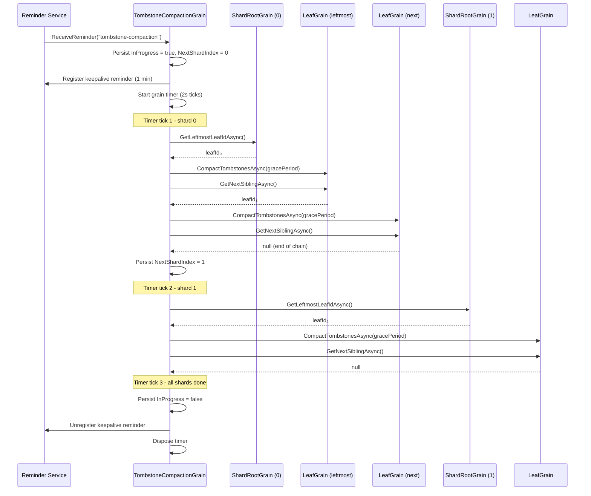

# Tombstone Compaction

Deleted keys are represented as **tombstones** - `LwwValue` entries with `IsTombstone = true`. Tombstones participate in LWW merge and delta replication like any other entry, so all replicas and caches eventually learn about the delete. However, tombstones are never removed by normal operations, leading to unbounded storage and scan overhead.

## How It Works

A single **`TombstoneCompactionGrain`** per tree owns one [grain reminder](https://learn.microsoft.com/dotnet/orleans/grains/timers-and-reminders) that fires at the configured grace-period interval. When the reminder fires, it starts a **grain timer** that processes one shard per tick (every 2 seconds), avoiding a single long-running grain call that could hit Orleans timeouts for large trees:

1. The reminder tick persists `InProgress = true` and registers a **one-minute keepalive reminder**, then starts a grain timer at shard 0.
2. Each timer tick processes one shard:
   a. Calls `GetLeftmostLeafIdAsync` on the shard root to find the head of the leaf chain.
   b. Walks the doubly-linked leaf list via `GetNextSiblingAsync`, calling `CompactTombstonesAsync` on each leaf.
   c. Persists the updated `NextShardIndex` to durable state.
3. If a shard fails, it is retried once before being skipped.
4. After all shards are processed, the timer self-disposes, `InProgress` is set to `false`, and the keepalive reminder is unregistered.

**Recovery:** If the silo restarts mid-compaction, the keepalive reminder fires within one minute and the grain resumes from the persisted `NextShardIndex`. Once the pass completes, the keepalive is unregistered. If `InProgress` is already `false` when the keepalive fires, it simply unregisters itself.

Each leaf compares every tombstone's `HLC.WallClockTicks` against `now − gracePeriod`. Tombstones older than the cutoff are durably reaped: for each removed entry the leaf appends a single `LatticeMutation { Kind = MutationKind.Tombstone, IsMerge = true }` envelope to the per-shard WAL **before** the entry is removed from the in-memory `SortedDictionary`. The envelope's HLC is the existing tombstone's own timestamp (not a fresh tick) so activation-time replay can use a straight `existing.Timestamp <= mutation.Timestamp` dominance check to skip a reap when a fresher live rewrite has already landed. Expired live entries past the same grace period are reaped through the same envelope shape.

The entire `CompactTombstonesAsync` body runs under a `LatticeMaintenanceContext` scope, so every emitted envelope is stamped `Category = MutationCategory.Maintenance`. This classification is what keeps reap envelopes off the replication wire: the producer-side observer in `Orleans.Lattice.Replication` skips `MutationCategory.Maintenance` writes entirely before any per-key filter runs, and the change feed plus the outbound shipper apply a defence-in-depth filter that drops `MutationKind.Tombstone` envelopes if they ever reach those layers. Every converged peer reaps its own copy of the data independently against its own grace window; replicating reap events would inflate every peer's vector clock with edges the user never authored.

A `LastCompactionVersion` (a `VersionVector` snapshot) advances in memory after each pass and is folded into the next projection-checkpoint flush alongside the entries. Subsequent ticks **skip the scan entirely** when the in-memory `LastCompactionVersion` already dominates `Version` (no writes have occurred since the last compaction). If a silo restarts before the checkpoint flushes, the next activation simply re-scans once - no data is lost.

A pass only stamps `LastCompactionVersion` when *no* tombstones remained inside the grace window; if any tombstone was still in-grace, the version is left untouched so the next pass re-scans once the grace has elapsed.



The reminder is registered lazily - `LatticeGrain` calls `EnsureReminderAsync` on the first `SetAsync` or `DeleteAsync` for a given tree. A per-activation `bool` field ensures this cross-grain call happens at most once per `LatticeGrain` activation.

For manual or on-demand compaction (e.g. maintenance scripts, integration tests), `LatticeGrain` invokes `ITombstoneCompactionGrain.RunCompactionPassAsync` internally on each reminder tick. The compaction grain is not part of the public API.

## Configuration

`TombstoneGracePeriod` follows the same named-options pattern as all other `LatticeOptions` properties:

```csharp verify
// Global default - applies to all trees.
siloBuilder.ConfigureLattice(o => o.TombstoneGracePeriod = TimeSpan.FromHours(12));

// Per-tree override.
siloBuilder.ConfigureLattice("my-tree", o => o.TombstoneGracePeriod = TimeSpan.FromDays(7));

// Disable compaction entirely for a specific tree.
siloBuilder.ConfigureLattice("archive-tree", o => o.TombstoneGracePeriod = Timeout.InfiniteTimeSpan);
```

The default grace period is **24 hours**. The reminder interval equals the grace period (clamped to a minimum of 1 minute, the Orleans reminder floor).

### `CompactionShardTickInterval`

A `TimeSpan` (default 2 seconds, floor 100 ms). The compaction grain processes one shard per internal grain-timer tick during a pass, and waits this long between ticks so the grain returns control to the Orleans scheduler between shards. Without this gap a single grain call could span every shard in the tree, hit Orleans' grain-call timeout, and starve concurrent operator-initiated `RequestCompactionAsync` callers.

The cadence is a **scheduler-fairness knob, not a grain-deactivation knob.** Leaf activation lifetime is governed by the silo's `GrainCollectionOptions.CollectionAge` (default 15 minutes) and is independent of this value.

#### What a pass actually touches

Within a single shard the coordinator walks the leaf chain back-to-back via `IBPlusLeafGrain.GetNextSiblingAsync` and `CompactTombstonesAsync`; **the tick interval is *not* inserted between leaves of the same shard**, only between shards. A full pass therefore activates every leaf in the tree at least once. The only thing keeping the live-activation count bounded is `GrainCollectionOptions.CollectionAge`: leaves that finish compacting fall idle and are collected after they've been idle for `CollectionAge`. The peak concurrent leaf activation count during a pass is roughly:

```
peak ~= leaves walked within the last CollectionAge window
```

This means **lowering the tick interval directly raises the peak.** A pass that finishes inside one `CollectionAge` window has effectively activated the entire leaf set of the tree at once, because the leaves visited at the start of the pass have not yet been collected when the pass ends.

#### Tuning trade-off

Full-pass wall-clock scales linearly with shard count and tick interval. The table below is for a tree with 1024 physical shards and ~50 leaves per shard (~50 000 leaves total) and shows both the wall-clock saving and the activation-pressure cost. "Peak concurrent activations" is the number of leaves walked in the last 15 minutes of the pass, capped at the tree's leaf count.

| `CompactionShardTickInterval` | Full-pass duration | Peak concurrent leaf activations |
|---|---|---|
| 2 s (default) | ~34 minutes | ~22 500 (~45% of leaves) |
| 500 ms | ~8.5 minutes | ~50 000 (entire tree) |
| 200 ms | ~3.4 minutes | ~50 000 (entire tree) |
| 100 ms (floor) | ~1.7 minutes | ~50 000 (entire tree) |

The default 2 s cadence is deliberately conservative on this axis: it spreads activations across multiple `CollectionAge` windows so the directory and silo memory don't see the full leaf set simultaneously. Lower the cadence only after measuring that your silo can absorb the resulting peak activation count, and prefer `ILattice.CompactShardAsync(shardIndex)` for "compact this one shard fast" operator triage - a scoped pass walks only one shard's leaves regardless of the tick interval.

Values below the 100 ms floor are clamped up to the floor with a one-shot warning per tree per process. The floor protects scheduler fairness; lower it only if you have a measured reason. The interval is snapshotted at the start of each pass, so changing the option mid-pass does not reshape the in-flight pass; the next pass picks up the new value.

```csharp verify
// Speed up compaction triage on a high-shard tree.
// Verify the silo can absorb the resulting peak activation count first.
siloBuilder.ConfigureLattice("high-shard-tree", o => o.CompactionShardTickInterval = TimeSpan.FromMilliseconds(500));
```

## Policy-Driven Triggers

Reminder-driven compaction handles the steady state. Bursty workloads can build a tombstone backlog **between** reminder ticks - either because the delete:write ratio spikes or because a leaf accumulates so many tombstones that scan latency degrades before the next reminder fires. Three optional policy controls let the leaf request an out-of-cycle pass without waiting for the next reminder.

### `MinTombstoneRatioForCompaction`

A `double` in the range `[0.0, 1.0]` (default `0.0` = disabled). When non-zero, every mutation samples the leaf's tombstone-to-live-entry ratio and emits it on the `orleans.lattice.leaf.tombstone.ratio` histogram. When the sampled ratio crosses the threshold, the leaf calls `ITombstoneCompactionGrain.RequestCompactionAsync(shardIndex, "ratio")` to schedule an out-of-cycle pass scoped to that single shard.

### `MaxLeafEntriesBeforeForcedCompaction`

An `int` (default `0` = disabled). When non-zero, the leaf requests an out-of-cycle pass once its total entry count (live + tombstones) exceeds the threshold, with trigger label `"size"`. This is the safety net for workloads where the tombstone ratio stays low but absolute entry count drifts up because deletes never quite outpace writes.

### `CompactionTriggerCooldown`

A `TimeSpan` (default 5 minutes). Per-shard cooldown gate that prevents a hot leaf from re-requesting compaction every mutation. The coordinator persists `LastTriggerAt` per pass; ratio/size requests inside the cooldown window are silently dropped. Operator-initiated requests via `ILattice.CompactShardAsync` bypass the cooldown by carrying the `"operator"` trigger label.

```csharp verify
// Enable both triggers with a 2-minute cooldown.
siloBuilder.ConfigureLattice("hot-tree", o =>
{
    o.MinTombstoneRatioForCompaction = 0.30;        // 30% tombstones triggers a pass.
    o.MaxLeafEntriesBeforeForcedCompaction = 50_000; // 50k entries triggers a pass.
    o.CompactionTriggerCooldown = TimeSpan.FromMinutes(2);
});
```

## Operator API

`ILattice.CompactShardAsync(int shardIndex, CancellationToken)` schedules an out-of-cycle pass scoped to a single physical shard, bypassing the cooldown gate. Returns `false` when compaction is disabled (`TombstoneGracePeriod = Timeout.InfiniteTimeSpan`) or when a pass is already in flight. The shard index must be a physical shard of the tree's `ShardMap`; an out-of-range value throws `ArgumentOutOfRangeException`.

```csharp verify
// Operator triage: force a compaction pass on shard 3.
var accepted = await lattice.CompactShardAsync(3, cancellationToken);
```

## Telemetry

Every compaction pass emits the following instruments. See [Metrics](metrics.md) for the full schema:

- `orleans.lattice.compaction.pass.duration` (histogram, ms) - tagged `tree`, `trigger`.
- `orleans.lattice.compaction.leaves.visited` (counter) - tagged `tree`, `outcome` (`reaped` / `noop`), and `trigger` when a policy-trigger pass is in flight.
- `orleans.lattice.compaction.shard.retries` (counter) - tagged `tree`.
- `orleans.lattice.compaction.shard.skipped` (counter) - tagged `tree`. **Any non-zero rate is alert-worthy.**
- `orleans.lattice.leaf.tombstone.ratio` (histogram) - tagged `tree`. Only emitted when `MinTombstoneRatioForCompaction` is enabled.

The bundled Grafana **Overview** dashboard ships compaction-focused panels for each of these (pass duration p95 by trigger, leaves visited by outcome, shard retries / skips, and tombstone-ratio p95).

## Design Considerations

| Concern | Approach |
|---|---|
| **Scalability** | One reminder per tree (not per leaf). The compaction grain uses a grain timer to process one shard per tick, avoiding long-running calls that could hit Orleans timeouts. |
| **Consistency** | Tombstones are only removed after the grace period, giving all caches and replicas time to observe the delete via delta replication. |
| **Durability of reaps** | Each reaped entry is committed to the per-shard WAL as a `MutationKind.Tombstone` envelope **before** in-memory removal, so activation-time replay re-applies the reap deterministically. The WAL is the sole durability boundary; grain state is never a fallback store for entry values. |
| **Idempotency** | `CompactTombstonesAsync` is safe to call multiple times. The `LastCompactionVersion` fast-path avoids redundant scans. Replay-time `ApplyTombstoneReap` re-runs the dominance check, so the same envelope applied twice is a no-op. |
| **Replication isolation** | Reap envelopes carry `MutationCategory.Maintenance`. The replication observer skips maintenance writes entirely, and the change feed plus outbound shipper apply a `MutationKind.Tombstone` filter as defence in depth. Every peer reaps independently against its own grace window. |
| **Durability of progress** | Compaction progress (`NextShardIndex`, `InProgress`) is persisted to grain storage. A one-minute keepalive reminder ensures the grain is reactivated after a silo restart to resume the in-flight pass. |
| **Fault tolerance** | If a shard fails during compaction, it is retried once before being skipped. The next reminder tick starts a fresh pass. |
| **Memory** | Leaves are compacted one at a time via sequential grain calls, but the leaf walk within a shard runs back-to-back; only the *between-shard* gap is governed by `CompactionShardTickInterval`. Peak concurrent leaf activations during a pass is roughly the number of leaves walked within one `GrainCollectionOptions.CollectionAge` window (default 15 minutes). The default 2 s cadence is sized to spread activations across multiple `CollectionAge` windows; lowering it raises the peak. |
| **Scheduler fairness** | The compactor yields between shard walks for `CompactionShardTickInterval` (default 2 s, floor 100 ms) so the grain returns control to the Orleans scheduler and concurrent `RequestCompactionAsync` callers are not starved. The cadence is configurable per tree and snapshotted at pass start. |
| **Disabling** | Set `TombstoneGracePeriod = Timeout.InfiniteTimeSpan` to disable compaction globally or per tree. |
