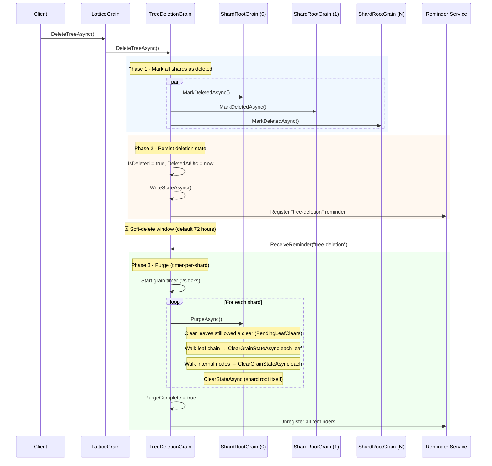

# Tree Deletion

## Overview

Trees can be deleted via `ILattice.DeleteTreeAsync()`. Deletion is a **soft delete** - the tree is immediately marked as inaccessible, but its data is retained in storage for a configurable grace period before being permanently purged.

```csharp verify
var tree = grainFactory.GetGrain<ILattice>("my-tree");
await tree.DeleteTreeAsync();
```

After deletion, any attempt to read from or write to the tree throws `InvalidOperationException` with the message *"This tree has been deleted and is no longer accessible."*

## How It Works

Deletion uses a three-phase approach:



### Phase 1: Mark shards as deleted

`TreeDeletionGrain.DeleteTreeAsync()` calls `MarkDeletedAsync()` on every shard in parallel. Each shard persists an `IsDeleted = true` flag to its `ShardRootState`. Once set, every subsequent `GetAsync`, `SetAsync`, `DeleteAsync`, `ScanKeysAsync`, `BulkLoadAsync`, and `BulkAppendAsync` call on that shard throws `InvalidOperationException` immediately - before touching any leaf or internal node.

### Phase 2: Persist and schedule

After all shards are marked, the `TreeDeletionGrain` persists its own `IsDeleted` flag and `DeletedAtUtc` timestamp, unregisters the [tombstone compaction](tombstone-compaction.md) reminder (compaction is no longer needed for a deleted tree), then registers a grain reminder for deferred purge. The reminder fires at intervals equal to the configured `SoftDeleteDuration` (clamped to a minimum of 1 minute).

### Phase 3: Purge

When the reminder fires and the soft-delete window has elapsed (`now - DeletedAtUtc ≥ SoftDeleteDuration`), a grain timer is started that processes one shard per tick (every 2 seconds) - the same pattern used by [tombstone compaction](tombstone-compaction.md).

For each shard, `PurgeAsync()`:

1. Clears every leaf the shard root still records as owed a state clear (`ShardRootState.PendingLeafClears`) - leaves an earlier [empty-leaf reclaim](tree-structure.md) or orphan repair took out of the tree but could not clear. They are on neither the chain nor any routing table, so no walk below reaches them, and the shard row cleared in the last step is the only thing that names them (issue [#2207](https://github.com/NSTA1/Orleans.Lattice/issues/2207)).
2. Walks the doubly-linked leaf chain from the leftmost leaf, calling `ClearGrainStateAsync()` on each leaf (which clears persistent state and deactivates the grain).
3. Collects all internal node grain IDs by walking the tree from the root level by level, and with them every leaf the bottom internal level routes to. Any routed leaf the chain walk did not reach is cleared too, then each internal node.
4. Clears the shard root's own state via `ClearStateAsync()`.

Step 3's routed-leaf sweep matters on a **retried** purge. A purge that fails part-way has already cleared the head of the chain, and a cleared leaf has no sibling pointer left, so the retry's chain walk stops at the first leaf. The internal nodes are cleared only after the leaves, so on the retry they still name every routed leaf, and the sweep reaches the ones beyond the break. Any failure propagates out of `PurgeAsync()` with the shard row still in place, so the retry has the same record to work from.

`ClearGrainStateAsync()` deletes the grain's storage record - the provider reports no state for it afterwards - and retires the leaf's WAL replay barrier and unregisters its materialiser pins before it does, so a cleared leaf no longer holds the WAL trim floor down. The WAL itself is trimmed separately: each GC pass re-computes the trim floor from the pins that remain and re-issues the trim, which is idempotent, so a trim that fails is retried on the next pass rather than lost. Deleting a record and reclaiming the storage behind it are distinct: a provider may keep the freed space until its own compaction runs.

After all shards are purged, the deletion grain marks `PurgeComplete = true`, unregisters all reminders, and deactivates itself.

## Recovery

| Crash point | State on recovery | Action |
|---|---|---|
| During Phase 1 (some shards marked) | Some shards have `IsDeleted = true` | `DeleteTreeAsync` is idempotent - re-calling marks remaining shards |
| After Phase 2, before Phase 3 | `IsDeleted` persisted, reminder registered | Reminder fires after soft-delete window, starts purge |
| During Phase 3 (mid-purge) | `PurgeInProgress = true`, `NextShardIndex` persisted | Keepalive reminder (1 min) reactivates grain, resumes from persisted shard index |
| `PurgeTreeAsync()` interrupted mid-shard | Shard root still routes to nodes whose state was cleared | Typed CRDT write path re-binds the node on demand; `RecoverTreeAsync()` also re-asserts proactively - see [Repairing an unbound node](#repairing-an-unbound-node) |
| After Phase 3 | `PurgeComplete = true` | Reminder fires, detects completion, unregisters and deactivates |

## Idempotency

- `DeleteTreeAsync()` is idempotent - calling it on an already-deleted tree is a no-op.
- `MarkDeletedAsync()` is idempotent per shard.
- `PurgeAsync()` is safe to call multiple times - `ClearGrainStateAsync()` on an already-cleared grain is harmless, and `ClearStateAsync()` on an already-empty shard root is a no-op. A retry reaches the leaves a failed attempt left behind, even past the chain break that attempt caused, through the routed-leaf sweep in step 3.
- Failed shards during purge are retried once before being skipped. The next reminder tick starts a fresh purge pass.

## Read Cache Behaviour

`LeafCacheGrain` is a `[StatelessWorker]` that holds an in-memory copy of leaf data. It is **not** notified when a tree is deleted - doing so would require traversing every leaf in the tree to set a flag, which is prohibitively expensive and defeats the purpose of the shard-root-level guard.

This is safe because the cache is not publicly addressable. The only path to it is through `ShardRootGrain.TraverseForReadAsync`, which calls `ThrowIfDeleted()` before reaching the cache layer. No external caller can obtain a `LeafCacheGrain` reference - its key is an internal `GrainId` string derived from the primary leaf's identity, not exposed through `ILattice`.

After deletion, existing cache activations may still hold stale data in memory, but no requests can reach them. Orleans will deactivate idle `StatelessWorker` activations on its normal schedule, at which point the in-memory data is garbage-collected. No persistent state is involved - the cache is purely in-memory.

## Configuration

The soft-delete window is controlled by `SoftDeleteDuration` in `LatticeOptions`. See [Configuration](configuration.md) for details.

```csharp verify
// Global default - 72 hours
siloBuilder.ConfigureLattice(o => o.SoftDeleteDuration = TimeSpan.FromHours(72));

// Per-tree override - immediate purge
siloBuilder.ConfigureLattice("ephemeral-tree", o => o.SoftDeleteDuration = TimeSpan.Zero);
```

## Recovering a Deleted Tree

During the soft-delete window (before purge begins), a deleted tree can be recovered:

```csharp verify
var tree = grainFactory.GetGrain<ILattice>("my-tree");
await tree.RecoverTreeAsync();

// Tree is accessible again - all data from before the delete is restored.
byte[]? value = await tree.GetAsync("customer-123");
```

`RecoverTreeAsync()` clears the `IsDeleted` flag on every shard, re-asserts each shard's node bindings so an interrupted purge cannot leave a routable-but-unbound leaf behind (see [Repairing an unbound node](#repairing-an-unbound-node)), unregisters the purge reminder, re-instates the [tombstone compaction](tombstone-compaction.md) reminder, and resets the deletion grain's state. The tree returns to normal operation with all its data intact, including automatic tombstone compaction.

**State validation:**

| Tree state | Result |
|---|---|
| Not deleted | Throws `InvalidOperationException` - nothing to recover |
| Soft-deleted (within window) | ✅ Recovers successfully |
| Purge in progress | Throws `InvalidOperationException` - too late to recover safely |
| Purge complete | Throws `InvalidOperationException` - data is gone |

### Repairing an unbound node

A node's owning-tree binding is written when the node is *created* and never re-asserted afterwards, so any node that loses it stays unbound forever: routing keeps delivering writes to it, but every typed CRDT write to its key range fails with `LatticeCrdtShapeNotRegisteredException`, permanently and across process restarts. Two paths produce such a node:

- **An interrupted purge.** `PurgeTreeAsync()` clears a shard's leaf and internal nodes *before* it clears the shard root itself, so an interruption part-way through - a grain call timeout on a large tree, a silo restart, an abandoned reminder tick - leaves a shard root whose `RootNodeId` still routes writes to nodes whose state has already been wiped.
- **A split from an unbound donor.** A splitting leaf seeds its new sibling with its own tree id, so one unbound leaf mints another every time it splits, spreading the damage across the key range. The donor logs a warning when this happens.

**The write path repairs it.** When a typed CRDT write faults because the target leaf has no bound tree id, the owning shard root - which always knows the tree id and shard index the leaf is missing - re-asserts the binding and retries the write once. The repair is driven from the fault rather than from a probe, so a tree that is *already* in this state heals on its very next write, with no operator action, no recover call, and no restart. A healthy write pays nothing for it: an exception filter is only evaluated once a fault is in flight.

The repair is deliberately narrow, so it cannot mask a genuine fault:

| Situation | Behaviour |
|-----------|-----------|
| Leaf has no bound tree id | Re-assert the binding, retry once, log a warning |
| Retry fails again | Original fault propagates - fail closed |
| Tree genuinely has no registered `CrdtShape` | Fault propagates untouched, never retried |

The two cases are distinguishable because `LatticeCrdtShapeNotRegisteredException.TreeId` is empty only for an unbound leaf; a genuinely unregistered shape carries the tree id it could not resolve.

`RecoverTreeAsync()` additionally repairs proactively: after clearing the `IsDeleted` flag on every shard it asks each shard root to walk its topology and re-assert `SetTreeIdAsync` (and `SetShardIndexAsync` on leaves) on every node it can still route to, bounded to 4096 nodes at a fan-out of 16 so the repair cannot reproduce the timeout that caused the damage. `SetTreeIdAsync` and `SetShardIndexAsync` are idempotent and short-circuit inside the callee, so re-asserting a healthy binding costs one round trip and no storage write. This pass is best-effort: if the walk fails - for example because the shard's internal root was also cleared, leaving nothing to descend - the shard root logs a warning and recovery continues, since the write path repairs the same damage on demand anyway.

## Manual Purge

To bypass the soft-delete waiting window and permanently destroy a tree's data immediately:

```csharp verify
var tree = grainFactory.GetGrain<ILattice>("my-tree");
await tree.DeleteTreeAsync();
await tree.PurgeTreeAsync();
```

`PurgeTreeAsync()` walks every shard synchronously, clearing all leaf and internal node state, then marks the tree as fully purged. This is useful for maintenance scripts, test teardown, or when you know recovery will never be needed.

> **Note:** `PurgeTreeAsync()` processes all shards in a single grain call. For very large trees (many shards, deep trees, millions of keys), this call may take a long time and risk hitting Orleans grain call timeouts. In those cases, prefer the default reminder-driven purge, which processes one shard per timer tick and is resilient to timeouts and silo restarts.

**State validation:**

| Tree state | Result |
|---|---|
| Not deleted | Throws `InvalidOperationException` - delete first |
| Soft-deleted (within window) | ✅ Purges immediately |
| Purge in progress (via reminder) | ✅ Purges remaining shards |
| Purge complete | Throws `InvalidOperationException` - already purged |
