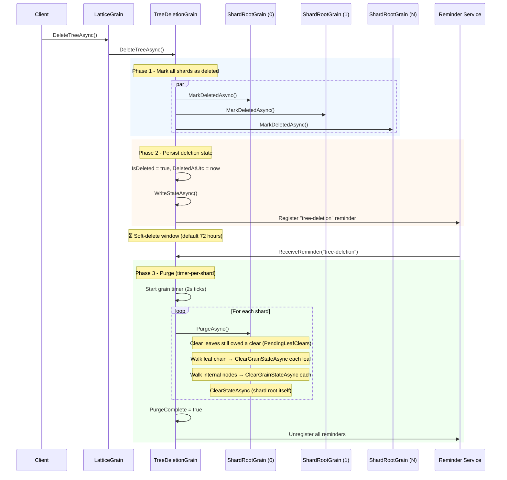

# Tree Deletion

## Overview

Trees can be deleted via `ILattice.DeleteTreeAsync()`. Deletion is a **soft delete** - the tree is immediately marked as inaccessible, but its data is retained in storage for a configurable grace period before being permanently purged.

```csharp verify
var tree = grainFactory.GetGrain<ILattice>("my-tree");
await tree.DeleteTreeAsync();
```

After deletion, any attempt to read from or write to the tree throws `InvalidOperationException` with the message *"This tree has been deleted and is no longer accessible."* The same holds for an aliased tree - one a populated resize, a shadow-cutover restore or a schema-remediation cutover has pointed at another physical tree: the delete marks the live copy the alias targets, except any shard a split has added to that copy since the alias was set (see [Phase 1](#phase-1-mark-shards-as-deleted)); see [Deleting an aliased tree](#deleting-an-aliased-tree).

`DeleteTreeAsync`, `RecoverTreeAsync`, and `PurgeTreeAsync` are whole-tree lifecycle operations: each is authorised as `LatticeOperation.TreeLifecycle` over the whole tree, and each rejects a reserved system tree with `LatticeReservedTreeNamespaceException` and a materialised-view tree with `InvalidOperationException`. `DeleteTreeAsync` additionally refuses, with `InvalidOperationException`, a tree that one or more [materialised views](materialised-views.md) derive from - delete the dependent views first through `ILatticeViewFactory.DeleteAsync`.

## How It Works

Deletion uses a three-phase approach:


```mermaid
sequenceDiagram
    participant Client
    participant L as LatticeGrain
    participant D as TreeDeletionGrain
    participant S0 as ShardRootGrain (0)
    participant S1 as ShardRootGrain (1)
    participant SN as ShardRootGrain (N)
    participant R as Reminder Service

    Client->>L: DeleteTreeAsync()
    L->>D: DeleteTreeAsync()

    rect rgb(240, 248, 255)
    Note over D: Phase 1 - Mark all shards as deleted
    par
        D->>S0: MarkDeletedAsync()
        D->>S1: MarkDeletedAsync()
        D->>SN: MarkDeletedAsync()
    end
    end

    rect rgb(255, 248, 240)
    Note over D: Phase 2 - Persist deletion state
    D->>D: IsDeleted = true, DeletedAtUtc = now
    D->>D: WriteStateAsync()
    D->>R: Register "tree-deletion" reminder
    end

    Note over D: ⏳ Soft-delete window (default 72 hours)

    R->>D: ReceiveReminder("tree-deletion")

    rect rgb(240, 255, 240)
    Note over D: Phase 3 - Purge (timer-per-shard)
    D->>D: Start grain timer (2s ticks)
    loop For each shard
        D->>S0: PurgeAsync()
        Note over S0: Clear leaves still owed a clear (PendingLeafClears)
        Note over S0: Walk leaf chain → ClearGrainStateAsync each leaf
        Note over S0: Walk internal nodes → ClearGrainStateAsync each
        Note over S0: ClearStateAsync (shard root itself)
    end
    D->>D: PurgeComplete = true
    D->>R: Unregister all reminders
    end
```

### Phase 1: Mark shards as deleted

`TreeDeletionGrain.DeleteTreeAsync()` calls `MarkDeletedAsync()` on every shard in parallel. Each shard persists an `IsDeleted = true` flag to its `ShardRootState`. Once set, every subsequent `GetAsync`, `SetAsync`, `DeleteAsync`, `ScanKeysAsync`, `BulkLoadAsync`, and `BulkAppendAsync` call on that shard throws `InvalidOperationException` immediately - before touching any leaf or internal node.

"Every shard" means every physical shard index the registry records for the tree, not just the pinned `ShardCount`: an [adaptive shard split](shard-splitting.md) allocates its target shard above the pin and routes slots to it without changing the pin, and a shard consolidation retires a donor from the routing map, keeping its shard root as a routing tombstone after releasing its leaves. Deletion, recovery and purge therefore walk shards `0` through the highest index the registry has recorded for the tree (its pinned count, its shard map or its split allocation high-water mark, whichever is greatest), so a split-added shard and a retired donor are soft-deleted, recovered and purged with the rest of the tree. The one gap is an [online reshard](online-reshard.md) that re-pins an observably empty tree to a smaller count: it rewrites the pin and the map but not the high-water mark, so on a tree whose slots no split or fold ever reassigned, the shards above the new count drop out of every later delete, recovery and purge, with whatever their leaves still hold.

On an [aliased tree](#deleting-an-aliased-tree) the walk covers the pinned live copy and reads that copy's own registry record, but a split the tree makes after its alias is set - including one an online reshard drives - is recorded against the logical tree, not the copy. A shard such a split added to the live copy is therefore not marked deleted, recovered or purged: its keys stay readable and writable through the tree after `DeleteTreeAsync`, and its state stays in storage after the purge.

### Phase 2: Persist and schedule

After all shards are marked, the `TreeDeletionGrain` persists its own `IsDeleted` flag and `DeletedAtUtc` timestamp, unregisters the [tombstone compaction](tombstone-compaction.md) reminder (compaction is no longer needed for a deleted tree), then registers a grain reminder for deferred purge. The reminder fires at intervals equal to the configured `SoftDeleteDuration` (clamped to a minimum of 1 minute). A registration that races the Orleans reminder service's start-up is retried; if it still cannot be registered, the grain rolls its soft delete back (the shard marks stay in place) and the call fails, so a retried delete is a real retry rather than a no-op against a tree nothing would ever purge.

### Phase 3: Purge

When the reminder fires and the soft-delete window has elapsed (`now - DeletedAtUtc >= SoftDeleteDuration`), the purge is recorded as in progress, a one-minute keepalive reminder is registered as its crash-recovery anchor, and a grain timer is started that processes one shard per tick (every 2 seconds) - the same pattern used by [tombstone compaction](tombstone-compaction.md). An explicit [`PurgeTreeAsync`](#manual-purge) starts the same timer-driven walk without waiting for the window, and walks shards back to back rather than one every 2 seconds.

For each shard, `PurgeAsync()`:

1. Clears every leaf the shard root still records as owed a state clear (`ShardRootState.PendingLeafClears`) - leaves an earlier [empty-leaf reclaim](tree-structure.md) or orphan repair took out of the tree but could not clear. They are on neither the chain nor any routing table, so no walk below reaches them, and the shard row cleared in the last step is the only thing that names them (issue [#2207](https://github.com/NSTA1/Orleans.Lattice/issues/2207)).
2. Walks the doubly-linked leaf chain from the leftmost leaf, calling `ClearGrainStateAsync()` on each leaf (which clears persistent state and deactivates the grain).
3. Collects all internal node grain IDs by walking the tree from the root level by level, and with them every leaf the bottom internal level routes to. Any routed leaf the chain walk did not reach is cleared too, then each internal node.
4. Clears the shard root's own state via `ClearStateAsync()`.

Step 3's routed-leaf sweep matters on a **retried** purge. A purge that fails part-way has already cleared the head of the chain, and a cleared leaf has no sibling pointer left, so the retry's chain walk stops at the first leaf. The internal nodes are cleared only after the leaves, so on the retry they still name every routed leaf, and the sweep reaches the ones beyond the break. Any failure propagates out of `PurgeAsync()` with the shard row still in place, so the retry has the same record to work from.

`ClearGrainStateAsync()` deletes the grain's storage record - the provider reports no state for it afterwards - and retires the leaf's WAL replay barrier and unregisters its materialiser pins before it does, so a cleared leaf no longer holds the WAL trim floor down. The purge does not trim the tree's write-ahead log, though, and once it has completed nothing else does: the WAL garbage collector visits only the trees the registry lists, so after the purge has removed the tree's registry entry no collection pass reaches its log - neither the consumer-cursor trim nor `LatticeOptions.WalRetention` applies to it - and whatever had not been trimmed by then stays in the WAL storage provider. Only a [discarded copy](#discarding-an-undone-resizes-copy) has its log trimmed through its head, at the discard and again before its purge unregisters it. The original copy a first resize retires keeps the live tree's registry entry, so collection passes go on visiting its ID, but with its leaves' pins gone they trim its log only as far as a remaining consumer's cursor or `LatticeOptions.WalRetention`, when that is set, allows. Deleting a record and reclaiming the storage behind it are distinct: a provider may keep the freed space until its own compaction runs.

After all shards are purged, the deletion grain records the purge as complete, removes the tree from the registry (so `TreeExistsAsync` returns `false` until something re-creates the tree - see [Reusing a purged tree ID](#reusing-a-purged-tree-id); a system tree has no entry to remove, and the original copy a first resize retires keeps the live tree's entry - see [Retiring a resized tree's original copy](#retiring-a-resized-trees-original-copy)), drops any leaf-materialiser cursors registered for the tree, unregisters all reminders, counts the purge on `orleans.lattice.tree.lifecycle` (`kind=purged`, with a tree event when [tree events](events.md) are enabled - the registry entry is removed first, so a per-tree `SetPublishEventsEnabledAsync` override has normally gone by then and the configured `LatticeOptions.PublishEvents` decides), and deactivates itself.

## Recovery

| Crash point | State on recovery | Action |
|---|---|---|
| During Phase 1 (some shards marked) | Some shards have `IsDeleted = true` | `DeleteTreeAsync` is idempotent - re-calling marks remaining shards |
| After Phase 2, before Phase 3 | `IsDeleted` persisted, reminder registered | Reminder fires after soft-delete window, starts purge |
| During Phase 3 (mid-purge) | `PurgeInProgress = true`, `NextShardIndex` persisted | Keepalive reminder (1 min) reactivates grain, resumes from persisted shard index - including an explicitly requested purge, at its own cadence |
| A purge interrupted mid-shard | Shard root still routes to nodes whose state was cleared | Typed CRDT write path re-binds the node on demand; `RecoverTreeAsync()` also re-asserts proactively - see [Repairing an unbound node](#repairing-an-unbound-node) |
| After Phase 3, before the registry entry is removed | `PurgeComplete = true`, registry removal recorded as owed | Keepalive reminder (1 min), or the next `PurgeTreeAsync()`, removes the entry, then unregisters the reminders and deactivates; the status reports `PurgeInProgress` until it lands |
| After Phase 3 | `PurgeComplete = true` | Reminder fires, detects completion, unregisters and deactivates |

## Idempotency

- `DeleteTreeAsync()` is idempotent - calling it on an already-deleted tree is a no-op.
- `MarkDeletedAsync()` is idempotent per shard.
- `PurgeAsync()` is safe to call multiple times - `ClearGrainStateAsync()` on an already-cleared grain is harmless, and `ClearStateAsync()` on an already-empty shard root is a no-op. A retry reaches the leaves a failed attempt left behind, even past the chain break that attempt caused, through the routed-leaf sweep in step 3.
- During the reminder-driven purge of an unaliased tree, a failed shard is retried once before being skipped, and a skipped shard is not revisited: the pass still completes, records the purge as complete, removes the tree from the registry, and unregisters its reminders, so a shard whose purge failed twice keeps its state in storage. A purge requested with `PurgeTreeAsync()` does not skip while the tree is still inside its soft-delete window: a failing shard is retried every 2 seconds, and the purge keeps reporting in progress at that shard, until it succeeds; once the window has elapsed it follows the reminder-driven rule above, as the deferred purge would. A shard purge that does not answer within the response timeout is never counted as a failure, because the shard keeps walking after the call is abandoned: it is simply retried, and the retry finds the work done.

## Read Cache Behaviour

`LeafCacheGrain` is a `[StatelessWorker]` that holds an in-memory copy of leaf data. It is **not** notified when a tree is deleted - doing so would require traversing every leaf in the tree to set a flag, which is prohibitively expensive and defeats the purpose of the shard-root-level guard.

This is safe because the cache is not publicly addressable. The only path to it is the shard root's read traversal, and every shard-root operation runs its deleted-tree check before it traverses at all, so a read of a deleted tree is refused before it reaches the cache layer. No external caller can obtain a reference to a leaf cache - its key is an internal `GrainId` string derived from the primary leaf's identity, not exposed through `ILattice`.

After deletion, existing cache activations may still hold stale data in memory, but no requests can reach them. Orleans will deactivate idle `StatelessWorker` activations on its normal schedule, at which point the in-memory data is garbage-collected. No persistent state is involved - the cache is purely in-memory.

## Configuration

The soft-delete window is controlled by `SoftDeleteDuration` in `LatticeOptions`. See [Configuration](configuration.md) for details. An installed app's manifest can also set the window for one of its own (not adopted) trees through `AppTreeDeclaration.SoftDeleteDuration`, which applies to that tree in every tenant; per-tree configuration registered after `AddLatticeApps` still takes precedence. See [Installable apps](../lattice.apps/README.md).

```csharp verify
// Global default - 72 hours
siloBuilder.ConfigureLattice(o => o.SoftDeleteDuration = TimeSpan.FromHours(72));

// Per-tree override - purge on the first reminder tick (the period is clamped to 1 minute)
siloBuilder.ConfigureLattice("ephemeral-tree", o => o.SoftDeleteDuration = TimeSpan.Zero);
```

## Recovering a Deleted Tree

During the soft-delete window (before purge begins), a deleted tree can be recovered:

```csharp verify
var tree = grainFactory.GetGrain<ILattice>("my-tree");
await tree.RecoverTreeAsync();

// Tree is accessible again - all data from before the delete is restored.
byte[]? value = await tree.GetAsync("customer-123");
```

`RecoverTreeAsync()` clears the `IsDeleted` flag on every shard, re-asserts each shard's node bindings so an interrupted purge cannot leave a routable-but-unbound leaf behind (see [Repairing an unbound node](#repairing-an-unbound-node)), then resets the deletion grain's state, unregisters the purge reminder, and re-instates the [tombstone compaction](tombstone-compaction.md) reminder. The tree returns to normal operation with all its data intact, including automatic tombstone compaction.

**State validation:**

| Tree state | Result |
|---|---|
| Not deleted | Throws `InvalidOperationException` - nothing to recover |
| Soft-deleted (within window) | ✅ Recovers successfully |
| Purge in progress | Throws `InvalidOperationException` - too late to recover safely |
| Purge complete | Throws `InvalidOperationException` - data is gone |

On an aliased tree these results describe the logical tree: a live resized tree is not deleted, so recovering it throws. A tree re-created under a purged tree's ID is live, not purged: a `RecoverTreeAsync` that is the first lifecycle call on the ID clears the purged tree's record and returns without error, and any later one throws as for any tree that is not deleted - see [Reusing a purged tree ID](#reusing-a-purged-tree-id).

### Repairing an unbound node

A node's owning-tree binding is written when the node is *created* and never re-asserted afterwards, so any node that loses it stays unbound forever: routing keeps delivering writes to it, but every typed CRDT write to its key range fails with `LatticeCrdtShapeNotRegisteredException`, permanently and across process restarts. Two paths produce such a node:

- **An interrupted purge.** `PurgeTreeAsync()` clears a shard's leaf and internal nodes *before* it clears the shard root itself, so an interruption part-way through - a grain call timeout on a large tree, a silo restart, an abandoned reminder tick - leaves a shard root whose `RootNodeId` still routes writes to nodes whose state has already been wiped.
- **A split from an unbound donor.** A splitting leaf seeds its new sibling with its own tree id, so one unbound leaf mints another every time it splits, spreading the damage across the key range. The donor logs a warning when this happens.

**The write path repairs it.** When a typed CRDT write faults because the target leaf has no bound tree id, the owning shard root - which always knows the tree id and shard index the leaf is missing - re-asserts the binding and retries the write once. The repair is driven from the fault rather than from a probe, so a tree that is *already* in this state heals on its very next write, with no operator action, no recover call, and no restart. A healthy write pays nothing for it: an exception filter is only evaluated once a fault is in flight.

The repair is deliberately narrow, so it cannot mask a genuine fault:

| Situation | Behaviour |
|-----------|-----------|
| Leaf has no bound tree id | Re-assert the binding, retry once, log a warning |
| Retry fails again | The retry's fault propagates - fail closed |
| Tree genuinely has no registered `CrdtShape` | Fault propagates untouched, never retried |

The two cases are distinguishable because `LatticeCrdtShapeNotRegisteredException.TreeId` is empty only for an unbound leaf; a genuinely unregistered shape carries the tree id it could not resolve.

`RecoverTreeAsync()` additionally repairs proactively: after clearing the `IsDeleted` flag on every shard it asks each shard root to walk its topology and re-assert `SetTreeIdAsync` (and `SetShardIndexAsync` on leaves) on every node it can still route to, bounded to 4096 nodes at a fan-out of 16 so the repair cannot reproduce the timeout that caused the damage. `SetTreeIdAsync` and `SetShardIndexAsync` are idempotent and short-circuit inside the callee, so re-asserting a healthy binding costs one round trip and no storage write. This pass is best-effort: a node the purge already cleared reports no children, so the walk simply stops there, and if the walk fails - for example because a node's silo is momentarily unreachable - the shard root logs a warning and recovery continues, since the write path repairs the same damage on demand anyway.

## Manual Purge

To bypass the soft-delete waiting window and permanently destroy a tree's data immediately:

```csharp verify
var tree = grainFactory.GetGrain<ILattice>("my-tree");
await tree.DeleteTreeAsync();
await tree.PurgeTreeAsync();
```

`PurgeTreeAsync()` clears all leaf and internal node state on every shard, then marks the tree as fully purged. This is useful for maintenance scripts, test teardown, or when you know recovery will never be needed.

`PurgeTreeAsync()` is **accept-then-poll**. It records the purge as in progress and hands the shard walk to the deletion grain's timer - the Phase 3 walk, anchored by the same keepalive reminder, but walking shards back to back - so no caller's response timeout can stop a large purge part-way, and a silo restart resumes it from the last shard it recorded. The call then waits a bounded time, 15 seconds or half the silo's response timeout when that is shorter, and returns once the purge has completed or, for a tree too large to purge in that time, with it still running. That return is not a failure: the tree-admin deletion status (`lattice_treeadmin_tree_deletion_status`) reports `PurgeInProgress` with `PurgedShardCount` of `PurgeShardCount` shards done until it completes. A purge counts as complete only once the tree's registry entry has been removed: after the last shard the deletion grain records the completion and then removes the entry, and until that removal lands the status still reports `PurgeInProgress`, with every shard done, so neither the status nor a `PurgeTreeAsync()` that returns on it reports the tree purged while `TreeExistsAsync()` still finds it. The status read is interleaved and answers from the state as last persisted, so it never queues behind a shard's purge and never reports progress a failed write could roll back. If that removal fails, the completion and the owed removal are both durable: the keepalive reminder retries the removal every minute, and a `PurgeTreeAsync()` retry performs it, so the status keeps reporting `PurgeInProgress` - across a reactivation too - until it lands. Calling `PurgeTreeAsync()` again while the purge runs, or after it has completed, returns without error.

Before issue [#3941](https://github.com/NSTA1/Orleans.Lattice/issues/3941) the walk ran inside the `PurgeTreeAsync()` call itself, so on a tree whose shards took longer than the 30-second response timeout the call failed with a `TimeoutException`, the purge stopped after the shard in flight, and the status reported nothing in progress.

**State validation:**

| Tree state | Result |
|---|---|
| Not deleted | Throws `InvalidOperationException` - delete first |
| Soft-deleted (within window) | ✅ Purges immediately |
| Purge in progress | ✅ Returns once it completes or the bounded wait elapses; the running walk carries on and nothing is restarted |
| Purge complete | ✅ Returns without error - already purged |
| Purged, then the ID registered again | Throws `InvalidOperationException` - the new tree is live; see [Reusing a purged tree ID](#reusing-a-purged-tree-id) |

## Resized, aliased, and re-created trees

Deletion, recovery and purge keep one deletion record per tree ID. Three situations need care: the original copy a resize retires, a tree whose ID is aliased to another physical tree, and a tree created again under the ID of a purged one.

### Retiring a resized tree's original copy

A populated tree's first `ResizeAsync` copies the tree into a new physical tree - every shard its shard map routes to, as [Tree Sizing](tree-sizing.md#how-it-works) describes - and aliases the tree's ID to it, which leaves the original copy under the tree's own ID. The resize's cleanup phase retires that copy through the same soft delete and deferred purge as `DeleteTreeAsync`, with two differences, because the registry entry and the compaction schedule under that ID now belong to the live, resized tree:

- The retirement leaves the [tombstone compaction](tombstone-compaction.md) reminder registered; the compaction pass resolves the alias and compacts the resized copy.
- The purge that follows clears the retired shards but never removes the tree's registry entry, so the alias and the tree's sizing survive and `TreeExistsAsync` keeps returning `true`.

The retirement is physical maintenance, not a logical delete: it publishes no `TreeDeleted` or `TreePurged` event and records nothing on `orleans.lattice.tree.lifecycle`, and the live tree does not read as deleted while its original copy is retired.

A later resize retires the previous resized copy, whose ID is its own, with the same silent soft delete but without keeping its registry entry, so that copy is unregistered when its purge completes.

The alias swap carries the shard map and split allocation mark onto the tree's registry entry, and before a later resize retires the previous copy it records the tree's current shard map and split allocation mark on that copy's own entry, so either retirement walks every shard an [adaptive shard split](shard-splitting.md) had added to the retired copy, and marks it deleted and purges it with the rest.

### Discarding an undone resize's copy

`UndoResizeAsync` discards the copy the resize built, before or after the swap. A discard marks the copy's shards deleted and schedules its purge after `SoftDeleteDuration`, exactly as a retirement does, so a router that cached an alias to the copy keeps being refused rather than reading an empty tree. Unlike a retirement, the discarded copy is never recovered, so the discard also releases its write-ahead-log retention at once: every leaf materialiser pin held against the copy is removed and each WAL partition is trimmed through its head, and the purge trims again before it unregisters the copy. `RecoverTreeAsync` on a discarded copy throws `InvalidOperationException`.

Before issue #3930 the copy was only soft-deleted. The drain writes the copy's leaves and nothing checkpoints them, so their materialiser pins carried no usable offset: the copy's WAL was retained in full for the whole soft-delete window, and the WAL GC kept reactivating its leaves to try to lift a floor no activation could lift. A silo restart does not clear such a pin: it lives in the durable pin store, which only a purge or a discard empties, and the WAL GC reads it for every leaf missing from the restarted silo's in-memory cursor registry.

The WAL GC also checks a tree's deletion state before it touches leaves to heal a stuck retention floor, and it never reactivates a deleted tree's leaves. A discarded copy's remaining pins are retired. A copy a resize retired and that no resize can recover any longer - its tree's resize coordinator no longer names it, which is the state an earlier build left an undone resize's destination in - is discarded by the WAL GC itself, so an estate already holding one heals without an operator, whose per-tree grants may not name the copy's id at all. A floor held by any other deleted tree, which is still recoverable, is logged once, at error level, as retained until the tree is purged or recovered, rather than reported as a floor that is merely behind.

### Deleting an aliased tree

A resize, a shadow-cutover restore and a schema remediation leave a tree [aliased](tree-registry.md#tree-aliasing) to a physical copy that holds its live data. `DeleteTreeAsync`, `RecoverTreeAsync` and `PurgeTreeAsync` always act on the **logical** tree, so on an aliased tree the logical tree's deletion grain resolves the alias and runs the three phases above against the live copy:

1. **Validate and pin.** A deletion fence is published first, so a concurrent alias change either finishes before the delete reads the registry or is refused. The copy the alias targets must be owned by this logical tree - its registry `DerivedFrom` must be the logical tree id, and no other logical tree may alias it - or the delete is refused with `InvalidOperationException` and nothing is marked. The resolved copy is then pinned in the logical tree's durable state, so every retry, recovery and purge acts on that same copy even if a later read of the alias would differ.
2. **Delegate.** The live copy is marked deleted and the logical tree's single purge reminder is registered. The copy's own deletion bookkeeping publishes no lifecycle event; the logical tree publishes one `TreeDeleted` and counts one `kind=deleted` under its own id.
3. **Recover or purge.** `RecoverTreeAsync` unmarks the pinned copy, including one whose delete was only partly applied. The logical purge purges the pinned copy's state and unregisters both the copy and the logical tree, so `TreeExistsAsync` then reports `false`; a pending retirement of the tree's original copy - the one a first resize retired under the tree's own ID - is purged in the same pass. Each publishes one logical `TreeRecovered` or `TreePurged`.

The rules around it:

- **Ambiguous failures keep the intent.** If marking the copy fails part-way, the pinned record is kept rather than rolled back, because some marks may already have landed. Retrying `DeleteTreeAsync` re-drives the marks, and `PurgeTreeAsync` finishes the pinned copy.
- **Recovery and purge are one-way.** Recovery is refused once a logical purge has started, and repeating a completed purge returns without doing anything.
- **The purge runs on the pinned copy's timer.** Once the soft-delete window has elapsed, or at once on `PurgeTreeAsync`, the logical tree records its purge as in progress and starts the pinned copy's timer-driven walk, then polls the copy until its purge has completed - resuming that poll from a one-minute keepalive reminder after a restart - and only then unregisters the logical tree. The logical tree's deletion status reports the copy's progress. A copy whose walk has neither started nor completed is started again on the next poll, and a start that fails is retried on the reminder's next tick.
- **Deletes and alias changes never overlap.** A delete is refused while a resize (or its undo), a shadow-cutover restore or its revert, or a schema remediation holds the tree's alias reservation, and each of those operations is refused while another one holds it; those operations, and an administrative alias change, are refused while the tree is deleted or a delete is pending. A resize or undo started on a deleted tree is refused. An in-place restore and an administrative alias change take no reservation and are not refused by one.
- **A failed restore or revert keeps the reservation.** A shadow-cutover restore takes the tree's alias reservation before it writes its restore copy and releases it only as the last step of a successful cutover; a revert takes it before it moves the alias back and releases it only when it finishes. Neither releases it when it fails part-way - including when the alias change it makes is refused, for example by the [ownership guard](tree-registry.md#ownership-bounded-aliasing) - so the tree's delete, resize and its undo, schema remediation, and any other shadow-cutover restore or revert go on being refused with `InvalidOperationException`. The reservation has no time-out. It is released when that same restore, or that same revert, is retried and completes - a retry takes the same reservation again, because the same backup, target tree, scope and mode (or the same explicit operation id, or for a revert the same restore result) yield the same operation id - or, for a restore, when its unfinished restore copy is deleted through the backup package's shadow clean-up ([`ILatticeCoordinatedRestoreEngine`](../lattice.backup/api.md#ilatticecoordinatedrestoreengine)), which a coordinated (cross-cluster) restore runs, best-effort, when it abandons a restore. Nothing else releases a revert's reservation.
- **A tree another tree aliases cannot be deleted directly.** Deleting a physical tree that some other logical tree's alias targets is refused, so the live data behind another name is never removed.
- **Retirement is not deletion.** A resize retires its old copy as physical maintenance: the retired copy is soft-deleted and later purged, but the logical tree stays live, reads as not deleted, and no `TreeDeleted` or `TreePurged` is published for it. `RecoverTreeAsync` on a live resized tree is refused because the tree is not deleted.

### Reusing a purged tree ID

A tree's deletion record outlives its purge: while the ID stays unregistered it reads as deleted and purged, `RecoverTreeAsync` throws `InvalidOperationException`, `PurgeTreeAsync` returns without error - a retry of the completed purge reports its success - and `DeleteTreeAsync` is a no-op. A later read or delete on the same ID answers as the empty tree the purge left and registers nothing, so it never recreates the tree; a later write, or an explicit create, registers a new tree with fresh shards. A purge is terminal, so once the ID is registered again the record no longer describes it: `IsDeletedAsync` and the deletion status report the tree live, agreeing with `TreeExistsAsync`, and the first lifecycle call on the ID - `DeleteTreeAsync`, `RecoverTreeAsync`, `PurgeTreeAsync`, the retirement a first resize performs, or the reservation any alias change such as `ResizeAsync` takes - clears the record durably before it acts. The new tree is then deleted, recovered, purged and resized like any other. `RecoverTreeAsync` on it clears the record and returns without error, since there is nothing to restore; a second call is refused as for any tree that is not deleted. `PurgeTreeAsync` on it clears the record and is refused with `InvalidOperationException` as for any tree that is not deleted: the earlier purge's success is reported only while the ID stays unregistered, never against the new tree. A logical purge record left by [deleting an aliased tree](#deleting-an-aliased-tree) is cleared the same way, together with the retirement record of the tree's original copy, and a record an earlier build left on an ID that is registered again heals on its next lifecycle call, with no operator step.

Only a completed purge is treated this way. A soft-deleted tree keeps its registry entry throughout its window, and a purge still running - including one that has recorded its completion but not yet removed the registry entry, which the deletion status reports as still in progress - is never reported live, so a registration can neither resurrect a soft-deleted tree nor unblock a purge in progress. A purge interrupted after recording its completion but before removing the registry entry records that removal as owed in the same write, so the ID keeps reading as deleted and the purge as in progress until the keepalive reminder or a `PurgeTreeAsync()` retry removes the entry; it is never mistaken for an ID registered again. Before issue [#4265](https://github.com/NSTA1/Orleans.Lattice/issues/4265) nothing retried that removal, and once the deletion grain deactivated the ID read as a live, empty tree that kept the purged tree's registry settings.

Before issue #3940 the record went on describing the new tree: `DeleteTreeAsync` returned without deleting anything, recovery and purge threw as for a purged tree, and every alias change involving the ID - `ResizeAsync` and `UndoResizeAsync`, a shadow-cutover restore or its revert, a schema remediation cut-over, and an administrative alias - was refused, so a purged tree's ID could never be resized.
