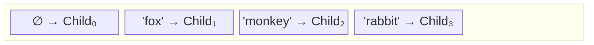
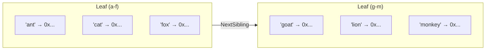
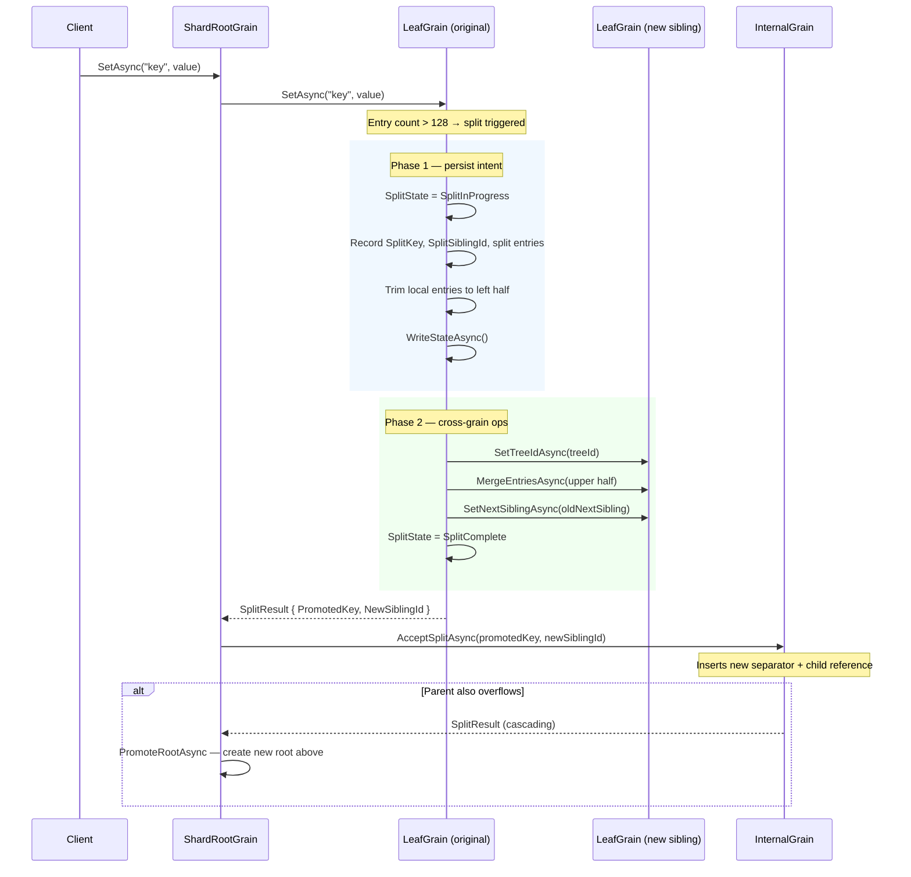

# B+ Tree Structure

## Node Structure

Each shard is a standard B+ tree with a configurable branching factor (default: 128 keys per leaf, 128 children per internal node).

### Internal Nodes

An internal node stores a sorted list of `(SeparatorKey, ChildGrainId)` entries. The first entry always has a `null` separator and acts as the leftmost catch-all:

Routing walks the separator list from right to left and picks the first child whose separator is ≤ the search key:

| Lookup key | Selected child | Reason |
|---|---|---|
| `"ant"` | Child₀ | `"ant"` < `"fox"`, falls through to leftmost |
| `"fox"` | Child₁ | `"fox"` ≥ `"fox"` |
| `"lion"` | Child₁ | Walk from right: `"lion"` < `"rabbit"`, `"lion"` < `"monkey"`, `"lion"` ≥ `"fox"` ✓ → Child₁ |
| `"zebra"` | Child₃ | `"zebra"` ≥ `"rabbit"` |

### Leaf Nodes

Each leaf stores entries in a `SortedDictionary<string, LwwValue<byte[]>>` and maintains `NextSibling` and `PrevSibling` pointers forming a doubly-linked list for forward and reverse range scans:

## Leaf Splits

When a leaf exceeds `MaxLeafKeys` (128) entries after an insert, it splits using a **two-phase** pattern that is crash-safe:

1. **Phase 1 (persist intent):** The leaf finds the **median key**, records the split metadata (`SplitKey`, `SplitSiblingId`, right-half entries) and trims its own entries to the left half — all in a single `WriteStateAsync` call.
2. **Phase 2 (cross-grain ops):** The new sibling is populated via `MergeEntriesAsync` (an idempotent bulk merge), sibling pointers are updated, and `SplitState` advances to `SplitComplete`.
3. A `SplitResult` containing the promoted key and new sibling's `GrainId` is returned up the call stack.
4. The parent internal node inserts the new separator. If *it* overflows, the split cascades further (internal nodes use the same two-phase pattern).
5. If the split reaches the shard root, a new internal root is created above the old one via a two-phase `PromoteRootAsync`, increasing tree depth by one.

**Recovery:** If a grain crashes between Phase 1 and Phase 2, the next call to `SetAsync` detects `SplitState == SplitInProgress` and resumes Phase 2 (`CompleteSplitAsync`). After recovery completes, the caller's write is routed to the correct leaf — locally if the key falls below the split key, or forwarded to the new sibling otherwise. This ensures **no writes are lost** during a crash mid-split.

## Idempotent Split Propagation

`AcceptSplitAsync` on internal nodes checks for duplicate `(separatorKey, childId)` pairs before inserting. If the same split result is delivered twice (e.g. crash recovery, message retry), the duplicate is detected and skipped. Combined with the monotonic `SplitState` on leaf and internal nodes, this makes the entire split protocol idempotent end-to-end.

Internal nodes themselves use the same two-phase split pattern as leaves. If an internal node crashes mid-split, the next `AcceptSplitAsync` call resumes the incomplete split before processing the caller's promotion — routing it to the correct node (locally or to the new sibling) based on the split key.
