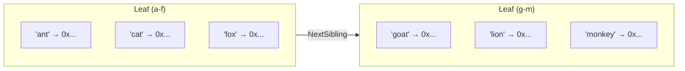
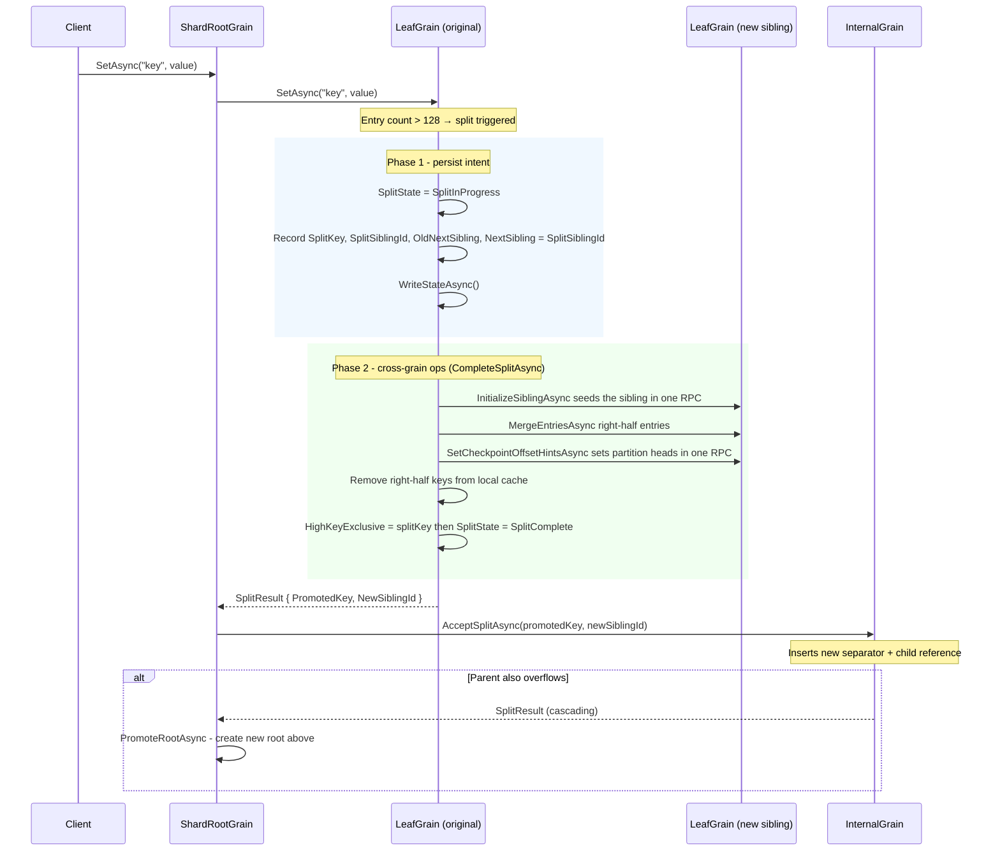
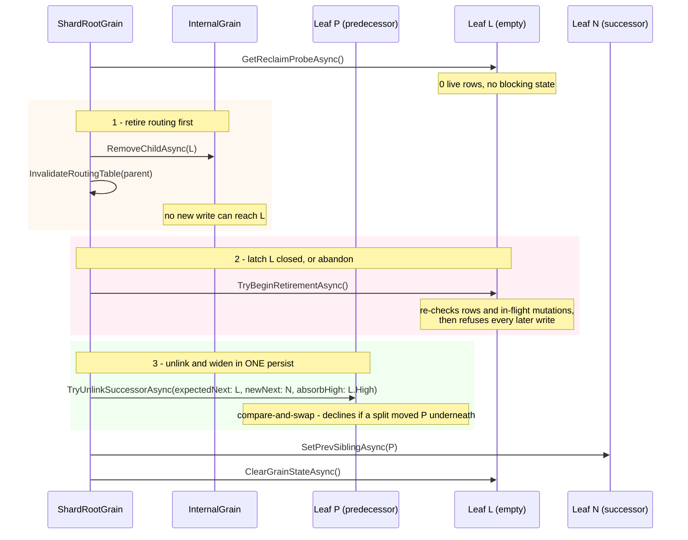

# B+ Tree Structure

## Node Structure

Each shard is a standard B+ tree with a configurable branching factor (default: 128 keys per leaf, 128 children per internal node).

### Internal Nodes

An internal node stores a sorted list of `(SeparatorKey, ChildGrainId)` entries. The first entry always has a `null` separator and acts as the leftmost catch-all:

```mermaid
block-beta
    columns 5
    block:Internal["Internal Node"]
        columns 5
        NULL["∅ → Child₀"]
        SEP1["'fox' → Child₁"]
        SEP2["'monkey' → Child₂"]
        SEP3["'rabbit' → Child₃"]
        space
    end
```

Routing walks the separator list from right to left and picks the first child whose separator is ≤ the search key:

| Lookup key | Selected child | Reason |
|---|---|---|
| `"ant"` | Child₀ | `"ant"` < `"fox"`, falls through to leftmost |
| `"fox"` | Child₁ | `"fox"` ≥ `"fox"` |
| `"lion"` | Child₁ | Walk from right: `"lion"` < `"rabbit"`, `"lion"` < `"monkey"`, `"lion"` ≥ `"fox"` ✓ → Child₁ |
| `"zebra"` | Child₃ | `"zebra"` ≥ `"rabbit"` |

### Leaf Nodes

Each leaf grain holds its live entries in a per-activation in-memory cache (a `SortedDictionary<string, LwwValue<byte[]>>` rebuilt from the WAL on activation; not part of the persisted leaf state row). Every leaf also maintains `NextSibling` and `PrevSibling` pointers forming a doubly-linked list for forward and reverse range scans:

```mermaid
flowchart LR
    subgraph Leaf1["Leaf (a-f)"]
        E1["'ant' → 0x..."]
        E2["'cat' → 0x..."]
        E3["'fox' → 0x..."]
    end

    subgraph Leaf2["Leaf (g-m)"]
        E4["'goat' → 0x..."]
        E5["'lion' → 0x..."]
        E6["'monkey' → 0x..."]
    end

    Leaf1 -- "NextSibling" --> Leaf2
```

## Leaf Splits

When a leaf exceeds `MaxLeafKeys` (128) entries after an insert, it splits using a **two-phase** pattern that is crash-safe:

```mermaid
sequenceDiagram
    participant Client
    participant Root as ShardRootGrain
    participant Leaf as LeafGrain (original)
    participant New as LeafGrain (new sibling)
    participant Parent as InternalGrain

    Client->>Root: SetAsync("key", value)
    Root->>Leaf: SetAsync("key", value)

    Note over Leaf: Entry count > 128 → split triggered

    rect rgb(240, 248, 255)
    Note over Leaf: Phase 1 - persist intent
    Leaf->>Leaf: SplitState = SplitInProgress
    Leaf->>Leaf: Record SplitKey, SplitSiblingId, OldNextSibling, NextSibling = SplitSiblingId
    Leaf->>Leaf: WriteStateAsync()
    end

    rect rgb(240, 255, 240)
    Note over Leaf: Phase 2 - cross-grain ops (CompleteSplitAsync)
    Leaf->>New: InitializeSiblingAsync seeds the sibling in one RPC
    Leaf->>New: MergeEntriesAsync right-half entries
    Leaf->>New: SetCheckpointOffsetHintsAsync sets partition heads in one RPC
    Leaf->>Leaf: Remove right-half keys from local cache
    Leaf->>Leaf: HighKeyExclusive = splitKey then SplitState = SplitComplete
    end

    Leaf-->>Root: SplitResult { PromotedKey, NewSiblingId }
    Root->>Parent: AcceptSplitAsync(promotedKey, newSiblingId)

    Note over Parent: Inserts new separator + child reference

    alt Parent also overflows
        Parent-->>Root: SplitResult (cascading)
        Root->>Root: PromoteRootAsync - create new root above
    end
```

1. **Phase 1 (persist intent):** The leaf picks the **median key** from its in-memory cache, allocates the new sibling's `GrainId`, and persists the split metadata (`SplitState = SplitInProgress`, `SplitKey`, `SplitSiblingId`, `OldNextSibling`, and `NextSibling` redirected to the new sibling) in a single `WriteStateAsync` call. The donor's own key-range is *not* trimmed in Phase 1 - the right-half entries remain in the cache until Phase 2.
2. **Phase 2 (cross-grain ops, `CompleteSplitAsync`):** The donor seeds every birth-time metadata slot on the new sibling - tree id, shard index, ownership key range, and the next/prev sibling pointers - in a single `InitializeSiblingAsync` round-trip (one gate acquire and one `WriteStateAsync` on the sibling, replacing the five separate gated setter RPCs the donor used to issue serially). It then populates the sibling via `MergeEntriesAsync` (an idempotent bulk merge of every key `>= splitKey`), applies the per-partition projection-checkpoint hints in a single `SetCheckpointOffsetHintsAsync` round-trip (replacing the per-WAL-partition fan-out), removes the right-half keys from its local cache, advances its own `HighKeyExclusive` to the split key, and transitions `SplitState` to `SplitComplete`. The per-partition WAL-head capture that feeds the checkpoint hints is fanned out in parallel across the independent replay-coordinator grains rather than read serially. `InitializeSiblingAsync` keeps the same idempotent semantics as the individual setters - the write-once slots (tree id, shard index, key-range low bound) are skipped when already seeded - so a crash-recovery re-call against a partially seeded sibling is safe.
3. A `SplitResult` containing the promoted key and new sibling's `GrainId` is returned up the call stack.
4. The parent internal node inserts the new separator. If *it* overflows, the split cascades further (internal nodes use the same two-phase pattern).
5. If the split reaches the shard root, a new internal root is created above the old one via a two-phase `PromoteRootAsync`, increasing tree depth by one.

**Recovery:** If a grain crashes between Phase 1 and Phase 2, the next call to `SetAsync` detects `SplitState == SplitInProgress` and resumes Phase 2 (`CompleteSplitAsync`). After recovery completes, the caller's write is routed to the correct leaf - locally if the key falls below the split key, or forwarded to the new sibling otherwise. This ensures **no writes are lost** during a crash mid-split.

## Idempotent Split Propagation

`AcceptSplitAsync` on internal nodes checks for duplicate `(separatorKey, childId)` pairs before inserting. If the same split result is delivered twice (e.g. crash recovery, message retry), the duplicate is detected and skipped. Combined with the monotonic `SplitState` on leaf and internal nodes, this makes the entire split protocol idempotent end-to-end.

Internal nodes themselves use the same two-phase split pattern as leaves. If an internal node crashes mid-split, the next `AcceptSplitAsync` call resumes the incomplete split before processing the caller's promotion - routing it to the correct node (locally or to the new sibling) based on the split key.

## Empty Leaf Reclaim

Splitting is the only direction the tree had for a long time. A leaf was allocated whenever a key range grew past `MaxLeafKeys`, and nothing ever took one back when the range shrank again. A range that grew to a thousand leaves and was then emptied kept all thousand: each an activation to schedule, a state row to store, and a hop in every range scan that crosses it. The cost was paid in proportion to the **high-water mark** of the range rather than to the rows that are actually live, and it never subsided.

`ReclaimEmptyLeavesAsync` on the shard root walks the sibling chain and folds out leaves that hold no live rows. It is deliberately conservative:

- It **moves no data.** The only leaf it ever touches is one with zero live rows, so there is no migration window in which a row exists in two places or in neither.
- The **head leaf is never folded.** It owns everything below the tree's first separator and has no predecessor to inherit that range, so a fully emptied tree still retains exactly one leaf to route to.
- A leaf is skipped when it carries state that must outlive its rows: an in-progress split, a sticky moved-away seal, a prepared cross-shard saga bucket, or a destination-side shadow marker.
- Each pass is **bounded** by a caller-supplied leaf count and an internal walk ceiling, so it cannot hold an activation turn open on a degenerate chain, and it is re-driven rather than run to completion. A pass that stops on its budget records where it stopped and the next pass resumes from there, so a long chain is drained across passes instead of being re-walked from the head each time.

### Fold ordering

The ordering is the whole of the safety argument. The WAL materialiser filters records by exactly the span each leaf declares it owns, so two leaves claiming overlapping spans would materialise the same record twice, and a range routed to a leaf whose span excludes it loses writes on the next projection rebuild.

```mermaid
sequenceDiagram
    participant Root as ShardRootGrain
    participant Parent as InternalGrain
    participant Prev as Leaf P (predecessor)
    participant Leaf as Leaf L (empty)
    participant Next as Leaf N (successor)

    Root->>Leaf: GetReclaimProbeAsync()
    Note over Leaf: 0 live rows, no blocking state

    rect rgb(255, 248, 240)
    Note over Root,Parent: 1 - retire routing first
    Root->>Parent: RemoveChildAsync(L)
    Root->>Root: InvalidateRoutingTable(parent)
    Note over Parent: no new write can reach L
    end

    rect rgb(255, 240, 245)
    Note over Root,Leaf: 2 - latch L closed, or abandon
    Root->>Leaf: TryBeginRetirementAsync()
    Note over Leaf: re-checks rows and in-flight mutations,<br/>then refuses every later write
    end

    rect rgb(240, 255, 240)
    Note over Root,Prev: 3 - unlink and widen in ONE persist
    Root->>Prev: TryUnlinkSuccessorAsync(expectedNext: L, newNext: N, absorbHigh: L.High)
    Note over Prev: compare-and-swap - declines if a split moved P underneath
    end

    Root->>Next: SetPrevSiblingAsync(P)
    Root->>Leaf: ClearGrainStateAsync()
```

1. **Retire routing first.** Removing the separator from the parent means no new write can reach `L`. Widening `P` first would instead let a write route to `L` while `P` also claimed the range - a permanent duplicate that never self-heals, because `L` is no longer empty and so is never reclaimed again.
2. **Latch `L` closed before anything destructive.** The probe in the first line of the diagram is several round trips old by now, and the leaf mutation surface interleaves, so a write could have been routed, logged and **acknowledged** in between. `TryBeginRetirementAsync` re-checks the row count and the in-flight mutation count and then latches the leaf so that every later write is refused. Retiring is decided here, before the fold is destructive, rather than at the clear: a leaf that is discovered non-empty only after being unlinked is unreachable, which loses the same rows by another route. The latch lives in the activation, not in persisted state, so an activation that dies mid-fold reopens the leaf rather than sealing it permanently.
3. **Unlink and widen together.** `P` takes over both the chain link and the vacated range in a single persist. Split into two writes there is a window in which `P` routes a range its own replay filter rejects, so a write landing in that window survives in cache and vanishes on the next rebuild.
4. **Clear last.** `L` is unreachable by routing and by the chain, and provably still empty, before any state is destroyed.

A fold that gives up at step 2 or step 3 **undoes step 1** before returning: it reopens the leaf and reinstates the separator it removed. Leaving routing retired would hand the span to nobody - a write would route to a neighbour whose replay filter rejects the key, so it would live in that neighbour's cache and vanish on the next rebuild. The gap is invisible to the chain-based repair below, because the chain still tiles the keyspace perfectly; only routing has the hole. Compensation restores the separator rather than widening a neighbour onto the span, because `L` is still chained and still declares that span, and two leaves declaring one span would both materialise its records.

Between steps 1 and 3 the tree is in a **self-healing** intermediate state: the range routes to `P` but `P` still declares the narrower span. A fold interrupted by a crash - the one case where compensation cannot run - is finished by the next pass rather than left half-done, and it is worth being precise about how, because it is not the range-gap repair below. The chain still tiles the keyspace perfectly in that state, so there is no gap for that repair to find; the hole is only in routing. Instead the next pass resolves routing on the leaf's own low bound, sees it land on some other leaf, and recognises that as the fingerprint of a fold that retired routing and stopped. It then completes that fold rather than starting a new one. Every step is idempotent and the range widen is monotonic, so re-driving converges.

A crash after step 3 but before step 4 leaves the leaf unrouted, unlinked and empty: unreachable, but harmless, since the predecessor already owns its range and it holds nothing. It is a leaked state row rather than a correctness problem.

### Why the unlink is a compare-and-swap

Reclaim is a multi-grain sequence while the split gate is per-grain, so reclaim and split are **not** serialised with respect to each other. A split of `P` can land between the shard root reading `P`'s sibling pointer and writing it. That split inserts a new leaf `S` between `P` and `L`, and moves live rows into it. An unconditional write of the pointer the reclaim had planned would set `P.NextSibling` past `S` entirely, unlinking a leaf that holds rows which were live throughout - silent data loss caused by the reclaim path, in the growth direction.

`TryUnlinkSuccessorAsync` therefore verifies that `P` still points at the leaf being folded before writing anything, and declines otherwise. A declined fold reopens `L` and reinstates its separator, so the leaf is routed, chained and writable again exactly as it was before the pass touched it, and the next pass retries it once the topology has settled. Declining is safe where corrupting is not, and reclaim is background work that will be re-driven anyway.

### How fast a shard actually heals

Reclaim is bounded twice over, and the two bounds compose into a healing rate rather than a repair that completes. Each pass folds at most `CompactionLeafBatchSize` leaves (64 by default) and walks a bounded number of leaves to find them, and the pass is driven by the compaction reminder, which fires every `TombstoneGracePeriod` (one hour by default). A shard therefore sheds on the order of 64 leaves an hour, so a range that grew to several thousand leaves and was then emptied takes **days** to give that space back, not minutes.

That is the intended trade - a pass holds the shard root's activation turn while it runs, so a pass large enough to drain a degenerate chain in one go would block every read and write on that shard for as long as it took. It does mean the cost recovery described at the top of this section is asymptotic: scan cost falls steadily once a range empties, but a host that has just deleted a very large range should not expect the leaf count to drop promptly. Nothing else drives reclaim by default, because `MinTombstoneRatioForCompaction` is `0.0` and `MaxLeafEntriesBeforeForcedCompaction` is `0` in a default-configured host, leaving the periodic reminder as the only trigger. Raise `CompactionLeafBatchSize` to trade turn latency for a faster recovery.

The resume position lives in the shard root's activation rather than in its persisted state, so it is lost when the activation recycles and the next pass restarts from the leftmost leaf. This is correctness-neutral - the cursor only decides where a pass begins, never what it is willing to fold - and it is self-limiting in the ordinary case, because a folded leaf leaves the chain and so is not re-walked. It has one known bound: on a shard whose first `MaxLeafReclaimWalk` leaves hold live rows, a pass that always restarts from the leftmost leaf never reaches the candidates beyond them, so a very large sparse shard that recycles its activation faster than it drains will not heal. A persisted cursor would fix it at the cost of a shard-root state change; that trade has not been taken.

