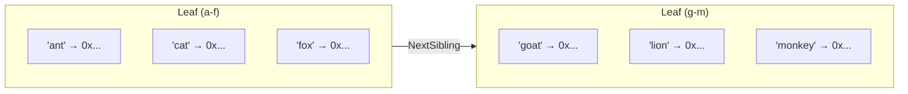
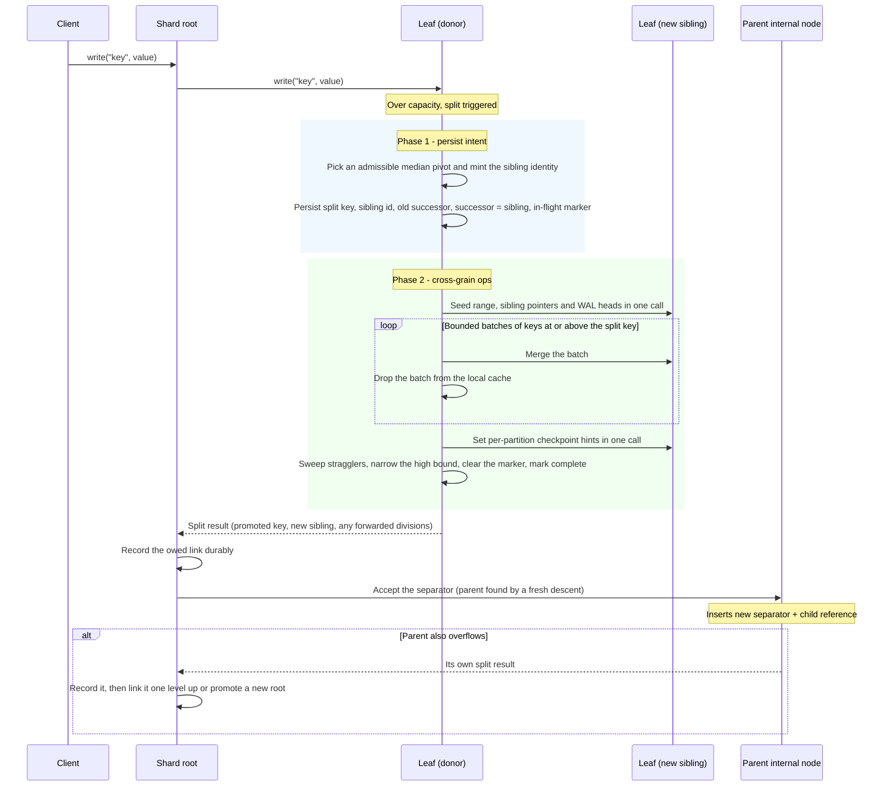
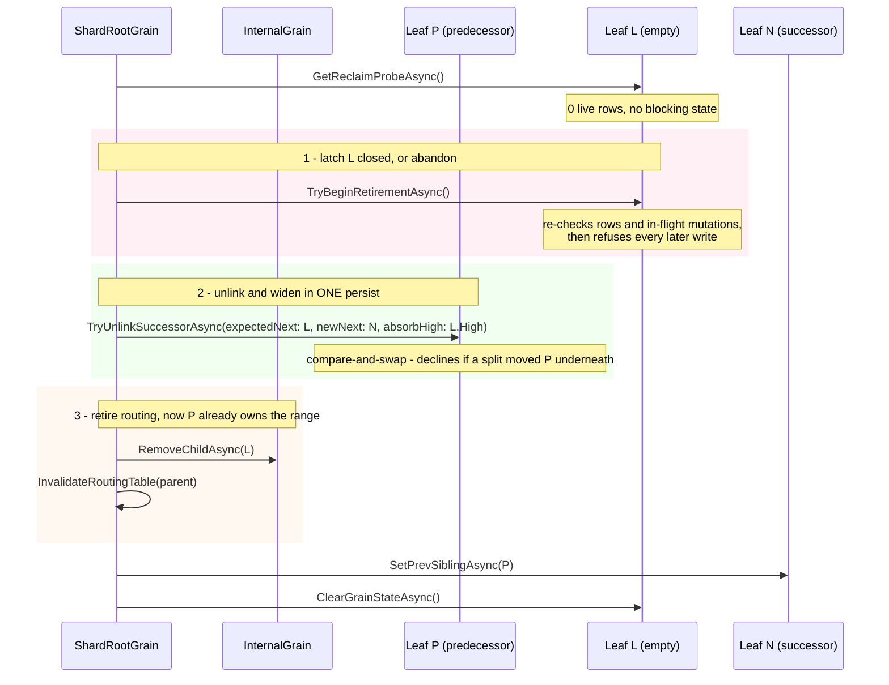

# B+ Tree Structure

## Node Structure

Each shard is a standard B+ tree with a configurable branching factor (default: 128 keys per leaf, 128 children per internal node).

### Internal Nodes

An internal node stores a sorted list of `(SeparatorKey, ChildId)` entries. The first entry always has a `null` separator and acts as the leftmost catch-all:

```mermaid
block-beta
    columns 5
    block:Internal["Internal Node"]
        columns 5
        NULL["∅ → Child₀"]
        SEP1["'fox' → Child₁"]
        SEP2["'monkey' → Child₂"]
        SEP3["'rabbit' → Child₃"]
        space
    end
```

Routing walks the separator list from right to left and picks the first child whose separator is ≤ the search key:

| Lookup key | Selected child | Reason |
|---|---|---|
| `"ant"` | Child₀ | `"ant"` < `"fox"`, falls through to leftmost |
| `"fox"` | Child₁ | `"fox"` ≥ `"fox"` |
| `"lion"` | Child₁ | Walk from right: `"lion"` < `"rabbit"`, `"lion"` < `"monkey"`, `"lion"` ≥ `"fox"` ✓ → Child₁ |
| `"zebra"` | Child₃ | `"zebra"` ≥ `"rabbit"` |

### Leaf Nodes

Each leaf grain holds its live entries in a per-activation in-memory cache - a sorted map from each key to its last-writer-wins entry - that is not part of the persisted leaf state row. On activation the cache is rebuilt from the leaf's persisted snapshot when that snapshot is newer than the leaf's checkpoint, followed by a replay of the WAL beyond it; with no usable snapshot the leaf replays the whole readable WAL window, filtered to its own key range (see [Projection Rebuild](projection-rebuild.md)). Every leaf also maintains next- and previous-sibling pointers forming a doubly-linked list for forward and reverse range scans:

```mermaid
flowchart LR
    subgraph Leaf1["Leaf (a-f)"]
        E1["'ant' → 0x..."]
        E2["'cat' → 0x..."]
        E3["'fox' → 0x..."]
    end

    subgraph Leaf2["Leaf (g-m)"]
        E4["'goat' → 0x..."]
        E5["'lion' → 0x..."]
        E6["'monkey' → 0x..."]
    end

    Leaf1 -- "NextSibling" --> Leaf2
```

## Leaf Splits

When a leaf holds more than `MaxLeafKeys` (128 by default) entries after a write, or - while it holds at least two entries - its keys and values together exceed `LatticeOptions.MaxLeafBytes` (64 MiB by default), it splits using a **two-phase** pattern that is crash-safe. A leaf found over the byte bound when its snapshot is next captured is divided then, even if it takes no further writes.

```mermaid
sequenceDiagram
    participant Client
    participant Root as Shard root
    participant Leaf as Leaf (donor)
    participant New as Leaf (new sibling)
    participant Parent as Parent internal node

    Client->>Root: write("key", value)
    Root->>Leaf: write("key", value)

    Note over Leaf: Over capacity, split triggered

    rect rgb(240, 248, 255)
    Note over Leaf: Phase 1 - persist intent
    Leaf->>Leaf: Pick an admissible median pivot and mint the sibling identity
    Leaf->>Leaf: Persist split key, sibling id, old successor, successor = sibling, in-flight marker
    end

    rect rgb(240, 255, 240)
    Note over Leaf: Phase 2 - cross-grain ops
    Leaf->>New: Seed range, sibling pointers and WAL heads in one call
    loop Bounded batches of keys at or above the split key
        Leaf->>New: Merge the batch
        Leaf->>Leaf: Drop the batch from the local cache
    end
    Leaf->>New: Set per-partition checkpoint hints in one call
    Leaf->>Leaf: Sweep stragglers, narrow the high bound, clear the marker, mark complete
    end

    Leaf-->>Root: Split result (promoted key, new sibling, any forwarded divisions)
    Root->>Root: Record the owed link durably
    Root->>Parent: Accept the separator (parent found by a fresh descent)

    Note over Parent: Inserts new separator + child reference

    alt Parent also overflows
        Parent-->>Root: Its own split result
        Root->>Root: Record it, then link it one level up or promote a new root
    end
```

1. **Phase 1 (persist intent):** The leaf picks the **median key** as its pivot, read from the leaf's ordinal index without materialising any payload whenever its cached frame allows. Each half must own part of the leaf's declared range, so a pivot outside that range is replaced by another admissible key, and the split is declined (and counted) when there is none. The leaf allocates the new sibling's `GrainId`, captures the head of every WAL partition in parallel, and persists the split intent - the split key, the sibling's identity, its current successor, its successor pointer redirected to the sibling, and a durable in-flight marker - in a single state write. The donor's own key-range is *not* trimmed in Phase 1 - the right-half entries remain in the cache until Phase 2. The in-flight marker is what recovery keys on: the split lifecycle state only ever advances, so a leaf that has completed one split reports complete from then on and could not otherwise tell a later interrupted division from a finished one (issue [#3265](https://github.com/NSTA1/Orleans.Lattice/issues/3265)).
2. **Phase 2 (cross-grain ops):** The donor seeds every birth-time slot on the new sibling - tree id, shard index, the ownership range `[splitKey, donor's old high bound)`, the next/previous sibling pointers, any moved-away slot seal, and the WAL heads the sibling's materialiser pin starts from - in a single round-trip, while repointing its old successor's previous-sibling pointer at the sibling in parallel. It then moves every key `>= splitKey` across in bounded batches through an idempotent last-writer-wins merge, dropping each batch from its own cache before reading the next (a row that a concurrent write changed mid-transfer stays behind rather than being discarded), stamps the sibling's per-partition projection-checkpoint hints in a single round-trip, and sweeps again for rows written at or above the split key while the batches were moving. Only when that sweep finds nothing does it narrow its own high bound to the split key, clear the in-flight marker and mark the split complete, in one synchronous step, before advancing its own checkpoints to the captured WAL heads. The sibling's write-once slots (tree id, shard index, key-range low bound) are skipped when already seeded, so a crash-recovery re-run against a partially completed split is safe.
3. The leaf returns a split result carrying the promoted key and the new sibling's `GrainId`. A write the leaf forwarded to a neighbour - because it arrived mid-split, or fell outside the leaf's declared span (see [Span Admission](#span-admission)) - can divide that neighbour too, and every such division is carried back in the same result rather than discarded, because only the shard root can link it (issue [#3523](https://github.com/NSTA1/Orleans.Lattice/issues/3523)).
4. **The shard root links every division from a durable record.** Before it asks any parent to accept a separator, the shard root records the link it owes in its own persisted state, and it retires the record only once the separator has landed. A link interrupted part-way is replayed at the start of the shard root's next operation, and the parent's duplicate detection (below) makes the replay safe. Links are delivered one at a time per shard, each by a fresh descent from the current root that bypasses the routing cache, rather than along the path captured on the way down: a concurrent batch write can split a node on that path or promote the root in the meantime, and a separator delivered to a parent whose range no longer covers it would be accepted and routed to by nothing.
5. The parent internal node inserts the new separator. If *it* overflows, it splits in turn (internal nodes use the same two-phase pattern), and the shard root records that division and links it one level up before any other link still owed at the lower level.
6. If the division is of the root itself, the shard root creates a new internal root above the old one via a two-phase root promotion - persist the intent, then create the root under a deterministic identity - increasing tree depth by one.

**Recovery:** If a leaf crashes between Phase 1 and Phase 2, its next write detects the durable in-flight marker and resumes Phase 2, and a further split attempt resumes the same division rather than minting a second sibling. After recovery completes, the caller's write is routed to the correct leaf - locally if the key falls below the split key, or forwarded to the new sibling otherwise - and any split that write causes is returned alongside the recovered one. This ensures **no writes are lost** during a crash mid-split.

## Idempotent Split Propagation

An internal node checks each separator it is asked to accept for a duplicate `(separatorKey, childId)` pair before inserting it. If the same split result is delivered twice (e.g. a replayed pending link, crash recovery, message retry), the duplicate is detected and skipped. Combined with the durable in-flight marker on leaves, and its internal-node counterpart (the right half of an unfinished split, recorded beside the intent and cleared on completion), which make an interrupted division resume rather than re-mint, this makes the entire split protocol idempotent end-to-end.

Internal nodes themselves use the same two-phase split pattern as leaves. If an internal node crashes mid-split, the next `AcceptSplitAsync` call resumes the incomplete split before processing the caller's promotion - routing it to the correct node (locally or to the new sibling) based on the split key.

## Span Admission

Every leaf that has been split declares the keyspace it owns as a half-open span, `[LowKeyInclusive, HighKeyExclusive)`. Routing is what normally delivers a key to the leaf that declares it, but routing is a snapshot: a write or a merge batch can be resolved against the routing table just before a concurrent split or fold moves the boundary, and arrive at a leaf that no longer declares the key. **Span admission** is the leaf's own defence against that. Before committing a key, a leaf checks it against its declared span; a key outside the span is forwarded to the neighbouring leaf on the key's side (`NextSibling` for a key at or above the high bound, `PrevSibling` for one below the low bound), and that leaf applies the same check. Forwarding is per key, so a batch that straddles a boundary is split into per-leaf sub-batches rather than rejected.

The shard root narrows how often a leaf has to forward at all. A `MergeManyAsync` batch is grouped by leaf once, up front, and each group is normally dispatched to the leaf its first key routed to. When the shard root's routing has moved since the batch was grouped - it bumps a local routing generation whenever it invalidates its cached routing table or promotes a new root - or when a group is being retried, the group is re-routed key by key and split into fresh per-leaf groups before it is merged, so a split that landed mid-batch does not turn the rest of the group into leaf-to-leaf forwards. The check is one local read on the normal path: a first attempt with unchanged routing takes no extra lookup and no extra allocation.

### Fail-open

When an out-of-span key has nowhere to go - the pointer on the key's side is null, or names the leaf itself - the leaf **fails open**: it commits the key locally rather than refusing the write. This is deliberate, and it is not free. Replay admits by declared span (see [Why routing is retired last](#why-routing-is-retired-last)), so a row committed outside its leaf's span is one that leaf will not reinstate on its own rebuild; whether it survives a cold restart depends on the checkpoint position of the leaf that does declare it. A fail-open is therefore the shape that precedes a silent loss, and it is counted:

- **`orleans.lattice.leaf.span_fail_open_commits`** advances once per key committed this way, tagged `tree`, `reason` (`no_sibling` or `self_reference`) and `origin` (`client_write`, `merge`, or `cross_shard_migration`), and the leaf logs a warning naming itself and its tree, rate-limited to one line per silo every ten seconds. The `origin` tag separates a deliberate cross-shard migration graft from an accidental fall-back on the foreground or merge path. See [Metrics](metrics.md).
- A healthy tree never advances it, so the series is not pre-minted: an absent series is the healthy reading, and any non-zero value is worth investigating. The behaviour itself is unchanged - the counter makes the fall-back visible; it does not refuse the write.

### Bulk-loaded leaves declare no span

A leaf built by `BulkLoadAsync`, like the single leaf of a tree that has never split, declares **no span at all**: both bounds are null, so it owns every key, never forwards, and never advances the fail-open counter. Giving bulk-loaded leaves a real span is a **breaking change**, not a tidy-up. The span a leaf declares is also the filter its replay applies, so assigning bounds to an existing bulk-loaded leaf would silently drop every row it holds outside the new bounds on the next rebuild. Any change that assigns spans to bulk-loaded leaves must therefore land together with the fail-open counter above, so that the rows it would strand are visible before they are lost.

## Empty Leaf Reclaim

Splitting is the only direction the tree had for a long time. A leaf was allocated whenever a key range grew past `MaxLeafKeys`, and nothing ever took one back when the range shrank again. A range that grew to a thousand leaves and was then emptied kept all thousand: each an activation to schedule, a state row to store, and a hop in every range scan that crosses it. The cost was paid in proportion to the **high-water mark** of the range rather than to the rows that are actually live, and it never subsided.

`ReclaimEmptyLeavesAsync` on the shard root walks the sibling chain and folds out leaves that hold no live rows. It is deliberately conservative:

- It **moves no data.** The only leaf it ever touches is one with zero live rows, so there is no migration window in which a row exists in two places or in neither.
- The **head leaf is never folded.** It owns everything below the tree's first separator and has no predecessor to inherit that range, so a fully emptied tree still retains exactly one leaf to route to.
- A leaf is skipped when it carries state that must outlive its rows: an in-progress split, a sticky moved-away seal, a prepared cross-shard saga bucket, or a destination-side shadow marker.
- Each pass is **bounded** by a caller-supplied leaf count and an internal walk ceiling, so it cannot hold an activation turn open on a degenerate chain, and it is re-driven rather than run to completion. A pass that stops on its budget records where it stopped and the next pass resumes from there, so a long chain is drained across passes instead of being re-walked from the head each time.

### Fold ordering

The ordering is the whole of the safety argument. The WAL materialiser filters records by exactly the span each leaf declares it owns, so two leaves claiming overlapping spans would materialise the same record twice, and a range routed to a leaf whose span excludes it loses writes on the next projection rebuild.

```mermaid
sequenceDiagram
    participant Root as ShardRootGrain
    participant Parent as InternalGrain
    participant Prev as Leaf P (predecessor)
    participant Leaf as Leaf L (empty)
    participant Next as Leaf N (successor)

    Root->>Leaf: GetReclaimProbeAsync()
    Note over Leaf: 0 live rows, no blocking state

    rect rgb(255, 240, 245)
    Note over Root,Leaf: 1 - latch L closed, or abandon
    Root->>Leaf: TryBeginRetirementAsync()
    Note over Leaf: re-checks rows and in-flight mutations,<br/>then refuses every later write
    end

    rect rgb(240, 255, 240)
    Note over Root,Prev: 2 - unlink and widen in ONE persist
    Root->>Prev: TryUnlinkSuccessorAsync(expectedNext: L, newNext: N, absorbHigh: L.High)
    Note over Prev: compare-and-swap - declines if a split moved P underneath
    end

    rect rgb(255, 248, 240)
    Note over Root,Parent: 3 - retire routing, now P already owns the range
    Root->>Parent: RemoveChildAsync(L)
    Root->>Root: InvalidateRoutingTable(parent)
    end

    Root->>Next: SetPrevSiblingAsync(P)
    Root->>Leaf: ClearGrainStateAsync()
```

1. **Latch `L` closed before anything else.** The probe in the first line of the diagram is several round trips old by now, and the leaf mutation surface interleaves, so a write could have been routed, logged and **acknowledged** in between. `TryBeginRetirementAsync` re-checks the row count and the in-flight mutation count and then latches the leaf so that every later write is refused. Retiring is decided here, before the fold is destructive, rather than at the clear: a leaf that is discovered non-empty only after being unlinked is unreachable, which loses the same rows by another route. The latch lives in the activation, not in persisted state, so an activation that dies mid-fold reopens the leaf rather than sealing it permanently.
2. **Unlink and widen together.** `P` takes over both the chain link and the vacated range in a single persist. Split into two writes there is a window in which `P` routes a range its own replay filter rejects, so a write landing in that window survives in cache and vanishes on the next rebuild.
3. **Retire routing last.** `P` already declares the range before anything stops routing to `L`, so there is never a moment when a routed leaf does not declare the span being sent to it.
4. **Clear last.** `L` is unreachable by routing and by the chain, and provably still empty, before any state is destroyed.

Steps 1 and 2 are the only ones that can decline, and neither has mutated anything when it does, so **a fold that gives up has nothing to compensate**: it unlatches the leaf and returns, and the tree is exactly as the pass found it.

#### Why routing is retired last

This ordering is load-bearing, and it is the reverse of the one the fold originally used. **It is the same order the split path has always used**, and that is the clearest way to see that it is right rather than merely defensible. A split widens the receiver before narrowing the giver: `InitializeSiblingAsync` sets the new sibling's span to `[splitKey, donorPreSplitHigh)`, `MergeEntriesAsync` moves the rows, and only then does the donor narrow its own `HighKeyExclusive` to `splitKey`. Its transient state is therefore an **overlap**, never a gap. The fold now does the same thing in the shrink direction: the predecessor takes the range before the leaf gives it up. "Retire routing first" was the outlier, not the rule.

The reason a gap is not survivable is that the two admission rules disagree about what a leaf owns:

- the **write path** admits by **routing** - a leaf writes whatever the shard root sent it, and [span admission](#span-admission) can only forward an out-of-span key to a neighbour, failing open when there is none;
- **WAL replay** admits by **declared span** - `ShouldApplyDuringReplay` drops any record outside the leaf's own `[low, high)`.

So any interval in which routing resolves a key to a leaf whose declared span does not cover it is a **silent-loss window**: the write is appended to the log, merged into the projection and acknowledged, and is then filtered out the moment that projection is rebuilt. Durable, readable, and gone on restart.

Retiring routing first opened exactly such a window. The range immediately re-resolved to `P`, but `P` did not declare it until the compare-and-swap landed one or more round trips later. Doing it last closes the window by construction.

The reason the old order looked necessary is that widening `P` while `L` is still routed leaves two leaves claiming one range, and a write reaching `L` there would be a permanent duplicate - `L` would no longer be empty, so it would never be reclaimed again. **The latch is what voids that**: `L` is frozen and refusing writes before the widen, so it cannot accept the write that argument was about. What is left is a transient overlap between steps 2 and 3, in which `P` and an empty, latched `L` both declare the range - the same shape of transient the split path has always carried, and here it cannot even cost a double materialisation, because `L` holds nothing to materialise.

The residual is a write arriving in that same window. It routes to `L`, which is latched, so it is **refused and retried** rather than lost. The retry backs off briefly on this specific exception, because the condition clears in two grain calls and an immediate retry would spend all its attempts inside the window it is waiting out; with the delay the write simply lands. A failure the caller sees would still be categorically better than a success the caller is later robbed of, but it does not normally come to that.

A crash between steps 2 and 3 leaves the tree in a **self-healing** state: `P` owns the range and the chain has already skipped `L`, but `L` is still routed. Writes to it are refused only until its activation recycles, and the next pass resolves routing on the leaf's own low bound, sees it land elsewhere, recognises the fingerprint of an interrupted fold, and finishes it. Every step is idempotent and the range widen is monotonic, so re-driving converges. Note this is **not** the chain-based range-gap repair below: the chain tiles perfectly in that state, so that repair has nothing to find.

A crash after step 3 but before step 4 leaves the leaf unrouted, unlinked and empty: unreachable, and harmless to correctness, since the predecessor already owns its range and it holds nothing. It is not harmless to storage, though: the leaf's state row, and the WAL materialiser pin it publishes, survive until the clear lands, and nothing walking the chain or the routing can ever find the leaf again. So the fold records the leaf durably on the shard root (`ShardRootState.PendingLeafClears`) **before** it attempts the clear, and removes it from that record only once the clear has succeeded. A clear that fails, or never runs, is re-attempted at the start of every later reclaim pass and every orphan repair on the shard, oldest first and at most 64 per pass, until it lands (issue [#2207](https://github.com/NSTA1/Orleans.Lattice/issues/2207)). The retry is idempotent - clearing an already-cleared leaf is harmless - so a record that outlives its clear through a crash costs one redundant call, not a lost clear. A shard that has shrunk to a single leaf still retries what it owes; it just has nothing to fold. A tree purge also clears every leaf in the record before it drops the shard row that holds it - see [Tree Deletion](tree-deletion.md#phase-3-purge).

### Why the unlink is a compare-and-swap

Reclaim is a multi-grain sequence while the split gate is per-grain, so reclaim and split are **not** serialised with respect to each other. A split of `P` can land between the shard root reading `P`'s sibling pointer and writing it. That split inserts a new leaf `S` between `P` and `L`, and moves live rows into it. An unconditional write of the pointer the reclaim had planned would set `P.NextSibling` past `S` entirely, unlinking a leaf that holds rows which were live throughout - silent data loss caused by the reclaim path, in the growth direction.

`TryUnlinkSuccessorAsync` therefore verifies that `P` still points at the leaf being folded before writing anything, and declines otherwise. A declined fold unlatches `L` and returns, so the leaf is routed, chained and writable again exactly as it was before the pass touched it - routing was never retired - and the next pass retries it once the topology has settled. Declining is safe where corrupting is not, and reclaim is background work that will be re-driven anyway.

### How fast a shard actually heals

Reclaim is bounded three times over, and the bounds compose into a healing rate rather than a repair that completes. Each pass folds at most `CompactionLeafBatchSize` leaves (64 by default), walks a bounded number of leaves to find them, and stops when it has spent `BackgroundDrainMaxDuration` (10 seconds by default) regardless of how far the leaf bounds would have let it go. The pass is driven by the compaction reminder, which fires every `TombstoneGracePeriod` (24 hours by default, floored at one minute). A shard therefore sheds on the order of 64 leaves per reminder period - 64 a day at the default - so a range that grew to several thousand leaves and was then emptied takes **weeks** to give that space back at the default cadence, not minutes.

The wall-clock bound is the one that decides how long user traffic waits, and it is the only one that can. The leaf bounds count probes, and the cost of a probe is not a constant: the same 1024-probe budget is a fraction of a second against warm activations and, on a cold shard rehydrating each leaf from storage, minutes. A pass has been observed in the field holding a shard root for **59.2 seconds** with a scan enqueued behind it, which no probe budget can prevent without also crippling the warm case it was tuned for. A clock measures the quantity that actually matters. It also fails safe in the direction that matters: set `BackgroundDrainMaxDuration` to `TimeSpan.Zero` and the bound is disabled, restoring the leaf-bounded walk rather than truncating a pass to nothing.

That is the intended trade - a pass holds the shard root's activation turn while it runs, so a pass large enough to drain a degenerate chain in one go would block every read and write on that shard for as long as it took. It does mean the cost recovery described at the top of this section is asymptotic: scan cost falls steadily once a range empties, but a host that has just deleted a very large range should not expect the leaf count to drop promptly. Nothing else drives reclaim by default, because `MinTombstoneRatioForCompaction` is `0.0` and `MaxLeafEntriesBeforeForcedCompaction` is `0` in a default-configured host, leaving the periodic reminder as the only trigger. Raise `CompactionLeafBatchSize` to trade turn latency for a faster recovery - but note it sizes the reclaim walk as well as the compaction batch, at sixteen probes per foldable leaf, so a raised value lengthens a non-reentrant walk quadratically in effect; at 625 and above it saturates the 10,000-leaf clamp. Since [#2131](https://github.com/NSTA1/Orleans.Lattice/issues/2131) that no longer decides how long the turn is held: the walk also stops when it has spent `BackgroundDrainMaxDuration` (10 seconds by default), so against cold storage a raised batch size costs more passes rather than one pass that outlives the caller's Orleans response timeout.

The resume position lives in the shard root's activation rather than in its persisted state, so it is lost when the activation recycles and the next pass restarts from the leftmost leaf. This is correctness-neutral - the cursor only decides where a pass begins, never what it is willing to fold - and it is self-limiting in the ordinary case, because a folded leaf leaves the chain and so is not re-walked. It has one known bound, and the threshold is worth stating precisely because "does this drain my existing bloated tree?" is the first question an operator asks. A pass probes at most `CompactionLeafBatchSize * 16` leaves from where it starts, which is **1024 at default settings**. (`MaxLeafReclaimWalk` is a cycle guard and an upper clamp at 10,000; it only binds once `CompactionLeafBatchSize` reaches 625, which no default path does, so 10,000 is not the reach.) Because the cursor is per-activation, a shard that recycles between passes always restarts at the head, so the stall requires more than **1024 consecutive non-reclaimable leaves at the head of the chain**, sustained across activations.

That is a **distributional** condition, not a size one, and the difference is what makes the answer to the operator's question a confident yes. A large tree does not qualify; a large tree whose head holds a long contiguous run of *live* leaves, with its empties only beyond leaf 1024, does. Reclaim candidates are empty leaves, and a bloated chain is by definition dense in them, so a pass meets a candidate almost immediately, folds up to `CompactionLeafBatchSize` of them, and each folded leaf leaves the chain permanently. **The worse the bloat, the more certainly a pass makes progress** - bloat is self-clearing under this design, and the stall shape is close to its opposite. Note also that leaf count is the wrong thing to reason from here: on a tree suffering this bug leaf count is decoupled from key count by construction, so estimating leaves from keys assumes the pathology is absent on exactly the tree that has it. Steady-state drain is `CompactionLeafBatchSize` leaves per shard per pass, bounded by the 1024-probe reach rather than by tree size. A persisted cursor would lift the bound at the cost of a shard-root state change; that trade has not been taken.

