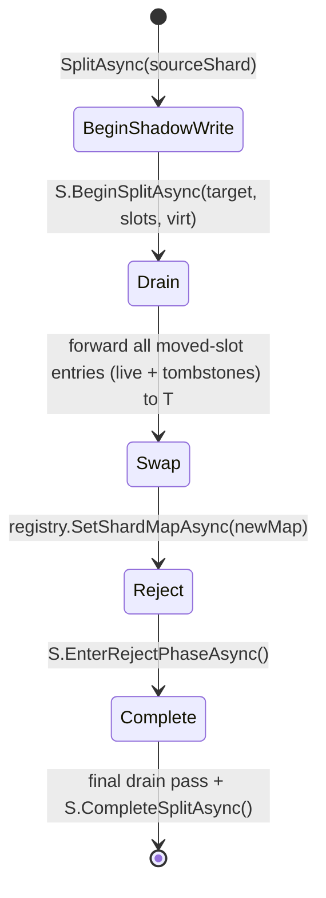

# Adaptive Shard Splitting

Adaptive shard splitting allows a hot physical shard to split into two **at
runtime, fully online** — no shard is ever taken offline. Splits happen
automatically when an autonomic monitor detects a hot shard. Shard
splitting is internal-only: `ITreeShardSplitGrain` is declared `internal`
and is not reachable from consumer assemblies.

## Why

Lattice trees are sharded by hashing keys into a virtual slot space and
mapping virtual slots onto physical `ShardRootGrain` activations. With a
fixed shard count, a workload skewed toward a small set of keys will
saturate one shard while others sit idle. Adaptive splitting redistributes
hot virtual slots to a new physical shard so the load follows the data.

## How it works

A split is driven by the internal `TreeShardSplitGrain` coordinator through
five phases. The source shard *S* keeps serving reads and writes throughout;
the target shard *T* receives mirrored data and eventually owns the moved
slots.

1. **BeginShadowWrite** — Coordinator persists intent and calls
   `S.BeginSplitAsync(targetShardIndex, movedSlots, virtualShardCount)`. From
   this point on, every successful write *S* applies to a key in a moved
   virtual slot is mirrored to *T* via `T.MergeManyAsync`, preserving the
   original HLC. CRDT LWW guarantees correct convergence regardless of how
   the foreground write and the background drain interleave.
2. **Drain** — Coordinator walks *S*'s leaf chain and forwards moved-slot
   entries (including tombstones) to *T* with their original HLC timestamps.
   The drain is **chunked** and **leaf-side filtered**: each leaf returns
   only entries whose virtual slot is in the moved-slot set via
   `IBPlusLeafGrain.GetDeltaSinceForSlotsAsync`, and the coordinator flushes
   to *T* in batches of `SplitDrainBatchSize` (default 1024) entries. This
   bounds peak memory on the coordinator regardless of source shard size,
   and avoids transferring non-moved entries over the wire. Idempotent under
   retry — re-running merges only converges to the same state.
3. **Swap** — Coordinator persists a new `ShardMap` in the registry that
   redirects moved slots to *T*. New `LatticeGrain` activations immediately
   route the moved slots to *T*; stale activations still cache the old map.
4. **Reject** — Coordinator calls `S.EnterRejectPhaseAsync()`. From this
   point any read or write to *S* for a moved-slot key throws
   `StaleShardRoutingException`. `LatticeGrain` catches the exception,
   invalidates its cached map, fetches the fresh map from the registry, and
   retries against *T* — a single transparent retry per call.
5. **Complete** — Coordinator runs one final drain pass to capture any
   tombstones written during shadow that were not mirrored on the hot path,
   then calls `S.CompleteSplitAsync()` and clears its own state.
   `CompleteSplitAsync` also promotes the just-completed split's moved
   slots into a permanent `MovedAwaySlots` set on `S`, so even after the
   active reject-phase state is cleared, every subsequent operation on a
   moved-slot key continues to throw `StaleShardRoutingException`. This
   guarantees that stale `[StatelessWorker]` `LatticeGrain` activations
   (which may have cached the pre-split shard map) always trigger a map
   refresh on first use rather than silently returning orphan data.

The coordinator state is persisted before any side effect, so a silo crash
mid-split is recovered by the keepalive reminder: `RunSplitPassAsync`
resumes from the last persisted phase, and every phase method is
idempotent.

## Scan semantics during a split

This section describes the *mechanism* by which live operations behave
during a split. For the consistency contract each `ILattice` method
provides — including under concurrent splits — see
[Consistency](consistency.md).

Point reads and writes (`GetAsync`, `SetAsync`, `DeleteAsync`,
`SetIfVersionAsync`, `GetOrSetAsync`, etc.) continue to serve traffic
throughout the split: every successful write is mirrored to the new
owner during the shadow phase and the post-swap reject phase causes
stale activations to transparently retry against the correct shard. The
post-Complete permanent `MovedAwaySlots` rejection extends this for the
lifetime of the source shard.

Scans (`KeysAsync`, `EntriesAsync`, `CountAsync`) reconcile against
topology changes mid-scan as described below. See
[Consistency](consistency.md) for the guarantee this reconciliation
delivers.

### How the reconciliation works

Each scan uses a reconciliation algorithm coordinated against the
registry's monotonically-incrementing `ShardMap.Version`, but `CountAsync`
and the `KeysAsync` / `EntriesAsync` streams follow two different paths.

#### `CountAsync` / `CountPerShardAsync` — per-slot routing

The orchestrator reads the authoritative `ShardMap`, partitions virtual
slots by current owner (via `LatticeGrain.BuildOwnedSlotMap`), and asks
each physical shard to count only its owned slots via
`IShardRootGrain.CountForSlotsAsync(sortedSlots, virtualShardCount)`.
Because each virtual slot is counted exactly once — against whichever
shard the map identifies as its current owner — the result is
topology-consistent by construction, independent of the source shard's
per-split phase. The map version is re-read after the fan-out; if it
moved, the count is discarded and retried on the fresh map, bounded by
`LatticeOptions.MaxScanRetries` (default 3). Throws
`InvalidOperationException` on retry exhaustion.

#### `KeysAsync` / `EntriesAsync` — in-line reconciliation

Reconciliation is driven inside the main k-way merge loop rather than
as a separate pass. Each shard root reports back:

* the keys/entries of all keys *not* in its `MovedAwaySlots` table
  (entries it no longer authoritatively owns), and
* the set of `MovedAwaySlots` virtual slots it observed during the
  traversal (used as a topology-stability hint).

Before each priority-queue dequeue, the orchestrator checks whether
any live shard cursor has reported new `MovedAwaySlots` since the last
reconciliation step. If so, it queries the current owners of the
affected slots via the slot-filtered variants
`GetSortedKeysBatchForSlotsAsync` / `GetSortedEntriesBatchForSlotsAsync`,
loads the reconciled keys into memory, sorts them with the same
comparer, and injects them as an additional in-memory cursor into the
same priority queue. The merge invariant (global minimum is yielded
next) then carries ordering across the topology boundary. A per-call
`HashSet<string>` suppresses duplicates across pre- and post-swap
views. A final stability check after the priority queue drains catches
the edge case where a split commits after all live cursors finished —
reconciled entries from this path are also sorted and injected as a
cursor, not appended. Bounded by `LatticeOptions.MaxScanRetries`.

### Trade-offs

* **Order**: Keys/Entries are streamed in strict lexicographic (or
  reverse) order end-to-end, even when splits commit mid-scan.
  Reconciled entries participate in the same k-way merge as live
  cursors, so the ordering guarantee is preserved.
* **Memory**: scans allocate a `HashSet<string>` for dedup that grows
  with the number of distinct keys observed during the scan, plus a
  per-reconciliation buffer proportional to the number of keys in
  slots that actually moved during the scan (typically small). For
  very large trees, prefer the range-bounded overload of `KeysAsync` /
  `EntriesAsync` to bound memory.
* **Latency**: when no split has ever occurred, scans take the same
  fast path as before (one round-trip per shard). The reconciliation
  passes only run when a shard actually reports moved slots.
* **System trees**: the lattice registry tree itself bypasses the
  reconciliation path (it never participates in adaptive splits, and
  reading its own shard map would deadlock). It uses the simple
  fan-out-and-sum count instead.

## Autonomic detection

The per-tree `HotShardMonitorGrain` is started lazily on the first write and
re-anchored by a keepalive reminder. On each tick (default every 30 s) it:

1. Polls every physical shard's `GetHotnessAsync()` in parallel.
2. Computes ops/sec = `(reads + writes) / window.TotalSeconds`.
3. Counts the number of in-flight splits **for this tree** by polling every
   physical shard's `IsSplittingAsync()`. If that count is already
   `MaxConcurrentAutoSplits`, the pass returns without triggering anything.
   Because `HotShardMonitorGrain` is keyed per-tree, the cap is enforced
   independently per tree — in a multi-tree cluster each tree may have up
   to `MaxConcurrentAutoSplits` concurrent splits running simultaneously.
4. Selects the top-`(MaxConcurrentAutoSplits − inFlight)` hottest shards
   whose rate exceeds `HotShardOpsPerSecondThreshold` (default 200 ops/s),
   skipping any shard already splitting, on cooldown, or owning a single
   virtual slot.
5. Triggers `ITreeShardSplitGrain.SplitAsync` on each selected shard in
   parallel via `Task.WhenAll` and starts a per-shard cooldown.

Each split runs in its own coordinator activation: the
`ITreeShardSplitGrain` key format is **`{treeId}/{sourceShardIndex}`**,
so independent splits of different source shards within the same tree do
not contend on a single coordinator. Concurrent target-index allocation is
made collision-free by a registry-side atomic counter
(`ILatticeRegistry.AllocateNextShardIndexAsync`), and concurrent shard-map
swaps are made composition-safe by re-reading the current map inside the
swap phase before persisting the diff. Both atomicity guarantees rely on
the singleton `LatticeRegistryGrain` being non-reentrant.

A split is **suppressed** (whole pass skipped) or a candidate is **skipped
individually** when:

| Suppression rule | Scope | Mechanism |
|---|---|---|
| `AutoSplitEnabled = false` | Whole pass | Returns early. |
| Tree younger than `AutoSplitMinTreeAge` (since monitor activation, default 60 s) | Whole pass | Returns early. |
| Resize / merge / snapshot in progress | Whole pass | `ILattice.IsResize/Merge/SnapshotCompleteAsync()` returns `false`. |
| Any shard has a pending bulk graft | Whole pass | `IShardRootGrain.HasPendingBulkOperationAsync()` returns `true`. |
| In-flight splits already at `MaxConcurrentAutoSplits` | Whole pass | Sum of `IsSplittingAsync()` results. |
| Shard already splitting | Per shard | Excluded from candidate set. |
| Per-shard cooldown active (default 2 min) | Per shard | In-memory cooldown timestamp. |
| Shard owns a single virtual slot | Per shard | Cannot be subdivided further. |

## Tunables (`LatticeOptions`)

| Option | Default | Description |
|---|---|---|
| `AutoSplitEnabled` | `true` | Master switch for autonomic splits. When `false`, `HotShardMonitorGrain` will not trigger any splits; there is no external way to invoke a split. |
| `HotShardOpsPerSecondThreshold` | `200` | Operations/second above which a shard is considered hot. Intentionally low so splits occur before throughput degrades. |
| `HotShardSampleInterval` | `30 s` | How often the monitor polls hotness counters. |
| `HotShardSplitCooldown` | `2 min` | Minimum interval between consecutive splits of the same physical shard. |
| `MaxConcurrentAutoSplits` | `2` | Maximum concurrent splits per tree. Each split runs in its own per-shard coordinator activation; the cap bounds aggregate storage I/O. |
| `SplitDrainBatchSize` | `1024` | Maximum number of moved-slot entries the drain accumulates in memory before flushing to the target shard. Caps coordinator allocation regardless of source shard size. |
| `AutoSplitMinTreeAge` | `60 s` | Minimum tree age before autonomic splits are allowed; absorbs startup bursts. |
| `MaxScanRetries` | `3` | Maximum bounded retries that a scan (`CountAsync`, `KeysAsync`, `EntriesAsync`) performs when `ShardMap.Version` keeps moving mid-scan due to concurrent splits. Throws `InvalidOperationException` on exhaustion. Increase if scans run during very-high split churn. See [Consistency](consistency.md). |

## Convergence guarantees

* **No data loss** — every write committed to *S* is either drained,
  shadow-mirrored, or both, and `MergeManyAsync` is idempotent under LWW.
* **No duplicate authority** — after the swap, only *T* is reachable for
  moved slots via the public API; orphan entries on *S* are unreachable
  and reclaimed on tree purge.
* **Geometric convergence on a single hot slot** — if all heat is in one
  virtual slot, successive autonomic splits subdivide *S*'s slot set in
  half each pass, isolating the hot slot in `O(log virtualSlotsPerShard)`
  splits.

## Scope

Shard splitting is an autonomic concern. `ITreeShardSplitGrain` is internal
infrastructure protected by `InternalGrainGuardFilter` — external client
calls are rejected with `InvalidOperationException`. There is no public
API to trigger or control a split; tuning is performed exclusively through
the `LatticeOptions` listed above.
