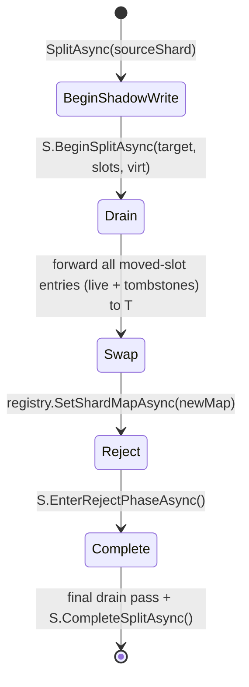

# Adaptive Shard Splitting

Adaptive shard splitting allows a hot physical shard to split into two **at
runtime, fully online** — no shard is ever taken offline. Splits happen
automatically when an autonomic monitor detects a hot shard, or can be
triggered manually for diagnostics and tooling.

## Why

Lattice trees are sharded by hashing keys into a virtual slot space and
mapping virtual slots onto physical `ShardRootGrain` activations. With a
fixed shard count, a workload skewed toward a small set of keys will
saturate one shard while others sit idle. Adaptive splitting redistributes
hot virtual slots to a new physical shard so the load follows the data.

## How it works

A split is driven by the internal `TreeShardSplitGrain` coordinator through
five phases. The source shard *S* keeps serving reads and writes throughout;
the target shard *T* receives mirrored data and eventually owns the moved
slots.

1. **BeginShadowWrite** — Coordinator persists intent and calls
   `S.BeginSplitAsync(targetShardIndex, movedSlots, virtualShardCount)`. From
   this point on, every successful write *S* applies to a key in a moved
   virtual slot is mirrored to *T* via `T.MergeManyAsync`, preserving the
   original HLC. CRDT LWW guarantees correct convergence regardless of how
   the foreground write and the background drain interleave.
2. **Drain** — Coordinator walks *S*'s leaf chain, filters entries by moved
   slot, and forwards them (including tombstones) to *T* with their original
   HLC timestamps. Idempotent under retry — re-running merges only converges
   to the same state.
3. **Swap** — Coordinator persists a new `ShardMap` in the registry that
   redirects moved slots to *T*. New `LatticeGrain` activations immediately
   route the moved slots to *T*; stale activations still cache the old map.
4. **Reject** — Coordinator calls `S.EnterRejectPhaseAsync()`. From this
   point any read or write to *S* for a moved-slot key throws
   `StaleShardRoutingException`. `LatticeGrain` catches the exception,
   invalidates its cached map, fetches the fresh map from the registry, and
   retries against *T* — a single transparent retry per call.
5. **Complete** — Coordinator runs one final drain pass to capture any
   tombstones written during shadow that were not mirrored on the hot path,
   then calls `S.CompleteSplitAsync()` and clears its own state.
   `CompleteSplitAsync` also promotes the just-completed split's moved
   slots into a permanent `MovedAwaySlots` set on `S`, so even after the
   active reject-phase state is cleared, every subsequent operation on a
   moved-slot key continues to throw `StaleShardRoutingException`. This
   guarantees that stale `[StatelessWorker]` `LatticeGrain` activations
   (which may have cached the pre-split shard map) always trigger a map
   refresh on first use rather than silently returning orphan data.

The coordinator state is persisted before any side effect, so a silo crash
mid-split is recovered by the keepalive reminder: `RunSplitPassAsync`
resumes from the last persisted phase, and every phase method is
idempotent.

## Scan semantics during a split

Point reads and writes (`GetAsync`, `SetAsync`, `DeleteAsync`,
`SetIfVersionAsync`, `GetOrSetAsync`, etc.) are **fully consistent**
throughout the split: every successful write is mirrored to the new owner
during shadow phase and the post-swap reject phase guarantees stale
activations transparently retry against the correct shard. The post-Complete
permanent `MovedAwaySlots` rejection extends this guarantee for the lifetime
of the source shard.

Scans (`KeysAsync`, `EntriesAsync`, `CountAsync`) are **eventually
consistent** across a topology change. The source shard filters out moved
virtual slots from scan results once the shard map swap has happened
(phase ≥ `Swap`) so duplicates are never produced once the topology change
is visible. However, a long-running scan that begins **before** the swap
and ends **after** it may transiently miss or under-count entries in the
moved slot range, because:

* The scan iterates physical shards as discovered when it began.
* If `S` was originally serving a slot but the swap moved it to `T`
  mid-scan, neither S (which now filters) nor T (which the scan never
  visited) yields those entries within that single scan pass.

Callers that require an exact snapshot during periods of expected
topology change should re-run the scan after `IsSplittingAsync()` returns
`false` for every physical shard, or pin to a tree that has not been
splitting recently. Re-running the scan once the split has completed
yields exactly the live key set.

## Autonomic detection

The per-tree `HotShardMonitorGrain` is started lazily on the first write and
re-anchored by a keepalive reminder. On each tick (default every 30 s) it:

1. Polls every physical shard's `GetHotnessAsync()` in parallel (F-013).
2. Computes ops/sec = `(reads + writes) / window.TotalSeconds`.
3. Selects the hottest shard whose rate exceeds
   `HotShardOpsPerSecondThreshold` (default 200 ops/s).
4. Triggers `ITreeShardSplitGrain.SplitAsync` on that shard and starts a
   per-shard cooldown.

A split is **suppressed** when any of the following hold, to avoid
thrashing or interfering with bulk maintenance:

| Suppression rule | Mechanism |
|---|---|
| `AutoSplitEnabled = false` | Returns early. |
| Tree younger than `AutoSplitMinTreeAge` (since monitor activation, default 60 s) | Returns early. |
| Resize / merge / snapshot in progress | `ILattice.IsResize/Merge/SnapshotCompleteAsync()` returns `false`. |
| Any shard splitting | `IShardRootGrain.IsSplittingAsync()` returns `true`. |
| Any shard has a pending bulk graft | `IShardRootGrain.HasPendingBulkOperationAsync()` returns `true`. |
| Per-shard cooldown active (default 2 min) | In-memory cooldown timestamp. |
| Shard owns a single virtual slot | Cannot be subdivided further. |

## Tunables (`LatticeOptions`)

| Option | Default | Description |
|---|---|---|
| `AutoSplitEnabled` | `true` | Master switch for autonomic splits. Manual splits via `ITreeShardSplitGrain` remain available even when `false`. |
| `HotShardOpsPerSecondThreshold` | `200` | Operations/second above which a shard is considered hot. Intentionally low so splits occur before throughput degrades. |
| `HotShardSampleInterval` | `30 s` | How often the monitor polls hotness counters. |
| `HotShardSplitCooldown` | `2 min` | Minimum interval between consecutive splits of the same physical shard. |
| `MaxConcurrentAutoSplits` | `1` | Maximum concurrent splits per tree. Default `1` keeps storage I/O bounded. |
| `AutoSplitMinTreeAge` | `60 s` | Minimum tree age before autonomic splits are allowed; absorbs startup bursts. |

## Convergence guarantees

* **No data loss** — every write committed to *S* is either drained,
  shadow-mirrored, or both, and `MergeManyAsync` is idempotent under LWW.
* **No duplicate authority** — after the swap, only *T* is reachable for
  moved slots via the public API; orphan entries on *S* are unreachable
  and reclaimed on tree purge.
* **Geometric convergence on a single hot slot** — if all heat is in one
  virtual slot, successive autonomic splits subdivide *S*'s slot set in
  half each pass, isolating the hot slot in `O(log virtualSlotsPerShard)`
  splits.

## Manual control

For tooling and tests, `ITreeShardSplitGrain` exposes:

| Method | Purpose |
|---|---|
| `SplitAsync(int sourceShardIndex)` | Initiate a split of the given shard. Idempotent for matching parameters. |
| `RunSplitPassAsync()` | Synchronously drive the in-progress split to completion. |
| `IsCompleteAsync()` | `true` when no split is in progress. |

Both grains are internal infrastructure (`[EditorBrowsable(Never)]`) and are
not exposed on `ILattice`. The intent is that splits remain an
autonomic concern; the manual interface exists to support tests and
operators investigating routing topology.
