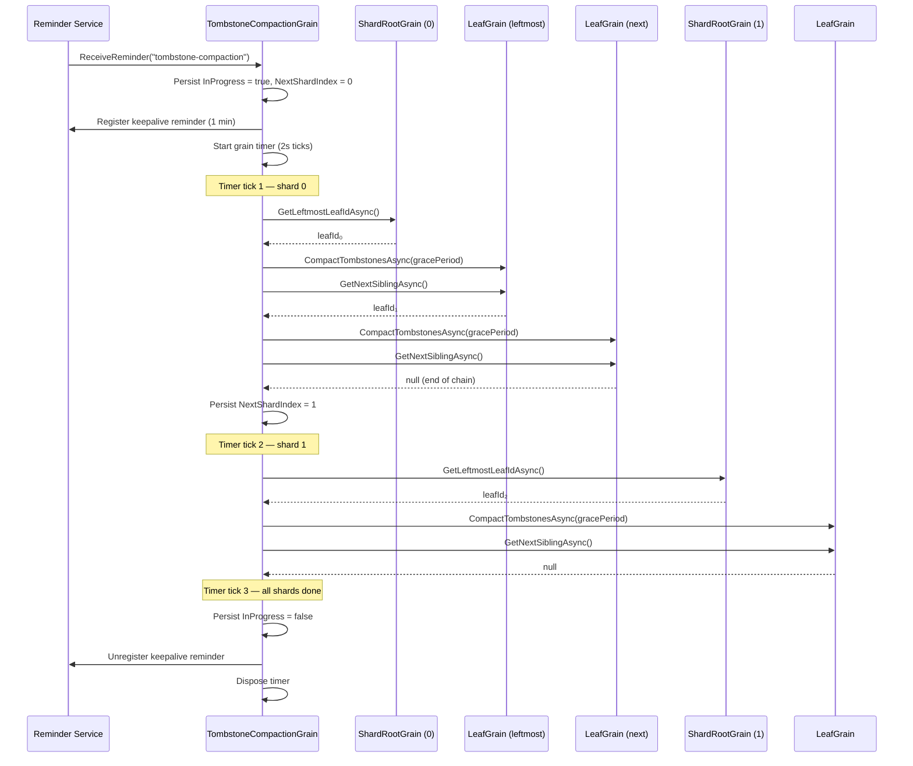

# Tombstone Compaction

Deleted keys are represented as **tombstones** — `LwwValue` entries with `IsTombstone = true`. Tombstones participate in LWW merge and delta replication like any other entry, so all replicas and caches eventually learn about the delete. However, tombstones are never removed by normal operations, leading to unbounded storage and scan overhead.

## How It Works

A single **`TombstoneCompactionGrain`** per tree owns one [grain reminder](https://learn.microsoft.com/dotnet/orleans/grains/timers-and-reminders) that fires at the configured grace-period interval. When the reminder fires, it starts a **grain timer** that processes one shard per tick (every 2 seconds), avoiding a single long-running grain call that could hit Orleans timeouts for large trees:

1. The reminder tick persists `InProgress = true` and registers a **one-minute keepalive reminder**, then starts a grain timer at shard 0.
2. Each timer tick processes one shard:
   a. Calls `GetLeftmostLeafIdAsync` on the shard root to find the head of the leaf chain.
   b. Walks the doubly-linked leaf list via `GetNextSiblingAsync`, calling `CompactTombstonesAsync` on each leaf.
   c. Persists the updated `NextShardIndex` to durable state.
3. If a shard fails, it is retried once before being skipped.
4. After all shards are processed, the timer self-disposes, `InProgress` is set to `false`, and the keepalive reminder is unregistered.

**Recovery:** If the silo restarts mid-compaction, the keepalive reminder fires within one minute and the grain resumes from the persisted `NextShardIndex`. Once the pass completes, the keepalive is unregistered. If `InProgress` is already `false` when the keepalive fires, it simply unregisters itself.

Each leaf compares every tombstone's `HLC.WallClockTicks` against `now − gracePeriod`. Tombstones older than the cutoff are physically removed from the `SortedDictionary`. A `LastCompactionVersion` (a `VersionVector` snapshot) is persisted after each pass so that subsequent ticks can **skip the scan entirely** when no writes have occurred since the last compaction.



The reminder is registered lazily — `LatticeGrain` calls `EnsureReminderAsync` on the first `SetAsync` or `DeleteAsync` for a given tree. A per-activation `bool` field ensures this cross-grain call happens at most once per `LatticeGrain` activation.

For manual or on-demand compaction (e.g. maintenance scripts, integration tests), call `RunCompactionPassAsync` on the compaction grain directly:

```csharp verify
var compaction = grainFactory.GetGrain<ITombstoneCompactionGrain>("my-tree");
await compaction.RunCompactionPassAsync();
```

## Configuration

`TombstoneGracePeriod` follows the same named-options pattern as all other `LatticeOptions` properties:

```csharp verify
// Global default — applies to all trees.
siloBuilder.ConfigureLattice(o => o.TombstoneGracePeriod = TimeSpan.FromHours(12));

// Per-tree override.
siloBuilder.ConfigureLattice("my-tree", o => o.TombstoneGracePeriod = TimeSpan.FromDays(7));

// Disable compaction entirely for a specific tree.
siloBuilder.ConfigureLattice("archive-tree", o => o.TombstoneGracePeriod = Timeout.InfiniteTimeSpan);
```

The default grace period is **24 hours**. The reminder interval equals the grace period (clamped to a minimum of 1 minute, the Orleans reminder floor).

## Design Considerations

| Concern | Approach |
|---|---|
| **Scalability** | One reminder per tree (not per leaf). The compaction grain uses a grain timer to process one shard per tick, avoiding long-running calls that could hit Orleans timeouts. |
| **Consistency** | Tombstones are only removed after the grace period, giving all caches and replicas time to observe the delete via delta replication. |
| **Idempotency** | `CompactTombstonesAsync` is safe to call multiple times. The `LastCompactionVersion` fast-path avoids redundant scans. |
| **Durability** | Compaction progress (`NextShardIndex`, `InProgress`) is persisted to grain storage. A one-minute keepalive reminder ensures the grain is reactivated after a silo restart to resume the in-flight pass. |
| **Fault tolerance** | If a shard fails during compaction, it is retried once before being skipped. The next reminder tick starts a fresh pass. |
| **Memory** | Leaves are compacted one at a time via sequential grain calls. Orleans deactivates idle leaves on its normal schedule; no bulk activation occurs. |
| **Disabling** | Set `TombstoneGracePeriod = Timeout.InfiniteTimeSpan` to disable compaction globally or per tree. |
