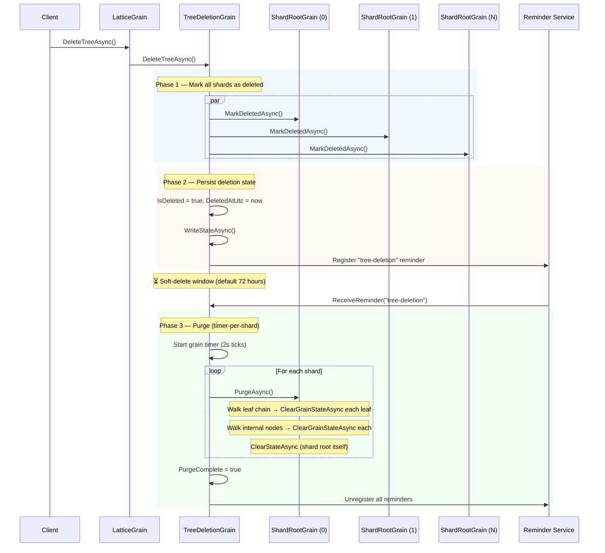

# Tree Deletion

## Overview

Trees can be deleted via `ILattice.DeleteTreeAsync()`. Deletion is a **soft delete** — the tree is immediately marked as inaccessible, but its data is retained in storage for a configurable grace period before being permanently purged.

```csharp
var tree = grainFactory.GetGrain<ILattice>("my-tree");
await tree.DeleteTreeAsync();
```

After deletion, any attempt to read from or write to the tree throws `InvalidOperationException` with the message *"This tree has been deleted and is no longer accessible."*

## How It Works

Deletion uses a three-phase approach:



### Phase 1: Mark shards as deleted

`TreeDeletionGrain.DeleteTreeAsync()` calls `MarkDeletedAsync()` on every shard in parallel. Each shard persists an `IsDeleted = true` flag to its `ShardRootState`. Once set, every subsequent `GetAsync`, `SetAsync`, `DeleteAsync`, `KeysAsync`, `BulkLoadAsync`, and `BulkAppendAsync` call on that shard throws `InvalidOperationException` immediately — before touching any leaf or internal node.

### Phase 2: Persist and schedule

After all shards are marked, the `TreeDeletionGrain` persists its own `IsDeleted` flag and `DeletedAtUtc` timestamp, unregisters the [tombstone compaction](tombstone-compaction.md) reminder (compaction is no longer needed for a deleted tree), then registers a grain reminder for deferred purge. The reminder fires at intervals equal to the configured `SoftDeleteDuration` (clamped to a minimum of 1 minute).

### Phase 3: Purge

When the reminder fires and the soft-delete window has elapsed (`now - DeletedAtUtc ≥ SoftDeleteDuration`), a grain timer is started that processes one shard per tick (every 2 seconds) — the same pattern used by [tombstone compaction](tombstone-compaction.md).

For each shard, `PurgeAsync()`:

1. Walks the doubly-linked leaf chain from the leftmost leaf, calling `ClearGrainStateAsync()` on each leaf (which clears persistent state and deactivates the grain).
2. Collects all internal node grain IDs by iteratively walking the tree from the root using an explicit stack, then clears each one.
3. Clears the shard root's own state via `ClearStateAsync()`.

After all shards are purged, the deletion grain marks `PurgeComplete = true`, unregisters all reminders, and deactivates itself.

## Recovery

| Crash point | State on recovery | Action |
|---|---|---|
| During Phase 1 (some shards marked) | Some shards have `IsDeleted = true` | `DeleteTreeAsync` is idempotent — re-calling marks remaining shards |
| After Phase 2, before Phase 3 | `IsDeleted` persisted, reminder registered | Reminder fires after soft-delete window, starts purge |
| During Phase 3 (mid-purge) | `PurgeInProgress = true`, `NextShardIndex` persisted | Keepalive reminder (1 min) reactivates grain, resumes from persisted shard index |
| After Phase 3 | `PurgeComplete = true` | Reminder fires, detects completion, unregisters and deactivates |

## Idempotency

- `DeleteTreeAsync()` is idempotent — calling it on an already-deleted tree is a no-op.
- `MarkDeletedAsync()` is idempotent per shard.
- `PurgeAsync()` is safe to call multiple times — `ClearGrainStateAsync()` on an already-cleared grain is harmless, and `ClearStateAsync()` on an already-empty shard root is a no-op.
- Failed shards during purge are retried once before being skipped. The next reminder tick starts a fresh purge pass.

## Read Cache Behaviour

`LeafCacheGrain` is a `[StatelessWorker]` that holds an in-memory copy of leaf data. It is **not** notified when a tree is deleted — doing so would require traversing every leaf in the tree to set a flag, which is prohibitively expensive and defeats the purpose of the shard-root-level guard.

This is safe because the cache is not publicly addressable. The only path to it is through `ShardRootGrain.TraverseForReadAsync`, which calls `ThrowIfDeleted()` before reaching the cache layer. No external caller can obtain a `LeafCacheGrain` reference — its key is an internal `GrainId` string derived from the primary leaf's identity, not exposed through `ILattice`.

After deletion, existing cache activations may still hold stale data in memory, but no requests can reach them. Orleans will deactivate idle `StatelessWorker` activations on its normal schedule, at which point the in-memory data is garbage-collected. No persistent state is involved — the cache is purely in-memory.

## Configuration

The soft-delete window is controlled by `SoftDeleteDuration` in `LatticeOptions`. See [Configuration](configuration.md) for details.

```csharp
// Global default — 72 hours
siloBuilder.ConfigureLattice(o => o.SoftDeleteDuration = TimeSpan.FromHours(72));

// Per-tree override — immediate purge
siloBuilder.ConfigureLattice("ephemeral-tree", o => o.SoftDeleteDuration = TimeSpan.Zero);
```

## Recovering a Deleted Tree

During the soft-delete window (before purge begins), a deleted tree can be recovered:

```csharp
var tree = grainFactory.GetGrain<ILattice>("my-tree");
await tree.RecoverTreeAsync();

// Tree is accessible again — all data from before the delete is restored.
byte[]? value = await tree.GetAsync("customer-123");
```

`RecoverTreeAsync()` clears the `IsDeleted` flag on every shard, unregisters the purge reminder, re-instates the [tombstone compaction](tombstone-compaction.md) reminder, and resets the deletion grain's state. The tree returns to normal operation with all its data intact, including automatic tombstone compaction.

**State validation:**

| Tree state | Result |
|---|---|
| Not deleted | Throws `InvalidOperationException` — nothing to recover |
| Soft-deleted (within window) | ✅ Recovers successfully |
| Purge in progress | Throws `InvalidOperationException` — too late to recover safely |
| Purge complete | Throws `InvalidOperationException` — data is gone |

## Manual Purge

To bypass the soft-delete waiting window and permanently destroy a tree's data immediately:

```csharp
var tree = grainFactory.GetGrain<ILattice>("my-tree");
await tree.DeleteTreeAsync();
await tree.PurgeTreeAsync();
```

`PurgeTreeAsync()` walks every shard synchronously, clearing all leaf and internal node state, then marks the tree as fully purged. This is useful for maintenance scripts, test teardown, or when you know recovery will never be needed.

> **Note:** `PurgeTreeAsync()` processes all shards in a single grain call. For very large trees (many shards, deep trees, millions of keys), this call may take a long time and risk hitting Orleans grain call timeouts. In those cases, prefer the default reminder-driven purge, which processes one shard per timer tick and is resilient to timeouts and silo restarts.

**State validation:**

| Tree state | Result |
|---|---|
| Not deleted | Throws `InvalidOperationException` — delete first |
| Soft-deleted (within window) | ✅ Purges immediately |
| Purge in progress (via reminder) | ✅ Purges remaining shards |
| Purge complete | Throws `InvalidOperationException` — already purged |
