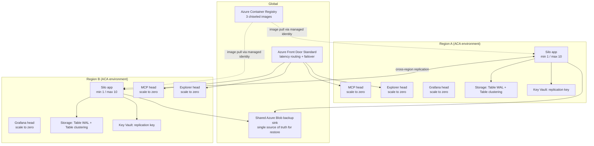
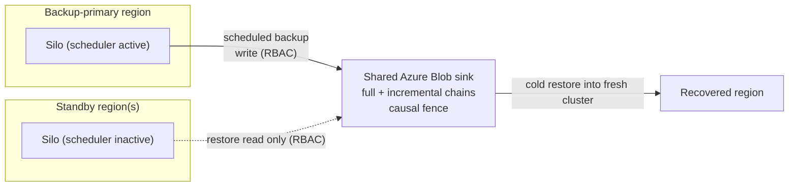
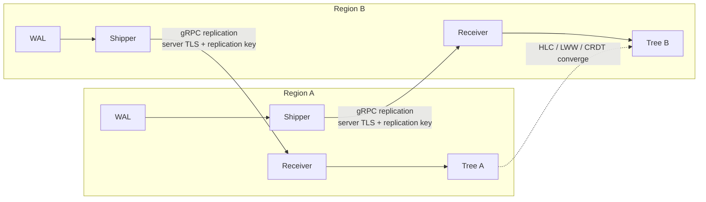
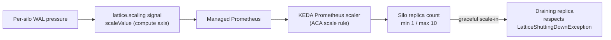
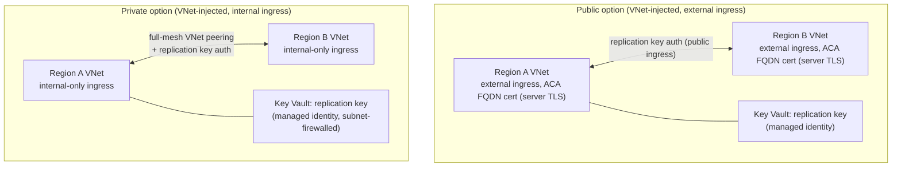
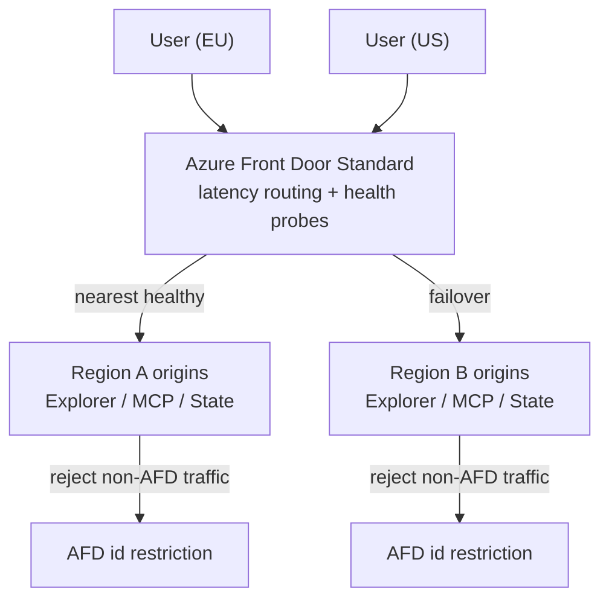
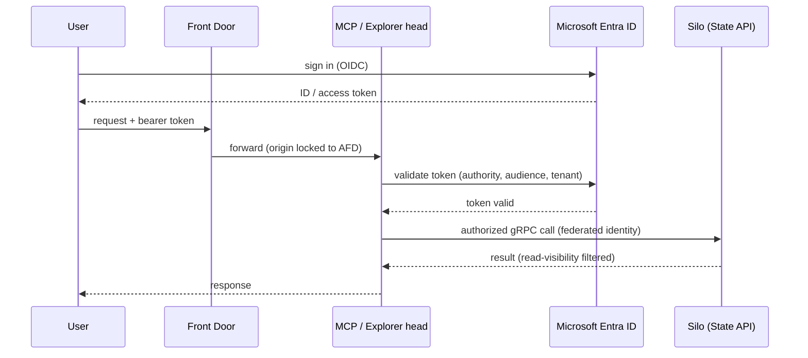

# Reference Architecture: active-active cross-region Orleans.Lattice on Azure Container Apps

This is a production-grade blueprint for running Orleans.Lattice as an
active-active, cross-region, cross-cluster estate on **Azure Container Apps
(ACA)**, with a durable write-ahead log, a shared Azure Blob backup sink,
`lattice.scaling`-driven autoscaling, Microsoft Entra ID authentication, MCP
endpoints, and the Explorer deployed as an operator console.

Unlike a sample, this is a reusable design plus a parameterised deployment kit: a
team points it at their own subscription and stands up an N-region estate from a
single PowerShell invocation. The deployment kit lives under
[`reference-architecture/`](reference-architecture/) and its deploy and
configuration guide is [`reference-architecture/README.md`](reference-architecture/README.md).
This document is the design; the kit is the implementation.

## Contents

- [Design goals and non-goals](#design-goals-and-non-goals)
- [Consistency scoping](#consistency-scoping) - read this first
- [Regional topology](#regional-topology)
- [Container heads and scaling profile](#container-heads-and-scaling-profile)
- [Intra-region silo clustering](#intra-region-silo-clustering)
- [Durable WAL, clustering, and the shared backup sink](#durable-wal-clustering-and-the-shared-backup-sink)
- [Cross-region replication and data flow](#cross-region-replication-and-data-flow)
- [Disaster recovery](#disaster-recovery)
- [Autoscaling via the lattice.scaling KEDA bridge](#autoscaling-via-the-latticescaling-keda-bridge)
- [Network options](#network-options)
- [Client-facing endpoints](#client-facing-endpoints)
- [Global ingress: Azure Front Door Standard](#global-ingress-azure-front-door-standard)
- [Identity and authentication](#identity-and-authentication)
- [Observability](#observability)
- [Security posture](#security-posture)
- [Container images](#container-images)
- [Cost](#cost)

## Design goals and non-goals

Goals:

- **Active-active across N regions.** Every region is a full read-write Lattice
  cluster; there is no primary region for serving traffic. Regions are a
  parameterised count, not a fixed two or three.
- **Durable and disaster-recoverable.** A durable Azure Table WAL per region and
  one shared Azure Blob backup sink that is the single source of truth for
  cold-restore.
- **Elastic and cheap at rest.** The silo scales on real WAL pressure; the MCP,
  Explorer, and Grafana heads scale to zero when idle.
- **Secure by default.** Entra-backed auth on every client-facing surface,
  secrets in Key Vault reached through managed identity, least-privilege RBAC,
  non-root distroless containers, and origins locked to the global front door.
- **One-command reproducible.** A single parameterised PowerShell deployer builds
  the images and deploys every region plus the global ingress idempotently.

Non-goals (documented, deliberately out of the baseline for cost):

- Azure Front Door **Premium** (Private Link private origins, managed WAF, bot
  protection). The baseline uses **AFD Standard**; the upgrade path is documented.
- A Front Door **WAF** policy. The Bicep leaves a clean seam to attach one; none
  is deployed by default.
- The standing diagnostics cluster idea (issue #1109) is descoped and unrelated.

## Consistency scoping

**Read this before anything else, because it qualifies a headline claim in the
[README](README.md).**

The README states Orleans.Lattice is "strongly consistent from the outside." That
guarantee is scoped to **a single cluster**: within one region, point reads,
writes, and ordered scans always observe a consistent view, even while the shard
tree rebalances underneath.

An **active-active cross-region** estate is a different consistency regime. Across
regions the estate is **eventually consistent**:

- Each key converges by **per-key last-writer-wins** ordered by a **hybrid
  logical clock (HLC)**; multi-member CRDT values converge by their algebraic
  merge. Convergence is deterministic and independent of message arrival order.
- A write accepted in region A is durable and locally consistent in A
  immediately, and becomes visible in the other regions after asynchronous
  replication ships and applies it. There is no cross-region read-your-writes
  guarantee unless the client is pinned to the accepting region.
- Atomic multi-key writes remain **all-or-nothing on every peer**: a batch never
  applies partially in any region.

So the correct external contract for this topology is: **strong consistency
within a region, eventual (convergent, LWW/CRDT) consistency between regions,
with no session affinity required** because any region can serve any user and all
regions converge to the same state. Applications that need read-your-writes
across regions must route a user's writes and reads to the same region for the
duration of that requirement; the global front door's latency routing already
keeps a user on their nearest region in steady state.

## Regional topology

Each of the N regions is a self-contained Lattice cluster: a silo container app
(the cluster), an MCP endpoint head, an Explorer head, and a self-hosted Grafana
head, sharing a per-region ACA environment, storage account, Key Vault, and Log
Analytics workspace. The regions replicate to each other and all back up to one
shared blob sink.

The diagram shows two regions for clarity; the Bicep is parameterised over an
arbitrary region list, and Front Door, the blob sink, and the registry are single
global resources shared by every region.

## Container heads and scaling profile

Three built images plus one stock image, deployed as four container apps per
region with deliberately different scaling profiles:

| Head | Image | Min | Max | Rationale |
|---|---|---|---|---|
| Silo | built (silo host) | 1 | 10 | Stateful cluster member; a min floor keeps a membership quorum and never cold-starts the data plane. Scales up on WAL pressure. |
| MCP | built (MCP host) | 0 | N | Stateless remote MCP server; cold-starts on demand, idle at zero. |
| Explorer | built (Explorer host) | 0 | N | Stateless operator console; a small admin tool, idle at zero. |
| Grafana | stock `grafana/grafana-oss` | 0 | 1 | Stateless visualization head, provisioned config only, no database or volume. |

The silo is the only always-on head and the only one that must never reach zero.
Keeping the three read/tool heads at a zero floor is the whole point of the
isolated-head design: an admin tool must not tax the data plane's scale economics.

## Intra-region silo clustering

The silo is a **single container app** whose **replicas** (1 to 10) form the
Orleans cluster. Replicas discover and address each other two ways working
together:

- **Azure Table clustering** provides Orleans membership: each replica registers
  in a per-region storage table, and the membership protocol tracks the live set.
- **Same-revision replica-to-replica connectivity** (a supported ACA capability)
  lets replicas in the same revision reach each other directly on the silo-to-silo
  port, which Orleans needs for grain directory and messaging.

Scaling the silo to a single replica per region is **not** an acceptable fallback:
the design requires genuine intra-region multi-silo clustering so a single replica
loss does not take the region's data plane offline. The Orleans membership and
endpoint configuration on ACA (advertised address, silo port, gateway port) must
be validated against this replica-to-replica model rather than assumed.

## Durable WAL, clustering, and the shared backup sink

Per region:

- **Durable WAL** on Azure Table (the `Orleans.Lattice.Storage.AzureTable`
  backend). The WAL is the region's durability boundary; every mutation is
  appended before it is acknowledged.
- **Orleans clustering** on Azure Table (membership, above).
- Both live in the per-region storage account, reached by the silo's
  **user-assigned managed identity** with least-privilege data-plane RBAC (Storage
  Table Data Contributor scoped to that account). No account keys.

One **shared Azure Blob backup sink** is consumed by the
`Orleans.Lattice.Backup.AzureBlob` package across all regions:

- A single **designated backup-primary region** (a deployment parameter) owns the
  scheduled backups. Other regions are DR standby and do not run the scheduler, so
  there are no duplicate or competing backup chains writing the same sink.
- Access is via managed identity + RBAC (Storage Blob Data Contributor for the
  primary, a reader role where a standby only needs restore reads). No account
  keys.
- The sink is the **single source of truth** for restore: the catalog rebuilds
  from it, and a backup cold-restores into a fresh cluster.

## Cross-region replication and data flow

Replication uses the `Orleans.Lattice.Replication` engine over its gRPC transport.
Every region runs both a **shipper** (streams local WAL mutations to peers) and a
**receiver** (applies peer mutations into the local tree).

Two invariants must hold **symmetrically across every region**, or cross-region
traffic dead-letters:

- **Receiver-enrollment gating.** Each region enrolls the peers it accepts
  replication from; enrollment must be reciprocal.
- **Wire-merge-mode.** The wire merge mode must match on both ends of every link.

The replication transport is secured differently per network option (see
[Network options](#network-options)); in both cases the endpoint is authenticated
by Lattice's per-cluster replication key, which must match across the estate.

## Disaster recovery

Losing a whole region is survivable because the estate is active-active and the
backup sink is shared:

- **Live peers keep serving.** The remaining regions continue to accept reads and
  writes; the front door fails user traffic over to the next-nearest healthy
  region automatically.
- **Rebuild from the shared sink.** A replacement region is redeployed from the
  same Bicep and cold-restores the latest backup chain from the shared blob sink,
  then re-enrolls into replication and converges with the live peers.
- **Restore vs live peers.** Because restore lands data that the live peers may
  already have newer versions of, convergence is by the same per-key HLC/LWW rule:
  a restored value never overwrites a causally newer live value. The
  backup-primary designation prevents two regions racing to write the sink.

## Autoscaling via the lattice.scaling KEDA bridge

The silo's replica count is driven by the `Orleans.Lattice.Scaling`
**compute-axis** signal (`scaleValue`, a replica-demand scalar derived from WAL
pressure), exposed as an HTTP/health endpoint and scraped into Prometheus.

Two properties matter:

- **Min-replica quorum floor.** The scale rule's minimum is 1 (never 0) so the
  data plane and a membership quorum survive idle periods.
- **Graceful scale-in.** A replica chosen for scale-in drains rather than being
  force-killed mid-transfer; the host honours `LatticeShuttingDownException` so an
  in-flight shard transfer completes or hands off before the replica exits.

The same Prometheus feed drives both KEDA and Grafana, so there is one metrics
pipeline, not two.

## Network options

Both deployment options are **VNet-injected** (each region gets a per-region VNet
with a delegated `/23` ACA infrastructure subnet) and therefore **zone-redundant
by default** (`zoneRedundant`, default `true`). The **deployment-option
parameter** does not decide whether a VNet is provisioned; it selects the
region's **ingress visibility** and whether the regions are peered, and the
replication transport rides whichever path that yields.

**Public option** (default) - external ingress, replication over the public
ingress FQDN:

- Each region keeps an **external** ACA ingress; no cross-region VNet peering is
  created.
- Transport security is **server TLS via the ACA-managed ingress FQDN
  certificate**. There is no custom client-certificate or mTLS lifecycle to issue,
  rotate, or expire.
- Endpoint authentication is **Lattice's per-cluster replication key/secret**,
  stored in each region's **Key Vault**, referenced by the silo via **managed
  identity**, and matched across all regions.
- Ingress is locked down (allow-listing parameterised); the global front door
  fronts the client-facing heads.

**Private option** - internal-only ingress, replication over private address
space:

- Each region's ACA environment is switched to an **internal-only** ingress and
  the per-region VNets are joined by **full-mesh global VNet peering**, so
  cross-region replication travels private address space and is never publicly
  reachable.
- Replication is **still authenticated by the per-cluster replication key** (held
  in each region's Key Vault, read via managed identity), layered on top of the
  private transport as **defense in depth** - so a caller that reaches the
  internal ingress still cannot forge replication traffic.
- There is no global Front Door (AFD Standard has no Private Link to origins), so
  private deployments route clients through their own private connectivity to the
  regional internal ingress.
- **Not a zero-public-surface deployment (yet).** "Private" here means private
  *ingress* and a private *inter-region replication path* - it is **not** a fully
  private data plane. The silos still reach Azure Storage (WAL tables, backup
  blob) and the container registry over **public PaaS endpoints** (authenticated
  by managed identity), and the replication Key Vault keeps `publicNetworkAccess`
  enabled but firewalled to the region workload subnet. Closing those remaining
  public surfaces (private endpoints for Storage / ACR / Key Vault) is a documented
  **further-hardening** step that this reference architecture does not yet
  implement.

## Client-facing endpoints

The baseline exposes three client-facing surfaces per region:

- **State API (read)** - the read-only `Orleans.Lattice.Api.State` gRPC surface
  that backs the Explorer and read integrations.
- **MCP endpoint** - the remote MCP server (`AddLatticeMcpRemote` over gRPC) with
  the telemetry module.
- **Explorer** - the web operator console.

The read-write **Data API** (`Orleans.Lattice.Api.Data`) is **opt-in and default
off**: it is a public write surface, so it is not exposed in the baseline. Enabling
it is a deployment parameter, and when on it is an additional locked-down origin
behind the same Entra auth.

## Global ingress: Azure Front Door Standard

For the **public** option, one global **Azure Front Door Standard** profile fronts
every region:

- **Latency-based routing** sends each user to the nearest healthy region. Because
  the estate is active-active with per-key convergence, **no session affinity is
  required** and nearest-region routing is safe.
- **Automatic failover**: on a regional health-probe failure, traffic moves to the
  next-nearest healthy region.
- **One origin group per client-facing endpoint** (Explorer, MCP, State API; Data
  API only when opted in).
- **Custom domain(s) with AFD-managed TLS.**
- **Origins locked to the front door**: each origin accepts traffic only via the
  Front Door (AFD id header / access restriction), so no one bypasses the global
  ingress. See **Origin lock and its limits** below for exactly how strong this
  guarantee is.

**Health probe vs scale-to-zero.** Continuous AFD health probes against the
MCP/Explorer origins would keep those heads from ever reaching zero. The baseline
resolves this by using an infrequent probe and accepting that the front door may
keep at most one warm replica of each fronted head, consistent with the
scale-to-zero intent (the heads still scale in the rest of their replicas). The
deploy/config docs record the probe interval and the alternative of a cheaper TCP
probe.

**Origin lock and its limits.** The origin lock is a **header assertion, not a
network lock**. Front Door stamps `X-Azure-FDID: <frontDoorId>` on every forwarded
request and each region's ACA ingress is configured to reject any request whose
header does not carry this estate's Front Door id. This is the **recommended origin
lock for AFD Standard** and stops casual direct hits on the ACA FQDN. It is not,
however, unspoofable: ACA ingress `ipSecurityRestrictions` accepts only IPv4 CIDR
ranges - it **cannot filter by the `AzureFrontDoor.Backend` service tag**, and
pinning Front Door's published backend CIDRs is fragile (they rotate) and
Microsoft-discouraged. A caller who learns both the ACA FQDN and the (non-secret)
Front Door id could therefore still forge the header. The only **non-spoofable**
origin lock is **AFD Premium + Private Link** to an internal (VNet-injected,
internal-ingress) environment, which removes the public ACA FQDN entirely - the
**private** deployment option's upgrade path.

Door WAF custom-rule policy to the Standard profile, and/or upgrade to AFD Premium
for Private Link private origins, managed WAF rule sets, and bot protection - with
the cost trade-offs and private-option implications spelled out in
[`reference-architecture/README.md`](reference-architecture/README.md).

## Identity and authentication

Every client-facing surface is protected by **Microsoft Entra ID**. Provisioning
is **Bicep-native** via the Microsoft Graph extension (GA 2025-07-29): app
registrations, service principals, and **federated identity credentials**
(preferred over client secrets) are declared in Bicep and deployed idempotently
alongside the Azure resources. The only residual imperative step is tenant admin
consent where a permission demands it, which the PowerShell deployer performs.

- The **silo** validates Entra bearer tokens for its exposed facades and applies
  the fail-closed read-visibility filter, so a caller only sees trees it may read.
- The **MCP** and **Explorer** heads authenticate users against Entra and call the
  silo with a federated workload identity, not a stored secret.
- Managed identity, not secrets, is used for every Azure-to-Azure hop (ACR pull,
  storage, Key Vault, blob sink).

## Observability

- **Azure Monitor managed Prometheus** scrapes the silo, MCP, and Explorer apps.
- The **MCP telemetry endpoint** (`Orleans.Lattice.Api.Mcp.Telemetry`) is backed
  by that managed Prometheus datasource, so the telemetry tool returns live
  metrics.
- **Self-hosted Grafana** runs as a stateless, scale-to-zero container app on the
  stock `grafana/grafana-oss` image, provisioned with the bundled
  `Orleans.Lattice.Dashboards` and the managed-Prometheus datasource via Grafana
  provisioning config. No database or persistent volume; it is a visualization
  head only. Any alerting rides Prometheus / Azure Monitor rules, not Grafana
  state.
- **Per-region Log Analytics** captures ACA container logs, capped at **1 GB/day
  ingestion** (`dailyQuotaGb = 1`) at the default 30-day retention to bound cost;
  metrics via managed Prometheus are unaffected by the log cap.
- One Prometheus feed serves both Grafana and the KEDA autoscaler.

## Security posture

Security is a first-class property of this architecture, not an afterthought:

- **No secrets in images or source.** The container images are secretless; the
  only secret in the estate (the per-cluster replication key) lives in Key Vault
  and is reached by managed identity. Prefer federated identity credentials over
  client secrets for Entra.
- **Managed identity everywhere.** ACR pull, storage/table access, Key Vault
  reads, and the blob sink all use user-assigned managed identity with
  least-privilege RBAC scoped to the specific resource. No account keys, no
  registry passwords, no connection strings.
- **Least privilege.** Each role assignment is the narrowest that works (for
  example Storage Table Data Contributor scoped to one account; a reader role on
  the sink for standby regions).
- **Key Vault data-plane firewall (both options).** Every region's replication
  Key Vault denies network access by default (`networkAcls.defaultAction: Deny`)
  and trusts **only** the region's ACA infrastructure subnet, via a
  `Microsoft.KeyVault` service endpoint on that subnet plus a matching
  `virtualNetworkRule`. `bypass: AzureServices` keeps the Key Vault resource
  provider's trusted-service path so the secret is still written at deploy time.
  This service-endpoint boundary applies to public and private alike; a Key Vault
  **private endpoint** (`publicNetworkAccess: Disabled`) is the documented
  further-hardening step and is **not implemented** yet, as are private endpoints
  for storage and the registry.
- **Non-root distroless runtime.** Every built image runs as a non-root user on a
  chiseled (shell-less) base, shrinking the attack surface and blocking
  shell-based exploitation.
- **Locked ingress.** Client origins accept traffic only from the global front
  door; the replication transport is server-TLS + replication-key over public
  ingress (public option) or the private VNet mesh **also** authenticated by the
  replication key (private option).
- **Fail-closed authorization.** The data plane is deny-by-default where auth is
  enabled, and the read-visibility filter only surfaces trees the caller may read.
- **Public write surface is opt-in.** The read-write Data API is off unless a
  deployment explicitly enables it.

## Container images

The three built images use the **most compact base that is practical**:

- Framework-dependent **.NET 10 chiseled** (Ubuntu Noble distroless,
  `mcr.microsoft.com/dotnet/aspnet:10.0-noble-chiseled`) via a multi-stage SDK
  build. Non-root, shell-less, distroless.
- **NativeAOT and aggressive trimming are ruled out**: Orleans depends on
  reflection, source-generated serializers, and dynamic grain activation.
- An **`InvariantGlobalization` (ICU-less)** compaction is a candidate for further
  shrinkage, **gated on an ordinal-only audit** of the culture-sensitive
  comparison sites in the core. The hosts sub-issue records the audit result and
  whether the flag was flipped.

## Cost

The baseline is designed to be cheap at rest: only the silo is always-on (min 1),
and the MCP, Explorer, and Grafana heads sit at zero when idle. The dominant fixed
costs are the always-on silo replica per region, the single AFD Standard profile,
the container registry, and the managed Prometheus / Log Analytics (the latter
capped at 1 GB/day). Self-hosting Grafana instead of Azure Managed Grafana removes
a material fixed monthly cost. A concrete, validated cost note for a specific
region count lives with the validation run in
[`reference-architecture/README.md`](reference-architecture/README.md).
