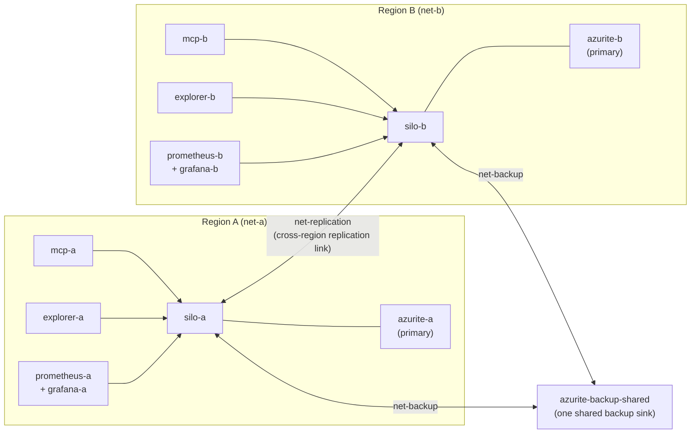

# Local-dev dual-cluster harness

A two-region Orleans.Lattice environment that runs entirely on your machine, with
**no Azure**, **no NuGet**, and **no Entra**. It mirrors
[`reference-architecture/local`](../local) as closely as possible, but differs in
four deliberate ways:

- **Project references, not packages.** Every head (Silo, MCP, Explorer) builds
  directly from `src/**` by `<ProjectReference>`, so the whole stack always
  reflects your working tree - edit a library and `docker compose up --build` picks
  it up, with no pack/publish step.
- **Two network-isolated regions.** Region A and region B are symmetric. Docker
  networking enforces the isolation: each region has a private network, and the
  only bridge between them carries nothing but the silo-to-silo replication seam.
- **Network-isolated primary storage per region.** Each region has its own Azurite
  primary storage, reachable only from within that region. The one deliberate
  exception is the backup sink: both regions share a single sink over a dedicated
  backup seam, because a coordinated restore of a replicated tree needs every cluster
  to read the same backup.
- **Real deny-by-default enforcement with per-request identities.** The
  authorization core runs deny-by-default, and a hand-crafted dev identity story
  (no Entra) lets an agent act as any of four differentiated identities by setting
  a bearer token.

> **This is a development harness, not a secure deployment template.** It trusts a
> bearer token as an identity verbatim, permits plaintext replication, and opens the
> coarse transport gate. None of that is safe outside a throwaway local box. The
> secure posture (Entra, managed identity, `RequireAuthorization=true`, TLS) is the
> deployed reference architecture under [`reference-architecture/hosts`](../hosts).

## Topology



Region A's storage, telemetry, and heads are unreachable from region B and vice
versa. Two dedicated cross-region seams carry the only inter-region traffic:
`net-replication` attaches **only** the two silos, so the replication shipper can dial
its peer; `net-backup` attaches **only** the two silos and the one shared backup sink,
so every cluster can read the same backup for a coordinated restore. Everything else
stays region-local.

Telemetry is deliberately **not** one of those seams, and it flows both ways inside
a region. Each silo exports the whole `orleans.lattice` meter family at `/metrics`
for its own Prometheus to scrape (the write direction, feeding Grafana), and each
silo also **reads** that same Prometheus back through the read-only telemetry facade
(`Telemetry__BackendAddress`), which is what puts a working **Telemetry** area in
that region's Explorer. `silo-a` is wired to `prometheus-a` and `silo-b` to
`prometheus-b`; the sibling region's Prometheus is not resolvable across the network
boundary, so neither region can read the other's series.

## Quickstart

Run every command from this directory (`reference-architecture/local-dev`). Each head
builds from `src/**` by project reference, so `--build` always reflects your working
tree - no pack or publish step. The first standup builds three images (silo, MCP,
explorer); the sibling region reuses them.

| Action | Command | Notes |
| --- | --- | --- |
| Stand up (build + run) | `docker compose up --build -d` | Builds the images and starts both regions detached; wait for both silos to report healthy. Uses the tracked public `nuget.config` for the restore step. |
| Stand up with a private / offline NuGet feed | PowerShell: `$env:NUGET_CONFIG_FILE = "$env:APPDATA\NuGet\NuGet.Config"; docker compose up --build -d` <br> bash: `NUGET_CONFIG_FILE=/path/to/NuGet.Config docker compose up --build -d` | Points the build-time `nugetcfg` secret at your own `NuGet.Config` (a private, proxy, or offline feed) instead of `./nuget.config`, for when public nuget.org is unreachable. The secret is never baked into an image layer. |
| Rebuild after editing `src/**` | `docker compose up --build -d` | Project references pick up the change. Append service names (e.g. `... silo-a silo-b`) to rebuild one region only. |
| Reseed the identity model | `docker compose restart silo-a silo-b` | Applies edits to `identities.json` with no rebuild. |
| Stop (keep data) | `docker compose stop` | Halts the containers; volumes and networks remain. `docker compose start` resumes. |
| Tear down (keep data) | `docker compose down` | Removes containers and networks; the per-region Azurite volumes survive, so grain state, clustering, reminders, and the WAL persist to the next standup. |
| Tear down and wipe data | `docker compose down -v` | Also deletes the Azurite volumes (each region's primary plus the one shared backup sink) for a clean slate. |
| Wipe data only, then restart | `docker compose down -v; docker compose up --build -d` | Clean-slate restart: drops the storage volumes, then rebuilds and starts both regions. |
| Stand up with multi-tenancy enabled | PowerShell: `$env:TENANCY_ENABLED = "true"; docker compose up --build -d` <br> bash: `TENANCY_ENABLED=true docker compose up --build -d` | Turns on the opt-in multi-tenancy feature in **both** silos and MCP heads together. The silos register the tenant registry + admin API and seed the demo tenants from [`identities.json`](identities.json)'s `tenants` section; the heads dial the silo's tenant-admin facade and advertise the tenant self-awareness tools (`lattice_tenant_current` / `_list` / `_get`). Add `$env:TENANCY_CONTROL = "true"` (bash `TENANCY_CONTROL=true`) to also advertise the mutating tenant-administration tools. Off by default - with `TENANCY_ENABLED` unset the stack is byte-for-byte the single-tenant cluster. |

## Ports

Only three surfaces per region are published to the host, all on fixed ports
`>= 9000`. Every other container - the silos, Azurite, and Prometheus - is internal
to its region's Docker network and has no host port.

| Surface | Region A | Region B |
| --- | --- | --- |
| Explorer console | http://localhost:9080 | http://localhost:9081 |
| MCP endpoint | http://localhost:9090 | http://localhost:9091 |
| Grafana | http://localhost:9300 | http://localhost:9301 |
| Silo HTTP / gRPC | internal to net-a | internal to net-b |
| Prometheus | internal to net-a | internal to net-b |
| Azurite primary | internal to net-a | internal to net-b |
| Azurite backup | one shared sink on net-backup, reachable from both silos | (shared) |

Prometheus has no host port on purpose. Read its series through that region's
Grafana, that region's Explorer **Telemetry** area, or that region's MCP telemetry
tools - all three reach it from inside the region's own network.

## The identity model

The identities, their groups, and each group's grants live in
[`identities.json`](identities.json), which is mounted read-only into both silos and
seeded at startup by `LocalDevIdentitySeeder`. That seeder does two things:

1. writes the groups and memberships into the durable membership directory (the
   `sys-membership-*` trees), so they are introspectable through the ordinary read /
   scan surface and the **Explorer Access tab**; and
2. authors each group's authorization grant into the policy store
   (`sys-auth-policy`), so under deny-by-default the identities have genuinely
   different power.

| Identity | Group | Can do |
| --- | --- | --- |
| `platform-admin` | `platform-admins` | Everything (bootstrap administrator; also seeded a cluster-wide full grant). |
| `region-operator` | `operators` | Read/write every tree: read, write, delete, range read/delete, CRDT apply, atomic/cross-tree write, bulk load, routine tree admin. **No** backup, schema, telemetry, replication, or tree lifecycle. |
| `data-reader` | `readers` | Read only: single-key read and range read on every tree. Nothing else. |
| `auditor` | `auditors` | Telemetry only: read cluster telemetry. **No** tree data, no mutations. |

Any other bearer id authenticates as itself but, carrying no groups, is **denied
everything** - deny-by-default in action.

Edit `identities.json` and `docker compose restart silo-a silo-b` to change the
model; no rebuild is needed.

## Acting as an identity

There is no Entra tenant and no per-identity registration. You choose the identity -
and, once tenancy is enabled, the tenant you act as - per call:

- **MCP / gRPC:** set the bearer token to the identity id.

  ```bash
  # Act as the read-only data-reader against region A's MCP head.
  curl -s http://localhost:9090/ \
    -H "Authorization: Bearer data-reader" \
    -H "Content-Type: application/json" \
    -H "Accept: application/json, text/event-stream" \
    -d '{"jsonrpc":"2.0","id":1,"method":"tools/list"}'
  ```

  The MCP head authenticates the request as the subject named in the bearer token
  and forwards it to the silo; fail-closed tool discovery then advertises only the
  tools that identity's grants allow. `data-reader` sees the read tools; `auditor`
  sees the telemetry tools; `region-operator` sees the data read/write tools;
  `platform-admin` sees everything; an unlisted id (or no token) sees nothing.

- **Explorer:** the console opens at its sign-in dialog. Enter any identity id as
  the **username** (the password is ignored) to browse as that identity - start
  with `platform-admin`.   Sign out and sign back in as another id to see that
  identity's view: a `data-reader` sees only readable trees, an `auditor` sees no
  tree data at all, and the Access tab reflects the seeded groups and grants.

  Sign-in here is deliberately manual rather than seeded. The web Explorer
  withholds the `LATTICE_EXPLORER_USERNAME` / `LATTICE_EXPLORER_PASSWORD`
  credential seed unless a host opts in - the store is per browser, so a seeded
  credential would sign **every** anonymous visitor in as the operator - and this
  harness does not opt in, so those two variables are not set on either console.
  That is not just caution: a web head signs out by clearing the credential cookie
  and reloading, which is exactly the empty-store condition the seed fires on, so
  an enabled seed would sign you straight back in and make sign-out - and with it
  the identity switching this whole harness exists to demonstrate - impossible.
  One dialog on first load buys a working four-identity demo.

- **Acting as a tenant (tenancy stack only):** identity and tenant are independent
  axes. The bearer token says *who you are*; the `lattice-active-tenant` header says
  *which tenant you are acting as*. Send both:

  ```bash
  # Act as platform-admin, asserting the acme tenant.
  curl -s http://localhost:9090/ \
    -H "Authorization: Bearer platform-admin" \
    -H "lattice-active-tenant: acme" \
    -H "Content-Type: application/json" \
    -H "Accept: application/json, text/event-stream" \
    -d '{"jsonrpc":"2.0","id":1,"method":"tools/call","params":{"name":"lattice_tenant_current","arguments":{}}}'
  ```

  That answers `{"tenantId":"acme","status":"Active","isDefault":false}`. Drop the
  `lattice-active-tenant` header and the same call answers
  `{"tenantId":"default","status":"Active","isDefault":true}` - no header means the
  reserved `default` tenant, not a failure. The head lifts the header onto the
  ambient active-tenant context for the tool call and the credential-forwarding
  interceptor re-emits it to the silo as gRPC metadata, so the assertion does cross
  the split-head process boundary.

  **The tenant is validated, not trusted.** This harness takes the bearer token as
  an identity verbatim, but it does not extend that trust to the tenant: the silo
  authenticates the identity from the token and then *independently* checks the
  asserted tenant against that identity's seeded `adminSubjects` (the `tenants`
  section of [`identities.json`](identities.json)). `data-reader` administers
  `globex` but not `acme`, so asserting `globex` answers
  `{"tenantId":"globex","status":"Active","isDefault":false}` while asserting `acme`
  is refused fail-closed with `PermissionDenied` - *"The operation was denied: no
  valid active tenant is present for the caller."* - rather than being quietly
  downgraded to `default`. Header lifting is on by default and this harness does not
  rename it, so `lattice-active-tenant` is the value to send; with `TENANCY_ENABLED`
  unset the header is inert.

## Demo 1 - differentiated access (deny-by-default)

1. `docker compose up --build` and wait for both silos to report healthy.
2. `tools/list` on region A's MCP (port 9090) as `platform-admin` - full tool set.
3. Repeat as `data-reader` - only the read tools. As `auditor` - only telemetry. As
   `region-operator` - read/write data tools but no backup/schema/replication. As an
   unlisted id such as `nobody`, or with no bearer - zero tools.
4. Try a write as `data-reader` (call a data write tool) - it is denied by the
   per-subject access gate, even though the transport let the call through.

## Demo 2 - replication across isolation

1. As `region-operator` (or `platform-admin`) on **region A's** MCP (9090), write a
   key into the `orders` tree (the demo replicated tree, declared in
   `Replication__Trees`).
2. Read the same key from **region B's** MCP (9091) as `data-reader`. It converges
   into region B over `net-replication`, even though region B cannot reach region
   A's storage, telemetry, or heads - only the silos' replication seam bridges the
   two regions.

## Demo 3 - telemetry, region-local

The Explorer's **Telemetry** area is a read plane over that region's Prometheus.
The silo exposes it: `Telemetry__BackendAddress` names the region's own Prometheus,
and the telemetry gRPC binding rides the same silo endpoint the console already
uses for State, so the console needs no second address.

1. Open region A's Explorer (http://localhost:9080) and sign in as `platform-admin`
   (any password). A **Telemetry** area tab is present; open it and the panels
   render series scraped from `silo-a`.
2. Sign out and back in as `data-reader` or `region-operator`, or browse signed
   out. None of them is entitled to telemetry, so the catalogue comes back empty
   and **no Telemetry tab is rendered at all**. The facade makes "no backend here"
   and "nothing offered to you" deliberately indistinguishable, so a caller cannot
   probe its own entitlement.
3. The area is region-local: region B's Explorer (http://localhost:9081) shows
   region B's series, read from `prometheus-b`. Neither region can read the other's
   telemetry - only replication and the shared backup sink cross the boundary.

> **`auditor` reaches telemetry without holding any data grant.**
> `auditor` holds the scopeless `Telemetry` capability and nothing else: its MCP
> telemetry tools work **and** it gets the Telemetry area in the Explorer, while
> every tree read is still denied. The seeded grant is authored cluster-wide over
> the all-trees sentinel (`LatticeScope.ClusterWide()`, whose own documentation
> names `LatticeOperation.Telemetry` as its intended use), and both the telemetry
> facade and the tree-administration facade authorize the capability over that
> same sentinel, so a grant authored the documented way is the grant that is
> honoured. `platform-admin` reaches the area by a different route: a bootstrap
> administrator bypasses the gate outright. Until #1795 the two facades asked
> about the reserved auth-policy tree instead, so this delegated grant was
> silently inert and only bootstrap administrators could see the area.

Unset `Telemetry__BackendAddress` on a silo and that region's telemetry surface
disappears entirely: the binding answers `Unimplemented`, the Explorer's gate reads
the surface as absent, and no Telemetry tab is rendered for anyone.

## Demo 4 - tenant isolation (opt-in multi-tenancy)

This demo requires the stack be stood up with tenancy on:
`TENANCY_ENABLED=true docker compose up --build -d` (see the Quickstart table).
The silos seed two demo tenants from [`identities.json`](identities.json)'s
`tenants` section, each with its own set of admin subjects:

| Tenant | Admin subjects |
| --- | --- |
| `acme` (Acme Corporation) | `platform-admin`, `region-operator` |
| `globex` (Globex Corporation) | `platform-admin`, `data-reader` |

1. `tools/list` on region A's MCP (9090). The tenant tools are **grant-gated per
   identity**, exactly like every other tool group, so different identities see
   different subsets (with tenancy off they are absent for everyone):
   - `platform-admin` and `region-operator` see all seven - the three
     self-awareness tools (`lattice_tenant_current`, `lattice_tenant_list`,
     `lattice_tenant_get`) plus the four mutating administration tools
     (`lattice_tenant_create` / `_suspend` / `_resume` / `_delete`, advertised only
     when `TENANCY_CONTROL=true`).
   - `data-reader` sees only the three read/self-awareness tools - no mutating
     tools.
   - `auditor` (telemetry-only) sees **no** tenant tools at all.
2. Call `lattice_tenant_list` as `platform-admin` - it returns **both** `acme` and
   `globex` (it administers both). As `region-operator` - only `acme`. As
   `data-reader` - only `globex`. Each identity sees exactly the tenants its seeded
   admin-subject membership allows, resolved from its own bearer credential.
3. `lattice_tenant_get` for a tenant the caller administers returns its status
   report; for one it does not, the tenant reads back as `NotFound` - isolation
   does not even leak the tenant's existence to a non-administering subject, the
   same deny-by-default discipline as tree access.
4. `lattice_tenant_current` reflects the tenant the call **asserts**, which is a
   second axis independent of identity: send the `lattice-active-tenant` header
   alongside the bearer token (see
   [Acting as an identity](#acting-as-an-identity)). Three calls show the whole
   behaviour:
   - No header, as `platform-admin` - the reserved default tenant, exactly as
     before: `{"tenantId":"default","status":"Active","isDefault":true}`.
   - `lattice-active-tenant: acme`, as `platform-admin` (an `acme` admin) -
     `{"tenantId":"acme","status":"Active","isDefault":false}`. The active tenant
     does cross the **split-head** process boundary: the head lifts the header into
     the ambient tenant context and the credential-forwarding interceptor re-emits
     it to the silo over gRPC.
   - `lattice-active-tenant: acme`, as `data-reader` (a `globex` admin, **not** an
     `acme` one) - refused fail-closed with `PermissionDenied`, *"The operation was
     denied: no valid active tenant is present for the caller."* The same identity
     asserting `globex` succeeds, so the refusal is membership, not a broken header.

   The assertion is therefore validated rather than trusted: a caller cannot act as
   a tenant it does not administer, and a bad assertion is refused rather than
   quietly downgraded to `default`. Tenant scoping is demonstrable on both axes -
   `_list` / `_get` derive from the caller's credential, while the asserted tenant
   scopes the tenant-aware surfaces.
5. `lattice_list_regions` is scoped by that same assertion, so call it twice.
   Without the `lattice-active-tenant` header the answer is the unscoped topology,
   byte-for-byte what a single-tenant cluster returns, and no entry carries a
   `tenantScope` property at all. Re-send it with `lattice-active-tenant: acme` and
   each entry gains a `tenantScope` object naming the tenant and its standing in
   that region (`isAllowed`, `isResident`, `status`). That property appearing and
   disappearing is the visible proof the assertion reached the region filter, and it
   is the check worth running: the filter engages *only* on an asserted tenant, so a
   run without the header exercises none of it and would pass regardless. Be clear
   about what this harness can show: each head serves exactly **one** region (the
   compose file sets neither `Mcp:RegionId` nor any `Mcp:Regions` peer, so the
   current region is the built-in `current` and there are no peers), and the region
   a caller is talking to is always advertised to it. You see the *annotation* here,
   not the *pruning* - a peer outside the tenant's allowed-or-resident set dropping
   out of the list needs a multi-region head, which is the deployed reference
   architecture's shape rather than this harness's.

## Configuration knobs

Everything has a baked-in dev default, so no `.env` is required. Override via the
environment or a `.env` file next to this compose file:

| Variable | Default | Purpose |
| --- | --- | --- |
| `LATTICE_REPLICATION_SECRET` | `local-dev-only-not-a-real-secret` | Shared key that authenticates inbound replication RPCs. **Must be identical in both regions.** |
| `STORAGE_CONNECTION_STRING_A` / `_B` | Azurite emulator string | Per-region primary storage. |
| `BACKUP_BLOB_CONNECTION_STRING` | Azurite emulator string | The one shared backup Blob sink, identical in both regions (region A is backup-primary and owns the scheduler; region B is DR standby). |
| `TENANCY_ENABLED` | `false` | Opt-in multi-tenancy. When `true`, both silos register the tenant registry + tenant-admin API and seed the demo tenants from `identities.json`, and both MCP heads dial the tenant-admin facade and advertise the tenant self-awareness tools. Off leaves the stack byte-for-byte single-tenant. |
| `TENANCY_CONTROL` | `false` | When `true` (and `TENANCY_ENABLED=true`), the MCP heads also advertise the mutating tenant-administration tools. Ignored when tenancy is off. |

Two per-region values are deliberately **not** `.env` knobs, because pointing either
across the region boundary would make the harness lie about its isolation: each
silo's `Telemetry__BackendAddress` and each MCP head's `Mcp__Telemetry__BackendAddress`
name that region's own Prometheus (`prometheus-a` / `prometheus-b`) directly in the
compose file. Clear a silo's value to switch that region's telemetry surface off
entirely - the Explorer then renders no Telemetry area there.

## How the dev identity seams fit together

| Concern | Component | What it does |
| --- | --- | --- |
| Resolve a forwarded bearer to a subject + groups (silo) | `DevIdentityCredentialAuthenticator` | Trusts any bearer id as the subject and attaches the groups `identities.json` declares for it. Registered only when Entra is off. |
| Seed the model into the cluster (silo) | `LocalDevIdentitySeeder` | Writes groups + memberships to the membership directory and each group's grant to the policy store. Idempotent, retried until the silo is active. |
| Seed the demo tenants (silo, tenancy only) | `TenantSeeder` | When `TENANCY_ENABLED=true`, writes each `tenants` entry from `identities.json` into the tenant registry with its admin subjects. Idempotent LWW upserts, retried until the silo is active. Not registered when tenancy is off. |
| Per-request identity at the edge (MCP) | `DevBypassAuthenticationHandler` | Authenticates each request as the subject in its own `Authorization: Bearer <id>` header; no bearer means anonymous (zero tools). |
| Per-identity sign-in (Explorer) | `DevBypassExplorerAuthMethod` | Forwards the username entered at the sign-in dialog as the caller's bearer token, so the console is served as that identity. Sign-in is manual: the environment credential seed is deliberately left off (see [Acting as an identity](#acting-as-an-identity)). |

All four exist only in this harness and never ship in a real deployment host.

### Why the MCP head carries an administrator token

Tool discovery is fail-closed: for each caller the MCP head asks the silo's auth
control plane which facade groups that caller's grants allow, and advertises only
those tools. That introspection is administrator-gated. When the MCP server is
co-hosted in the silo it uses an in-process system-origin bypass to run the read on
the caller's behalf - but this harness runs the MCP head as a **separate process**
that reaches the silo over gRPC, and the in-process bypass does not cross the wire.
So each head is configured with `Mcp__AdministratorToken: platform-admin` (a
bootstrap administrator): the discovery introspection is forwarded to the silo under
that administrator service credential, which lets every caller's own grants light up
their tools. Enforcement is unaffected - the caller's *own* bearer token authorizes
every actual tool call, so a `data-reader` still sees the write tools advertised but
is denied at call time by deny-by-default. Without this token only an administrator
caller could enumerate a full tool set remotely; every non-admin identity would fall
back to just the two ungated baseline tools.
