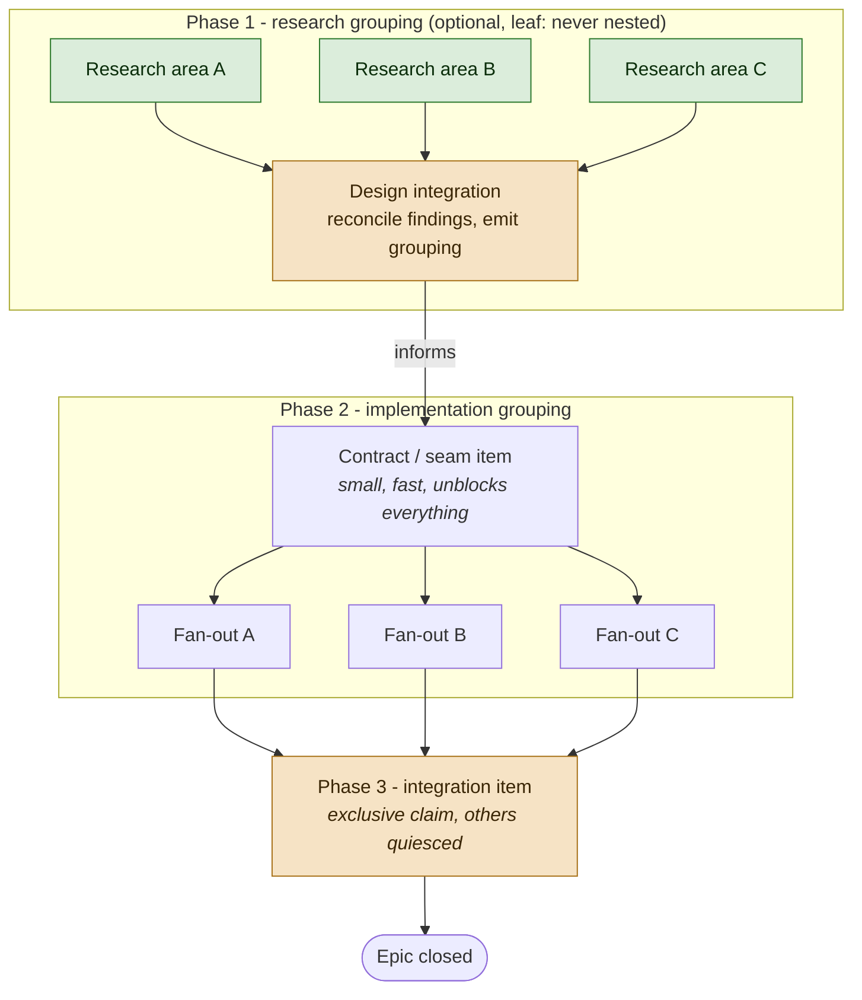
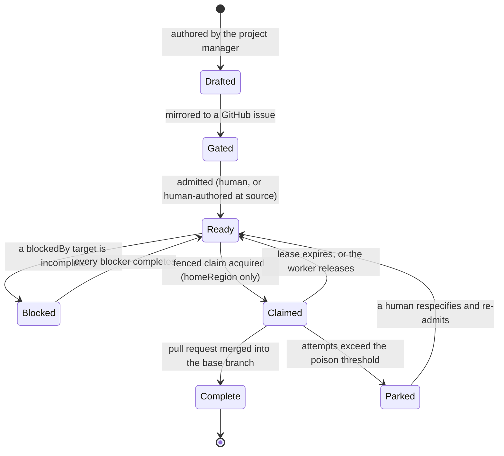

# The agent-operated backlog protocol

This is the **generic base** for an agent-operated backlog: a durable work queue
that lives in `repocontext` memory, is drained concurrently by agent sessions
under fenced claims, and is mirrored to GitHub issues for human oversight.

It is written to be repository-neutral and is the single source of truth for the
protocol. The repository that hosts it consumes it unmodified, so it cannot rot
into a stale copy: if this document is wrong, that repository's own backlog
agents are wrong with it.

The `backlog` topic is a specialisation of ordinary `repocontext` memory:
ordinary memory entries, an extended relation vocabulary, and rules that make
the graph safe for **several agents to drain concurrently**. Read it before
authoring, claiming, or completing a backlog item. The agent definitions that
implement it are [`backlog-pm.base.md`](backlog-pm.base.md) and
[`backlog-worker.base.md`](backlog-worker.base.md); this document defines the
data they operate on. Background on the fencing mechanism is in
[The agent-operated backlog](../../../docs/lattice.api.mcp.repocontext/backlog.md).

## Bindings

Everything repository-specific is a **binding**, written as `{placeholder}`
throughout this document and supplied by the consuming repository. The bindings
are:

| Binding | Meaning | Example |
|---------|---------|---------|
| `{repoId}` | The `repocontext` repository id, as reported by `repocontext_list_repos`. Not your working directory, and not a worktree name. | `my-repo` |
| `{owner}/{repo}` | The GitHub repository that mirrors items as issues. | `my-org/my-repo` |
| `{ghAccount}` | The GitHub account every `gh` call authenticates as. | `my-github-account` |
| `{homeRegion}` | The region claims are taken in. Claims are region-scoped, so this is load-bearing rather than informational. | `uksouth` |
| `{conventionsDoc}` | The repository's contribution conventions: branch naming, commit rules, labels. | `.github/copilot-instructions.md` |
| `{implementationAgent}` | The agent a worker delegates feature implementation to, if the repository has one. | `feature-dev` |

A consuming repository supplies these in one small override file rather than by
editing this document. See [`bindings.example.md`](bindings.example.md) and the
[adoption guide](README.md).

**If the bindings are not available, stop and report.** Do not guess a
repository, an account, or a region: a `gh` call under the wrong identity and a
claim taken in the wrong region both fail in ways that are expensive to unpick.

**Responsibility split - two stores, one source of truth each.** Neither store
copies the other's content, because two writable copies with no transaction
between them diverge, and the divergence surfaces weeks later.

| Concern | Owner |
|---------|-------|
| Item identity, specification, human-visible priority, oversight, audit trail, notifications | **GitHub issues** |
| Dependency graph, code anchors, claims, resume pointers, durable learnings | **repocontext memory** |

A human can reprioritise or respecify without an agent in the loop, because the
thing they edit (the issue) is the thing that is authoritative.

## Item schema

**Topic `backlog`. One entry per item.** The `id` is derived deterministically
from the item - `issue-2057`, never a generated GUID - so a retry merges in
place instead of creating a near-duplicate. The id is the mirrored issue number,
which makes identity and mirroring the same act (see
[Entry gating](#entry-gating---mirror-first-admit-by-label)).

**A memory record has exactly four author-settable scalars**, and this is the
constraint the whole schema is built around. `repocontext_update` accepts
`title`, `body`, `author` and `provenance` on a memory record and **rejects
every other name** - `update(fields: { "priority": "P0" })` fails with *"The
field 'priority' is not a settable scalar on a Memory record"*. There is no
generic field bag. `createdAt` is set by the store at creation and is never
authored. So an item's structured attributes must be carried by the two
collection-valued members that do accept arbitrary content: **tags** and
**links**.

| Carrier | CRDT | Concurrency behaviour |
|---------|------|-----------------------|
| Scalars (`title`, `body`, `author`, `provenance`) | LWW register | Two concurrent writers: one write is **silently lost**. |
| `tags` | add-wins OR-Set | Two concurrent writers: **both survive**, so the collision is visible. |
| `links` | `OrMap<string, OrSet>` per relation | Two concurrent writers: **both survive**, converging per relation. |

The allocation follows directly from that table.

### Attribute tags

Single-valued, low-cardinality attributes are carried as `key:value` **tags**.
Tags are returned by `scan` and `recall` and are matchable by `search`, so an
attribute expressed this way is filterable without reading bodies. Arbitrary
`:` and `/` characters round-trip intact, so a branch name is a legal tag value.

| Tag | Meaning |
|-----|---------|
| `backlog` | Plain marker tag. Every item carries it. |
| `priority:P0` .. `priority:P3` | Ordering priority. |
| `phase:research` \| `phase:implementation` \| `phase:integration` | Which phase of its grouping the item belongs to. Set at authoring, never changed by a worker. |
| `homeRegion:<region>` | The region in which claims for this item are taken. A claim attempted from any other region fails closed, because the underlying lock is cluster-wide and therefore region-scoped. |
| `baseBranch:<branch>` | The branch this item's pull request targets. For an item in a grouping this is the **epic branch**, never `main`. |

**Exactly one tag per prefix.** Two `priority:` tags on one item means two
authors wrote concurrently. Add-wins is what makes that visible rather than
silent, so it is reported as a defect and reconciled, never resolved by picking
one arbitrarily.

Keep attribute tags **low-churn**. OR-Set dots accumulate per add, so an
attribute rewritten every run would grow a long-lived item record without bound.
That is why execution state is deliberately not a tag (see below).

### The item body

`body` holds a pointer to the mirrored GitHub issue - not a copy of its
specification - plus the resume block for the most recent attempt:

- `lastLocation`: branch / pull request number / sha of the last attempt.
- `resumeNote`: a short "what is done, what is left".

`body` is an LWW register, and that is safe here **only because these fields are
written exclusively by the current fenced claim holder**, so there is never more
than one writer. LWW is not unsafe in general; it is unsafe when unserialised.
The fenced claim is what serialises it. Nothing else may write `body` while a
claim is live.

The resume block is **advisory**. A resuming worker re-decides from it and never
continues blindly, because an abandoned run leaves the branch behind but not the
reasoning that produced it.

### What is deliberately not on the item record

- **`attempts`** is derived from the mirrored issue's claim-comment trail, not
  stored. GitHub already owns the audit trail, counting comments needs no
  reverse index, and a per-attempt counter on the item record would be exactly
  the unbounded-churn write the OR-Set dot cost warns against.
- **Claims, leases and fencing tokens** live in the fenced claim/lease surface
  and on short-lived per-run worker records, never on the item.

**Never set a TTL on a backlog item.** Expiry is silent and unlogged, so a
lapsed item that other items declare `blockedBy` starves its dependents
invisibly, with no event anywhere to explain it. Retire an item deliberately
with `forget`. This is a hard exception to the "coordination state is time-boxed"
rule in [Coordination](#coordination---memory-as-a-cross-session-bus): a backlog
item is a ledger entry, not a handoff.

**Recording `baseBranch:` on the item is what makes a retry land correctly.**
Leaving it to worker convention means a resumed or reassigned attempt targets
whatever the worker assumes, which for a sub-item of an epic is usually `main` -
exactly the case the epic branch exists to avoid. An item that is `partOf` an
epic and carries `baseBranch:main` is a **defect**, reported rather than
silently accepted.

## Relation vocabulary - the backlog extension

These extend the small, stable
[knowledge-linking vocabulary](#knowledge-linking---typed-edges-between-memory-entries)
rather than competing with it. `partOf` and `related` are the documented
relations used unchanged, and the four additions follow the same discipline:
few, stable, one direction authored, named for what they assert.

They are documented here so tooling that audits memory - the daily Memory
Accuracy automation in particular - recognises them and does not prune them as
unknown relations.

| Relation | Authored on | Points at | Meaning |
|----------|-------------|-----------|---------|
| `blockedBy` | the **dependent** item | item keys | Every target must be complete before this item is claimable. |
| `anchoredTo` | the item | file / symbol keys | The code this item concerns. Gives digest-drift staleness for free. |
| `claims` | a **per-run worker record** | the item | This run asserts ownership of the item. |
| `partOf` | the sub-item | the epic item | Grouping membership. The documented relation, used unchanged. |
| `integrates` | the **integration item** | the epic it closes out | Marks exactly one item per grouping as its integration join. |
| `informs` | a **research grouping** | the implementation grouping it produced | Keeps the rationale behind a decomposition discoverable from the work it caused. |
| `related` | either | items, gotchas, decisions | Near-duplicate items, and the learnings a prior attempt produced. The documented relation, used unchanged. |

Two rules follow from the store's semantics rather than from taste:

- **`claims` lives on a short-lived per-run record, never on a long-lived one.**
  OR-Set dots accumulate per add, so an edge asserted and released every run
  grows a long-lived record without bound.
- **Edges make a collision detectable, not preventable.** There is no
  compare-and-swap anywhere in this surface: `repocontext_update` preconditions
  on record *existence* only, never on value. A `claims` edge is therefore an
  audit record of who tried, not a lock. Mutual exclusion comes from the fenced
  claim/lease surface, whose monotonic fencing tokens and bounded,
  expiry-reclaimed leases give real exclusion and a real stale-claim reaper.

### Why `anchoredTo` matters

Linking an item to the files it concerns captures those targets' content digests
at link time, so `repocontext_recall` reports the item `stale` once the code
drifts. An item whose anchor moved auto-flags "re-validate the spec before
spending a run on it". This is the one capability GitHub issues cannot provide,
and it doubles as the poison-item mitigation.

Combined with `repocontext_related`, anchors also give each item a **blast
radius**, so two items touching the same code can be serialised at selection
time rather than colliding at merge time. Selecting for disjointness is the
primary throughput mechanism; a concurrency cap is only a backstop for an
unavoidably overlapping ready set.

## The grouping model - three phases

A **grouping** is a set of items delivered together: an epic and its sub-items,
joined by `partOf` edges from sub-item to epic. A grouping runs in up to three
phases.

1. **Research and design** (optional, for a large or uncertain epic). One item
   per research area, fanned out to research agents. Research items produce
   memory entries, docs and proposals rather than code, so their blast radius is
   empty and they parallelise perfectly. The phase terminates in a
   **design-integration item** that reconciles the findings and *emits* the
   implementation grouping, linked to it with `informs`.
2. **Implementation.** Seam-first fan-out: land the contract as one small fast
   item, then fan out implementations against it. Prefer wide DAGs to deep
   chains - a `blockedBy` edge that exists only because of how the work was
   *described* is not a real dependency.
3. **Integration.** The close-out item described below.



Green items have empty or disjoint blast radii and run concurrently without
restriction; amber items are exclusive joins.

**Termination rule, and it is load-bearing: a research grouping does not itself
get a research grouping.** It is a leaf phase. Without this rule an agent asked
to plan an epic can recurse indefinitely into planning the planning. An item
tagged `phase:research` may not author a further research grouping; whatever it
emits is an implementation grouping. Research is also not the default - where
the shape of the work is already understood, a research phase is pure
critical-path depth.

### The integration item

Every grouping terminates in exactly one designated integration item, which is
`blockedBy` every fan-out item in the grouping and carries an `integrates` edge
to the epic it closes out.

It exists to absorb the risk that maximum parallelism creates: N pull requests,
each green in isolation against a different base, none ever tested against the
others. The failure it catches is not a merge conflict (those are visible) but
the epic passing every sub-item's acceptance criteria while failing its own. Its
remit is therefore conflict reconciliation, a **full cross-package test run**
rather than the per-package targeted runs the sub-items ran, and verification
against the *epic's* acceptance criteria.

Three rules attach to it:

- **It is exclusive.** It spans the grouping's whole blast radius by design, so
  it cannot be selected for disjointness like a normal item. It requires an
  exclusive claim with the grouping's other workers quiesced. This is the one
  deliberate exception to the disjointness rule.
- **A grouping is not complete until its integration item is complete.** An epic
  cannot be closed by its sub-items alone, however green they are.
- **A design-integration item may not complete while the grouping it emitted
  lacks a mermaid dependency DAG**, and the gate applies transitively to
  anything those groupings go on to emit. A generated grouping is held to
  exactly the standard a hand-authored one is. That is the case that matters
  most, because a human has least visibility into a decomposition an agent
  assembled, so the obligation must not be launderable through a layer of
  automation.

### Branch inheritance

An epic gets one shared branch and its sub-item pull requests target that
branch; the epic reaches `main` as a single fully-gated pull request once its
integration item passes. Concretely:

- the epic record carries `baseBranch:<type>/epic/<epic-slug>`;
- every sub-item inherits that value as its own `baseBranch:` tag;
- sub-item branches nest under it as `<type>/epic/<epic-slug>/<item-slug>`;
- an item that is `partOf` an epic and carries `baseBranch:main` is reported as
  a defect.

## Computing the ready set

The **ready set** is the items claimable right now. It is always computed as a
topic scan plus per-candidate depth-1 checks, and never as a single graph query.

**Why it cannot be one call.** `repocontext_neighbors` is navigation, not query:
it walks **outbound** edges only, with `depth` clamped to `[1, 3]` and
`maxNodes` to `[1, 100]`. There is no reverse index over memory links - the
reverse cross-reference index serves `repocontext_related` for *symbols* only -
so "who is blocked by me?" and "what did completing X unblock?" cannot be asked
directly. They require either an explicitly authored inverse edge or a topic
scan. Do not design a protocol around a reverse lookup this surface cannot
serve. Scan-plus-check is fine at hundreds of items; this is a coordination
graph, not a queue engine.

The computation:

1. `repocontext_scan` scope `MemoryTopic`, topic `backlog`, paging on the
   continuation token, to enumerate every live item.
2. Drop items already complete, parked, or held under a live fenced claim.
3. For each remaining candidate, one depth-1 `repocontext_neighbors` on
   `blockedBy`. A candidate survives when every target it names is complete.
4. Drop survivors whose mirrored issue is not admitted (see
   [Entry gating](#entry-gating---mirror-first-admit-by-label)). This is checked
   *after* the `blockedBy` narrowing, so it costs one issue read per survivor
   rather than one per item in the topic.
5. Sort by `(priority, createdAt, id)`, then pick from the top three to five.
   Ordering deterministically is fine and is not a defect: `repocontext_claim` is
   real mutual exclusion, so two workers converging on the same item resolve to
   exactly one proceeding and the other observing a clean refusal it can act on
   immediately. Jitter is a cheap way to spread the fan-out across candidates and
   avoid spending a round on a refusal, so it remains worth applying - but it is an
   optimisation, and no worker may rely on it for correctness.
6. Prefer a candidate whose blast radius - its `anchoredTo` anchors plus
   `repocontext_related` on them - is disjoint from the radii of in-flight
   items.

A `scan` is a bulk read and therefore does **not** evaluate TTL or link
staleness: `stale` and `staleLinks` come back `null` there, meaning "not
evaluated" rather than "not stale". Staleness must be read with `recall` on the
specific candidate.

### Defect conditions the ready-set computation must surface

These are reported, never silently absorbed:

- **Dangling `blockedBy`.** A target that returns `exists: false` is a defect,
  not a satisfied dependency. Treating an absent blocker as complete is how a
  deleted item silently releases work that was deliberately gated on it.
- **Stale item.** An `anchoredTo` target drifted, so `recall` reports the item
  `stale`. Re-validate the spec before spending a run on it.
- **Duplicate attribute tag.** Two tags sharing a `key:` prefix means two
  concurrent authors. Reconcile; never pick one arbitrarily.
- **Ready set empty while pending is not.** There is no cycle detection in the
  store, so a dependency cycle is silent permanent starvation. Alarm rather than
  exit quietly.
- **Ready set empty and pending empty.** Exit immediately. Every tick otherwise
  spends a whole session for nothing.
- **`baseBranch:main` on an item that is `partOf` an epic.** See branch
  inheritance above.
- **A grouping whose fan-out is complete but whose integration item is not.**
  The grouping is not complete; do not close the epic.

### Item lifecycle



`Claimed --> Ready` on lease expiry is the normal path, not an exception. Stale
claims are the common case, so a claim is always lease-bounded and reclaimed on
expiry rather than held by a flag that a killed session leaves set forever.

## Mirroring to GitHub

Mirroring exists so a human can see and steer the backlog without reading agent
memory. It is deliberately narrow.

- **Item to issue on creation.** Every item is mirrored, and **the issue number
  becomes the item id** (`issue-2057`). Identity and mirroring are the same act,
  so an unmirrored item does not exist.
- **Epics mirror as GitHub epics with native sub-issues**, matching the existing
  convention that an epic is a container closed by its sub-issues' pull
  requests, never by one pull request of its own.
- **State transitions mirror as an issue comment or a label** - claimed,
  released, parked, complete. This trail is also what `attempts` is counted
  from.
- **Mirroring is one-way for content.** A human editing the issue body is the
  source of truth; the item's `body` points at the issue rather than copying it.
  An agent never writes the item's specification back onto the issue, and never
  reconciles a divergence by overwriting the human's text.
- **Never mirrored:** claims, leases, fencing tokens, anchors and blast radii.
  They churn far faster than an issue timeline should, and they are execution
  state rather than specification.

## Entry gating - mirror-first, admit-by-label

An agent-writable backlog otherwise grows without bound and lets the fleet pick
its own homework. The gate is **both** halves of that choice, because each
closes a different hole, and it is enforced at step 4 of the ready-set
computation:

1. **Visibility is mandatory and structural.** Every item is mirrored to a
   GitHub issue at creation and takes its id from that issue. There is no such
   thing as an unmirrored item, so nothing can be enqueued invisibly.
2. **Agent-authored items additionally require human admission.** An item an
   agent proposed is opened carrying the existing `needs-specification` label
   and is **excluded from the ready set while that label is present**. A human
   removes the label to admit it. An item a human filed, or one the product
   owner approved in conversation with the project manager, is admitted at
   creation.

This reuses the repository's existing `needs-specification` and `stale` label
ladder rather than inventing a parallel state machine, and it keeps admission on
the GitHub side where a human can exercise it without an agent in the loop -
consistent with GitHub owning oversight.

Poison items ride the same ladder: after N failed attempts an item is parked
(labelled `stale`) rather than burning a whole session per scheduled tick.

## Worked example

Two items, one blocked by the other, both anchored to real code and both
belonging to epic `issue-2099`.

```text
# 1. The blocker. The issue is filed first, so its number is the item id.
remember(repoId: "{repoId}", topic: "backlog", id: "issue-2100",
         kind: "Note", author: "backlog-pm",
         title: "Add the WAL shard batching seam",
         body: "Spec: https://github.com/{owner}/{repo}/issues/2100",
         tags: ["backlog", "priority:P1", "phase:implementation",
                "homeRegion:{homeRegion}", "baseBranch:feat/epic/wal-batching"],
         addLinks: {
           "partOf":     ["repo/{repoId}/mem/backlog/issue-2099"],
           "anchoredTo": ["repo/{repoId}/file/src/lattice/BPlusTree/Wal/IWalShardGrain.cs"]
         })

# 2. The dependent. blockedBy is authored on the DEPENDENT, pointing back.
remember(repoId: "{repoId}", topic: "backlog", id: "issue-2101",
         kind: "Note", author: "backlog-pm",
         title: "Batch the shipper poll against the new seam",
         body: "Spec: https://github.com/{owner}/{repo}/issues/2101",
         tags: ["backlog", "priority:P1", "phase:implementation",
                "homeRegion:{homeRegion}", "baseBranch:feat/epic/wal-batching"],
         addLinks: {
           "partOf":     ["repo/{repoId}/mem/backlog/issue-2099"],
           "blockedBy":  ["repo/{repoId}/mem/backlog/issue-2100"],
           "anchoredTo": ["repo/{repoId}/file/src/lattice/BPlusTree/Wal/IWalShardGrain.cs"]
         })
```

Reading it back:

- `scan` scope `MemoryTopic` topic `backlog` enumerates both, with their tags.
- `neighbors(key: "repo/{repoId}/mem/backlog/issue-2101", relation: "blockedBy",
  depth: 1)` returns `issue-2100`, which is incomplete, so `issue-2101` is
  **excluded from the ready set**. `issue-2100` names no blocker and is ready.
- Completing `issue-2100` moves `issue-2101` into the ready set on the next
  computation. Nothing pushes that transition, because there is no reverse
  index; it is observed by the next scan-plus-check pass.
- Deleting `issue-2100` instead makes `issue-2101`'s `blockedBy` target return
  `exists: false`. That is reported as a **defect**, not treated as satisfied.
- Editing `IWalShardGrain.cs` makes `recall` report both items `stale`, because
  their `anchoredTo` target's digest drifted. Both are re-validated before a run
  is spent on them.
- Epic `issue-2099` stays open until the item carrying `integrates` to it
  completes, even once `issue-2100` and `issue-2101` are both merged.
