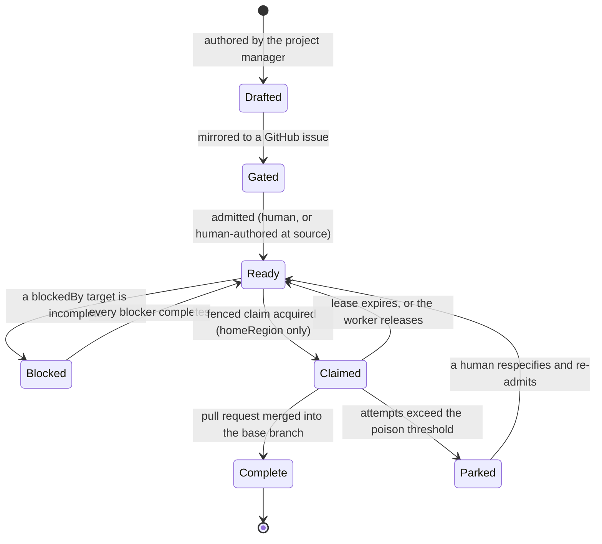

# The agent-operated backlog protocol

This is the **generic base** for an agent-operated backlog: a durable work queue
that lives in `repocontext` memory, is drained concurrently by agent sessions
under fenced claims, and is mirrored to GitHub issues for human oversight.

It is written to be repository-neutral and is the single source of truth for the
protocol. The repository that hosts it consumes it unmodified, so it cannot rot
into a stale copy: if this document is wrong, that repository's own backlog
agents are wrong with it.

The `backlog` topic is a specialisation of ordinary `repocontext` memory:
ordinary memory entries, an extended relation vocabulary, and rules that make
the graph safe for **several agents to drain concurrently**. Read it before
authoring, claiming, or completing a backlog item. The agent definitions that
implement it are [`backlog-pm.base.md`](backlog-pm.base.md) and
[`backlog-worker.base.md`](backlog-worker.base.md); this document defines the
data they operate on. Background on the fencing mechanism is in
[The agent-operated backlog](../../../docs/lattice.api.mcp.repocontext/backlog.md).

## Bindings

Everything repository-specific is a **binding**, written as `{placeholder}`
throughout this document and supplied by the consuming repository. The bindings
are:

| Binding | Meaning | Example |
|---------|---------|---------|
| `{repoId}` | The `repocontext` repository id, as reported by `repocontext_list_repos`. Not your working directory, and not a worktree name. | `my-repo` |
| `{owner}/{repo}` | The GitHub repository that mirrors items as issues. | `my-org/my-repo` |
| `{ghAccount}` | The GitHub account every `gh` call authenticates as. | `my-github-account` |
| `{homeRegion}` | The region claims are taken in. Claims are region-scoped, so this is load-bearing rather than informational. | `uksouth` |
| `{conventionsDoc}` | The repository's contribution conventions: branch naming, commit rules, labels. | `.github/copilot-instructions.md` |
| `{implementationAgent}` | The agent a worker delegates feature implementation to, if the repository has one. | `feature-dev` |

A consuming repository supplies these in one small override file rather than by
editing this document. See [`bindings.example.md`](bindings.example.md) and the
[adoption guide](README.md).

**If the bindings are not available, stop and report.** Do not guess a
repository, an account, or a region: a `gh` call under the wrong identity and a
claim taken in the wrong region both fail in ways that are expensive to unpick.

**Responsibility split - two stores, one source of truth each.** Neither store
copies the other's content, because two writable copies with no transaction
between them diverge, and the divergence surfaces weeks later.

| Concern | Owner |
|---------|-------|
| Item identity, specification, human-visible priority, oversight, audit trail, notifications | **GitHub issues** |
| Dependency graph, code anchors, claims, resume pointers, durable learnings | **repocontext memory** |

A human can reprioritise or respecify without an agent in the loop, because the
thing they edit (the issue) is the thing that is authoritative.

## Item schema

**Topic `backlog`. One entry per item.** The `id` is derived deterministically
from the item - `issue-2057`, never a generated GUID - so a retry merges in
place instead of creating a near-duplicate. The id is the mirrored issue number,
which makes identity and mirroring the same act (see
[Entry gating](#entry-gating---mirror-first-admit-by-label)).

**A memory record has exactly four author-settable scalars**, and this is the
constraint the whole schema is built around. `repocontext_update` accepts
`title`, `body`, `author` and `provenance` on a memory record and **rejects
every other name** - `update(fields: { "priority": "P0" })` fails with *"The
field 'priority' is not a settable scalar on a Memory record"*. There is no
generic field bag. `createdAt` is set by the store at creation and is never
authored. So an item's structured attributes must be carried by the two
collection-valued members that do accept arbitrary content: **tags** and
**links**.

| Carrier | CRDT | Concurrency behaviour |
|---------|------|-----------------------|
| Scalars (`title`, `body`, `author`, `provenance`) | LWW register | Two concurrent writers: one write is **silently lost**. |
| `tags` | add-wins OR-Set | Two concurrent writers: **both survive**, so the collision is visible. |
| `links` | `OrMap<string, OrSet>` per relation | Two concurrent writers: **both survive**, converging per relation. |

The allocation follows directly from that table.

### Attribute tags

Single-valued, low-cardinality attributes are carried as `key:value` **tags**.
Tags are returned by `scan` and `recall` and are matchable by `search`, so an
attribute expressed this way is filterable without reading bodies. Arbitrary
`:` and `/` characters round-trip intact, so a branch name is a legal tag value.

| Tag | Meaning |
|-----|---------|
| `backlog` | Plain marker tag. Every item carries it. |
| `priority:P0` .. `priority:P3` | Ordering priority. |
| `phase:research` \| `phase:implementation` \| `phase:integration` | Which phase of its grouping the item belongs to. Set at authoring, never changed by a worker, and it never carries execution state - a `phase:complete` or `phase:review` tag is a defect, not a status. |
| `homeRegion:<region>` | The region in which claims for this item are taken. **Verify this is enforced before relying on it.** The intent is that a claim attempted from any other region fails closed, because the underlying lock is cluster-wide and therefore region-scoped - but that is a property of the deployment, not of the tag. On a single-region deployment `lattice_list_regions` reports only `current`, claims report region `local`, and a geographic value such as `uksouth` is **not enforced at all**: a claim from anywhere succeeds. Treat a value the cluster does not route as a **defect in the binding**, and note the failure is worse than a no-op - an unenforced safety assumption that the protocol documents as enforced is more dangerous than an absent one, because it is relied upon. |
| `baseBranch:<branch>` | The branch this item's pull request targets. For an item in a grouping this is the **epic branch**, never `main`. |
| `state:complete` \| `state:parked` | The item's **terminal** state, and the only execution state carried on the item. Absent means the item is live. See [Recording completion](#recording-completion). |
| `resource:<name>` | **Optional, repeatable-by-name but one tag per distinct resource.** Names a scarce **non-file** resource the item needs exclusively - a shared test box, a physical device, a deployment slot, a rate-limited external account. Two items naming the same resource may never be in flight together, however disjoint their code radii are. |

**Exactly one tag per prefix.** Two `priority:` tags on one item means two
authors wrote concurrently. Add-wins is what makes that visible rather than
silent, so it is reported as a defect and reconciled, never resolved by picking
one arbitrarily.

Keep attribute tags **low-churn**. OR-Set dots accumulate per add, so an
attribute rewritten every run would grow a long-lived item record without bound.
That is why *per-run* execution state - attempts, claims, leases, review rounds -
is deliberately not a tag (see below). The one exception is the terminal
`state:` tag, which is written at most once in an item's life and so costs a
single dot.

### Recording completion

**An item is complete when, and only when, it carries `state:complete`.** The
tag is the record; nothing else is. Without a defined encoding every worker
invents one, and the inventions do not agree - which is how an item ends up
tagged `phase:complete` (clobbering a reserved authoring attribute) or described
as finished only in prose inside `body`, where the ready-set computation cannot
see it.

Three rules make the tag trustworthy:

- **It is written by the claim holder, under its fencing token, and only after
  the thing it asserts is true.** For an implementation item that means *after*
  the pull request is merged into its `baseBranch`, not after CI goes green and
  not after a review passes. Green-and-unmerged is not complete: the lifecycle
  transition is `Claimed --> Complete: pull request merged into the base branch`,
  and an item tagged complete while its pull request is still open is a defect
  the next ready-set computation reports. **An item that produces no pull
  request completes on the equivalent durable act, not on a weaker one.** A
  research item's product is its findings, so it completes once those findings
  are recorded somewhere that outlives the item - the mirrored issue and durable
  memory - and never merely because the run ended. The item's own `body` does
  not count: it is a resume pointer rather than a deliverable, and a finding
  that exists only in the worker's context is lost the moment the session does.
  A design-integration item carries the further gate described under the
  grouping model: it may not complete while a grouping it emitted still lacks
  its dependency DAG.
- **It is terminal and it is not a status field.** There is no `state:review`,
  no `state:in-progress`, no `state:blocked`. Everything short of terminal is
  derived from state that already exists elsewhere and is authoritative there:
  blocked from `blockedBy`, claimed from the claim surface, admitted from the
  mirrored issue's labels. Adding a mutable status tag would duplicate all three
  and churn the record besides.
- **`body` explains, the tag decides.** The resume block says what landed and
  what is left, for a human and for the next claim holder. It is prose and is
  never parsed. No agent may infer completeness from it.

A worker that cannot merge - because it lost its claim, because review requested
changes, or because it ran out of run - **does not tag the item complete**. It
writes an honest `resumeNote`, posts `result=released`, and leaves the item live
for the next holder. That is the normal path, not a failure.

### The item body

`body` holds a pointer to the mirrored GitHub issue - not a copy of its
specification - plus the resume block for the most recent attempt:

- `lastLocation`: branch / pull request number / sha of the last attempt.
- `resumeNote`: a short "what is done, what is left".

`body` is an LWW register, and that is safe here **only because these fields are
written exclusively by the current fenced claim holder**, so there is never more
than one writer. LWW is not unsafe in general; it is unsafe when unserialised.
The fenced claim is what serialises it. Nothing else may write `body` while a
claim is live.

The resume block is **advisory**. A resuming worker re-decides from it and never
continues blindly, because an abandoned run leaves the branch behind but not the
reasoning that produced it.

### What is deliberately not on the item record

- **`attempts`** is derived from the mirrored issue's claim-comment trail, not
  stored. GitHub already owns the audit trail, counting comments needs no
  reverse index, and a per-attempt counter on the item record would be exactly
  the unbounded-churn write the OR-Set dot cost warns against.
- **Claims, leases and fencing tokens** live in the fenced claim/lease surface
  and on short-lived per-run worker records, never on the item.

**Never set a TTL on a backlog item.** Expiry is silent and unlogged, so a
lapsed item that other items declare `blockedBy` starves its dependents
invisibly, with no event anywhere to explain it. Retire an item deliberately
with `forget`. This is a hard exception to the "coordination state is time-boxed"
rule in [Coordination](#coordination---memory-as-a-cross-session-bus): a backlog
item is a ledger entry, not a handoff.

**Recording `baseBranch:` on the item is what makes a retry land correctly.**
Leaving it to worker convention means a resumed or reassigned attempt targets
whatever the worker assumes, which for a sub-item of an epic is usually `main` -
exactly the case the epic branch exists to avoid. An item that is `partOf` an
epic and carries `baseBranch:main` is a **defect**, reported rather than
silently accepted.

## Relation vocabulary - the backlog extension

These extend the small, stable
[knowledge-linking vocabulary](#knowledge-linking---typed-edges-between-memory-entries)
rather than competing with it. `partOf` and `related` are the documented
relations used unchanged, and the four additions follow the same discipline:
few, stable, one direction authored, named for what they assert.

They are documented here so tooling that audits memory - the daily Memory
Accuracy automation in particular - recognises them and does not prune them as
unknown relations.

| Relation | Authored on | Points at | Meaning |
|----------|-------------|-----------|---------|
| `blockedBy` | the **dependent** item | item keys | Every target must be complete before this item is claimable. |
| `anchoredTo` | the item | file / symbol keys | The code this item concerns. Gives digest-drift staleness for free. |
| `claims` | a **per-run worker record** | the item | This run asserts ownership of the item. |
| `partOf` | the sub-item | the epic item | Grouping membership. The documented relation, used unchanged. |
| `integrates` | the **integration item** | the epic it closes out | Marks exactly one item per grouping as its integration join. |
| `informs` | a **research grouping** | the implementation grouping it produced | Keeps the rationale behind a decomposition discoverable from the work it caused. |
| `related` | either | items, gotchas, decisions | Near-duplicate items, and the learnings a prior attempt produced. The documented relation, used unchanged. |

Two rules follow from the store's semantics rather than from taste:

- **`claims` lives on a short-lived per-run record, never on a long-lived one.**
  OR-Set dots accumulate per add, so an edge asserted and released every run
  grows a long-lived record without bound.
- **Edges make a collision detectable, not preventable.** There is no
  compare-and-swap anywhere in this surface: `repocontext_update` preconditions
  on record *existence* only, never on value. A `claims` edge is therefore an
  audit record of who tried, not a lock. Mutual exclusion comes from the fenced
  claim/lease surface, whose monotonic fencing tokens and bounded,
  expiry-reclaimed leases give real exclusion and a real stale-claim reaper.

### Why `anchoredTo` matters

Linking an item to the files it concerns captures those targets' content digests
at link time, so `repocontext_recall` reports the item `stale` once the code
drifts. An item whose anchor moved auto-flags "re-validate the spec before
spending a run on it". This is the one capability GitHub issues cannot provide,
and it doubles as the poison-item mitigation.

Combined with `repocontext_related`, anchors also give each item a **blast
radius**, so two items touching the same code can be serialised at selection
time rather than colliding at merge time. Selecting for disjointness is the
primary throughput mechanism; a concurrency cap is only a backstop for an
unavoidably overlapping ready set.

## The grouping model - three phases

A **grouping** is a set of items delivered together: an epic and its sub-items,
joined by `partOf` edges from sub-item to epic. A grouping runs in up to three
phases.

1. **Research and design** (optional, for a large or uncertain epic). One item
   per research area, fanned out to research agents. Research items produce
   memory entries, docs and proposals rather than code, so their blast radius is
   empty and they parallelise perfectly. The phase terminates in a
   **design-integration item** that reconciles the findings and *emits* the
   implementation grouping, linked to it with `informs`.
2. **Implementation.** Seam-first fan-out: land the contract as one small fast
   item, then fan out implementations against it. Prefer wide DAGs to deep
   chains - a `blockedBy` edge that exists only because of how the work was
   *described* is not a real dependency.
3. **Integration.** The close-out item described below.


Green items have empty or disjoint blast radii and run concurrently without
restriction; amber items are exclusive joins.

**Termination rule, and it is load-bearing: a research grouping does not itself
get a research grouping.** It is a leaf phase. Without this rule an agent asked
to plan an epic can recurse indefinitely into planning the planning. An item
tagged `phase:research` may not author a further research grouping; whatever it
emits is an implementation grouping. Research is also not the default - where
the shape of the work is already understood, a research phase is pure
critical-path depth.

**A `phase:research` item's deliverable is a durable memory entry plus an issue
comment - not a branch, and not a pull request.** State this when dispatching
one, because the default assumption of a worker built to ship code is that it
must produce a diff. Three consequences follow:

- **It does not need a branch at all**, which sidesteps the branch-naming rules
  above entirely. A session whose workspace was auto-provisioned with a
  generated branch name - frequently one carrying a username and no `<type>/`
  prefix, both of which many repositories forbid outright - simply never pushes
  it, and the non-conforming name never reaches the remote.
- **A well-evidenced negative is a completed item, not a failed one.** Say so at
  dispatch. A research item exists to be capable of killing the work that would
  otherwise follow it, and a worker that believes a negative reflects on it will
  reach for an encouraging maybe. The cheapest possible outcome of a research
  phase is discovering early that the implementation phase must not be built.
- **It must not touch the implementation surface.** A research item that edits
  `src/` has silently become an implementation item without being admitted as
  one, and its changes bypass the grouping its findings were meant to shape.

If a research item genuinely must produce a file, that is a signal it was
mis-scoped as research - and the file needs a conforming branch arranged
deliberately, rather than an auto-generated one pushed by default.

### The integration item

Every grouping terminates in exactly one designated integration item, which is
`blockedBy` every fan-out item in the grouping and carries an `integrates` edge
to the epic it closes out.

It exists to absorb the risk that maximum parallelism creates: N pull requests,
each green in isolation against a different base, none ever tested against the
others. The failure it catches is not a merge conflict (those are visible) but
the epic passing every sub-item's acceptance criteria while failing its own. Its
remit is therefore conflict reconciliation, a **full cross-package test run**
rather than the per-package targeted runs the sub-items ran, and verification
against the *epic's* acceptance criteria.

Three rules attach to it:

- **It is exclusive.** It spans the grouping's whole blast radius by design, so
  it cannot be selected for disjointness like a normal item. It requires an
  exclusive claim with the grouping's other workers quiesced. This is the one
  deliberate exception to the disjointness rule.
- **A grouping is not complete until its integration item is complete.** An epic
  cannot be closed by its sub-items alone, however green they are.
- **A design-integration item may not complete while the grouping it emitted
  lacks a mermaid dependency DAG**, and the gate applies transitively to
  anything those groupings go on to emit. A generated grouping is held to
  exactly the standard a hand-authored one is. That is the case that matters
  most, because a human has least visibility into a decomposition an agent
  assembled, so the obligation must not be launderable through a layer of
  automation.

### Branch inheritance

An epic gets one shared branch and its sub-item pull requests target that
branch; the epic reaches `main` as a single fully-gated pull request once its
integration item passes. Concretely:

- the epic record carries `baseBranch:<type>/epic/<epic-slug>`;
- every sub-item inherits that value as its own `baseBranch:` tag;
- sub-item branches are named `<type>/epic/<epic-slug>-<item-slug>`;
- an item that is `partOf` an epic and carries `baseBranch:main` is reported as
  a defect.

**The final separator is a hyphen, not a slash, and this is forced by git rather
than chosen.** An earlier revision of this document prescribed nesting sub-items
as `<type>/epic/<epic-slug>/<item-slug>`. That form is **unimplementable**
whenever the epic branch is parked on the bare slug - which the first rule above
also mandates - because git stores a branch as a file at `refs/heads/<name>`, so
`refs/heads/X` and `refs/heads/X/anything` cannot coexist. The remote refuses it:

```text
cannot lock ref 'refs/heads/fix/epic/my-epic/my-item':
'refs/heads/fix/epic/my-epic' exists
```

This is a directory/file ref conflict, not a policy or permissions failure, and
no naming choice on the sub-item's side avoids it. It was found by a worker
attempting the push, having been reviewed twice in prose without either reader
noticing - reading a ref name does not tell you git will refuse it.

Note the corollary, because it is the part that gives false assurance: **a CI
branch-name guard will happily accept the nested form**, since it is a
well-formed lower-case name under an allowed prefix. A guard that validates a
string the underlying system then rejects is worse than no guard on that
dimension, because it converts "unverified" into "verified" without adding
verification.

The alternative - parking the epic on `<type>/epic/<epic-slug>/integration` and
leaving the namespace free for true nesting - does work, and is the better shape
for a grouping created from scratch. It is not adopted as the default because it
costs a rename of the epic branch and a rebase of every in-flight sub-item if
adopted mid-grouping. Choose it at epic-creation time or not at all.

**Two invariants matter more than the name, and are what a reviewer should
actually check.** The name is a convenience; these are correctness:

1. the sub-item branch is descended from the epic branch -
   `git merge-base --is-ancestor origin/<epic-branch> HEAD` exits `0`;
2. the sub-item's pull request **targets the epic branch, never `main`**.

A sub-item that satisfies both under an off-convention name is fine and is
reported as a naming nit. A sub-item that satisfies neither under a perfectly
conventional name has silently bypassed the epic, and its work will not be
collected by the integration item.

**Do not use a workspace `rename_branch` affordance to satisfy this rule without
checking its output.** In at least one environment it applies a configured
prefix that injects a username and omits the `<type>/` prefix entirely,
producing a name this repository forbids outright and which fails the CI guard.
Rename the branch directly and verify the resulting name.

## Computing the ready set

The **ready set** is the items claimable right now. It is always computed as a
topic scan plus per-candidate depth-1 checks, and never as a single graph query.

**Why it cannot be one call.** `repocontext_neighbors` is navigation, not query:
it walks **outbound** edges only, with `depth` clamped to `[1, 3]` and
`maxNodes` to `[1, 100]`. There is no reverse index over memory links - the
reverse cross-reference index serves `repocontext_related` for *symbols* only -
so "who is blocked by me?" and "what did completing X unblock?" cannot be asked
directly. They require either an explicitly authored inverse edge or a topic
scan. Do not design a protocol around a reverse lookup this surface cannot
serve. Scan-plus-check is fine at hundreds of items; this is a coordination
graph, not a queue engine.

The computation:

1. `repocontext_scan` scope `MemoryTopic`, topic `backlog`, paging on the
   continuation token, to enumerate every live item.
2. Drop items tagged `state:complete` or `state:parked`, and items held under a
   live fenced claim (`repocontext_claim_status`). Completeness is read from the
   tag and from nothing else - never from prose in `body`, and never from a
   merged-looking pull request.
3. **Drop grouping records.** A grouping (an epic, or any item that other items
   declare themselves `partOf`) is a container, not a unit of work. It is
   completed by its integration item, never claimed directly. Omitting this step
   lets a worker claim the epic itself and duplicate the entire fan-out that the
   decomposition just created.

   Build the exclusion set **during the step-1 scan**, at no extra cost: collect
   the target of every `partOf` edge you encounter as you page through the topic.
   Do **not** attempt this as a reverse lookup - "who is `partOf` me?" is exactly
   the reverse-index query this surface cannot serve, which is why the check has
   to be a by-product of the enumeration rather than a per-candidate probe.

   The same conclusion can be reached from the data alone, and belt-and-braces is
   cheap here: a grouping should also carry `blockedBy` its own integration item,
   which drops it at step 4 anyway. Author both. The redundancy is one-way safe -
   it can only ever remove a container from the ready set, never admit one.
4. For each remaining candidate, one depth-1 `repocontext_neighbors` on
   `blockedBy`. A candidate survives when every target it names carries
   `state:complete`.
5. Drop survivors whose mirrored issue is not admitted (see
   [Entry gating](#entry-gating---mirror-first-admit-by-label)). This is checked
   *after* the `blockedBy` narrowing, so it costs one issue read per survivor
   rather than one per item in the topic.
6. Sort by `(priority, createdAt, id)`, then pick from the top three to five.
   Ordering deterministically is fine and is not a defect: `repocontext_claim` is
   real mutual exclusion, so two workers converging on the same item resolve to
   exactly one proceeding and the other observing a clean refusal it can act on
   immediately. Jitter is a cheap way to spread the fan-out across candidates and
   avoid spending a round on a refusal, so it remains worth applying - but it is an
   optimisation, and no worker may rely on it for correctness.
7. Prefer a candidate whose blast radius - its `anchoredTo` anchors plus
   `repocontext_related` on them - is disjoint from the radii of in-flight
   items.
8. **Exclude, rather than merely deprioritise, a candidate whose `resource:`
   tags collide with an in-flight item's.** Step 7 is a *preference* computed
   over `anchoredTo` **files**, so a scarce non-file resource is invisible to it:
   an item whose real constraint is "needs exclusive use of the shared test box"
   may have an empty code radius and will therefore look maximally disjoint and
   sort to the front. That is the exact inversion of the truth. Resource
   collision is a hard exclusion, not a tie-break, because the failure it
   prevents - two agents recreating the same container under one another - is
   not a merge conflict that surfaces loudly but a corrupted experiment that
   reports a plausible wrong answer.

A `scan` is a bulk read and therefore does **not** evaluate TTL or link
staleness: `stale` and `staleLinks` come back `null` there, meaning "not
evaluated" rather than "not stale". Staleness must be read with `recall` on the
specific candidate.

### Defect conditions the ready-set computation must surface

These are reported, never silently absorbed:

- **Dangling `blockedBy`.** A target that returns `exists: false` is a defect,
  not a satisfied dependency. Treating an absent blocker as complete is how a
  deleted item silently releases work that was deliberately gated on it.
- **Stale item.** An `anchoredTo` target drifted, so `recall` reports the item
  `stale`. Re-validate the spec before spending a run on it.
- **Duplicate attribute tag.** Two tags sharing a `key:` prefix means two
  concurrent authors. Reconcile; never pick one arbitrarily.
- **Execution state on a `phase:` tag.** `phase:` carries the authored phase and
  nothing else, so `phase:complete` or `phase:review` means a worker wrote a
  status into a reserved attribute - and, because add-wins never replaces, the
  item's real phase is either lost or now duplicated. Reconcile to the authored
  phase plus a `state:` tag if one is warranted.
- **Item tagged `state:complete` with an unmerged pull request.** Completion was
  claimed before the merge that defines it. The item is not complete; the merge
  is outstanding work.
- **Green, mergeable pull request on an item with no live claim and no
  `state:complete`.** The attempt died between CI passing and the merge. This is
  the cheapest possible resume and should be picked up before any fresh item.
- **Ready set empty while pending is not.** There is no cycle detection in the
  store, so a dependency cycle is silent permanent starvation. Alarm rather than
  exit quietly.
- **Ready set empty and pending empty.** Exit immediately. Every tick otherwise
  spends a whole session for nothing.
- **`baseBranch:main` on an item that is `partOf` an epic.** See branch
  inheritance above.
- **A grouping whose fan-out is complete but whose integration item is not.**
  The grouping is not complete; do not close the epic.

### Item lifecycle



`Claimed --> Ready` on lease expiry is the normal path, not an exception. Stale
claims are the common case, so a claim is always lease-bounded and reclaimed on
expiry rather than held by a flag that a killed session leaves set forever.

### The lease is shorter than the work - renew before, never after

**The cluster clamps a claim lease to a maximum of 300 seconds, and defaults to
30 seconds when `leaseSeconds` is omitted.** A build-and-test cycle on a
non-trivial repository exceeds both. The consequence is not hypothetical and was
observed on the first live run of this protocol: two independent workers each
had a claim lapse mid-build, while actively working the item.

Both recovered correctly - `repocontext_claim_status` showed no other holder and
no queue, and the re-claim returned a fencing token incremented by exactly one -
so the mechanism behaved as designed. **The gap is that the lease duration is
shorter than the shortest useful unit of work**, which turns a safety property
into a routine occurrence.

Why that matters more than a retry: during the lapse the item is, to any other
worker computing the ready set, simply **unclaimed**. Step 2 drops items "held
under a live fenced claim" and there is no live claim, so there is no state
distinguishable from never-started. A sibling recomputing in that window would
have found the item available and begun duplicate work on an item another worker
was mid-build on. Nothing prevented that. Only the timing did.

Rules, in force for every worker:

- **Always pass `leaseSeconds` explicitly.** The 30-second default is shorter
  than almost any real operation and will lapse under a single test run.
- **Renew immediately BEFORE any long operation, never after it.** Treat a
  build, a test run, or anything expected to exceed roughly two minutes as
  requiring a renewal first. Renewing afterwards is renewing during the window
  you needed to be covered for.
- **On discovering a lapsed claim, re-claim and then CHECK THE FENCING TOKEN.**
  If it incremented as expected and the holder is you, that is a clean re-claim;
  proceed, and report it. If the holder is not you, or the token did not move as
  expected, **stop and report** - somebody else has been working the item, and
  continuing would produce two divergent attempts at one unit of work.
- **Never write anything under a token you know to be stale.**

Fixes worth making to the surface itself, in preference order: raise the clamp
above a realistic build time, or make it per-phase, since a research item and a
build item have very different natural durations; auto-renew on a timer for the
lifetime of a long child process rather than asking a worker to predict its
duration; and distinguish "lease expired while work was in progress" from "never
claimed" in the ready set, so a lapse degrades to a warning rather than to
availability.

This was surfaced only because a worker volunteered an unflattering detail it
had already recovered from. A protocol that discourages that reporting would
have shipped this gap silently.

### Detecting and picking up a dropped lease

Raising the lease only makes a lapse rarer. It does not say what a lapse *means*
or who may act on it, and that is the part that has to be specified, because the
store cannot answer the only question that matters.

**The central difficulty: a lapse has two causes and the surface cannot tell
them apart.** An expired lease means either

1. the holder is **gone** - crashed, killed, context-exhausted, session ended -
   and the item genuinely needs picking up; or
2. the holder is **alive and working**, and merely failed to renew in time.

Both present identically: no live claim. Nothing in the lock, the item record, or
the ready set distinguishes them, and there is no liveness signal independent of
the renewal itself. Treating every lapse as case 1 duplicates live work; treating
every lapse as case 2 leaks items permanently to dead agents. Neither default is
safe, so the protocol makes the distinction *unnecessary* rather than pretending
to resolve it.

**Detection is pull, not push. Renewal IS the liveness probe.** A worker is never
notified that its lease expired; it finds out only by attempting a renew (or a
fenced write) and being refused. There is no callback and no interrupt. A worker
that never renews never learns it was evicted, and will keep working - which is
precisely case 2 seen from the inside. This is why renewal is mandatory before
long operations rather than merely advisable: it is the only mechanism by which a
worker discovers it has lost the item.

**What fencing does and does not protect, which is the load-bearing point.** The
monotonic fencing token makes *store* writes safe: a superseded worker's write is
rejected, so two workers can never both mutate the item record. It protects
nothing else. **Git, GitHub, the filesystem and any deployed environment are
outside the fence.** A superseded worker can still push a branch, open a pull
request, comment on an issue, or recreate a container, and none of those will be
refused on account of a stale token.

Therefore:

- **Renew immediately before every externally-visible side effect, and verify the
  token, not merely that the call succeeded.** Push, pull-request creation, issue
  comments, and any environment mutation are all gated on a fresh, verified
  renewal. A renewal that *returns* is not enough; the token it reports must be
  the one you hold.
- **On refusal, abort without side effects.** Do not push "just this branch", do
  not open the pull request, do not comment. Report and stop.
- **Never destroy your own work on discovering you were superseded.** The branch
  and commits from an evicted attempt are the takeover's most useful input. Leave
  them, and say in your report exactly where they are. Deleting them converts a
  recoverable handover into a restart.

**A lapsed item is quarantined before it becomes claimable.** It does not
re-enter the ready set the instant the lease expires. It becomes eligible only
after a quarantine interval that comfortably exceeds the longest plausible
renewal gap - one full lease is the working default. This is what buys the
distinction the store cannot make: an alive-but-late holder reclaims its own item
inside the quarantine and continues (its fence increments, nothing else changes),
whereas a genuinely dead holder never does, and the item is released to others
only after that window closes. The cost is bounded latency on genuine failures;
the benefit is that the common case stops being a race.

**One full lease is the wrong quarantine while the clamp stands, and elapsed time
is the wrong evidence.** The working default above assumes the lease
approximates the work. It does not: the cluster clamps to 300 seconds against
turns that routinely run for hours, so a live worker's claim spends almost all of
its life presenting as lapsed. This was observed on the first real run - a
productive worker sat at fence 12, mid-implementation, while `claim_status`
reported `isHeld: false` and the item showed no unmet blockers. To any agent
computing a ready set it was indistinguishable from abandoned work, and the lock
would have granted it on request. A quarantine measured in lease multiples is
therefore no protection at all here, because the window it names has already
elapsed in the ordinary case.

Until the clamp is raised, quarantine on **evidence of work, not elapsed time**.
An item whose previous claimant shows a branch pushed, an issue comment, or a
fencing token that has moved within the last hour is a **live holder**, whatever
the lease says, and must not be taken over. Only the sustained absence of all
three licenses a takeover. This inverts the default deliberately, because the two
errors are not symmetric: waiting on genuinely dead work costs bounded latency,
whereas taking over live work destroys an entire session's unpushed output at the
moment it finally tries to write, and destroys it silently, since the evicted
worker learns of the eviction only when its next fenced write is refused.

**Taking over is an explicit, evidenced act.** A worker claiming an item whose
previous claim lapsed must:

1. **Read the resume block first** (`lastLocation`, `resumeNote`) and treat it as
   **advisory**. An abandoned run leaves its branch behind but not the reasoning
   that produced it, and the resume note was written before whatever ended the
   run - so it describes an intent, not a verified state. Re-derive.
2. **Verify the recorded branch against the remote** rather than trusting
   `lastLocation`. It may not have been pushed at all - the most common shape,
   since eviction tends to happen mid-build, before any push.
3. **Never force-push or rewrite the prior attempt's branch.** Build on it or
   start beside it; do not destroy the only record of what the previous holder
   did.
4. **Post a takeover marker on the mirrored issue** naming the prior owner, the
   prior fencing token, and the new one. This is what makes `attempts`
   countable - it is derived from the claim-comment trail, not stored - and it is
   the only human-visible trace that an item changed hands.
5. **Check for a contradicting marker before doing any work.** If the prior owner
   posted activity *after* the takeover marker, it was case 2 and is still alive:
   stop, report the collision, and let a human adjudicate. Two agents silently
   working one item is the failure this whole section exists to prevent.

**A takeover counts as an attempt.** It is not a free retry. Repeated takeovers
on one item drive it toward the poison threshold and into `Parked`, which is
correct: an item that keeps evicting its holders is either mis-specified or too
large, and both need a human rather than another attempt.

**A claim marker records a CLAIMANT, not a grant.** A worker whose lease lapses
and who re-claims its own item is continuing the same work under a new fencing
token; custody never changed. It must **not** post a second claim marker - the
marker's purpose is to record who holds the item, and that did not change, so a
second one is noise in the exact trail the parking sweep counts. Disclose the
fence movement in the item body and in the outcome marker instead.

The corollary is load-bearing: **a lapse-and-re-claim by the same owner does not
count as an attempt.** Counting it would park an item purely for taking longer
than one lease, which inverts what parking is for - it exists to catch items that
keep *evicting* their holders, not items that are simply long. Only a genuine
change of custody, evidenced by a takeover marker naming a different prior owner,
is an attempt.

**Reporting a clean re-claim is mandatory, not optional.** A worker that lapses
and successfully re-claims its own item inside the quarantine has had a
near-miss, not a non-event. Report it. Both instances of this on the protocol's
first run were reported voluntarily by workers that had already recovered, and
that is the only reason the gap was found at all - had they stayed silent, the
protocol would have shipped with a race nobody had observed.

## Mirroring to GitHub

Mirroring exists so a human can see and steer the backlog without reading agent
memory. It is deliberately narrow.

- **Item to issue on creation.** Every item is mirrored, and **the issue number
  becomes the item id** (`issue-2057`). Identity and mirroring are the same act,
  so an unmirrored item does not exist.
- **Epics mirror as GitHub epics with native sub-issues**, matching the existing
  convention that an epic is a container closed by its sub-issues' pull
  requests, never by one pull request of its own.
- **State transitions mirror as an issue comment or a label** - claimed,
  released, parked, complete. This trail is also what `attempts` is counted
  from.
- **Mirroring is one-way for content.** A human editing the issue body is the
  source of truth; the item's `body` points at the issue rather than copying it.
  An agent never writes the item's specification back onto the issue, and never
  reconciles a divergence by overwriting the human's text.
- **Never mirrored:** claims, leases, fencing tokens, anchors and blast radii.
  They churn far faster than an issue timeline should, and they are execution
  state rather than specification.

## Entry gating - mirror-first, admit-by-label

An agent-writable backlog otherwise grows without bound and lets the fleet pick
its own homework. The gate is **both** halves of that choice, because each
closes a different hole, and it is enforced at step 4 of the ready-set
computation:

1. **Visibility is mandatory and structural.** Every item is mirrored to a
   GitHub issue at creation and takes its id from that issue. There is no such
   thing as an unmirrored item, so nothing can be enqueued invisibly.
2. **Agent-authored items additionally require human admission.** An item an
   agent proposed is opened carrying the existing `needs-specification` label
   and is **excluded from the ready set while that label is present**. A human
   removes the label to admit it. An item a human filed, or one the product
   owner approved in conversation with the project manager, is admitted at
   creation.

This reuses the repository's existing `needs-specification` and `stale` label
ladder rather than inventing a parallel state machine, and it keeps admission on
the GitHub side where a human can exercise it without an agent in the loop -
consistent with GitHub owning oversight.

Poison items ride the same ladder: after N failed attempts an item is parked
(labelled `stale`) rather than burning a whole session per scheduled tick.

## Worked example

Two items, one blocked by the other, both anchored to real code and both
belonging to epic `issue-2099`.

```text
# 1. The blocker. The issue is filed first, so its number is the item id.
remember(repoId: "{repoId}", topic: "backlog", id: "issue-2100",
         kind: "Note", author: "backlog-pm",
         title: "Add the WAL shard batching seam",
         body: "Spec: https://github.com/{owner}/{repo}/issues/2100",
         tags: ["backlog", "priority:P1", "phase:implementation",
                "homeRegion:{homeRegion}", "baseBranch:feat/epic/wal-batching"],
         addLinks: {
           "partOf":     ["repo/{repoId}/mem/backlog/issue-2099"],
           "anchoredTo": ["repo/{repoId}/file/src/lattice/BPlusTree/Wal/IWalShardGrain.cs"]
         })

# 2. The dependent. blockedBy is authored on the DEPENDENT, pointing back.
remember(repoId: "{repoId}", topic: "backlog", id: "issue-2101",
         kind: "Note", author: "backlog-pm",
         title: "Batch the shipper poll against the new seam",
         body: "Spec: https://github.com/{owner}/{repo}/issues/2101",
         tags: ["backlog", "priority:P1", "phase:implementation",
                "homeRegion:{homeRegion}", "baseBranch:feat/epic/wal-batching"],
         addLinks: {
           "partOf":     ["repo/{repoId}/mem/backlog/issue-2099"],
           "blockedBy":  ["repo/{repoId}/mem/backlog/issue-2100"],
           "anchoredTo": ["repo/{repoId}/file/src/lattice/BPlusTree/Wal/IWalShardGrain.cs"]
         })
```

Reading it back:

- `scan` scope `MemoryTopic` topic `backlog` enumerates both, with their tags.
- `neighbors(key: "repo/{repoId}/mem/backlog/issue-2101", relation: "blockedBy",
  depth: 1)` returns `issue-2100`, which is incomplete, so `issue-2101` is
  **excluded from the ready set**. `issue-2100` names no blocker and is ready.
- Completing `issue-2100` moves `issue-2101` into the ready set on the next
  computation. Nothing pushes that transition, because there is no reverse
  index; it is observed by the next scan-plus-check pass.
- Deleting `issue-2100` instead makes `issue-2101`'s `blockedBy` target return
  `exists: false`. That is reported as a **defect**, not treated as satisfied.
- Editing `IWalShardGrain.cs` makes `recall` report both items `stale`, because
  their `anchoredTo` target's digest drifted. Both are re-validated before a run
  is spent on them.
- Epic `issue-2099` stays open until the item carrying `integrates` to it
  completes, even once `issue-2100` and `issue-2101` are both merged.
