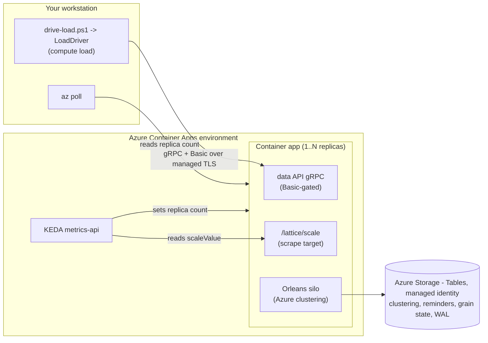

# ClusterScaling - autoscaling on Azure Container Apps

A deployable, end-to-end sample that runs a real multi-silo Orleans.Lattice
cluster on **Azure Container Apps (ACA)** and proves the
`Orleans.Lattice.Scaling` autoscaling signal drives **KEDA replica scale-out on
the compute axis**. A bundled .NET load driver generates compute-axis pressure,
and the deploy tooling wires an ACA KEDA `metrics-api` scale rule to the
`/lattice/scale` signal so ACA adds replicas under load and removes them
afterwards.

This is the "does it work in anger" capstone for the autoscaling-signal work
(issue #1216, epic #1190). It **consumes** the shipped scaling surface
(`MapLatticeScalingSignal`, `AddLatticeScalingSignal`, the health check, and the
reference ACA scale rule from `Orleans.Lattice.Scaling`); it does not redefine
them.

## The two axes (read this first)

Orleans.Lattice's scaling signal reports two axes:

- **Compute axis** - activation and dispatch pressure (CPU, activation counts).
  This is the **only** axis wired to replica count. When compute pressure rises,
  `scaleValue` climbs and the autoscaler adds replicas.
- **Storage axis** - retained WAL bytes. This is **advisory**: it feeds
  observability and the health check, and it never inflates replica count.
  Relieving storage pressure is an operational action (rebalancing WAL
  partitions), not an autoscaling one.

**This sample drives the compute axis.** The load driver issues a high op rate
across many distinct trees and keys with a tiny fixed payload, so it grows
activation + dispatch pressure without growing retained bytes. Bulk-loading
large values would move the storage axis and KEDA would never scale - so the
driver keeps payloads deliberately small.

## Architecture



- **Silo host** (`src/ClusterScaling.Silo`) - one container image, run as many
  ACA replicas. Each replica joins a genuine Orleans cluster over **Azure
  Storage clustering (managed identity)**, persists grain state and the Lattice
  **WAL** to **Azure Table storage (managed identity)**, and co-hosts:
  - the write-capable **data API gRPC** surface, gated by a Basic admin
    credential whose salted PBKDF2 hash arrives as an ACA **secret**; and
  - the `/lattice/scale` HTTP signal endpoint the KEDA scale rule scrapes, plus
    `/healthz` and `/readyz` health endpoints.
- **Load driver** (`src/ClusterScaling.LoadDriver`) - a small .NET console that
  speaks gRPC to the data API over TLS, presents the admin Basic credential, and
  drives sustained compute-axis load, printing offered-load throughput.
- **Deploy tooling** (`deploy/`) - `main.bicep` and `registry.bicep` plus
  `deploy.ps1`, `drive-load.ps1`, and `teardown.ps1`.

## Credential and TLS posture

- The operator supplies a **plaintext** admin password to `deploy.ps1` (as a
  `SecureString`). The script hashes it with the repository's
  `tools/New-LatticeStateCredential.ps1` helper (salted PBKDF2-SHA256) and passes
  only the **hash** to the bicep template.
- The bicep injects the hash as a container-app **secret**, surfaced through the
  `LATTICE_DATA_USER_<admin>` environment variable the data-API authorizer reads.
  The plaintext is never stored, never baked into the image, and never passed on
  a command line.
- The data-API `BasicAdminDataApiAuthorizer` verifies the inbound
  `authorization: Basic base64(user:pass)` header against that hash in constant
  time. An anonymous or wrong-password call is rejected with `PermissionDenied`.
- Basic-over-cleartext would be unsafe on its own. It is legitimate here because
  **ACA terminates TLS at its managed ingress**: the credential rides an
  encrypted HTTP/2 channel from the driver to the ingress, and the container is
  reachable only through that ingress. This is the upgrade over the localhost
  `PasswordProtection` sample, which has no transport encryption.

## Prerequisites

- An Azure subscription and `az login`, on an account that can **create role
  assignments** (the deploy assigns *Storage Table Data Contributor* and
  *AcrPull* to the app's managed identity).
- Azure CLI with the `containerapp` extension (`deploy.ps1` installs/updates it).
- The .NET SDK (net10.0) to run the load driver.
- PowerShell 7+.

No container registry, image, or local Docker daemon is required up front:
`deploy.ps1` provisions a Basic Azure Container Registry as part of the
deployment and builds the silo image into it for you (see below).

## The silo image

You don't build the image, provision a registry, or run Docker by hand -
`deploy.ps1` orchestrates all of it. By default it:

1. provisions a **Basic Azure Container Registry** (`registry.bicep`) into the
   resource group;
2. runs `az acr build` from the repository root against
   [`src/ClusterScaling.Silo/Dockerfile`](src/ClusterScaling.Silo/Dockerfile),
   which builds and pushes the image **server-side in that registry** (no local
   Docker daemon) and streams the build log to your console; and
3. wires the container app to pull the image using the managed identity
   (`AcrPull`), so no registry username or key is ever used.

Two overrides are available:

- `-Registry <name>` - build+push into an **existing** ACR you already own
  instead of provisioning a new one. The managed-identity `AcrPull` pull path is
  still wired for you.
- `-ContainerImage <ref>` - deploy a **pre-built** external image and skip both
  the registry provisioning and the build. No `AcrPull` is wired; you own that
  image's pull access. Build one yourself with:

  ```powershell
  az acr build --registry <myregistry> --image clusterscaling-silo:latest `
    --file samples/ClusterScaling/src/ClusterScaling.Silo/Dockerfile .
  ```

## Deploy

```powershell
cd samples/ClusterScaling/deploy
$pw = Read-Host -AsSecureString -Prompt 'Admin password'
./deploy.ps1 `
  -ResourceGroup rg-clusterscaling `
  -Location eastus `
  -AdminPassword $pw `
  -MinReplicas 1 -MaxReplicas 10
```

`deploy.ps1` is idempotent. It provisions the Basic container registry, builds
and pushes the silo image into it (see above), then provisions the managed
identity, the Tables-only storage account (shared-key access disabled), the
Storage Table Data Contributor and AcrPull role assignments, the Log Analytics
workspace, the Container Apps environment, and the container app with the KEDA
`metrics-api` scale rule (`valueLocation: scaleValue`, `targetValue: 1`,
`minReplicas`/`maxReplicas`). It prints the ingress FQDN and the exact
`drive-load.ps1` command to run next.

## Drive load and observe scale-out

```powershell
$pw = Read-Host -AsSecureString -Prompt 'Admin password'
./drive-load.ps1 `
  -ResourceGroup rg-clusterscaling `
  -AdminPassword $pw `
  -Rate 2000 -Duration 300
```

`drive-load.ps1` resolves the ingress FQDN, launches the bundled LoadDriver
(compute-axis load), and - while it runs - polls `az containerapp replica list`
to print a **replica-count timeline** interleaved with the driver's continuous
offered-load throughput. Example shape:

```
Replica-count timeline (offered-load lines come from the driver):
  [t=    0s] replicas = 1
  [t=   10s] replicas = 1
    t=  10.0s  offered=    20,000  offered/s=    2,000  completed=    19,880 ...
  [t=   40s] replicas = 3
  [t=   70s] replicas = 6
  ...
```

**Timing expectations.** Scale-out **lags** the load by tens of seconds. Three
delays stack between offered load and a new replica:

1. the KEDA polling interval (ACA default 30s),
2. the KEDA scale-down cooldown / stabilization window, and
3. the signal's producer-side EWMA smoothing.

That is by design (it prevents replica thrashing). Sustain the load past the
window - the 5 minute default is comfortable - then watch the count settle back
toward `minReplicas` after the driver stops:

```powershell
az containerapp replica list -g rg-clusterscaling -n <app> --query 'length(@)' -o tsv
```

The `minReplicas` floor keeps the scrape target reachable; the `maxReplicas`
ceiling is the hard cap the autoscaler never exceeds regardless of how high
`scaleValue` climbs.

## Verify the credential gate

An anonymous or wrong-password call to the data API is rejected. The load driver
fails fast with a clear message if `-AdminPassword` does not match what
`deploy.ps1` hashed into the secret, so a mismatch surfaces immediately rather
than as silent zero throughput.

## Teardown

```powershell
./teardown.ps1 -ResourceGroup rg-clusterscaling
```

Deletes the whole resource group. An idle deployment is **not free** even at
`minReplicas=1`: the always-on replica bills vCPU + memory per second, Log
Analytics bills for ingested logs, and the storage account bills for the tables
it retains. Tear down as soon as an experiment finishes.

## When to use / when not to use

**Use this sample when you want to:**

- See the compute-axis scaling signal drive real horizontal scale-out on live
  infrastructure, end to end.
- Copy a correct managed-identity ACA wiring for a multi-silo Lattice cluster
  (Azure clustering + reminders + grain state + WAL, no keys or connection
  strings) and a KEDA `metrics-api` scale rule against `/lattice/scale`.
- Understand the Basic-over-managed-TLS credential posture for the write-capable
  data API and the ACA-secret hash injection.

**Do not use this sample when:**

- You want to scale on the storage axis. It is advisory and never wired to
  replica count; relieving WAL pressure is a rebalancing action, not an
  autoscaling one.
- You need a local, dependency-free demo. Start with `HelloWorld` or, for the
  credential mechanism alone, `PasswordProtection` (single in-process silo, no
  Azure).
- You want a production deployment blueprint verbatim. This is a teaching
  sample: it uses external ingress so you can drive load from your workstation,
  a single storage account, and permissive storage network ACLs. A production
  deployment would scope ingress (IP allow-list or internal), separate the WAL
  account from clustering, and lock down the storage firewall.

## Layout

```
samples/ClusterScaling/
  README.md
  src/
    ClusterScaling.Silo/          # multi-silo host: clustering + WAL + data API gRPC + scale signal
      Program.cs
      BasicAdminDataApiAuthorizer.cs
      ClusterScaling.Silo.csproj
    ClusterScaling.LoadDriver/    # compute-axis gRPC load generator
      Program.cs
      LoadDriverOptions.cs
      ClusterScaling.LoadDriver.csproj
  deploy/
    main.bicep                    # identity, storage, role, ACA env + app, KEDA scale rule
    deploy.ps1                    # hash password, provision, print FQDN (idempotent)
    drive-load.ps1                # run LoadDriver + poll replica timeline
    teardown.ps1                  # delete the resource group
```
