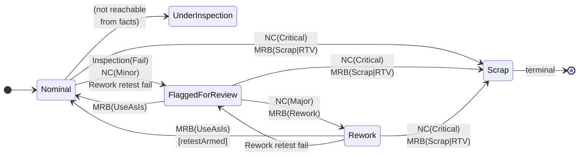

# MultiSiteManufacturing — approach

The reasoning and semantics behind the sample: the domain model and
fold, the chaos-tier layering, seeder strategy, replication
discovery, and the gotchas that shaped the code. For the structural
view (topology, components, grains, trees, sequence diagrams) see
[`architecture.md`](./architecture.md). For a capability overview see
[`README.md`](./README.md).

---

## 1. Process model and facts

A turbine blade moves through six process stages — `Forge`,
`HeatTreat`, `Machining`, `NDT`, `MRB`, `FAI` — distributed across
seven named sites (Ohio Forge, Nagoya Heat Treatment, Stuttgart
Machining, Stuttgart CMM Lab, Toulouse NDT Lab, Cincinnati MRB,
Bristol FAI).

Every operator action emits a fact carrying `PartSerialNumber`,
`FactId`, `HybridLogicalClock`, origin `ProcessSite`, `OperatorId`,
and a human description. Fact kinds: `ProcessStepCompleted`,
`InspectionRecorded`, `NonConformanceRaised`, `MRBDisposition`,
`ReworkCompleted`, `FinalAcceptance`.

## 2. Severity lattice and fold



The lattice is totally ordered. `ComplianceFold.Fold` sorts facts by
`(WallClockTicks, Counter, FactId)` before applying
`StateTransitions.Apply` as a running `Max`, with a `retestArmed` flag
threaded through to gate `MRBDisposition(UseAsIs)` demotion of
`Rework` → `Nominal`. The arrival-order baseline (`NaiveFold.Step`)
delegates to the same `StateTransitions.Apply` — the **only**
difference between the two folds is the order in which facts are
applied. Divergence in the dashboard is therefore purely an ordering
artefact, which is the property the sample exists to demonstrate.

`Scrap` is terminal: any fact applied to a part already in `Scrap` is
a no-op. `ReworkCompleted(retestPassed=false)` escalates to
`FlaggedForReview` and clears `retestArmed` — a failed retest is
defect evidence and must remain observable, even when a prior
`UseAsIs` had demoted the part.

## 3. Two backends, one router

`IFactBackend` has two implementations running side by side behind a
fan-out `FederationRouter`:

- **Baseline** — an Orleans grain per part that appends facts in
  arrival order. Drifts under chaos-induced reorder. On peer
  clusters the baseline is *also* fed by the inbound replication
  endpoint (decoding every replicated `mfg-facts` Set entry and
  re-emitting it locally), which models naive event-log
  replication — enough for cold-seed parity across clusters, but
  still vulnerable to divergence under concurrent writes because
  the peer applies replicated batches in HLC order while the
  originating cluster applied its local writes in arrival order.
- **Lattice** — persists facts to the `mfg-facts` tree and computes
  `ComplianceState` by scanning and folding in HLC order. Converges
  under reorder.

Chaos applies via a `ChaosFactBackend` decorator that wraps each
backend **independently**. Applying a 10 % transient-fault rate to
only the lattice backend (or only the baseline) is the canonical way
to surface divergence without a scripted saga. Storage-provider-level
chaos (wrapping the `TableServiceClient` itself) is explicitly out of
scope — the decorator tier exercises the same failure modes at a
cleaner seam without coupling tests to the Azure SDK.

## 4. Fault-injection tiers

Each tier models a distinct real-world failure class and can be
exercised independently from the UI and from tests:

| Tier | Seam | Models | Toggle |
|---:|---|---|---|
| 1 | `IProcessSiteGrain.AdmitAsync` (origin) | Site unavailable / WAN latency | `IsPaused`, `DelayMs` |
| 2 | `ChaosFactBackend` decorator (per backend) | Storage jitter, transient failure, write amplification | `IBackendChaosGrain` |
| 3 | Reorder buffer inside `ProcessSiteGrain` | Cross-site out-of-order arrival after a pause lifts | `ReorderEnabled` |
| 4 | `FederationRouter.IsDroppedByPartitionAsync` + `PartCrdtStore` shadow prefix | Simulated intra-cluster silo partition | `IPartitionChaosGrain.IsPartitioned` |
| 4b | `ReplicatorGrain.TickAsync` early-return + `POST /replicate/{tree}` 503 | App-level cross-cluster replication pause | `IReplicationDisconnectGrain.IsDisconnected` |
| 5 | `docker network disconnect` against the peer Traefik | Genuine cross-cluster transport partition | Manual `docker network` commands |

Tier 4b is a pure application-level shortcut that leaves the local
replog growing; once the flag clears, replication resumes from the
current cursor and catches the peer up with the accumulated backlog.
Tier 5 achieves the same effect at the transport layer without
co-operation from the application — useful as a forcing function
when proving the replicator's cursor and backoff behaviour.

All chaos state lives in **durable** grains (`IProcessSiteGrain`,
`IBackendChaosGrain`, `IPartitionChaosGrain`,
`IReplicationDisconnectGrain`) persisted to Azure Table Storage. A
host restart re-renders current chaos configuration from grain
storage — only the UI's fly-out open/closed bit is process-local.
This matches how a real MES would persist site availability flags.

## 5. Bulk-load strategy

`InventorySeeder` is an `IHostedService` that runs on every silo. A
singleton `IInventorySeedStateGrain` with a persisted `HasSeeded` flag
gates the work, so only the first silo to win the race actually
seeds. Five parts (one representative per reachable
`ComplianceState` — `Nominal`, `Nominal` + FAI signed off,
`FlaggedForReview`, `Rework`, `Scrap`) are emitted through
`FederationRouter` — the same path operators use — so both backends
agree before chaos is applied.

`UnderInspection` is deliberately skipped: the fact grammar has no
`InspectionStarted` transition, so no fact sequence can fold to
`UnderInspection` in v1.

Chaos knobs are **snapshotted, zeroed for the duration of the seed,
and restored** afterwards, so a previous session's chaos presets
cannot make seed time non-deterministic. Serial numbers are
deterministic (`HPT-BLD-S1-2028-00001` … `-00005`); HLCs are stamped
relative to `DateTimeOffset.UtcNow` at seed time so the dashboard
always shows "recent" activity.

## 6. Cross-cluster replication

Replication is **outside** `Orleans.Lattice` — zero library changes,
zero `LatticeOptions` edits. Two properties drive the design: the
library's current API surface does not expose a change feed or
source-HLC-preserving apply, and the sample wants to be a worked
example of what you build on top of Lattice today. When those
library primitives eventually ship, the pieces called out below
collapse into thin adapters (marked `FUTURE:` in the source).

### 6.1 Discovery via an HLC-ordered replog

An `IOutgoingGrainCallFilter` (`LatticeReplicationFilter`) fires
after every `ILattice.SetAsync` / `DeleteAsync` on an opted-in tree
and appends an envelope to a sibling tree `_replog__{tree}` keyed
`{wallTicks:D20}{counter:D10}|{clusterId}|{op}|{key}`. A forward lex
scan of the replog is HLC-ascending; the cluster id is the
tiebreaker for cross-cluster ordering.

> **Gotcha — read args before `await context.Invoke()`.** Orleans
> codegen releases reference-type invokable argument slots as soon as
> the wire message is dispatched. A post-await read of
> `context.Request.GetArgument(0)` returns `null` for reference
> types. Struct args like `CancellationToken` survive the release but
> are not useful here. The filter stashes method name, tree name, and
> the original key into local variables **before** the await, then
> acts on them after the call completes.

The replog envelope does **not** carry the user bytes. At ship time
the replicator reads the primary tree's current `(value, hlc)` for
each distinct key in the batch, so a key overwritten since the log
entry landed still ships its latest value — which is correct under
LWW.

### 6.2 Loop-break on inbound apply

The inbound endpoint sets `RequestContext["lattice.replay"] =
sourceCluster` before calling `SetAsync` / `DeleteAsync`. The
outgoing filter checks this flag and skips appending to the replog
when the write is itself a replicated apply. This breaks the
A → B → A cycle at the application layer without any library
support.

### 6.3 Replicator cadence

`IReplicatorGrain` is keyed `"{tree}|{peer}"` and persists a cursor
to `msmfgGrainState` (not to the lattice — the cursor is operational
state, not domain state, with a different lifecycle). Cadence is
split because Orleans reminders have a 1-minute minimum period:

- A **1-minute reminder** (`keepalive`) re-activates the grain after
  silo restart or idle deactivation.
- A **3-second grain timer** (`RegisterGrainTimer`) drives the actual
  shipping loop. Grain timers have no minimum period and are
  auto-disposed on deactivation — the idiomatic sub-minute cadence
  pattern under Orleans 10.

Each tick scans `_replog__{tree}` from `Cursor+` to end (bounded by
batch size), dedupes by key keeping the highest HLC, resolves the
current primary value per key, POSTs to the peer, advances the
cursor on ack, backs off exponentially on failure.

### 6.4 Compaction

`IReplogJanitorGrain` runs on a 10-minute reminder, reads every peer
replicator's cursor, takes the **min**, and deletes replog entries
with `hlc <= min − 24h`. Never prunes ahead of the slowest peer.

### 6.5 Opt-in matrix

`ReplicationTopology.ReplicatedTrees` is tree-level opt-in;
`ReplicationTopology.IsKeyReplicated(tree, key)` layers a per-key
filter on top. The shipped defaults opt all three domain trees in;
the per-key filter excludes `{serial}/operator` from `mfg-part-crdt`.

| Tree / key shape | Replicated? | Why |
|---|---|---|
| `mfg-facts` — `{serial}/{hlc}/{factId}` | Yes | Write-once immutable keys; double-apply is an idempotent `SetAsync` on an existing key with an identical value. |
| `mfg-site-activity-index` — `{site}/{hlc}/{serial}` | Yes | Same reasoning — one entry per fact, never overwritten. |
| `mfg-part-crdt` — `{serial}/labels/{label}` (G-Set) | Yes | Union is commutative, associative, idempotent; two clusters adding the same label converge trivially. |
| `mfg-part-crdt` — `{serial}/operator` (LWW register) | **No** — filtered at origin | LWW by the **receiver's** local HLC would diverge; concurrent cross-cluster writes to the same register would pick different winners on each side. |
| `_replog__{tree}` | No (per-cluster) | Local discovery ledger — has no meaning on the peer. |

The operator-register filter is the only tree-specific filter today.
When `Orleans.Lattice` ships source-HLC-preserving apply, the filter
collapses and the whole `mfg-part-crdt` tree replicates
unconditionally.

### 6.6 Anti-entropy backstop

A narrow race exists where the primary `SetAsync` succeeds but the
filter's replog append fails. A second reminder on each replicator
runs a periodic full-tree sweep (`AntiEntropyCursor`) that re-ships
any primary entry whose HLC is newer than the cursor. O(N) but
bounded; acceptable as a backstop because the replog append is the
common path and the sweep only needs to catch rare gaps.

## 7. UI design

Blazor Server components own an `IAsyncEnumerable<T>` subscription
acquired in `OnInitializedAsync` and cancelled in `Dispose`. The
subscription is backed by a `System.Threading.Channels.Channel<T>`
owned by the underlying service (`InventoryService`, `SiteRegistry`,
`DivergenceTracker`, `DashboardBroadcaster`). The service pushes
whenever domain state changes; the component applies the message to
its local view-model and calls `InvokeAsync(StateHasChanged)`.

`DashboardBroadcaster` additionally publishes every routed or
replicated `Fact` to a cluster-wide Orleans stream backed by Azure
Storage Queues (provider `DashboardStreams`, namespace
`msmfg.dashboard.facts`, single queue `msmfgdashboard-0`) and
subscribes to the same stream on every silo. This is what lets a
Blazor circuit pinned to silo B receive live updates for facts that
landed on silo A — each silo's broadcaster is both publisher and
subscriber, and the per-circuit `Channel<T>` fan-out runs only on the
receiving side of the stream, so the same code path handles
local-origin and peer-origin facts uniformly. The queue-backed
transport also gives the feed durability: messages enqueued while a
silo is restarting or briefly unreachable are picked up once it
reconnects, subscription metadata is persisted in the Azure Table
`PubSubStore`, and the broadcaster adds bounded retries around
publish and subscribe plus a top-level catch in the receive handler
so a single poison fact can't stall the queue.

No polling. No `Timer`. No `setInterval`. gRPC server-streaming RPCs
are thin adapters over the same channels.

Operator actions funnel through a single **"Next: …"** button driven
by `NextActionResolver`, which picks the deterministic next step from
the HLC-sorted fact log. Inline branch buttons appear only when the
state genuinely requires operator choice (MRB disposition, NDT
outcome, rework retest). A separate always-available form raises
non-conformances at any lifecycle stage.

The chaos fly-out is a single persistent side panel — clearly
labelled ("Simulate 4-second latency at Toulouse NDT Lab", not
`delay=4000`) — with per-site rows, per-backend sliders, and canned
presets (*Transoceanic backhaul outage*, *Customs hold*, *MRB
weekend*, *Lattice storage flakes*, *Cluster split*, *Replication
disconnect*, *Clear all*). An active-chaos banner outside the
fly-out ensures operators cannot close the panel and forget about
active injections.

## 8. Testing philosophy

All tests run against Orleans `TestingHost` fixtures with in-memory
storage — no Azurite dependency in the test suite, keeping CI fast
and hermetic. The cross-cluster replication path is covered by unit
tests on the deterministic pieces (replog key encoding, topology
parsing, wire-type JSON round-trips). Two-cluster end-to-end
replication is exercised manually via Docker Compose because the
`TestingHost` fixture materialises a single cluster.

Long-running stress tests are tagged `[Category("Chaos")]` and
excluded from the iterative development filter:

```powershell
dotnet test --filter "TestCategory!=Chaos"
