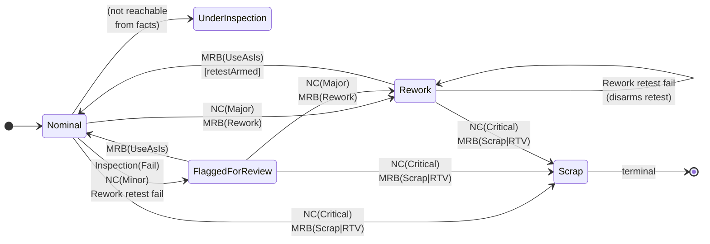

# MultiSiteManufacturing - approach

The reasoning and semantics behind the sample: the domain model and
fold, the chaos-tier layering, seeder strategy, replication
discovery, and the gotchas that shaped the code. For the structural
view (topology, components, grains, trees, sequence diagrams) see
[`architecture.md`](./architecture.md). For a capability overview see
[`README.md`](./README.md).

---

## 1. Process model and facts

A turbine blade moves through six process stages - `Forge`,
`HeatTreat`, `Machining`, `NDT`, `MRB`, `FAI` - distributed across
seven named sites (Ohio Forge, Nagoya Heat Treatment, Stuttgart
Machining, Stuttgart CMM Lab, Toulouse NDT Lab, Cincinnati MRB,
Bristol FAI).

Every operator action emits a fact carrying `PartSerialNumber`,
`FactId`, `HybridLogicalClock`, origin `ProcessSite`, `OperatorId`,
and a human description. Fact kinds: `ProcessStepCompleted`,
`InspectionRecorded`, `NonConformanceRaised`, `MrbDisposition`,
`ReworkCompleted`, `FinalAcceptance`.

## 2. Severity lattice and fold


```mermaid
stateDiagram-v2
    direction LR
    [*] --> Nominal
    Nominal --> UnderInspection: (not reachable<br/>from facts)
    Nominal --> FlaggedForReview: Inspection(Fail)<br/>NC(Minor)<br/>Rework retest fail
    Nominal --> Rework: NC(Major)<br/>MRB(Rework)
    FlaggedForReview --> Rework: NC(Major)<br/>MRB(Rework)
    FlaggedForReview --> Nominal: MRB(UseAsIs)
    Rework --> Nominal: MRB(UseAsIs)<br/>[retestArmed]
    Rework --> Rework: Rework retest fail<br/>(disarms retest)
    Nominal --> Scrap: NC(Critical)<br/>MRB(Scrap|RTV)
    FlaggedForReview --> Scrap: NC(Critical)<br/>MRB(Scrap|RTV)
    Rework --> Scrap: NC(Critical)<br/>MRB(Scrap|RTV)
    Scrap --> [*]: terminal
```

The lattice is totally ordered. `ComplianceFold.Fold` sorts facts by
`(WallClockTicks, Counter, FactId)` before applying
`StateTransitions.Apply` as a running `Max`. The only step that lowers
the state is `MrbDisposition(UseAsIs)`: it demotes `FlaggedForReview` to
`Nominal` outright, and demotes `Rework` to `Nominal` only when a
`retestArmed` flag threaded through the fold is set. The arrival-order baseline (`NaiveFold.Step`)
delegates to the same `StateTransitions.Apply` - the **only**
difference between the two folds is the order in which facts are
applied. Divergence in the dashboard is therefore purely an ordering
artefact, which is the property the sample exists to demonstrate.

`Scrap` is terminal: any fact applied to a part already in `Scrap` is
a no-op. `ReworkCompleted(retestPassed=false)` raises the part to at least
`FlaggedForReview` (a part already in `Rework` stays there) and clears
`retestArmed` - a failed retest is
defect evidence and must remain observable, even when a prior
`UseAsIs` had demoted the part.

## 3. Two backends, one router

`IFactBackend` has two implementations running side by side behind a
fan-out `FederationRouter`:

- **Baseline** - an Orleans grain per part that appends facts in
  arrival order. Drifts under chaos-induced reorder. On peer
  clusters the baseline is *also* fed by the inbound replication
  endpoint (decoding every replicated `mfg-facts` Set entry and
  re-emitting it locally), which models naive event-log
  replication - enough for cold-seed parity across clusters, but
  still vulnerable to divergence under concurrent writes because
  the peer applies replicated batches in HLC order while the
  originating cluster applied its local writes in arrival order.
- **Lattice** - persists facts to the `mfg-facts` tree and reads each
  part's `ComplianceState` from the library-maintained folded view
  `mfg-compliance` (folded in HLC order), falling back to a scan and an
  inline HLC-ordered fold when the view is not yet populated. Converges
  under reorder.

Chaos applies via a `ChaosFactBackend` decorator that wraps each
backend **independently**. Applying a 10 % transient-fault rate to
only the lattice backend (or only the baseline) is the canonical way
to surface divergence without a scripted saga. Storage-provider-level
chaos (wrapping the `TableServiceClient` itself) is explicitly out of
scope - the decorator tier exercises the same failure modes at a
cleaner seam without coupling tests to the Azure SDK.

## 4. Fault-injection tiers

Each tier models a distinct real-world failure class and can be
exercised independently from the UI and from tests:

| Tier | Seam | Models | Toggle |
|---:|---|---|---|
| 1 | `IProcessSiteGrain.AdmitAsync` (origin) | Site unavailable / WAN latency | `IsPaused`, `DelayMs` |
| 2 | `ChaosFactBackend` decorator (per backend) | Storage jitter, transient failure, write amplification, ingress reordering | `IBackendChaosGrain` |
| 3 | Reorder buffer inside `ProcessSiteGrain` (releases admitted facts four at a time, shuffled) | Cross-site out-of-order arrival | `ReorderEnabled` |
| 4 | `FederationRouter.IsDroppedByPartitionAsync` + `PartCrdtStore` shadow prefix | Simulated intra-cluster silo partition | `IPartitionChaosGrain.SetPartitionedAsync` |
| 4b | `ChaosReplicationTransport` decorator on `IReplicationTransport` (outbound) + `ChaosReplicationApplier` decorator on `IReplicationApplier` (inbound) | App-level cross-cluster replication pause | `IReplicationDisconnectGrain.SetDisconnectedAsync` |
| 5 | `docker network disconnect` against the peer Traefik | Genuine cross-cluster transport partition | Manual `docker network` commands |

Tier 4b is a pure application-level shortcut: the transport decorator
returns `Accepted=false` so the package shipper holds its per-peer
cursor steady and the local WAL keeps growing, and the applier
decorator rejects every inbound apply so the peer's shipper holds its
cursor too. Once the flag clears,
replication resumes from the stationary cursor and catches the peer
up with the accumulated backlog.
Tier 5 achieves the same effect at the transport layer without
co-operation from the application - useful as a forcing function
when proving the replicator's cursor and backoff behaviour.

All chaos state lives in **durable** grains (`IProcessSiteGrain`,
`IBackendChaosGrain`, `IPartitionChaosGrain`,
`IReplicationDisconnectGrain`) persisted to Azure Table Storage. A
host restart re-renders current chaos configuration from grain
storage - only the UI's fly-out open/closed bit is process-local.
This matches how a real MES would persist site availability flags.

## 5. Bulk-load strategy

`InventorySeeder` is an `IHostedService` registered on exactly one
silo - the one with `Seeder:Enabled` set to `true`, or by default the
primary (`a`) silo of the `us` cluster - so the two clusters never
race to seed. A singleton `IInventorySeedStateGrain` with a persisted
`HasSeeded` flag lets a restart skip the seed while the lattice fact
tree still holds parts (a flagged but empty tree is re-seeded). Five
parts covering every reachable `ComplianceState` (`Nominal`,
`Nominal` + FAI signed off, `FlaggedForReview`, `Rework`, `Scrap`) are
emitted through
`FederationRouter` - the same path operators use - so both backends
agree before chaos is applied.

`UnderInspection` is deliberately skipped: the fact grammar has no
`InspectionStarted` transition, so no fact sequence can fold to
`UnderInspection` in v1.

Every site's chaos configuration (pause, delay, reorder) is
**snapshotted, reset to nominal for the duration of the seed, and
restored** afterwards, so a previous session's site presets cannot
make seed time non-deterministic; backend, partition and
replication-disconnect chaos are left untouched. Serial numbers are
deterministic (`HPT-BLD-S1-2028-00001` … `-00005`); HLCs are stamped
relative to `DateTimeOffset.UtcNow` at seed time so the dashboard
always shows "recent" activity.

## 6. Cross-cluster replication

Cross-cluster replication is provided by
`Orleans.Lattice.Replication` (shipper + applier, shipping from the
core write-ahead log) wired with the `Orleans.Lattice.Replication.Grpc`
push transport. Together with the core WAL, which appends every
committed write, the package covers everything the sample used to
roll by hand: per-peer cursor management, batched gRPC
push to the peer cluster, idempotent receiver-side apply with CRDT
semantics chosen per tree, and dead-letter handling for entries that
fail to apply. See
[`docs/lattice.replication/`](../../docs/lattice.replication/) for
the gRPC wire format, bootstrap protocol, replog key shape, and
back-pressure / dead-letter design.

The sample's contribution is the per-tree opt-in:

| Tree | Replicated? | Mode | Why |
|---|---|---|---|
| `mfg-facts` | Yes | `LwwRegister` | Write-once immutable keys; double-apply is an idempotent merge. |
| `mfg-site-activity` | Yes | `LwwRegister` | Part-major activity rows keyed `{serial}/{site}`; newest fact per part-at-site wins, so LWW converges. |
| `tag-mfg-site` | Yes | `OrFlag` | Tag-index membership rows for the per-site view; under active-active both clusters tag keys, so flag-CRDT enable-wins membership converges where an LWW row would drop a concurrent posting. |
| `mfg-part-labels` | Yes | `OrSet` | One OrSet per serial; the package ships typed `add` / `remove` / `merge` deltas instead of raw byte writes. |
| `mfg-part-operator` | No (cluster-local) | n/a | Per-serial LWW register. LWW across clusters with disjoint HLCs is meaningless - concurrent cross-cluster writes would pick different winners on each side. |

Four sample-specific seams sit alongside the package:

- `BaselineReplicationApplier` decorates the package's
  `IReplicationApplier` singleton. It forwards each cross-cluster
  apply (single or batched) to the inner applier first and acts only
  when the inner applier reports that something merged: for
  `mfg-facts` entries it emits each replicated payload into the local
  naive `BaselineFactBackend` so the side-by-side divergence
  visualisation keeps working under cross-cluster traffic, and raises
  `FederationRouter.FactReplicated` so the dashboard activity feed
  updates without polling. For `mfg-part-labels` entries it raises
  `PartCrdtStore.PartChanged` instead, so an open part-detail card
  refreshes when a peer's label delta lands.
- `ChaosReplicationTransport` decorates the package's gRPC push
  transport (Tier 4b chaos): when the operator toggles the disconnect
  flag, `SendAsync` returns `Accepted=false` so the shipper holds
  its cursor and the local WAL grows until the flag clears.
- `ChaosReplicationApplier` is the inbound half of the same chaos
  tier: registered outermost on the package's `IReplicationApplier`,
  it rejects every inbound apply while the disconnect flag is set, so
  the peer's push fails, its shipper holds its cursor, and nothing
  reaches the baseline mirror until the flag clears.
- `ReplicationActivityTracker` + `ClusterReplicationActivityGrain`
  bridge the package's `orleans.lattice.replication` meter into a
  cluster-wide aggregate that drives the in-page per-peer ship/recv
  strip; without it, a Blazor circuit pinned to one silo would only
  see that silo's slice of replication activity.

> **Receiver catch-up after WAL GC.** When one cluster has been
> running long enough to GC old WAL entries and the peer's cursor has
> fallen behind that point, auto-bootstrap fires and drains a
> point-in-time snapshot from the sender cluster over the gRPC
> remote-snapshot transport (`AddLatticeReplicationGrpc` registers the
> `IRemoteSnapshotTransport` binding, and `AddLatticeReplication`
> auto-wires the receiver-side `RemoteSnapshotProvider`), so a
> long-disconnected or freshly-wiped receiver catches up automatically.
> See the [snapshot &amp; bootstrap](../../docs/lattice.replication/snapshot-bootstrap.md)
> docs for the cross-cluster bootstrap pipeline.

## 7. UI design

Blazor Server components own an `IAsyncEnumerable<T>` subscription
acquired in `OnInitializedAsync` and cancelled in `Dispose`. The
subscription is backed by a `System.Threading.Channels.Channel<T>`
owned by `DashboardBroadcaster`, which keeps one channel per
subscriber for part-summary updates, the chaos overview, divergence
events, and site activity. It pushes whenever domain state changes;
the component applies the message to its local view-model and calls
`InvokeAsync(StateHasChanged)`.

`DashboardBroadcaster` additionally publishes every routed or
replicated `Fact` to a cluster-wide Orleans stream backed by Azure
Storage Queues (provider `DashboardStreams`, namespace
`msmfg.dashboard.facts`, single queue `msmfgdashboard-0`) and
subscribes to the same stream on every silo. This is what lets a
Blazor circuit pinned to silo B receive live updates for facts that
landed on silo A - each silo's broadcaster is both publisher and
subscriber, and the per-circuit `Channel<T>` fan-out runs only on the
receiving side of the stream, so the same code path handles
local-origin and peer-origin facts uniformly. The queue-backed
transport also gives the feed durability: messages enqueued while a
silo is restarting or briefly unreachable are picked up once it
reconnects, subscription metadata is persisted through the Azure Table
grain-storage provider `PubSubStore` (which, like every provider in the
sample, writes Orleans' default `OrleansGrainState` table), and the
broadcaster adds bounded retries around
publish and subscribe plus a top-level catch in the receive handler
so a single poison fact can't stall the queue.

A second namespace on the same provider,
`msmfg.dashboard.part-changes`, fans out CRDT part changes (label and
operator edits, cross-cluster OR-Set applies) the same way, so every
circuit's part-detail card refreshes wherever the change landed.

The domain views never poll - no `Timer`, no `setInterval`. The one
exception is the layout's per-peer replication strip, which polls
the cluster-wide replication-activity grain every 500 ms (see section 6).
On the gRPC side only `WatchDivergence` streams live from those
channels; `WatchInventory`, `WatchPart` and `WatchSites` send a snapshot
and then hold the stream open without pushing updates.

Operator actions funnel through a single **"Next: …"** button driven
by `NextActionResolver`, which picks the deterministic next step from
the HLC-sorted fact log. Inline branch buttons appear only when the
state genuinely requires operator choice (MRB disposition, NDT
outcome, rework retest). A separate always-available form raises
non-conformances at any lifecycle stage.

The chaos fly-out is a single persistent side panel with per-site
rows (pause, delay in ms, reorder buffer), per-backend numeric knobs
(jitter, transient-failure rate, write amplification, reorder window),
and canned presets whose tooltips describe them in plain language
(*Clear all*, *Transoceanic backhaul outage*, *Customs hold*, *MRB
weekend*, *Lattice storage flakes*, *Baseline reorder storm*, *Cluster
split*, *Replication disconnect*). An active-chaos banner outside the
fly-out ensures operators cannot close the panel and forget about
active injections.

## 8. Testing philosophy

All tests run in process with in-memory storage - single-silo Orleans
`TestingHost` clusters or, for the gRPC contract tests, the host itself
started in its `Testing` environment - so there is no Azurite
dependency in the test suite, keeping CI fast and hermetic. The cross-cluster replication path itself is covered by
the `Orleans.Lattice.Replication` and
`Orleans.Lattice.Replication.Grpc` packages' own test suites; the
sample's tests focus on the sample's own code: the inbound chaos
applier decorator, the baseline-replay tap, the typed-CRDT accessors
over `mfg-part-labels` / `mfg-part-operator`, the folded compliance
view, the site-activity tag index, the change-history activator, and
the domain, federation, dashboard, gRPC-contract, seeding, operator,
and coordinated-restore layers. Two-cluster end-to-end replication is
exercised manually via Docker Compose because the `TestingHost`
fixture materialises a single cluster.

No test in the suite is tagged `[Category("Chaos")]` today. The
iterative development filter still excludes that category, as the CI
samples lane does, so a long-running stress test added under it stays
out of the fast loop:

```powershell
dotnet test --filter "TestCategory!=Chaos"
```

The cross-cluster replication path itself - shipper, applier, gRPC
push transport, dead-letter handling, bootstrap - is covered by the
test suites of `Orleans.Lattice.Replication` and
`Orleans.Lattice.Replication.Grpc`, and the write-ahead log it ships
from by the core `Orleans.Lattice` suite. The sample's tests stay on
the sample's own code, listed above.
