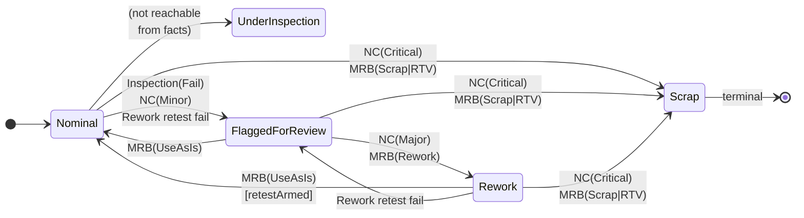

# MultiSiteManufacturing - approach

The reasoning and semantics behind the sample: the domain model and
fold, the chaos-tier layering, seeder strategy, replication
discovery, and the gotchas that shaped the code. For the structural
view (topology, components, grains, trees, sequence diagrams) see
[`architecture.md`](./architecture.md). For a capability overview see
[`README.md`](./README.md).

---

## 1. Process model and facts

A turbine blade moves through six process stages - `Forge`,
`HeatTreat`, `Machining`, `NDT`, `MRB`, `FAI` - distributed across
seven named sites (Ohio Forge, Nagoya Heat Treatment, Stuttgart
Machining, Stuttgart CMM Lab, Toulouse NDT Lab, Cincinnati MRB,
Bristol FAI).

Every operator action emits a fact carrying `PartSerialNumber`,
`FactId`, `HybridLogicalClock`, origin `ProcessSite`, `OperatorId`,
and a human description. Fact kinds: `ProcessStepCompleted`,
`InspectionRecorded`, `NonConformanceRaised`, `MRBDisposition`,
`ReworkCompleted`, `FinalAcceptance`.

## 2. Severity lattice and fold


```mermaid
stateDiagram-v2
    direction LR
    [*] --> Nominal
    Nominal --> UnderInspection: (not reachable<br/>from facts)
    Nominal --> FlaggedForReview: Inspection(Fail)<br/>NC(Minor)<br/>Rework retest fail
    FlaggedForReview --> Rework: NC(Major)<br/>MRB(Rework)
    FlaggedForReview --> Nominal: MRB(UseAsIs)
    Rework --> Nominal: MRB(UseAsIs)<br/>[retestArmed]
    Rework --> FlaggedForReview: Rework retest fail
    Nominal --> Scrap: NC(Critical)<br/>MRB(Scrap|RTV)
    FlaggedForReview --> Scrap: NC(Critical)<br/>MRB(Scrap|RTV)
    Rework --> Scrap: NC(Critical)<br/>MRB(Scrap|RTV)
    Scrap --> [*]: terminal
```

The lattice is totally ordered. `ComplianceFold.Fold` sorts facts by
`(WallClockTicks, Counter, FactId)` before applying
`StateTransitions.Apply` as a running `Max`, with a `retestArmed` flag
threaded through to gate `MRBDisposition(UseAsIs)` demotion of
`Rework` → `Nominal`. The arrival-order baseline (`NaiveFold.Step`)
delegates to the same `StateTransitions.Apply` - the **only**
difference between the two folds is the order in which facts are
applied. Divergence in the dashboard is therefore purely an ordering
artefact, which is the property the sample exists to demonstrate.

`Scrap` is terminal: any fact applied to a part already in `Scrap` is
a no-op. `ReworkCompleted(retestPassed=false)` escalates to
`FlaggedForReview` and clears `retestArmed` - a failed retest is
defect evidence and must remain observable, even when a prior
`UseAsIs` had demoted the part.

## 3. Two backends, one router

`IFactBackend` has two implementations running side by side behind a
fan-out `FederationRouter`:

- **Baseline** - an Orleans grain per part that appends facts in
  arrival order. Drifts under chaos-induced reorder. On peer
  clusters the baseline is *also* fed by the inbound replication
  endpoint (decoding every replicated `mfg-facts` Set entry and
  re-emitting it locally), which models naive event-log
  replication - enough for cold-seed parity across clusters, but
  still vulnerable to divergence under concurrent writes because
  the peer applies replicated batches in HLC order while the
  originating cluster applied its local writes in arrival order.
- **Lattice** - persists facts to the `mfg-facts` tree and computes
  `ComplianceState` by scanning and folding in HLC order. Converges
  under reorder.

Chaos applies via a `ChaosFactBackend` decorator that wraps each
backend **independently**. Applying a 10 % transient-fault rate to
only the lattice backend (or only the baseline) is the canonical way
to surface divergence without a scripted saga. Storage-provider-level
chaos (wrapping the `TableServiceClient` itself) is explicitly out of
scope - the decorator tier exercises the same failure modes at a
cleaner seam without coupling tests to the Azure SDK.

## 4. Fault-injection tiers

Each tier models a distinct real-world failure class and can be
exercised independently from the UI and from tests:

| Tier | Seam | Models | Toggle |
|---:|---|---|---|
| 1 | `IProcessSiteGrain.AdmitAsync` (origin) | Site unavailable / WAN latency | `IsPaused`, `DelayMs` |
| 2 | `ChaosFactBackend` decorator (per backend) | Storage jitter, transient failure, write amplification | `IBackendChaosGrain` |
| 3 | Reorder buffer inside `ProcessSiteGrain` | Cross-site out-of-order arrival after a pause lifts | `ReorderEnabled` |
| 4 | `FederationRouter.IsDroppedByPartitionAsync` + `PartCrdtStore` shadow prefix | Simulated intra-cluster silo partition | `IPartitionChaosGrain.IsPartitioned` |
| 4b | `ChaosReplicationTransport` decorator on `IReplicationTransport` | App-level cross-cluster replication pause | `IReplicationDisconnectGrain.IsDisconnected` |
| 5 | `docker network disconnect` against the peer Traefik | Genuine cross-cluster transport partition | Manual `docker network` commands |

Tier 4b is a pure application-level shortcut: the decorator returns
`Accepted=false` so the package shipper holds its per-peer cursor
steady and the local WAL keeps growing. Once the flag clears,
replication resumes from the stationary cursor and catches the peer
up with the accumulated backlog.
Tier 5 achieves the same effect at the transport layer without
co-operation from the application - useful as a forcing function
when proving the replicator's cursor and backoff behaviour.

All chaos state lives in **durable** grains (`IProcessSiteGrain`,
`IBackendChaosGrain`, `IPartitionChaosGrain`,
`IReplicationDisconnectGrain`) persisted to Azure Table Storage. A
host restart re-renders current chaos configuration from grain
storage - only the UI's fly-out open/closed bit is process-local.
This matches how a real MES would persist site availability flags.

## 5. Bulk-load strategy

`InventorySeeder` is an `IHostedService` that runs on every silo. A
singleton `IInventorySeedStateGrain` with a persisted `HasSeeded` flag
gates the work, so only the first silo to win the race actually
seeds. Five parts (one representative per reachable
`ComplianceState` - `Nominal`, `Nominal` + FAI signed off,
`FlaggedForReview`, `Rework`, `Scrap`) are emitted through
`FederationRouter` - the same path operators use - so both backends
agree before chaos is applied.

`UnderInspection` is deliberately skipped: the fact grammar has no
`InspectionStarted` transition, so no fact sequence can fold to
`UnderInspection` in v1.

Chaos knobs are **snapshotted, zeroed for the duration of the seed,
and restored** afterwards, so a previous session's chaos presets
cannot make seed time non-deterministic. Serial numbers are
deterministic (`HPT-BLD-S1-2028-00001` … `-00005`); HLCs are stamped
relative to `DateTimeOffset.UtcNow` at seed time so the dashboard
always shows "recent" activity.

## 6. Cross-cluster replication

Cross-cluster replication is provided by
`Orleans.Lattice.Replication` (WAL + shipper + applier) wired with
the `Orleans.Lattice.Replication.Grpc` push transport. The package
covers everything the sample used to roll by hand: WAL append on
every replicated write, per-peer cursor management, batched gRPC
push to the peer cluster, idempotent receiver-side apply with CRDT
semantics chosen per tree, and dead-letter handling for entries that
fail to apply. See
[`docs/lattice.replication/`](../../docs/lattice.replication/) for
the gRPC wire format, bootstrap protocol, replog key shape, and
back-pressure / dead-letter design.

The sample's contribution is the per-tree opt-in:

| Tree | Replicated? | Mode | Why |
|---|---|---|---|
| `mfg-facts` | Yes | `LwwRegister` | Write-once immutable keys; double-apply is an idempotent merge. |
| `mfg-site-activity` | Yes | `LwwRegister` | Part-major activity rows keyed `{serial}/{site}`; newest fact per part-at-site wins, so LWW converges. |
| `tag-mfg-site` | Yes | `OrFlag` | Tag-index membership rows for the per-site view; under active-active both clusters tag keys, so flag-CRDT enable-wins membership converges where an LWW row would drop a concurrent posting. |
| `mfg-part-labels` | Yes | `OrSet` | One OrSet per serial; the package ships typed `add` / `remove` / `merge` deltas instead of raw byte writes. |
| `mfg-part-operator` | No (cluster-local) | n/a | Per-serial LWW register. LWW across clusters with disjoint HLCs is meaningless - concurrent cross-cluster writes would pick different winners on each side. |

Three sample-specific seams sit alongside the package:

- `BaselineReplicationApplier` decorates the package's
  `IReplicationApplier` singleton; on every cross-cluster apply it
  filters to `mfg-facts` entries and emits each replicated payload
  into the local naive `BaselineFactBackend` so the side-by-side
  divergence visualisation keeps working under cross-cluster traffic.
  It also raises `FederationRouter.FactReplicated` so the dashboard
  activity feed updates without polling.
- `ChaosReplicationTransport` decorates the package's gRPC push
  transport (Tier 4b chaos): when the operator toggles the disconnect
  flag, `SendAsync` returns `Accepted=false` so the shipper holds
  its cursor and the local WAL grows until the flag clears.
- `ReplicationActivityTracker` + `ClusterReplicationActivityGrain`
  bridge the package's `orleans.lattice.replication` meter into a
  cluster-wide aggregate that drives the in-page per-peer ship/recv
  strip; without it, a Blazor circuit pinned to one silo would only
  see that silo's slice of replication activity.

> **Receiver catch-up after WAL GC.** When one cluster has been
> running long enough to GC old WAL entries and the peer's cursor has
> fallen behind that point, auto-bootstrap fires and drains a
> point-in-time snapshot from the sender cluster over the gRPC
> remote-snapshot transport (`AddLatticeReplicationGrpc` registers the
> `IRemoteSnapshotTransport` binding, and `AddLatticeReplication`
> auto-wires the receiver-side `RemoteSnapshotProvider`), so a
> long-disconnected or freshly-wiped receiver catches up automatically.
> See the [snapshot &amp; bootstrap](../../docs/lattice.replication/snapshot-bootstrap.md)
> docs for the cross-cluster bootstrap pipeline.

## 7. UI design

Blazor Server components own an `IAsyncEnumerable<T>` subscription
acquired in `OnInitializedAsync` and cancelled in `Dispose`. The
subscription is backed by a `System.Threading.Channels.Channel<T>`
owned by the underlying service (`InventoryService`, `SiteRegistry`,
`DivergenceTracker`, `DashboardBroadcaster`). The service pushes
whenever domain state changes; the component applies the message to
its local view-model and calls `InvokeAsync(StateHasChanged)`.

`DashboardBroadcaster` additionally publishes every routed or
replicated `Fact` to a cluster-wide Orleans stream backed by Azure
Storage Queues (provider `DashboardStreams`, namespace
`msmfg.dashboard.facts`, single queue `msmfgdashboard-0`) and
subscribes to the same stream on every silo. This is what lets a
Blazor circuit pinned to silo B receive live updates for facts that
landed on silo A - each silo's broadcaster is both publisher and
subscriber, and the per-circuit `Channel<T>` fan-out runs only on the
receiving side of the stream, so the same code path handles
local-origin and peer-origin facts uniformly. The queue-backed
transport also gives the feed durability: messages enqueued while a
silo is restarting or briefly unreachable are picked up once it
reconnects, subscription metadata is persisted in the Azure Table
`PubSubStore`, and the broadcaster adds bounded retries around
publish and subscribe plus a top-level catch in the receive handler
so a single poison fact can't stall the queue.

No polling. No `Timer`. No `setInterval`. gRPC server-streaming RPCs
are thin adapters over the same channels.

Operator actions funnel through a single **"Next: …"** button driven
by `NextActionResolver`, which picks the deterministic next step from
the HLC-sorted fact log. Inline branch buttons appear only when the
state genuinely requires operator choice (MRB disposition, NDT
outcome, rework retest). A separate always-available form raises
non-conformances at any lifecycle stage.

The chaos fly-out is a single persistent side panel - clearly
labelled ("Simulate 4-second latency at Toulouse NDT Lab", not
`delay=4000`) - with per-site rows, per-backend sliders, and canned
presets (*Transoceanic backhaul outage*, *Customs hold*, *MRB
weekend*, *Lattice storage flakes*, *Cluster split*, *Replication
disconnect*, *Clear all*). An active-chaos banner outside the
fly-out ensures operators cannot close the panel and forget about
active injections.

## 8. Testing philosophy

All tests run against Orleans `TestingHost` fixtures with in-memory
storage - no Azurite dependency in the test suite, keeping CI fast
and hermetic. The cross-cluster replication path itself is covered by
the `Orleans.Lattice.Replication` and
`Orleans.Lattice.Replication.Grpc` packages' own test suites; the
sample's tests focus on the sample-specific seams (the chaos transport
decorator, the baseline-replay tap, the activity-meter aggregator,
and the typed-CRDT accessors over `mfg-part-labels` /
`mfg-part-operator`). Two-cluster end-to-end replication is
exercised manually via Docker Compose because the `TestingHost`
fixture materialises a single cluster.

Long-running stress tests are tagged `[Category("Chaos")]` and
excluded from the iterative development filter:

```powershell
dotnet test --filter "TestCategory!=Chaos"
```

The cross-cluster replication path itself - WAL, shipper, applier,
gRPC push transport, dead-letter handling, bootstrap - is covered by
the test suites of `Orleans.Lattice.Replication` and
`Orleans.Lattice.Replication.Grpc`. The sample's tests stay focused on
the sample-specific seams listed in §6.
