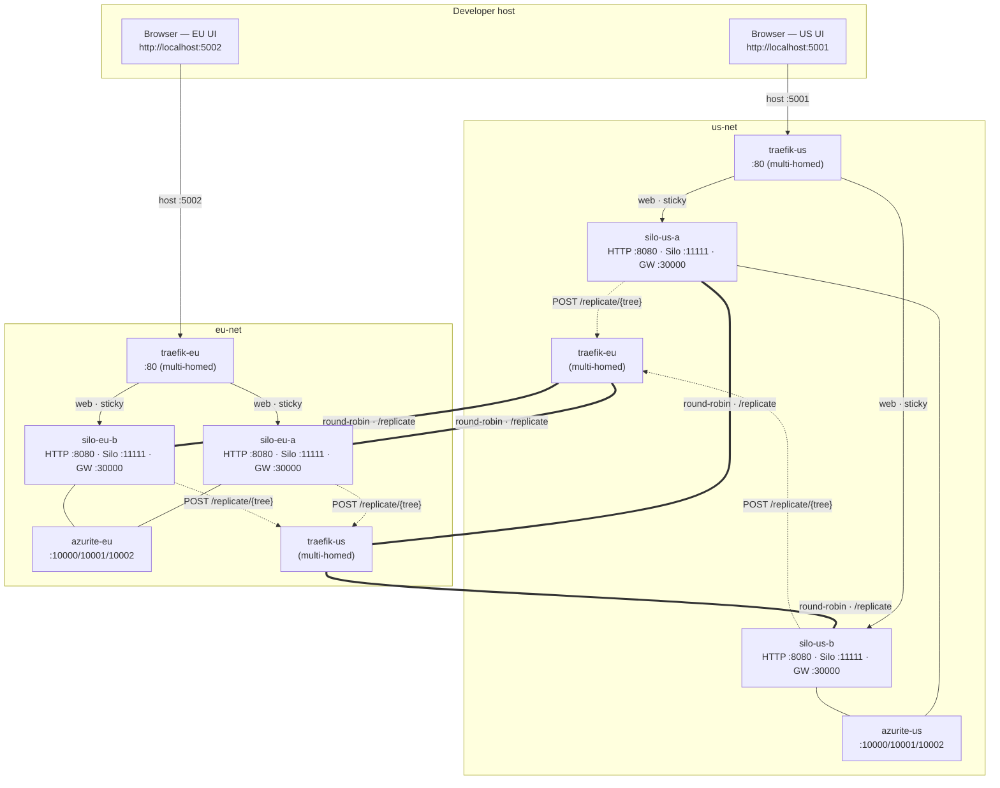
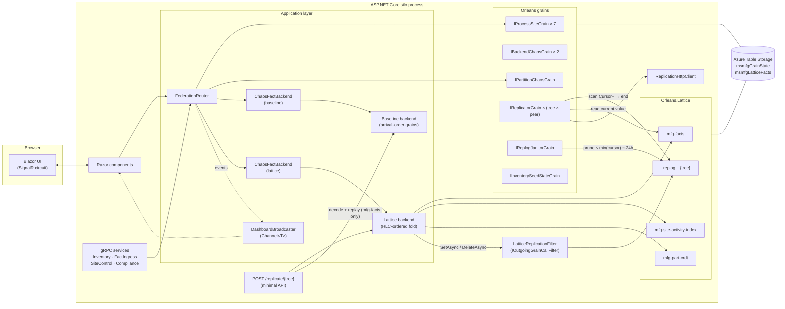
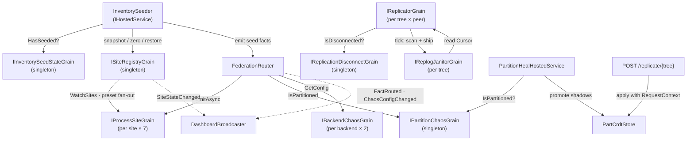
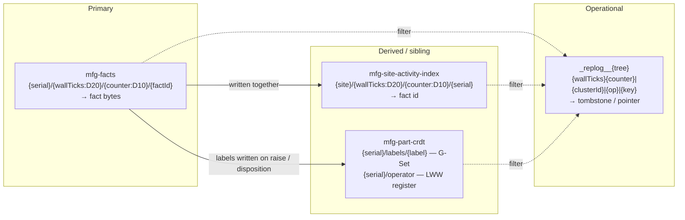
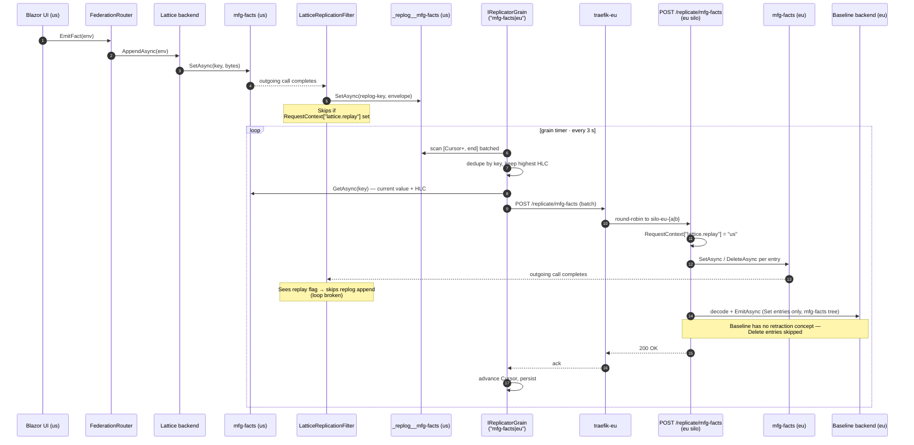

# MultiSiteManufacturing — architecture

Structural view of the sample: physical and network topology, how a
single silo is wired internally, how Orleans grains depend on each
other, what Lattice trees exist and what they hold, and how
cross-cluster replication flows end-to-end.

For rationale, semantics, and implementation gotchas see
[`approach.md`](./approach.md). For a capability overview see
[`README.md`](./README.md).

---

## 1. Physical and network topology

Docker Compose runs two Azurite containers, four silos (two per
cluster), and a Traefik proxy per cluster. The only cross-cluster
link is the peer Traefik, multi-homed onto both cluster networks.



Reachability matrix:

| From → To | Path | Reachable? |
|---|---|---|
| `silo-us-a` → `silo-us-b` | `us-net` | Yes (same cluster) |
| `silo-us-*` → `traefik-eu` | `us-net` (Traefik multi-homed) | Yes |
| `silo-us-*` → `silo-eu-*` | — | **No shared network — blocked** |
| `silo-eu-*` → `silo-us-*` | — | **No shared network — blocked** |
| `azurite-us` ↔ `azurite-eu` | — | **No shared network — blocked** |

Only two host ports are published:

| Host port | Container | Role |
|---|---|---|
| 5001 | `traefik-us:80` | US UI (sticky) + replication inbound (round-robin) |
| 5002 | `traefik-eu:80` | EU UI (sticky) + replication inbound (round-robin) |

Silo HTTP (`:8080`), Orleans silo (`:11111`), and gateway (`:30000`)
ports are internal-only.

Each Traefik runs two routers over the same backend pool:

| Router | Rule | LB |
|---|---|---|
| `{cluster}-replicate` | `PathPrefix(/replicate)`, priority 100 | round-robin + active health check |
| `{cluster}-web` | `PathPrefix(/)` | sticky cookie `msmfg_{cluster}_affinity` |

### Tier-5 partition commands

Disconnecting the peer Traefik from the local cluster network removes
the only route from local silos to the peer cluster.

```powershell
# Sever US ↔ EU:
docker network disconnect msmfg_us-net msmfg-traefik-eu
docker network disconnect msmfg_eu-net msmfg-traefik-us
# ... demonstrate divergence ...
docker network connect    msmfg_us-net msmfg-traefik-eu
docker network connect    msmfg_eu-net msmfg-traefik-us
```

---

## 2. In-silo component graph

Each silo is a single ASP.NET Core process hosting Blazor Server,
gRPC, Orleans, and the replication outbound/inbound endpoints. Both
UI and gRPC call paths share the same `FederationRouter` and backend
instances via DI.



---

## 3. Grain interdependencies

Who calls whom inside a single silo. Solid arrows are direct method
calls; dashed arrows are event channels consumed by UI subscribers.



Key invariants:

- `FederationRouter` only **reads** chaos grains; it never writes
  them. Writes come from the UI / gRPC control surface via
  `ISiteRegistryGrain` and direct grain calls.
- `IReplicatorGrain` persists its own cursor; `IReplogJanitorGrain`
  reads every peer replicator's cursor to compute the safe-to-prune
  watermark — never prunes ahead of the slowest peer.
- `PartitionHealHostedService` only runs shadow promotion when
  `IPartitionChaosGrain.IsPartitioned` has flipped back to `false`.

---

## 4. Lattice trees

All four trees persist to `msmfgLatticeFacts` in Azure Table Storage.
Orleans grain state (chaos, replicator cursors, seed flag, baseline
part grains, inventory) persists to `msmfgGrainState`.



| Tree | Key shape | Role | Replicated |
|---|---|---|---|
| `mfg-facts` | `{serial}/{wallTicks:D20}/{counter:D10}/{factId}` | Immutable per-part fact log. Forward range scan = HLC-ascending history. | Yes |
| `mfg-site-activity-index` | `{site}/{wallTicks:D20}/{counter:D10}/{serial}` | Per-site reverse-chronological activity feed. | Yes |
| `mfg-part-crdt` | `{serial}/labels/{label}` · `{serial}/operator` | Mixed G-Set + LWW register per part. | Labels yes · register filtered at origin |
| `_replog__{tree}` | `{wallTicks:D20}{counter:D10}\|{clusterId}\|{op}\|{key}` | Per-tree HLC-ordered replication log. | No (per-cluster) |

Range-scan patterns:

- Per-part history → forward scan of `mfg-facts` with prefix
  `{serial}/`.
- Per-site recent activity → reverse scan of
  `mfg-site-activity-index` with prefix `{site}/`.
- Shipping a batch → forward scan of `_replog__{tree}` from `Cursor+`
  to end, bounded by batch size.
- Janitor prune → forward range delete of `_replog__{tree}` up to
  `min(peer cursors) − 24h`.

---

## 5. Cross-cluster replication flow

A single operator write on the US cluster, propagating to the
EU cluster.



Failure modes and their recovery:

| Scenario | Effect | Recovery |
|---|---|---|
| Peer unreachable | `ReplicationHttpClient` fails all URLs → error counter ↑ | Exponential backoff; next tick retries from same cursor. |
| Silo-B of peer restarts | Traefik health check removes it from `/replicate` pool within ~2 s | Next POST lands on silo-A; no replicator visibility. |
| Filter fails after primary write succeeds | One entry missing from replog | `AntiEntropyCursor` reminder re-scans primary and re-ships entries with `hlc > cursor`. |
| Duplicate delivery | Same `SetAsync` applied twice | Idempotent under write-once key discipline (and LWW for the few mutable keys that replicate). |
| A → B → A cycle | Would re-append replog on inbound apply | Broken by `RequestContext["lattice.replay"]` check in the filter. |
| Cluster split preset | `IReplicationDisconnectGrain.IsDisconnected = true` | Tick is a no-op; inbound returns 503; replog grows locally; resumes from cursor on clear. |
| Tier-5 `docker network disconnect` | HTTP POST fails at transport layer | Identical to "peer unreachable"; replicator backs off, catches up on reconnect. |
| Baseline replay decode fails | Single entry skipped on peer's baseline; lattice apply still succeeds | Logged; subsequent entries continue to apply. Baseline is a demo-visualisation backend, not a correctness-critical store. |

---

## 6. Configuration overlay

`appsettings.cluster.{name}.json` ships the localhost defaults.
Compose overrides only what has to change in containers:

| Key | Purpose |
|---|---|
| `ConnectionStrings__AzureTableStorage` | Per-cluster Azurite URL (`http://azurite-{cluster}:10002/...`). |
| `Replication__Peers__0__Name` | Peer cluster short name. |
| `Replication__Peers__0__BaseUrls__0` | Peer Traefik URL (one entry — Traefik handles silo failover). |
| `Cluster__SiloPortA` / `SiloPortB` | Both `11111` under Compose — each container has its own IP. |
| `ASPNETCORE_URLS` | `http://+:8080` in Compose; `Program.cs` skips its own `UseUrls` when this is set. |
| `Seeder__Enabled` | Explicit boolean — `true` on `silo-us-a`, `false` elsewhere. |

`ReplicationHttpClient.SendAsync` still iterates a multi-URL
`BaseUrls` list, so three deployment shapes are supported:

1. **Single LB endpoint (Compose default)** — one URL per peer;
   Traefik absorbs silo churn.
2. **Per-silo fan-out (localhost dev without an LB)** — one URL per
   silo; client retries the list until one accepts.
3. **Multi-zone failover** — one URL per availability zone, each
   pointing at that zone's regional LB; client stays on the primary
   zone while healthy.
