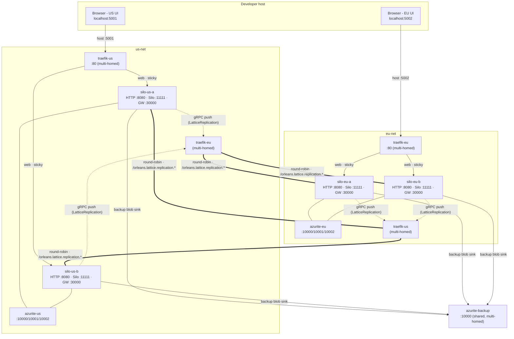
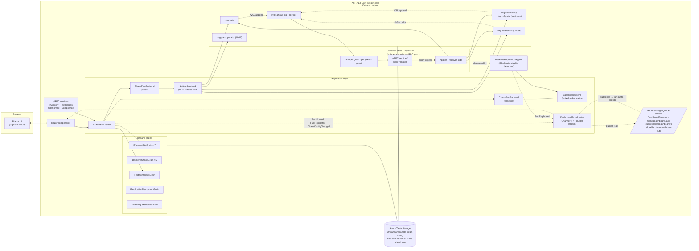
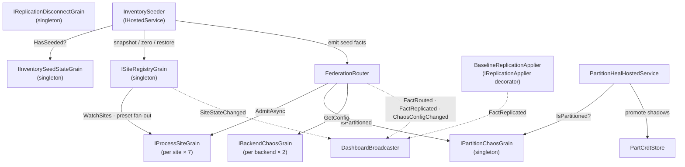
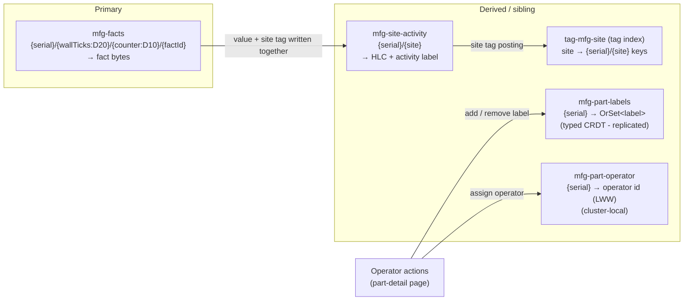
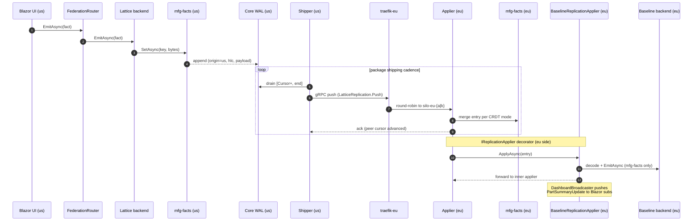

# MultiSiteManufacturing - architecture

Structural view of the sample: physical and network topology, how a
single silo is wired internally, how Orleans grains depend on each
other, what Lattice trees exist and what they hold, and how
cross-cluster replication flows end-to-end.

For rationale, semantics, and implementation gotchas see
[`approach.md`](./approach.md). For a capability overview see
[`README.md`](./README.md).

---

## 1. Physical and network topology

Docker Compose runs three Azurite containers (one per cluster plus
the shared `azurite-backup` account), four silos (two per cluster), a
Traefik proxy per cluster, and a Prometheus + Grafana pair. Silos never
reach a peer cluster's silos directly: the only route between them is
the peer Traefik, multi-homed onto both cluster networks. The shared
`azurite-backup` account and Prometheus are also attached to both
cluster networks.


```mermaid
flowchart TB
    subgraph host["Developer host"]
        browser1["Browser - US UI<br/>localhost:5001"]
        browser2["Browser - EU UI<br/>localhost:5002"]
    end

    subgraph usNet["us-net"]
        azF["azurite-us<br/>:10000/10001/10002"]
        siloFA["silo-us-a<br/>HTTP :8080 · Silo :11111 · GW :30000"]
        siloFB["silo-us-b<br/>HTTP :8080 · Silo :11111 · GW :30000"]
        tFE["traefik-us<br/>:80 (multi-homed)"]
        tHE1["traefik-eu<br/>(multi-homed)"]
    end

    subgraph euNet["eu-net"]
        azH["azurite-eu<br/>:10000/10001/10002"]
        siloHA["silo-eu-a<br/>HTTP :8080 · Silo :11111 · GW :30000"]
        siloHB["silo-eu-b<br/>HTTP :8080 · Silo :11111 · GW :30000"]
        tHE2["traefik-eu<br/>:80 (multi-homed)"]
        tFE2["traefik-us<br/>(multi-homed)"]
    end

    browser1 -->|"host :5001"| tFE
    browser2 -->|"host :5002"| tHE2

    tFE -->|"web · sticky"| siloFA
    tFE -->|"web · sticky"| siloFB
    tHE2 -->|"web · sticky"| siloHA
    tHE2 -->|"web · sticky"| siloHB

    siloFA --- azF
    siloFB --- azF
    siloHA --- azH
    siloHB --- azH

    azBK["azurite-backup<br/>:10000 (shared, multi-homed)"]
    siloFA -->|"backup blob sink"| azBK
    siloFB -->|"backup blob sink"| azBK
    siloHA -->|"backup blob sink"| azBK
    siloHB -->|"backup blob sink"| azBK

    siloFA -.->|"gRPC push (LatticeReplication)"| tHE1
    siloFB -.->|"gRPC push (LatticeReplication)"| tHE1
    siloHA -.->|"gRPC push (LatticeReplication)"| tFE2
    siloHB -.->|"gRPC push (LatticeReplication)"| tFE2

    tHE1 ===|"round-robin · /orleans.lattice.replication.*"| siloHA
    tHE1 ===|"round-robin · /orleans.lattice.replication.*"| siloHB
    tFE2 ===|"round-robin · /orleans.lattice.replication.*"| siloFA
    tFE2 ===|"round-robin · /orleans.lattice.replication.*"| siloFB
```

Reachability matrix:

| From → To | Path | Reachable? |
|---|---|---|
| `silo-us-a` → `silo-us-b` | `us-net` | Yes (same cluster) |
| `silo-us-*` → `traefik-eu` | `us-net` (Traefik multi-homed) | Yes |
| `silo-us-*` → `silo-eu-*` | - | **No shared network - blocked** |
| `silo-eu-*` → `silo-us-*` | - | **No shared network - blocked** |
| `azurite-us` ↔ `azurite-eu` | - | **No shared network - blocked** |
| `silo-us-*` / `silo-eu-*` → `azurite-backup` | `us-net` + `eu-net` (multi-homed) | Yes (shared backup sink) |

Three host ports are published:

| Host port | Container | Role |
|---|---|---|
| 5001 | `traefik-us:80` | US UI (sticky) + replication gRPC inbound (round-robin). Open <http://localhost:5001>. |
| 5002 | `traefik-eu:80` | EU UI (sticky) + replication gRPC inbound (round-robin). Open <http://localhost:5002>. |
| 3000 | `grafana:3000` | Cross-cluster Grafana - Prometheus-backed, multi-homed onto both cluster networks. Open <http://localhost:3000> (anonymous Viewer; `admin`/`admin` for edit). |

Silo HTTP (`:8080`), silo h2c gRPC (`:8081`), Orleans silo
(`:11111`), gateway (`:30000`), and Prometheus (`:9090`) ports are
internal-only.

Each Traefik runs four routers over the same backend pool:

| Router | Rule | LB |
|---|---|---|
| `{cluster}-replicate` | `PathPrefix(/orleans.lattice.replication.)`, priority 200 | round-robin, no health check |
| `{cluster}-state` | `PathPrefix(/orleans.lattice.api.state/)`, priority 200 | round-robin + active health check (probes `:8080`) |
| `{cluster}-backup` | `PathPrefix(/orleans.lattice.api.backup/)`, priority 200 | round-robin + active health check (probes `:8080`); serves the backup control API, wired only with `run.ps1 -Backup` |
| `{cluster}-web` | `PathPrefix(/)` | sticky cookie `msmfg_{cluster}_affinity` |

### Tier-5 partition commands

Disconnecting the peer Traefik from the local cluster network removes
the only route from local silos to the peer cluster.

```powershell
# Sever US ↔ EU:
docker network disconnect msmfg_us-net msmfg-traefik-eu
docker network disconnect msmfg_eu-net msmfg-traefik-us
# ... demonstrate divergence ...
docker network connect    msmfg_us-net msmfg-traefik-eu
docker network connect    msmfg_eu-net msmfg-traefik-us
```

---

## 2. In-silo component graph

Each silo is a single ASP.NET Core process hosting Blazor Server,
gRPC, Orleans (with the Lattice write-ahead log), and the replication
package's shipper, applier, and gRPC push transport. Both UI and gRPC
call paths share the same
`FederationRouter` and backend instances via DI.


```mermaid
flowchart LR
    subgraph browser["Browser"]
        ui["Blazor UI<br/>(SignalR circuit)"]
    end

    subgraph silo["ASP.NET Core silo process"]
        direction LR
        razor["Razor components"]
        grpc["gRPC services<br/>Inventory · FactIngress<br/>SiteControl · Compliance"]

        subgraph app["Application layer"]
            router["FederationRouter"]
            chaosBase["ChaosFactBackend<br/>(baseline)"]
            chaosLat["ChaosFactBackend<br/>(lattice)"]
            baseBE["Baseline backend<br/>(arrival-order grains)"]
            latBE["Lattice backend<br/>(HLC-ordered fold)"]
            broadcaster["DashboardBroadcaster<br/>(Channel&lt;T&gt; · cluster stream)"]
        end

        subgraph orleans["Orleans grains"]
            siteG["IProcessSiteGrain × 7"]
            backG["IBackendChaosGrain × 2"]
            partG["IPartitionChaosGrain"]
            replDisc["IReplicationDisconnectGrain"]
            seedG["IInventorySeedStateGrain"]
        end

        subgraph lattice["Orleans.Lattice"]
            facts["mfg-facts"]
            siteIdx["mfg-site-activity<br/>+ tag-mfg-site (tag index)"]
            labels["mfg-part-labels (OrSet)"]
            opReg["mfg-part-operator (LWW)"]
            wal["write-ahead log - per tree"]
        end

        subgraph repl["Orleans.Lattice.Replication<br/>(shipper + applier + gRPC push)"]
            ship["Shipper grain · per (tree × peer)"]
            apply["Applier · receiver-side"]
            grpc2["gRPC service /<br/>push transport"]
        end

        mirror["BaselineReplicationApplier<br/>(IReplicationApplier decorator)"]
        dashStream[/"Azure Storage Queue stream<br/>DashboardStreams · msmfg.dashboard.facts<br/>queue msmfgdashboard-0<br/>(durable cluster-wide fan-out)"/]
    end

    tables[("Azure Table Storage<br/>OrleansGrainState (grain state)<br/>OrleansLatticeWal (write-ahead log)")]

    ui <--> razor
    razor --> router
    grpc --> router
    router --> siteG
    router --> partG
    router --> chaosBase
    router --> chaosLat
    chaosBase --> baseBE
    chaosLat --> latBE
    latBE --> facts
    latBE --> siteIdx
    latBE --> labels
    latBE --> opReg
    router -.->|"FactRouted · FactReplicated · ChaosConfigChanged"| broadcaster
    broadcaster -.->|"publish Fact"| dashStream
    dashStream -.->|"subscribe → fan out to circuits"| broadcaster
    broadcaster -.-> razor

    facts -.->|"WAL append"| wal
    siteIdx -.->|"WAL append"| wal
    labels -.->|"OrSet delta"| wal
    wal --> ship
    ship --> grpc2
    grpc2 -->|"push to peer"| apply
    apply --> facts
    apply --> siteIdx
    apply --> labels
    apply -.->|"decorated by"| mirror
    mirror --> baseBE
    mirror -.->|"FactReplicated"| broadcaster

    orleans --- tables
    lattice --- tables
    repl --- tables
```

---

## 3. Grain interdependencies

Who calls whom inside a single silo. Solid arrows are direct method
calls; dashed arrows are event channels consumed by UI subscribers.


```mermaid
flowchart TB
    router["FederationRouter"]
    siteReg["ISiteRegistryGrain<br/>(singleton)"]
    siteG["IProcessSiteGrain<br/>(per site × 7)"]
    backG["IBackendChaosGrain<br/>(per backend × 2)"]
    partG["IPartitionChaosGrain<br/>(singleton)"]
    replDisc["IReplicationDisconnectGrain<br/>(singleton)"]
    seedG["IInventorySeedStateGrain<br/>(singleton)"]
    seeder["InventorySeeder<br/>(IHostedService)"]
    mirror["BaselineReplicationApplier<br/>(IReplicationApplier decorator)"]
    broadcaster["DashboardBroadcaster"]
    healSvc["PartitionHealHostedService"]
    crdtStore["PartCrdtStore"]

    router -->|"AdmitAsync"| siteG
    router -->|"IsPartitioned"| partG
    router -->|"GetConfig"| backG
    router -.->|"FactRouted · FactReplicated · ChaosConfigChanged"| broadcaster

    siteReg -->|"WatchSites · preset fan-out"| siteG
    siteReg -.->|"SiteStateChanged"| broadcaster

    seeder -->|"HasSeeded?"| seedG
    seeder -->|"snapshot / zero / restore"| siteReg
    seeder -->|"emit seed facts"| router

    mirror -.->|"FactReplicated"| broadcaster

    healSvc -->|"IsPartitioned?"| partG
    healSvc -->|"promote shadows"| crdtStore
```

Key invariants:

- On the fact path `FederationRouter` only **reads** chaos grains
  (site admission, the partition filter, backend config). Chaos writes
  come from the UI / gRPC control surface through the router's
  `Configure*` / `ApplyPresetAsync` methods, which update the chaos
  grains (sites through `ISiteRegistryGrain`) and raise
  `ChaosConfigChanged`.
- Cross-cluster replication is opaque to the application: the
  core write-ahead log and the replication package's shipper +
  applier sit below the lattice, and the
  sample observes the receiver-side stream by decorating the
  package's `IReplicationApplier` with `BaselineReplicationApplier`,
  so each cross-cluster apply also mirrors `mfg-facts` writes into
  `BaselineFactBackend` and raises `FactReplicated`. WAL garbage
  collection and compaction are library concerns; the sample does not
  configure them.
- `PartitionHealHostedService` only runs shadow promotion when
  `IPartitionChaosGrain.IsPartitioned` has flipped back to `false`.

---

## 4. Lattice trees

All five trees persist through the Lattice grain-storage provider
(`lattice`, Azure Table grain storage) and their write-ahead log
through `Orleans.Lattice.Storage.AzureTable` (table
`OrleansLatticeWal`). The sample's own grain state (chaos toggles,
seed flag, baseline part grains) persists through the
`msmfgGrainState` provider. Neither provider name is a table name:
every Azure Table grain-storage provider in the sample writes Orleans'
default `OrleansGrainState` table. Replication has no WAL of its own -
the shipper reads the trees' write-ahead log and keeps its cursors in
grain storage.


```mermaid
flowchart LR
    subgraph primary["Primary"]
        facts["mfg-facts<br/>{serial}/{wallTicks:D20}/{counter:D10}/{factId}<br/>→ fact bytes"]
    end

    subgraph derived["Derived / sibling"]
        siteIdx["mfg-site-activity<br/>{serial}/{site}<br/>→ HLC + activity label"]
        siteTag["tag-mfg-site (tag index)<br/>site → {serial}/{site} keys"]
        labels["mfg-part-labels<br/>{serial} → OrSet&lt;label&gt;<br/>(typed CRDT - replicated)"]
        opReg["mfg-part-operator<br/>{serial} → operator id (LWW)<br/>(cluster-local)"]
    end

    facts -->|"value + site tag written together"| siteIdx
    siteIdx -->|"site tag posting"| siteTag
    ops["Operator actions<br/>(part-detail page)"] -->|"add / remove label"| labels
    ops -->|"assign operator"| opReg
```

| Tree | Key shape | Role | Replicated |
|---|---|---|---|
| `mfg-facts` | `{serial}/{wallTicks:D20}/{counter:D10}/{factId}` | Immutable per-part fact log. Forward range scan = HLC-ascending history. | Yes |
| `mfg-site-activity` | `{serial}/{site}` → HLC + activity label | Part-major activity rows; the per-site view reads them through the tag index. | Yes |
| `tag-mfg-site` | tag-index membership (`tag \0 treeId \0 key`) | Posting list mapping each `ProcessSite` to its `{serial}/{site}` keys; powers `ListAtSiteAsync` via `WithAnyTags(site)`. | Yes |
| `mfg-part-labels` | `{serial}` (one OrSet per serial) | Per-part free-form label set, edited by operators on the part-detail page (the seeder writes `priority`, `expedite`, `rework-watch`, and `qa-hold` into one showcase part). | Yes - `LatticeMergeMode.OrSet` (typed CRDT delta shipping) |
| `mfg-part-operator` | `{serial}` (one LWW register per serial) | Per-part current operator id. | No (cluster-local) - LWW across clusters with disjoint HLCs is meaningless |

The dashboard's per-part summary is no longer a sample-owned tree. It is the
library-maintained folded view `mfg-compliance` over `mfg-facts` (registered via
`AddLatticeViews`/`AddFoldedView`), joined at read time with each part's baseline
compliance state. See the access patterns below.

Access patterns:

- Per-part history → forward range scan of `mfg-facts` with prefix
  `{serial}/`.
- Per-site recent activity → tag-index union query
  (`WithAnyTags(site)`) over the `tag-mfg-site` index, reading each
  matched `{serial}/{site}` key's value from `mfg-site-activity`.
  The site is deliberately the key *suffix*, so a range scan cannot
  answer this query - the tag index is the access path.

- All-parts dashboard snapshot → scan of the library-maintained folded view
  `mfg-compliance` (the fact-derived half: lattice compliance state, latest
  process stage, fact count), joined per part with the baseline compliance
  state from the baseline backend. The library maintainer keeps the folded
  half current directly off the `mfg-facts` write-ahead log, so a dashboard
  load reads one pre-folded accumulator per part instead of re-folding every
  part's `mfg-facts` prefix. `BaselineState` is folded in arrival order by the
  baseline backend, deliberately diverging from the HLC-ordered lattice fold
  (the red-row highlight and divergence stream are the demo), so it cannot be
  reproduced by any fold over `mfg-facts` and is joined per part at read time
  rather than materialised. While a dashboard is being watched, a bounded
  background pass also reconciles the fanned-out set against the `mfg-facts`
  tree, so parts written directly - bypassing `FederationRouter`, which raises
  no fact-stream event - are still fanned out live to the attached dashboard
  within a few cadences.

Cross-cluster shipping is a replication-package concern and WAL
compaction a core-library one - see
[`docs/lattice.replication/`](../../docs/lattice.replication/) for
the gRPC push protocol and the receiver-side apply pipeline.

---

## 5. Cross-cluster replication flow

Cross-cluster replication is provided by
`Orleans.Lattice.Replication` (shipper + applier, shipping from the
core write-ahead log) wired with the `Orleans.Lattice.Replication.Grpc`
push transport. From the sample's perspective the flow is opaque: a
write on the US cluster lands in the local lattice, the core WAL
captures it, the shipper pushes it to the EU cluster's gRPC service
(a unary `LatticeReplication.Push` call), and the EU
applier merges it back into the local lattice using the appropriate
CRDT semantics (LWW for `mfg-facts` and `mfg-site-activity`, OrFlag
enable-wins membership for its `tag-mfg-site` membership tree,
typed OrSet deltas for `mfg-part-labels`).


```mermaid
sequenceDiagram
    autonumber
    participant UI as Blazor UI (us)
    participant Router as FederationRouter
    participant Lat as Lattice backend
    participant Tree as mfg-facts (us)
    participant WAL as Core WAL (us)
    participant Ship as Shipper (us)
    participant Traefik as traefik-eu
    participant Apply as Applier (eu)
    participant PeerTree as mfg-facts (eu)
    participant Mirror as BaselineReplicationApplier (eu)
    participant PeerBase as Baseline backend (eu)

    UI->>Router: EmitAsync(fact)
    Router->>Lat: EmitAsync(fact)
    Lat->>Tree: SetAsync(key, bytes)
    Tree-->>WAL: append (origin=us, hlc, payload)

    loop package shipping cadence
        Ship->>WAL: drain [Cursor+, end]
        Ship->>Traefik: gRPC push (LatticeReplication.Push)
        Traefik->>Apply: round-robin to silo-eu-{a|b}
        Apply->>PeerTree: merge entry per CRDT mode
        Apply-->>Ship: ack (peer cursor advanced)
    end

    Note over Apply,Mirror: IReplicationApplier decorator (eu side)
    Apply->>Mirror: ApplyAsync(entry)
    Mirror->>PeerBase: decode + EmitAsync (mfg-facts only)
    Mirror-->>Apply: forward to inner applier
    Note over Mirror: DashboardBroadcaster pushes<br/>PartSummaryUpdate to Blazor subs
```

Failure modes and their recovery:

| Scenario | Effect | Recovery |
|---|---|---|
| Peer unreachable | Push transport's RPC fails | Package-internal exponential backoff; shipper retries from the same cursor. |
| Silo-B of peer restarts | The replication router has no health check, so a push routed to the stopped silo fails | The shipper retries with backoff, and round-robin lands the retry on silo-A. |
| Duplicate delivery | Same entry merged twice | CRDT-idempotent: LWW collapses to identity, OrSet add/remove dots are deduped by replica id, write-once `mfg-facts` keys are stable. |
| A -> B -> A cycle | Receiver re-emits a remote-origin entry | Broken by origin stamping: the receiver appends a replicated apply to its own WAL under the source cluster's origin, and its shipper ships only locally-authored entries, so the entry never travels back. |
| Replication-disconnect preset | `IReplicationDisconnectGrain.IsDisconnected = true` | `ChaosReplicationTransport` decorates the package's `IReplicationTransport` and returns `Accepted=false` while the flag is set, and `ChaosReplicationApplier` rejects inbound applies so the peer's shipper holds its cursor too; the package shipper holds its per-peer cursor steady, the WAL grows locally, and on clear the WAL drains in HLC order. |
| Tier-5 `docker network disconnect` | gRPC push fails at transport | Identical to "peer unreachable"; shipper backs off and catches up on reconnect. |
| Baseline applier decode fails | Single entry skipped on peer's baseline; lattice apply still succeeds | Logged; subsequent entries continue to apply. Baseline is a demo-visualisation backend, not a correctness-critical store. |
| Receiver fallen out of WAL retention window | Receiver's per-peer cursor is older than the sender's oldest WAL entry | Auto-bootstrap drains a point-in-time snapshot from the sender cluster over the gRPC remote-snapshot transport (`IRemoteSnapshotTransport` / `RemoteSnapshotProvider`); the receiver catches up automatically. See [`docs/lattice.replication/snapshot-bootstrap.md`](../../docs/lattice.replication/snapshot-bootstrap.md). |

See [`docs/lattice.replication/`](../../docs/lattice.replication/)
for the gRPC wire format, bootstrap protocol, and dead-letter
handling.

---

## 6. Configuration overlay

`appsettings.cluster.{name}.json` ships the localhost defaults.
Compose overrides only what has to change in containers:

| Key | Purpose |
|---|---|
| `ConnectionStrings__AzureTableStorage` | Per-cluster Azurite URL (`http://azurite-{cluster}:10002/...`). |
| `ConnectionStrings__BackupBlobStorage` | Shared backup Azurite blob URL (`http://azurite-backup:10000/...`) - identical on every silo so all clusters resolve one backup sink. |
| `PackageReplication__PeerClusterId` | Peer cluster short name - the replication peer the shipper targets and the key of its push endpoint. The origin tag on locally-authored WAL records is this silo's own cluster name. |
| `PackageReplication__PeerGrpcEndpoint` | Peer Traefik URL for the gRPC push transport. |
| `Cluster__SiloPortA` / `SiloPortB`, `Cluster__GatewayPortA` / `GatewayPortB` | `11111` and `30000` under Compose - each container has its own IP. |
| `CLUSTER_NAME` / `SILO_ID` | This silo's cluster (`us` / `eu`) and silo letter (`a` / `b`). The compose `command` also passes them as `--cluster` / `--silo-id`, which win. The cluster name is the replication `ClusterId`. |
| `LATTICE_REPLICATION_SECRET` | Shared replication secret, identical on every silo so each peer accepts inbound pushes. Sample-only value. |
| `ASPNETCORE_ENVIRONMENT` | `Production` in Compose. |
| `ASPNETCORE_URLS` | `http://+:8080` in Compose; `Program.cs` skips its own `UseUrls` when this is set. |
| `Seeder__Enabled` | Explicit boolean - `true` on `silo-us-a`, `false` elsewhere. |
| `EXPLORER_STATE_AUTH`, `LATTICE_STATE_USER_<username>`, `LATTICE_BACKUP_ENABLED` | Injected from the git-ignored `.env` that `run.ps1` writes: the state-API auth switch and its salted credential (`-Username` / `-Password`), and the backup control API switch (`-Backup`). |

The package's gRPC push transport accepts a single peer endpoint per
peer. Multi-zone failover is delegated to the load balancer in front
of each peer cluster; in this Compose topology Traefik fills that
role.
