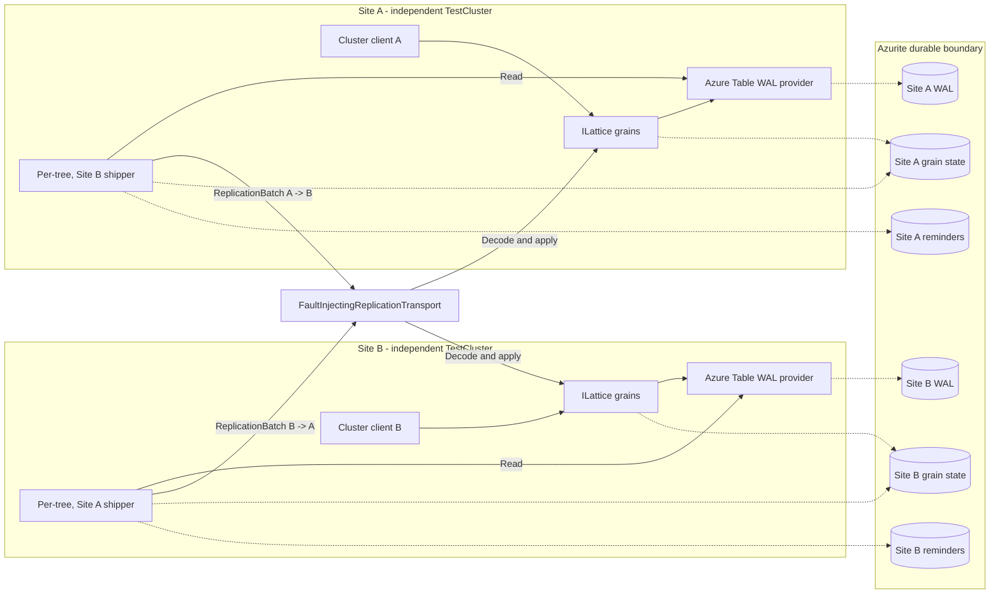
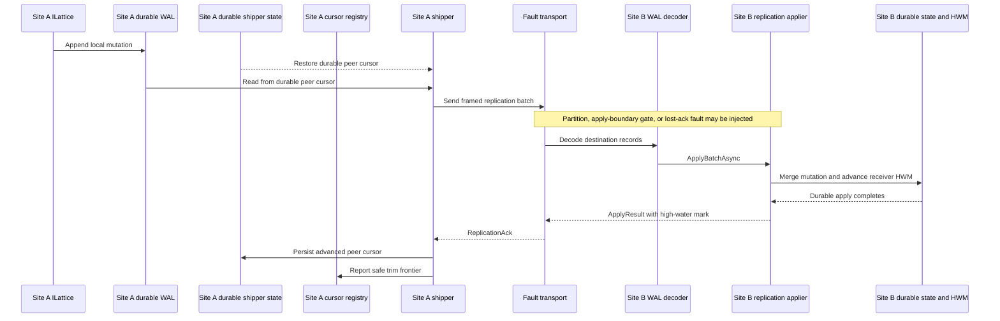

# Durable active-active integration suite

This project exercises grain-call-intensive replication and recovery paths that
are difficult to validate with isolated grain tests. It runs two independent
Orleans sites against Azurite and uses the production Lattice registration,
replication driver, shipper, WAL encoder, replication applier, cursor, and
high-water-mark paths.

The suite is categorized as `Integration` and `AzureStorageEmulator`. A single
`DurableActiveActiveClusterFixture` is shared by all eight scenarios. Each
scenario uses its own pre-minted LWW-register tree, so durable state can remain
in place for the whole fixture without tests depending on execution order.

## Topology

Each site is a separate `TestCluster` with its own cluster identity and service
provider. The sites share an Orleans service ID so a cold restart can reconstruct
the same logical site, but they do not share membership or grain activations.
Each site owns separate grain-state, reminder, and WAL tables. All six tables
have run-unique names, and fixture disposal attempts their best-effort deletion.



The transport is in-process, but the replication payload follows the production
shape. It routes by cluster ID, decodes the framed entries with the destination
site's canonical `IWalRecordEncoder`, invokes its `IReplicationApplier`, and
returns the receiver high-water mark in the acknowledgement. Fault controls are
inserted around this path rather than replacing the shipper or applier.



## Fixture lifecycle

- `OneTimeSetUp` probes Azurite and starts both sites once.
- All eight tree IDs are registered on both sites before startup, allowing the
  production replication activation service to start every shipper.
- A cold restart disposes and rebuilds a site's `TestCluster` with the same
  cluster ID, service ID, and table names. Only process-local state is lost.
- Per-test teardown heals partitions, releases one-shot gates, clears transient
  faults, and restarts a site if a failed scenario left it stopped.
- `OneTimeTearDown` stops both sites, clears transport state, and attempts
  best-effort deletion of the six run-specific Azurite tables.

## Scenario matrix

| Test | Execution path exercised | Concepts and assertions |
|---|---|---|
| `Sender_crash_before_and_after_acknowledgement_preserves_writes_and_tolerates_duplicate_apply` | Site A write -> durable WAL -> Site B apply -> rejected acknowledgement and directed partition -> Site A cold restart -> replay. It then sends acknowledged writes through a sequencing barrier and restarts Site A again. | Lost acknowledgement after durable receiver apply, at-least-once delivery, idempotent LWW merge, durable sender cursor advancement, and suppression of replay once a later acknowledged batch proves the cursor passed the entry. |
| `Receiver_crash_during_apply_retries_and_converges_after_restart` | Site A write -> batch decode against Site B -> one-shot gate at the apply boundary -> Site B cold restart -> stale attempt rejected -> production sender retry against the rebuilt site. | Receiver replacement during an in-flight delivery, stale service-provider detection, retry without data loss, and convergence on both writer and receiver. |
| `One_site_stopped_while_peer_continues_writing_catches_up_after_cold_start` | Initial A -> B replication -> stop Site B -> two writes on Site A while B is absent -> start Site B with the same identity and tables -> backlog drain. | Independent-site availability, durable sender backlog, peer outage, cold-start catch-up, and continued writes while the remote site is offline. |
| `Both_sites_cold_restarted_preserve_old_data_and_converge_new_bidirectional_writes` | Replicate a durable value -> cold restart Site A and Site B -> read the old value from both -> write independently on both sites -> replicate in both directions. | Durable data recovery across a full topology restart, followed by renewed bidirectional replication. |
| `Bidirectional_partition_with_concurrent_writes_and_restart_heals_and_converges` | Partition A -> B and B -> A -> distinct-key writes on both sites -> cold restart Site A while isolated -> prove remote writes remain invisible -> heal both links -> drain both backlogs. | Active-active availability during partition, durable local writes, restart while partitioned, isolation before heal, CRDT convergence after heal, and bidirectional backlog recovery. |
| `Wal_gc_across_restart_does_not_trim_unshipped_entries` | Establish an acknowledged positive cursor -> explicitly trim the shipped prefix -> partition A -> B -> append an unshipped suffix -> run GC -> cold restart Site A -> explicitly re-report the same known-safe cursor -> run GC again -> heal and replicate. | Azure Table WAL-provider trimming against Azurite, positive cursor-based GC rather than a vacuous no-op, lagging-peer retention, oldest-available HLC stability, restart safety, and eventual delivery of the protected suffix. |
| `Shipper_cursor_and_receiver_hwm_recover_across_restart_without_data_loss` | Eight Site A writes -> receiver applies first batch -> acknowledgement rejected and A -> B partitioned -> cold restart both sites -> heal -> replay unresolved delivery -> verify all keys and exact counts -> write from Site B. | Uncertain delivery across a double restart, duplicate replay tolerance, final state consistent with recovered replication metadata, no data loss, and post-recovery progress in the reverse direction. The test observes behavior rather than reading the internal HWM directly. |
| `Replication_resumes_after_restart_without_manual_shipper_wake` | Stop Site B -> create two-entry backlog on Site A -> cold restart Site A while B remains down -> start Site B -> wait without additional writes or internal wake calls. | Startup driver activation, shipper phase-timer recovery, durable backlog across sender and receiver outages, and convergence without operator or test-side re-priming. |

## Running locally

Start Azurite with its default development-storage endpoints, then run:

```powershell
dotnet test test\lattice.integration\Orleans.Lattice.Integration.Tests.csproj `
  --configuration Release `
  --filter "TestCategory=AzureStorageEmulator&TestCategory!=Chaos"
```

If Azurite is unreachable, the fixture reports the suite as inconclusive rather
than substituting in-memory storage. The suite runs after merges in the coverage
workflow and before package publication. Pull-request CI never selects it for
test execution; it is compiled only when change discovery chooses the
whole-solution build.
