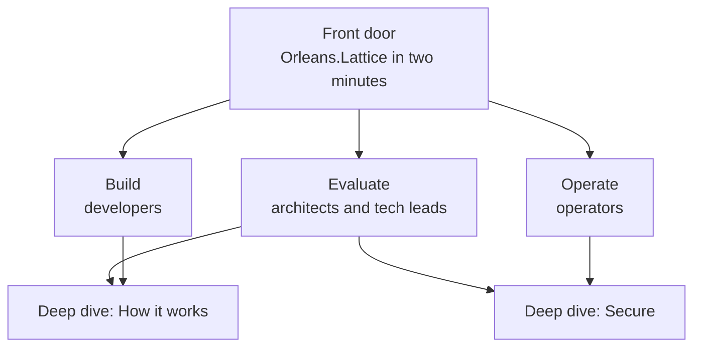

# The Orleans.Lattice video series - plan

This is the plan for the series: who it is for, how it is shaped, what is in
it, where it starts, and the tooling and decisions behind it. How a frame looks
is in [frame.md](frame.md); how to work in this folder is in
[README.md](README.md).

## Contents

- [Purpose](#purpose)
- [Shape: one front door, three paths, two deep dives](#shape-one-front-door-three-paths-two-deep-dives)
- [Episodes](#episodes)
- [Format rules](#format-rules)
- [Where to start](#where-to-start)
- [How an episode is made](#how-an-episode-is-made)
- [Tooling in place](#tooling-in-place)
- [Voice](#voice)
- [Open decisions](#open-decisions)
- [Deferred and out of scope](#deferred-and-out-of-scope)

## Purpose

A set of short, narrated explainers that give each kind of reader a clean way
in, and then hand them to the documentation. A video is an entry point, not a
second copy of the docs: it states one idea well and links to the page that
holds the detail.

The series follows the same principles as the documentation site:

1. **Route every reader fast.** A developer, an evaluator and an operator each
   find their first video within a click of the front door.
2. **The repository is the source of truth.** Every claim traces to the corpus,
   and code on screen is code the repository compiles.
3. **Prove, do not assert.** Guarantees are stated as precisely as the docs
   state them, with the test, specification or measurement behind them.
4. **Honest status.** Unreleased and in-progress packages are labelled
   wherever they appear.
5. **One programming model, Local to Global.** The deployment journey is the
   organising story, not a feature list.

## Shape: one front door, three paths, two deep dives

The paths are the documentation site's reader paths, with the same names, so a
reader who arrives by video and a reader who arrives by page end up in the same
place.

- **Front door** (two minutes at most, for everyone): what the platform is, the
  three positions it takes, and the Local -> Team -> Global journey with
  unchanged `ILattice` code. It ends by pointing each reader to a path.
- **Each path opens with an entry episode** that assumes only the front door.
  Later episodes on the path assume the entry episode.
- **Deep dives** are reached from the paths rather than from the front door:
  Secure from Evaluate and Operate, How it works from Evaluate and Build.

## Episodes

Sources are the pages each episode is drawn from and links on to. Every episode
is a proposal until its brief is written.

### Front door

| Episode | Beats | Sources |
| --- | --- | --- |
| Orleans.Lattice in two minutes | the store lives in the cluster; conflict resolution is algebraic (the join); everything else is a seam; Local -> Team -> Global with the same code; pick your path | [README](../README.md) "What is it?", "Why it exists", "The deployment journey" |

### Build (developers)

| Episode | Idea | Sources |
| --- | --- | --- |
| **Hello, Lattice** (entry) | register the silo, resolve `ILattice`, write and read typed values | [README Quick Start](../README.md#quick-start), [API reference](../docs/lattice/api.md) |
| Scans and cursors | ordered, range-bounded scans; cursors that survive failover | [API reference](../docs/lattice/api.md) |
| Atomic writes | all-or-nothing across keys and across trees | [Atomic writes](../docs/lattice/atomic-writes.md) |
| TTL and soft delete | per-entry expiry; recovery inside the retention window | [TTL](../docs/lattice/ttl.md) |
| Going durable | from the in-memory WAL to the file and Azure Table backends | [File WAL](../docs/lattice.storage.file/README.md), [WAL storage providers](../docs/lattice/wal-storage-providers.md) |
| Moving in from another store | bulk-loading from Redis, a relational database or Cosmos DB | [External store migration](../docs/lattice/external-store-migration.md) |

### Evaluate (architects and tech leads)

| Episode | Idea | Sources |
| --- | --- | --- |
| **When Lattice fits** (entry) | the three positions against a database, a cache and a queue; the categories it composes into | [README](../README.md) "Why it exists", "What you can build" |
| The deployment journey | Local, Team, Global: what each stage adds, and what stays the same | [README](../README.md#the-deployment-journey) |
| The guarantees, and how they are tested | consistency, crash safety, convergence; chaos tests and the verification tier | [Consistency](../docs/lattice/consistency.md), [chaos tests](../docs/lattice/chaos-tests.md) |
| A reference estate | active-active across regions on Azure Container Apps | [Reference architecture](../reference-architecture.md) |

### Operate (operators)

| Episode | Idea | Sources |
| --- | --- | --- |
| **What the write-ahead log guarantees** (entry) | the durability boundary, and how the backend choice changes it | [WAL](../docs/lattice/wal.md), [WAL storage providers](../docs/lattice/wal-storage-providers.md) |
| Backup and cold restore | a shared sink as the source of truth; restoring into a fresh cluster | [Backup](../docs/lattice.backup/README.md), [disaster recovery](../docs/lattice.backup/disaster-recovery.md) |
| Scaling on a signal | the cluster-aggregate signal an autoscaler such as KEDA scrapes | [Scaling](../docs/lattice.scaling/README.md) |
| Metrics and dashboards | what the instruments mean and where they are charted | [Dashboards](../docs/lattice.dashboards/README.md) |
| Diagnosing a tree | reading a `DiagnoseAsync` report, symptom by symptom | [Troubleshooting](../docs/lattice/troubleshooting.md) |

### Deep dive: Secure (from Evaluate and Operate)

| Episode | Idea | Sources |
| --- | --- | --- |
| Fail-closed by default | default-deny policy per tree, prefix or key, on the core data path | [Security](../docs/lattice/security.md) |
| Identity | OIDC and Entra membership resolving credentials to subjects | [OIDC](../docs/lattice.membership.oidc/README.md), [Entra](../docs/lattice.membership.entra/README.md) |
| One gate for every surface | gRPC client, operator console and AI agent all pass the same check | [Security](../docs/lattice/security.md) |

### Deep dive: How it works (from Evaluate and Build)

| Episode | Idea | Sources |
| --- | --- | --- |
| Conflict-free merges in 90 seconds | two concurrent writes and their join: why merges need no lock and no consensus | [CRDT primitives](../docs/crdt/readme.md), [state primitives](../docs/lattice/state-primitives.md) |
| Clocks and version vectors | ordering events without a shared clock | [Version vector](../docs/crdt/versionvector.md) |
| Trees that split online | sharded B+ trees rebalancing under load without downtime | [Architecture](../docs/lattice/architecture.md), [tree structure](../docs/lattice/tree-structure.md) |
| Atomic commit without consensus | the protocol behind all-or-nothing writes | [Verified atomic commit](../docs/lattice/verified-atomic-commit.md) |
| How it is verified | TLA+, Coyote and chaos tests, and what each one proves | [Verified atomic commit](../docs/lattice/verified-atomic-commit.md), [verified WAL](../docs/lattice/verified-wal.md), [chaos tests](../docs/lattice/chaos-tests.md) |

## Format rules

- **Two to five minutes, one idea.** The front door is two minutes at most; a
  deep-dive concept can be ninety seconds.
- **No presenter on screen.** Diagrams, code and narration only, so a change to
  the product is a re-render rather than a re-shoot.
- **Every episode ends on a next step**: the next episode on its path, and its
  companion page.
- **Evergreen or versioned.** How it works episodes describe the model and
  rarely change. Build and Operate episodes describe the API and the operating
  surface; they state the release line they describe and are re-rendered when
  it changes.
- **Built from shared scenes.** Diagrams and cards are shared components, so a
  fix to one propagates to every episode that uses it.
- **Only what has shipped.** An episode covers released packages; anything else
  is labelled as unreleased on screen.

## Where to start

1. **The tooling** (this folder as it stands): the workspace, its guards, the
   CI lane, the voice pipeline, and the site's design system read through the brand seam. Nothing here is an episode.
2. **Pilot: the front door**, built from three reusable scenes - the deployment
   journey, the core and its seams, and the join. It is the root every path
   links back to, it forces the style, voice and pacing decisions before there
   are ten episodes to change, and its source is the most-reviewed prose in the
   repository. Expect to re-cut it after steps 3 and 4.
3. **Hello, Lattice**, the Build entry: it proves the compiled-code path, and
   the README Quick Start it draws on is already written as verified snippets.
4. **Conflict-free merges in 90 seconds**, the first How it works episode: it is
   evergreen, and it stress-tests the diagram vocabulary.

Together those cover the widest audiences and all three production modes:
narrative and diagram, code walkthrough, and concept animation.

## How an episode is made

1. **Brief** - `episodes/<slug>/BRIEF.md`: the path and audience, the one idea,
   the corpus pages it draws on, and what the viewer can do afterwards.
2. **Script** - `episodes/<slug>/SCRIPT.md`: narration under a
   `## Narration` heading, one paragraph per cue, `### <scene>` headings to
   label scenes, HTML comments for direction notes. Written form, plain ASCII,
   British spelling. The Docs agent fact-checks it against the corpus before it
   is locked.
3. **Narration** - `npm run narrate -- <slug>`: one clip per cue, a cue
   timeline, and WebVTT captions, in the series voice.
4. **Storyboard** - `episodes/<slug>/STORYBOARD.md`: what is on screen for each
   cue.
5. **Composition** - `compositions/episodes/<slug>.html`, built from shared
   components and timed from the cue timeline.
6. **Companion page** - `docs/videos/<slug>.md`: the transcript, the compiled
   snippets shown on screen (`npm run snippets`), and the player.
7. **Check and render** - `npm run check`, then a draft render for review and
   a delivery-quality render to publish.
8. **Review** - the pull request carries the lane's draft render as an
   artifact. Watch it once with sound and once muted.

## Tooling in place

What was put in place before any episode, and why.

| Item | Why | Where |
| --- | --- | --- |
| No upstream scaffolding in git | `hyperframes init` writes `AGENTS.md` and `CLAUDE.md` with dozens of em-dashes, and the em-dash gate scans every tracked file in the repository | skills are installed per user; [README.md](README.md) rules |
| An ASCII check | catches non-ASCII text from imported blocks and model-written scripts before the repository gates do | `npm run ascii` |
| Media file types classified | the hygiene scanner fails every content gate on a tracked file whose type it does not know, and the repository tracked no video or audio before this | `test/shared/Orleans.Lattice.Testing/Hygiene/HygieneFiles.cs` |
| Its own CI lane | a change here matches no package, so `build-and-test` would otherwise fan out to the full test suite on every video pull request | `videos/**` is carved out in `ci.yml`; [videos.yml](../.github/workflows/videos.yml) runs this folder's checks |
| Outside `docs/` | the site build publishes and link-checks every markdown file under `docs/`, which would include every brief and script | this folder; companion pages alone go in `docs/videos/` |
| A pinned toolchain | HyperFrames is pre-1.0 and moves fast; renders must not change because a dependency did | exact versions in `package.json` and the lockfile; [tools/hf.js](tools/hf.js) runs the pinned CLI with telemetry, update checks and skill installs off |
| No network at render time | a render that fetches is neither reproducible nor local-first | GSAP and its plugins from `node_modules`; local media; font stacks limited to the site's self-hosted faces, because the renderer fetches any other named family from Google Fonts; `--docker` for byte-reproducible renders |
| The site's design system, read rather than copied | the videos must look like the documentation and follow it when it changes | `tools/hf.js` copies `docs-site/template/public` (tokens, fonts, mark) and `docs-site/figures/join-figures.json` into an ignored folder before every render; [assets/brand/brand.css](assets/brand/brand.css) imports it and adds only camera sizes; [assets/brand/motion.js](assets/brand/motion.js) reads the site's eases; the join figure reads each CRDT's scenario from the site |
| Compiled code on screen | a snippet that compiles today can rot tomorrow; the repository already compiles every verify fence | `npm run snippets`, `npm run snippets:check` |
| A local voice pipeline | one consistent voice, no account or key, reproducible from the script | [voice/](voice/), `npm run voice:samples`, `npm run narrate` |
| Agent conventions | agents do most of the authoring and must know the rules above | `.github/skills/video-production/SKILL.md` |

## Voice

- **Engine:** Kokoro-82M, run locally by the HyperFrames CLI. It needs no
  account, key or network, costs nothing, and the same script and settings
  give the same narration, so audio is as reproducible as the pictures.
  Hosted voices (HeyGen, ElevenLabs) are richer but need a key, and neither is
  reproducible.
- **The series voice is Emma** (`bf_emma`, British English), chosen by
  audition from eight candidates. `npm run voice:samples` renders the same
  script in every candidate voice under `renders/voice-samples/`, and the
  choice is recorded in [voice/voice.json](voice/voice.json). Changing it later
  means re-narrating every episode, so it changes rarely.
- **Pronunciation:** [voice/lexicon.json](voice/lexicon.json) maps written forms
  to spoken ones. "Orleans" is said or-LEENZ, with the stress on the second
  syllable, so the lexicon respells it "Or-leens"; left alone, the phonemizer
  says OR-lee-unz. Other entries spell out initialisms ("CRDTs", "gRPC").
  Captions keep the written form. Prefer rewording a script to adding an entry,
  and check a new entry by ear with `npm run voice:samples -- --voices bf_emma`.

## Open decisions

### Hosting

Where the rendered MP4s live, and how the companion page plays them. Keeping
the assets under `videos/` with a native player embedded on the companion page
is the direction; the question is how the binaries get there.

| Option | Upside | Cost |
| --- | --- | --- |
| A. Commit renders to git under `videos/` | simplest; the page points at a file | every re-render adds a full binary to history forever (video does not delta-compress); several CI jobs check out full history, so every run would download every render ever committed; GitHub blocks files over 100 MB |
| B. Git LFS under `videos/` | the same model with small history; CI checkouts skip LFS unless asked | storage and bandwidth quota; contributors need git-lfs; the docs deploy must check out LFS to publish the files |
| C. Commit sources only; render in the docs deploy | nothing binary in history; the published video is always in step with the published docs; the pictures are deterministic, so renders can be cached by content | render time in the deploy job; the GitHub Pages 1 GB site limit; the narration must be committed as compressed audio or regenerated in CI |
| D. An external host, embedded | adaptive streaming and discovery | a third-party dependency and its tracking on every page, against the local-first grain |

**Recommendation: C**, with B as the fallback if render time in the deploy
proves too slow. Both keep the source of every video under `videos/` and both
play it in a native HTML `<video>` element with the captions as a `<track>`,
styled by the docs site template. Decide once the pilot's first
delivery-quality render gives real numbers: its file size and its render time.
Until then renders and narration audio are not committed.

### Companion pages on the site

The first companion page creates `docs/videos/`. The site's navigation would
currently file it under Concepts next to `docs/crdt`; give it its own section
then, together with a player style, with whoever owns `docs-site/`.

### Music

Off by default. Decide with the pilot whether the series has a signature bed at
all.

## Deferred and out of scope

- **AI and agents path** - the MCP server, vector search and RepoContext - once
  `lattice.vector` and RepoContext have shipped.
- **The Explorer** is out of scope while it is redesigned.
- **What's new** episodes per release wave, drawn from the changelog.
- **Sample spotlights**: one variable-driven template filled per sample, once
  the core paths exist.
- **One CRDT, one join**: a short per scenario in the site's
  `docs-site/figures/join-figures.json` (thirteen today), each its join figure
  narrated from the scenario's own step, settled and rule texts, so the video
  and the explainer page it embeds on cannot disagree. The diamond scenarios
  are ready; the chain layouts are ported first.
