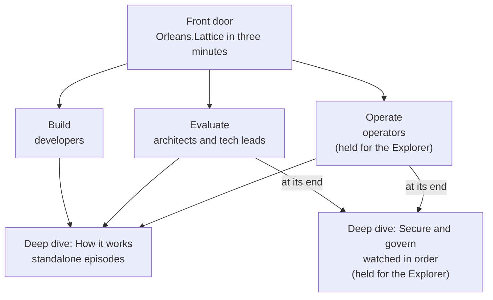

# The Orleans.Lattice video series - plan

This is the plan for the series: who it is for, how it is shaped, what is in
it, where it starts, and the tooling and decisions behind it. How a frame looks
is in [frame.md](frame.md); how to work in this folder is in
[README.md](README.md).

## Contents

- [Purpose](#purpose)
- [Shape: one front door, three paths, two deep dives](#shape-one-front-door-three-paths-two-deep-dives)
- [Episodes](#episodes)
- [Format rules](#format-rules)
- [Production order](#production-order)
- [How an episode is made](#how-an-episode-is-made)
- [Tooling in place](#tooling-in-place)
- [Voice](#voice)
- [Open decisions](#open-decisions)
- [Deferred and out of scope](#deferred-and-out-of-scope)

## Purpose

A set of short, narrated explainers that give each kind of reader a clean way
in, and then hand them to the documentation. A video is an entry point, not a
second copy of the docs: it states one idea well and links to the page that
holds the detail.

The series follows the same principles as the documentation site:

1. **Route every reader fast.** A developer, an evaluator and an operator each
   find their first video within a click of the front door.
2. **The repository is the source of truth.** Every claim traces to the corpus,
   and code on screen is code the repository compiles.
3. **Prove, do not assert.** Guarantees are stated as precisely as the docs
   state them, with the test, specification or measurement behind them.
4. **Honest status.** Unreleased and in-progress packages are labelled
   wherever they appear.
5. **One programming model, Local to Global.** The deployment journey is the
   organising story, not a feature list.

## Shape: one front door, three paths, two deep dives

The paths are the documentation site's reader paths, with the same names, so a
reader who arrives by video and a reader who arrives by page end up in the same
place.

```mermaid
flowchart TD
    Door["Front door<br/>Orleans.Lattice in three minutes"]
    Door --> Build["Build<br/>developers"]
    Door --> Evaluate["Evaluate<br/>architects and tech leads"]
    Door --> Operate["Operate<br/>operators<br/>(held for the Explorer)"]
    Evaluate -->|at its end| Secure["Deep dive: Secure and govern<br/>watched in order<br/>(held for the Explorer)"]
    Operate -->|at its end| Secure
    Build --> How["Deep dive: How it works<br/>standalone episodes"]
    Evaluate --> How
    Operate --> How
```

- **Front door** (three minutes at most, for everyone): a first minute in plain
  words for any viewer - what state is, why keeping it in more than one place
  is hard, and what Orleans.Lattice does differently - then what the platform
  is, the three positions it takes, and the Local -> Team -> Global journey
  with an unchanged `ILattice` programming model. It ends on the three ways in,
  and names each path's first episode once that episode is published.
- **A path is watched in order**, like the site's list of the same name. Its
  first episode assumes only the front door, and each later episode assumes
  the ones before it. Every episode after the first opens with a one-line
  recap of what it builds on, so a viewer who arrives from a search or a link
  can still join anywhere.
- **Each episode names the site pages it introduces**, and a path takes them
  in the order of the site's list, except where this plan gives a reason.
- **Deep dives are reached from the paths**, not from the front door. Secure and
  govern is a short run watched in order, reached from the ends of Evaluate
  and Operate. How it works is a set of standalone episodes, each reached from
  the path episode that leads to it, so they can be watched in any order.

## Episodes

Each episode has a code - its path's letter and its place on the path - by
which the production order and the other episodes refer to it. **Introduces**
names the documentation pages the episode is the way into: its ending points
to them, and its brief lists everything else it draws on. **Leads to** names
the deep dive it hands on to. Every episode is a proposal until its
brief is written.

### Front door

| # | Episode | Beats | Sources |
| --- | --- | --- | --- |
| F | **Orleans.Lattice in three minutes** (published) | in plain words: what state is, why it is hard to keep in more than one place, and what Lattice does instead; then the store lives in the cluster; conflict resolution is algebraic (the join); everything else is a seam; Local -> Team -> Global with the same programming model; the three ways in, each with its first episode once that is published | [README](../README.md) "What is it?", "Why it exists", "The deployment journey"; [reference architecture](../reference-architecture.md) "Disaster recovery" |

F2 and F3 are re-cuts of F, not episodes: its ending is re-cut to name each
path's first episode as they are published (see
[Production order](#production-order)).

### Build (developers)

Watched in order, then on to the site's Samples page. It departs from the
site's list twice, each for a reason. **Values that merge** comes second,
ahead of predicate operations, because the front door leaves a developer with
"for plain values, the last writer wins", and the next question is what a
value that merges looks like. **Configuration**, which the site lists on both
Build and Operate, comes late, in Going durable: a developer needs only the
registration code it changes, and its options and per-tree overrides are
Operate's first episode.

| # | Episode | Idea | Introduces | Leads to |
| --- | --- | --- | --- | --- |
| B1 | **Hello, Lattice** (first) | register Lattice on a silo, resolve a tree by name, and write and read typed values | [Quick start](../README.md#quick-start), [API reference](../docs/lattice/api.md) | |
| B2 | Values that merge | a plain value keeps the last write, while a counter, register, set or map merges concurrent writes by construction; how to choose | [CRDT primitives](../docs/crdt/readme.md) | H1 |
| B3 | Scans, filters and cursors | ordered, range-bounded scans; filters that run on the server; cursors that survive failover | [Predicate operations](../docs/lattice/predicated-operations.md), [API reference](../docs/lattice/api.md) | |
| B4 | Atomic writes | all-or-nothing across keys and across trees | [Atomic writes](../docs/lattice/atomic-writes.md) | H4 |
| B5 | TTL and soft delete | per-entry expiry; recovery inside the retention window | [TTL](../docs/lattice/ttl.md) | |
| B6 | Going durable | the registration code only: durable grain storage and a durable write-ahead log in place of the in-memory defaults, on the file or Azure Table backend; what that guarantees is Operate's first episode | [Configuration](../docs/lattice/configuration.md), [WAL storage providers](../docs/lattice/wal-storage-providers.md), [File WAL](../docs/lattice.storage.file/README.md), [Azure Table storage](../docs/lattice.storage.azuretable/README.md) | |
| B7 | Moving in from another store | bulk-loading from Redis, a relational database or Cosmos DB | [External store migration](../docs/lattice/external-store-migration.md) | |

### Evaluate (architects and tech leads)

Watched in order, in the order of the site's list, then on to Secure and
govern. The deployment journey is the front door's to tell, so Evaluate does
not retell it. The README has no "when not to use it" section, so When Lattice
fits takes its limits from the pages that state them - [Consistency](../docs/lattice/consistency.md),
the [API reference](../docs/lattice/api.md) and the [WAL](../docs/lattice/wal.md)
among them - and its brief cites each one.

| # | Episode | Idea | Introduces | Leads to |
| --- | --- | --- | --- | --- |
| E1 | **When Lattice fits, and when it doesn't** (first) | in plain words first; then the three positions against a database, a cache and a queue, the categories it composes into, and, as plainly, where it does not fit | [What it is and why it exists](../README.md#what-is-it), [A core plus seams](../README.md#architecture-a-core-plus-seams) | |
| E2 | The guarantees | what a caller of `ILattice` observes, operation by operation - linearizable, snapshot or eventually consistent - and what holds through a crash | [Consistency guarantees](../docs/lattice/consistency.md) | H2 |
| E3 | The evidence | how the guarantees are shown to hold, and what was measured: chaos tests on a live cluster, the machine-checked commit protocol, and single-silo throughput and latency on real Azure Tables | [Chaos tests](../docs/lattice/chaos-tests.md), [Verified atomic commit](../docs/lattice/verified-atomic-commit.md), [Single-silo performance](../docs/lattice/performance-single-silo.md) | H5 |
| E4 | A reference estate | active-active across regions on Azure Container Apps, with its deployment kit | [Reference architecture](../reference-architecture.md) | |

### Operate (operators)

**Held until the Explorer is released** (see
[Production order](#production-order)): an operator works through its console,
which is being redesigned, so this path is made once the new console ships, and
shows it wherever an operator would use it, alongside the API it drives. Where
the console itself, last on the site's list, goes on the path is decided then.
Watched in order, then on to Secure and govern. It departs from the site's list
once, for a reason: **Metrics and dashboards** comes second, ahead of sizing,
tuning and scaling, because an operator sizes, tunes and scales from what the
instruments show.

| # | Episode | Idea | Introduces | Leads to |
| --- | --- | --- | --- | --- |
| O1 | **Where your data lives, and when it's safe** (first) | the two storage surfaces - grain storage and the write-ahead log - the durability boundary, and how the backend choice changes it; where options and per-tree overrides are set | [Configuration](../docs/lattice/configuration.md), [WAL](../docs/lattice/wal.md), [WAL storage providers](../docs/lattice/wal-storage-providers.md) | |
| O2 | Metrics and dashboards | what the instruments mean and where they are charted | [Metrics](../docs/lattice/metrics.md), [Dashboards](../docs/lattice.dashboards/README.md) | |
| O3 | Sizing and tuning | resizing a live tree, with an undo window; the write-ahead log's concurrency limits against a backend's throughput envelope | [Tree sizing](../docs/lattice/tree-sizing.md), [WAL tuning](../docs/lattice/wal-tuning.md) | H3 |
| O4 | Scaling | what each workload gains as silos are added, and the cluster-aggregate signal an autoscaler such as KEDA scrapes | [Multi-silo scaling](../docs/lattice/performance-multi-silo.md), [Scaling](../docs/lattice.scaling/README.md) | |
| O5 | Running active-active | replication between clusters: each region serving reads and writes, and how their writes converge | [Replication](../docs/lattice.replication/README.md) | |
| O6 | Diagnosing a tree | reading a `DiagnoseAsync` report, symptom by symptom | [Troubleshooting](../docs/lattice/troubleshooting.md) | |
| O7 | Backup and cold restore | a shared sink as the source of truth; restoring into a fresh cluster | [Backup](../docs/lattice.backup/README.md), [Disaster recovery](../docs/lattice.backup/disaster-recovery.md) | |

### Deep dive: Secure and govern (after Evaluate and Operate)

**Held until the Explorer is released**, like Operate: the console has its own
areas for access, schemas and tenants, and is one of the surfaces the last
episode is about. Watched in order, following the security pipeline the docs
describe: who the caller is, what they may do, what a tree may hold and whose
it is, and every surface that reaches it. Identity comes first because a policy
names a subject. The site's Videos tab still labels this group "Deep dive:
Secure" (`$videoPaths` in `docs-site/stage.ps1`); rename it there when S1 is
published, keeping its path id, `secure`.

| # | Episode | Idea | Introduces |
| --- | --- | --- | --- |
| S1 | Identity | membership resolving a credential to a subject: the built-in JWT authenticator, or OIDC or Entra for a corporate identity provider | [Membership](../docs/lattice.membership/README.md), [OIDC](../docs/lattice.membership.oidc/README.md), [Entra](../docs/lattice.membership.entra/README.md) |
| S2 | Fail-closed by default | default-deny policy per tree, prefix or key, enforced on the core data path: a denied write throws and a denied read reports absent | [Security](../docs/lattice/security.md), [Authorization](../docs/lattice.auth/README.md) |
| S3 | Schemas and tenants | what a tree may hold, enforced and versioned; tenants kept apart in one cluster or many | [Schema](../docs/lattice.schema/README.md), [Tenancy](../docs/lattice.tenancy/README.md) |
| S4 | One gate for every surface | a gRPC client, the Explorer's console and an AI agent on the MCP server all authorize through the same gate as the data path, never a bypass | [Security](../docs/lattice/security.md#external-surfaces), [MCP server](../docs/lattice.api.mcp/README.md) |

### Deep dive: How it works (standalone)

Each episode is reached from the path episode beside it, and assumes only what
that episode taught, so the set can be watched in any order and from any path.

| # | Episode | Idea | Introduces | Reached from |
| --- | --- | --- | --- | --- |
| H1 | Conflict-free merges in 90 seconds | two concurrent writes and their join: why merges need no lock and no consensus, told with a scenario the front door does not use (a G-Set or an MV-Register, not its G-Counter) | [CRDT primitives](../docs/crdt/readme.md), the scenario's guide ([G-Set](../docs/crdt/gset.md) or [MV-Register](../docs/crdt/mvregister.md)), [state primitives](../docs/lattice/state-primitives.md) | B2 |
| H2 | Clocks and version vectors | ordering events without a shared clock | [Version vector](../docs/crdt/versionvector.md) | E2 |
| H3 | Trees that split online | sharded B+ trees rebalancing under load without downtime | [Architecture](../docs/lattice/architecture.md), [tree structure](../docs/lattice/tree-structure.md) | O3 |
| H4 | Atomic commit without consensus | the protocol behind all-or-nothing writes | [Verified atomic commit](../docs/lattice/verified-atomic-commit.md) | B4 |
| H5 | How it is verified | TLA+, Coyote and chaos tests, and what each one proves | [Verified atomic commit](../docs/lattice/verified-atomic-commit.md), [verified WAL](../docs/lattice/verified-wal.md), [chaos tests](../docs/lattice/chaos-tests.md) | E3 |

## Format rules

- **Two to five minutes, one idea.** The front door is three minutes at most; a
  deep-dive concept can be ninety seconds.
- **Plain words first only where the audience is mixed.** The front door and
  Evaluate's first episode, which any viewer may open, begin with a short part
  that uses no technical terms and one everyday example, drawn in the same
  notation as the rest, and then say "in technical terms" where the rest
  begins. Every other episode starts in technical terms: its path already
  says who is watching.
- **A one-line recap, so a viewer can join anywhere.** Every episode after a
  path's first opens with a sentence on what it builds on: a sentence, not a
  scene, and never a retelling.
- **No presenter on screen.** Diagrams, code and narration only, so a change to
  the product is a re-render rather than a re-shoot.
- **Every episode ends on where to go next**: the next episode on its path (at
  a path's end, what it hands on to), the deep dive it leads to, if any, and
  its companion page. The video names them by their titles in this plan, which
  are settled before they are made, so publishing the next episode needs no
  re-cut; the companion page gains its link to it when it is published.
  Writing both from the plan - each episode's path and order in
  `episode.json`, its code and deep dive here - is planned tooling, not yet
  built; until then an ending is written by hand from the tables above.
- **Evergreen or versioned.** How it works episodes describe the model and
  rarely change. Build and Operate episodes describe the API and the operating
  surface; they state the release line they describe and are re-rendered when
  it changes.
- **Built from shared scenes.** Diagrams and cards are shared components, so a
  fix to one propagates to every episode that uses it.
- **Only what has shipped.** An episode covers released packages; anything else
  is labelled as unreleased on screen.

## Production order

The next item to make is always the first below that is not done, and a deep
dive is made straight after the episode that leads to it. The first episodes
for developers and for evaluators come first, so both have a way in; then
Build straight through, then the rest of Evaluate.

**Operate and Secure and govern wait for the Explorer.** An operator works
through its console, which is being redesigned; the console has its own areas
for access, schemas, tenants and backups; and it is one of the surfaces the
last Secure and govern episode is about. So both paths are held at the end of
the order until the redesigned console is released, and their episodes then
show it wherever an operator would use it, alongside the API it drives.
Releasing the hold is a change to this plan. If the console is still not
ready when everything before the hold is done, Secure and govern's first three
episodes can be released to go ahead code-first.

1. **The tooling** - done: the workspace, its guards, the CI lane, the voice
   pipeline, and the site's design system read through the brand seam. Nothing
   here is an episode.
2. **The pilot, the front door** - done: [episodes/introduction/](episodes/introduction/),
   built from nine shared scenes: the title card; for everyone, what an
   application remembers and the same value kept in more than one place; then
   the store in its cluster, the cluster, the join, the core and its seams,
   the deployment journey, and the ways in. It is the root every path links
   back to, it forced the style, voice and pacing decisions before there were
   ten episodes to change, and its source is the most-reviewed prose in the
   repository. It is published: the docs site plays it on the home page and
   under Videos. Its ending is re-cut twice, each time as an item of its own:
   F2 names Build's and Evaluate's first episodes and brings the cut back
   within three minutes (the current cut runs 3:01), and F3 names Operate's
   first episode once it exists.
3. **The order**, each item in turn:

   | Step | Items | Completes |
   | --- | --- | --- |
   | 1 | B1, E1, F2 | a first episode for developers and for evaluators, and the front door re-cut to name them |
   | 2 | B2, H1, B3, B4, H4, B5, B6, B7 | Build, with its two deep dives |
   | 3 | E2, H2, E3, H5, E4 | Evaluate, with its two deep dives |
   | Held for the Explorer | O1, F3, O2, O3, H3, O4, O5, O6, O7 | Operate, with its deep dive, and the front door naming its first episode |
   | Held for the Explorer | S1, S2, S3, S4 | Secure and govern, and the 28 episodes planned here |

## How an episode is made

1. **Brief** - `episodes/<slug>/BRIEF.md`: the path and audience, the one idea,
   the corpus pages it draws on, and what the viewer can do afterwards.
2. **Script** - `episodes/<slug>/SCRIPT.md`: narration under a
   `## Narration` heading, one paragraph per cue, `### <scene>` headings to
   label scenes, HTML comments for direction notes. Written form, plain ASCII,
   British spelling. The Docs agent fact-checks it against the corpus before it
   is locked. For the Kokoro engine, `npm run phonemes -- <slug>` shows how
   its phonemizer will read it, flagging words with two readings.
3. **Narration** - `npm run narrate -- <slug>`: one clip per cue in the series
   voice, cached by what it says so a re-run speaks only the cues that changed,
   and each heard back by two local speech recognisers and made again when it
   does not say what the script says; the cues joined on a timeline and
   mastered to the series loudness; and WebVTT captions. A `<!-- pause N -->`
   comment in the script adds N seconds of silence, and a new scene waits a
   little longer than the next cue in a scene does (`voice/voice.json`). Then
   listen to the narration alone (`npm run review -- <slug> --audio`). Where a
   line reads wrongly - a word said wrong, a statement that rises like a
   question - make several takes of it and pick one by ear
   (`npm run audition -- <slug> <cue>`), and narrate again to master the
   picked take in. Takes and picks stay on the machine; only the published
   cut is committed.
4. **Storyboard** - `episodes/<slug>/STORYBOARD.md`: what is on screen for each
   cue.
5. **Composition** - `episodes/<slug>/composition.html`, built from the shared
   scenes in `shared/components/`. Each scene clip names the script scene it
   shows (`data-scene`), and `npm run timeline -- <slug>` stamps its window,
   its beats (one per cue) and the narration track from the timeline, so the
   pictures move on the words and nothing is timed by hand.
6. **Companion page** - `docs/videos/<slug>.md`: a short introduction whose
   first sentence is the episode's one-line idea, then the video block and the
   transcript, both written by `npm run companions`, and the compiled snippets
   shown on screen (`npm run snippets`). `episodes/<slug>/episode.json` names
   the episode's path, its place on it, and the moment its poster shows.
7. **Check and render** - `npm run check -- --episode <slug>`, then
   `npm run render -- --episode <slug> --quality high -o renders/<slug>-high.mp4`,
   which also writes the render's receipt: what it was rendered from.
8. **Review** - `npm run review -- <slug>`: the local review page. Watch it
   once with sound and once muted.
9. **Publish** - `npm run publish -- <slug>`: while the render's receipt still
   matches the sources, it writes the video, its captions and its poster into
   `docs-site/media/`, named by their cut, removes the episode's earlier cut,
   and records the new cut in `episode.json` and the companion page. Commit
   the three files with the episode: the pull request carries the video, and
   the site plays what is committed.

## Tooling in place

What is in place, and why.

| Item | Why | Where |
| --- | --- | --- |
| No upstream scaffolding in git | `hyperframes init` writes `AGENTS.md` and `CLAUDE.md` with dozens of em-dashes, and the em-dash gate scans every tracked file in the repository | skills are installed per user; [README.md](README.md) rules |
| An ASCII check | catches non-ASCII text from imported blocks and model-written scripts before the repository gates do | `npm run ascii` |
| Media file types classified | the hygiene scanner fails every content gate on a tracked file whose type it does not know, and the repository tracked no video or audio before this | `test/shared/Orleans.Lattice.Testing/Hygiene/HygieneFiles.cs` |
| Its own CI lane | a change here matches no package, so `build-and-test` would otherwise fan out to the full test suite on every video pull request | `videos/**` is carved out in `ci.yml`; [videos.yml](../.github/workflows/videos.yml) runs this folder's checks |
| Outside `docs/` | the site build publishes and link-checks every markdown file under `docs/`, which would include every brief and script | this folder; companion pages alone go in `docs/videos/` |
| A pinned toolchain | HyperFrames is pre-1.0 and moves fast; renders must not change because a dependency did | exact versions in `package.json` and the lockfile; [tools/hf.js](tools/hf.js) runs the pinned CLI with telemetry, update checks and skill installs off |
| No network at render time | a render that fetches is neither reproducible nor local-first | GSAP and its plugins from `node_modules`; local media; font stacks limited to the site's self-hosted faces, because the renderer fetches any other named family from Google Fonts; `--docker` for byte-reproducible renders |
| The site's design system and words, read rather than copied | the videos must look like the documentation, say what it says, and follow it when it changes | `tools/hf.js` copies `docs-site/template/public` (tokens, fonts, mark), `docs-site/figures/join-figures.json`, the home page's words (`docs-site/pages/index.md`) and the package catalogue (`PACKAGES.md`) into an ignored folder before every render; [shared/brand/brand.css](shared/brand/brand.css) imports it and adds only camera sizes and the notation; [shared/brand/motion.js](shared/brand/motion.js) reads the site's eases; scenes quote the site through `site:` variables, the seams are generated, and the join figure reads each CRDT's scenario from the site |
| Compiled code on screen | a snippet that compiles today can rot tomorrow; the repository already compiles every verify fence | `npm run snippets`, `npm run snippets:check` |
| A local voice pipeline | one consistent voice, no account or key, reproducible from the script | [voice/](voice/), `npm run narrate`, [tools/voice_worker.py](tools/voice_worker.py) |
| Narration heard back | a generative voice can drop, add or slip a word, and nobody can listen to every take | each clip is transcribed by two local recognisers and compared with the script word for word; a clip that is not heard exactly is made again with the next seed ([tools/lib/verify.js](tools/lib/verify.js)) |
| Loudness as delivered | every episode at -16 LUFS with the true peak below -1 dBTP, measured on the stereo track a viewer hears | `npm run narrate` masters the joined narration with one gain and a peak limiter, then measures it again ([tools/lib/loudness.js](tools/lib/loudness.js)) |
| Timing stamped from the narration | HyperFrames reads timing statically from the HTML, and hand-typed timings drift from the words | `npm run timeline -- <slug>` writes every clip's window, its beats and the narration track; `--check` fails when they are out of date |
| One folder per episode, one place for what is shared | the series will have dozens of episodes, and a scene fixed once must be fixed everywhere | `episodes/<slug>/` and `shared/`, defined once in [tools/lib/layout.js](tools/lib/layout.js) and guarded by a test that keeps episode material off the root |
| Project commands on an episode | the CLI's project commands open only `index.html`, and its lint finds compositions only in `compositions/` | `--episode <slug>` stands the episode in as `index.html` for one command and puts the smoke test back afterwards ([tools/lib/episode.js](tools/lib/episode.js)); `npm run check:episodes` checks every episode, against silence where narration is not generated |
| Companion pages from the episode | a companion page's transcript must say what the video says, and its video block must pin what is committed | `npm run companions`, `npm run companions:check` |
| Publishing from a receipt | a published video must show what the repository says, and its captions and poster must come from the same cut | `npm run render ... -o <file>` writes a receipt of the render's sources; `npm run publish -- <slug>` checks it and writes the files to commit into `docs-site/media/` ([tools/lib/publication.js](tools/lib/publication.js)) |
| Captions a reader can follow | a caption that ends mid-phrase, or runs past two lines, makes the viewer wait or squint | at most two lines of 42 characters, broken after a clause and never after a word that belongs with the next ([tools/lib/narration.js](tools/lib/narration.js)) |
| Agent conventions | agents do most of the authoring and must know the rules above | `.github/skills/video-production/SKILL.md` |

## Voice

- **The series voice is Emma, read by Chatterbox.** Emma (`bf_emma`, British
  English) was chosen by audition from eight Kokoro-82M voices, and the pilot
  was narrated with Kokoro. Kokoro reads through a phonemizer and has no control
  of stress or intonation, so its narration was even and flat, with no weight
  on the words that carry a point. Since the introduction's second cut the
  engine is **Chatterbox** (Resemble AI, MIT licence), cloned from
  [voice/reference.wav](voice/reference.wav): 12 seconds of Kokoro's Emma
  reading the introduction's opening. It keeps her timbre and accent, and reads
  as a person does, stressing what the sentence means. Measured on the same
  passage, its pitch moves about 30% more than Kokoro's.
- **Settings:** [voice/voice.json](voice/voice.json) records the model, pinned to
  one revision, and how it reads: exaggeration 0.75 and CFG weight 0.35 (the
  expressive end of its range, chosen by ear against the defaults and against
  Chatterbox Turbo) at temperature 0.8. It runs on the CPU, in a Python 3.11
  environment pinned by [voice/requirements.txt](voice/requirements.txt), with
  no account or key, and no network once the models are downloaded. On a laptop
  it takes eight to twenty times as long as the speech it makes, so a
  three-minute episode takes the better part of an hour; clips are cached, so
  a change to one cue re-speaks only that cue.
- **Heard back:** a generative voice can drop, add or slip a word (Chatterbox
  once said "Neither awaits its turn"). Every clip is transcribed by two local
  recognisers (faster-whisper `base.en` and `small.en`) and compared with the
  script word for word, forgiving only what a recogniser cannot know:
  capitals, punctuation, numerals, spelling variants and its guesses at the
  product's names. A clip that either recogniser does not hear exactly, or
  that is implausibly slow or fast for its length, is made again with the
  next seed, up to four attempts in all (`attempts` in `voice/voice.json`);
  `cues.json` records what was heard, and any cue that never passed is listed
  at the end of the run to be listened to.
  Each seed comes from the clip's name, so a run is repeatable on the same
  machine; across machines the audio can differ in detail.
- **Picked by ear where it matters:** the checks catch a wrong or missing
  word and a stray sound, not a word said with the wrong stress or a
  statement that rises like a question. When a line reads wrongly, `npm run
  audition` makes several takes of it (take n is narration's attempt n, so
  the kept take is among them), each checked, on a page to listen and pick
  from, and `--pick` makes the chosen take the cue's clip; a picked take
  stands whatever the recognisers heard. Takes live in `renders/takes/` and
  are never committed: the published cut is the record of what was chosen.
- **Listened for, too:** recognisers ignore sounds that are not speech, and
  Chatterbox sometimes fails to stop cleanly, adding a squeal or a burst
  after its last word (the introduction's first Chatterbox cut had one at
  1:52). Every clip is inspected frame by frame: a sound that follows a
  silence after the last word is cut off, keeping 150 ms of the silence, and a
  burst louder than the speech or a squeak far above the voice inside it
  makes the clip fail, so it is made again. Chatterbox also pauses at a
  hyphen ("active... active"), so a hyphen between two letters is read as a
  space (`readingFor` in [tools/lib/lexicon.js](tools/lib/lexicon.js)).
- **Pronunciation:** [voice/lexicon.json](voice/lexicon.json) maps written forms
  to spoken ones, with a form per engine where engines read differently.
  "Orleans" is said or-LEENZ, with the stress on the second syllable: Kokoro
  gets "Or-leens" and Chatterbox "Orleens", because Chatterbox pauses at a
  hyphen. Kokoro's other respellings ("livs", "Cluster Eh", "idem-potent")
  repaired its phonemizer, and Chatterbox reads those words from context, so
  it gets them as written. Other entries spell out initialisms ("CRDTs",
  "gRPC"). Captions keep the written form. Prefer rewording a script to adding
  an entry.
- **Chatterbox watermarks what it makes.** Every clip carries Resemble AI's
  Perth watermark, which cannot be heard and identifies the audio as
  generated. It is kept.
- **Kokoro remains an engine** (`"provider": "kokoro"` in `voice.json`), for
  auditions and comparison. Its phonemizer picks one reading of a heteronym
  without looking at the sentence, so `npm run phonemes -- <slug>` prints each
  cue's phonemes as Kokoro will receive them, and flags the words in
  [voice/heteronyms.json](voice/heteronyms.json). `npm run voice:samples`
  renders the audition script in every Kokoro candidate under
  `renders/voice-samples/`.

## Open decisions

### Hosting - decided

**Decided on 2026-09-24: option A, in the docs site.** Each episode's
published cut - its video, captions and poster - is committed to
`docs-site/media/`, and the site plays it from its own origin with a native
`<video>`. The pull request that publishes an episode therefore carries the
video itself, so it is reviewed and versioned with its page, and it reaches
the live site with the next docs deploy. The options, and the numbers the
decision rests on, follow; how it works is at the end of this section.

The question was where the rendered MP4s live and how a page plays them, given
that the site's player should play them from the site's own origin.

| Option | Upside | Cost |
| --- | --- | --- |
| A. Commit renders to git under `videos/` | simplest; the page points at a file | every re-render adds a full binary to history forever (video does not delta-compress); several CI jobs check out full history, so every run would download every render ever committed; GitHub blocks files over 100 MB |
| B. Git LFS under `videos/` | the same model with small history; CI checkouts skip LFS unless asked | storage and bandwidth quota; contributors need git-lfs; the docs deploy must check out LFS to publish the files |
| C. Commit sources only; render in the docs deploy | nothing binary in history; the published video is always in step with the published docs; the pictures are deterministic, so renders can be cached by content | render time in the deploy job; the GitHub Pages 1 GB site limit; the narration must be committed as compressed audio or regenerated in CI |
| D. An external host, embedded | adaptive streaming and discovery | a third-party dependency and its tracking on every page, against the local-first grain |
| E. Commit sources; publish renders as GitHub release assets | nothing binary in history; no limit on a release's total size or its bandwidth (each file under 2 GiB); renders versioned with the release they describe | the video is served from GitHub's release CDN rather than the site's origin; a workflow must render and attach it |

What the pilot measured (the introduction's first published cut, 2:52,
1920x1080 at 30 fps):

- **Size:** 10.8 MB at high quality (502 kbit/s: H.264 about 320, AAC stereo
  about 175), and 11.6 MB for its published re-render of the same sources,
  which differed only by encoder variation; the two-minute first cut was
  8.0 MB, and a draft is about three quarters of the high-quality size. That
  is about 4 MB a minute, so the 28 episodes planned here, at about three
  minutes each, are roughly 340 MB a full set, and every re-render of one
  episode is another 10 to 20 MB.
- **Render time:** 3 min 39 s for the high-quality render on one worker, on a
  laptop with every core busy: about 1.3 times real time. Its start-up probes
  failed repeatedly under that load until FFmpeg was kept resident (see the
  video-production skill); CI's dedicated runner has no such contention.
- **Narration:** the mastered track of the two-minute first cut was 5.7 MB as
  WAV (24 kHz 16-bit mono, so about 2.9 MB a minute), 1.5 MB as 96 kbit/s AAC
  and 0.7 MB as 48 kbit/s Opus - small enough to commit.

What that means for each option: A puts 340 MB in history for the first set and
more with every re-cut, downloaded by every full-history CI checkout. B fits
GitHub Free's Git LFS allowance (10 GiB of storage, 10 GiB a month of
bandwidth) for a while, but every pushed version counts against storage, every
CI or deploy checkout counts against bandwidth, and past the allowance LFS
stops working until the month ends. C fits the Pages limits (1 GB a site, 100
GB a month) with room, and renders only what changed if renders are cached by
content. E has no size or bandwidth limit at all.

Checked against the live services on 2026-09-24:

- **Pages can play the videos.** The site answers byte-range requests
  (`206 Partial Content`, through its CDN), and Pages serves `.mp4` as
  `video/mp4`, so a native `<video>` element starts a fast-start MP4 at once
  and seeks anywhere in it. Every render here is fast-start: the MP4's index
  comes first. This is progressive playback, which is what a documentation
  site needs; adaptive streaming (HLS or DASH) would also work as static
  files, but is not worth it at 4 MB a minute.
- **The site has room.** The published site is 41.7 MB (725 files) of its
  1 GB, so the current cut of all 28 planned episodes, about 325 MB, fits.
  100 GB a month is about 9,000 full plays of the introduction, and a visitor
  who never presses play downloads only the poster (the player is
  `preload="none"`).
- **Release files are not part of the site.** They count against neither the
  site's 1 GB nor git history, and have no total-size or bandwidth limit. But
  a release file is served through a signed link that expires within the hour,
  as `application/octet-stream` with `Content-Disposition: attachment`: right
  for a download, not dependable for playing in place.

An earlier recommendation here - keep each render as a release file and have
the docs deploy copy the current cut into the site - was not taken: the video
belongs in the pull request that publishes it, and in the site, not in a
release beside them.

How it works:

- **Only the published cut is committed**, once per episode per cut, as
  `docs-site/media/<slug>-<cut>.mp4`, `.vtt` and `.jpg`. The cut is a digest
  of the three files, so a new cut is a new file name and nothing cached under
  an old name goes stale. Renders, drafts and narration audio are not
  committed: the published MP4 carries its sound.
- **The companion page pins the cut** in its video block, which
  `npm run companions` writes from `episode.json` and the composition, so a
  page and the video it plays always come from the same commit.
  `npm run companions:check` fails CI when a pinned file is missing, or a
  committed one is pinned by no page.
- **The site plays what is committed.** `docs-site/stage.ps1` replaces each
  video block with the player when its three files are in `docs-site/media/`,
  copies them into the site once, and generates the Videos tab and the home
  page's introduction from the pages that pin a cut.
- **The cost, accepted:** each published cut adds its size to git history for
  good (about 4 MB a minute; 11.6 MB for the introduction), and every
  full-history CI checkout downloads it. Keep re-cuts deliberate, and publish
  from a review, not from a draft.

### Companion pages on the site - built

Built with the pilot. Companion pages under `docs/videos/` have their own
tab, Videos, generated from each page's video block: published episodes only,
grouped by path in the order of the shape above, each with its title, one-line
idea and length. The front door plays on the home page, in its own section
after the first viewport. A page whose video is not published is left out of
the site. The site's side is `docs-site/stage.ps1`, and the player's style is
in [DESIGN.md](../DESIGN.md).

### Music

Off by default. Decide with the pilot whether the series has a signature bed at
all.

## Deferred and out of scope

- **AI and agents path** - the MCP server, vector search and RepoContext - once
  `lattice.vector` and RepoContext have shipped.
- **The Explorer** is out of scope while it is redesigned, and the Operate and
  Secure and govern paths, which need its console, are held until it is
  released (see [Production order](#production-order)).
- **What's new** episodes per release wave, drawn from the changelog.
- **Sample spotlights**: one variable-driven template filled per sample, once
  the core paths exist.
- **One CRDT, one join**: a short per scenario in the site's
  `docs-site/figures/join-figures.json` (thirteen today), each its join figure
  narrated from the scenario's own step, settled and rule texts, so the video
  and the explainer page it embeds on cannot disagree. The diamond scenarios
  are ready; the chain layouts are ported first.
